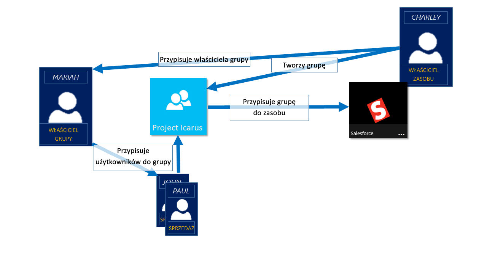

# Zarządzanie dostępem do aplikacji i zasobów za pomocą grup usługi Azure Active Directory
Usługa Azure Active Directory (Azure AD) umożliwia korzystanie z grup do zarządzania dostępem do aplikacji opartych na chmurze, aplikacji lokalnych i zasobów. Zasoby mogą być częścią organizacji usługi Azure AD, takie jak uprawnienia do zarządzania obiektami za pośrednictwem ról w usłudze Azure AD lub zewnętrzne dla organizacji, takie jak aplikacje Software as a Service (SaaS), usługi platformy Azure, witryny programu SharePoint i zasoby lokalne.

>[!NOTE]
> W witrynie Azure portal można wyświetlić niektóre grupy, których członkostwo i szczegóły grupy nie można zarządzać w portalu:
>
> - Grupami synchronizowanymi z lokalną usługą Active Directory można zarządzać tylko w lokalnej usłudze Active Directory.
> - Inne typy grup, takie jak listy dystrybucyjne i grupy zabezpieczeń z obsługą poczty, są zarządzane tylko w centrum administracyjnym programu Exchange lub centrum administracyjnym usługi Microsoft 365. Aby zarządzać tymi grupami, musisz zalogować się do centrum administracyjnego programu Exchange lub centrum administracyjnego usługi Microsoft 365.

## Jak działa zarządzanie dostępem w usłudze Azure AD

Usługa Azure AD ułatwia udzielanie dostępu do zasobów organizacji, zapewniając prawa dostępu jednemu użytkownikowi lub całej grupie usługi Azure AD. Dzięki grupom właściciel zasobu (lub właściciel katalogu usługi Azure AD) nie musi pojedynczo przypisywać uprawnień — może przypisać zestaw uprawnień dostępu do wszystkich członków grupy. Właściciel zasobu lub katalogu może również przyznać prawa do zarządzania listy elementów członkowskich innej osobie, takiej jak menedżer działu lub administrator działu pomocy technicznej, umożliwiając tej osobie dodawanie i usuwanie członków w razie potrzeby. Aby uzyskać więcej informacji na temat zarządzania właścicielami grup, zobacz [Zarządzanie właścicielami grup](active-directory-accessmanagement-managing-group-owners.md)

## Sposoby przypisywania praw dostępu

Istnieją cztery sposoby przypisywania użytkownikom praw dostępu do zasobów:

- **Przypisanie bezpośrednie.** Właściciel zasobu bezpośrednio przypisuje użytkownika do zasobu.

- **Przypisanie grupy.** Właściciel zasobu przypisuje grupę usługi Azure AD do zasobu, co automatycznie daje wszystkim członkom grupy dostęp do zasobu. Członkostwo w grupie jest zarządzane zarówno przez właściciela grupy, jak i właściciela zasobu, umożliwiając właścicielowi dodawanie lub usuwanie członków z grupy. Aby uzyskać więcej informacji na temat dodawania lub usuwania członkostwa w grupie, zobacz [Jak: Dodawanie lub usuwanie grupy z innej grupy za pomocą portalu Usługi Azure Active Directory](active-directory-groups-membership-azure-portal.md). 

- **Przypisanie oparte na regułach.** Właściciel zasobu tworzy grupę i używa reguły do definiowania, którzy użytkownicy są przypisani do określonego zasobu. Reguła jest oparta na atrybutach, które są przypisane do poszczególnych użytkowników. Właściciel zasobu zarządza regułą, określając, które atrybuty i wartości są wymagane, aby zezwolić na dostęp do zasobu. Aby uzyskać więcej informacji, zobacz [Tworzenie grupy dynamicznej i sprawdzanie stanu](../users-groups-roles/groups-create-rule.md).

    Możesz też obejrzeć ten krótki film, aby szybko wyjaśnić tworzenie grup dynamicznych i korzystanie z nich:

    >[!VIDEO https://channel9.msdn.com/Series/Azure-Active-Directory-Videos-Demos/Azure-AD--Introduction-to-Dynamic-Memberships-for-Groups/player]

- **Przypisanie władzy zewnętrznej.** Dostęp pochodzi z zewnętrznego źródła, takiego jak katalog lokalny lub aplikacja SaaS. W tej sytuacji właściciel zasobu przypisuje grupę, aby zapewnić dostęp do zasobu, a następnie zewnętrzne źródło zarządza członkami grupy.

   

## Czy użytkownicy mogą dołączać do grup bez przypisywania?
Właściciel grupy może umożliwić użytkownikom znajdowanie własnych grup do dołączenia, zamiast przypisywać je. Właściciel może również skonfigurować grupę, aby automatycznie akceptowała wszystkich użytkowników, którzy dołączają lub wymagają zatwierdzenia.

Gdy użytkownik zażąda dołączenia do grupy, żądanie jest przekazywane do właściciela grupy. Jeśli jest to wymagane, właściciel może zatwierdzić żądanie, a użytkownik zostanie powiadomiony o członkostwie w grupie. Jeśli jednak masz wielu właścicieli i jeden z nich odrzuca, użytkownik jest powiadamiany, ale nie jest dodawany do grupy. Aby uzyskać więcej informacji i instrukcji dotyczących sposobu umożliwienia użytkownikom żądania dołączania do grup, zobacz [Konfigurowanie usługi Azure AD, aby użytkownicy mogli żądać dołączania do grup](../users-groups-roles/groups-self-service-management.md)

## Następne kroki
Teraz, gdy masz trochę wprowadzenia do zarządzania dostępem przy użyciu grup, możesz zacząć zarządzać zasobami i aplikacjami.

- [Tworzenie nowej grupy przy użyciu usługi Azure Active Directory](active-directory-groups-create-azure-portal.md) lub [Tworzenie nowej grupy i zarządzanie nią przy użyciu poleceń cmdlet programu PowerShell](../users-groups-roles/groups-settings-v2-cmdlets.md)

- [Przypisywanie dostępu do zintegrowanej aplikacji SaaS za pomocą grup](../users-groups-roles/groups-saasapps.md)

- [Synchronizowanie lokalnej grupy z platformą Azure przy użyciu usługi Azure AD Connect](../hybrid/whatis-hybrid-identity.md)
