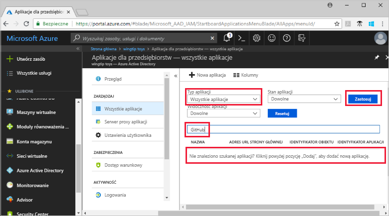

# Szybki Start: Wyświetlanie listy aplikacji korzystających z dzierżawy usługi Azure Active Directory (Azure AD) na potrzeby zarządzania tożsamościami

Rozpocznij korzystanie z usługi Azure AD jako systemu zarządzania tożsamościami i dostępem (IAM) dla aplikacji używanych przez organizację. W tym przewodniku szybki start zobaczysz aplikacje, znane także jako aplikacje, które zostały już skonfigurowane do korzystania z dzierżawy usługi Azure AD jako dostawcy tożsamości (dostawcy tożsamości).

## Wymagania wstępne

Aby wyświetlić aplikacje, które zostały zarejestrowane w dzierżawie usługi Azure AD, potrzebne są:

- Konto platformy Azure z aktywną subskrypcją. [Utwórz konto bezpłatnie](https://azure.microsoft.com/free/?WT.mc_id=A261C142F).

>[!IMPORTANT]
>Zalecamy użycie środowiska nieprodukcyjnego w celu przetestowania kroków opisanych w tym przewodniku Szybki Start.

## Znajdź listę aplikacji w swojej dzierżawie

Aplikacje, które są zarejestrowane w dzierżawie usługi Azure AD, są widoczne w sekcji **aplikacje dla przedsiębiorstw** w Azure Portal.

Aby wyświetlić aplikacje zarejestrowane w dzierżawie:

1. Zaloguj się do [Azure Portal](https://portal.azure.com).
2. W lewym panelu nawigacyjnym wybierz pozycję **Azure Active Directory**.
3. W okienku **Azure Active Directory** wybierz pozycję **aplikacje dla przedsiębiorstw**.
4. Z menu rozwijanego **Typ aplikacji** wybierz pozycję **wszystkie aplikacje**, a następnie wybierz pozycję **Zastosuj**. Zostanie wyświetlona losowa próbka aplikacji dzierżawy.
5. Aby wyświetlić więcej aplikacji, wybierz pozycję **Załaduj więcej** w dolnej części listy. Jeśli dzierżawa zawiera wiele aplikacji, można łatwiej wyszukiwać konkretną aplikację zamiast przewijać listę. Wyszukiwanie określonej aplikacji jest omówione w dalszej części tego przewodnika Szybki Start.

## Wybieranie opcje wyświetlania

Wybierz opcje według tego, czego szukasz.

1. Możesz wyświetlić aplikacje według **typu aplikacji**, **stanu aplikacji**i **widoczności aplikacji**.
2. W obszarze **Typ aplikacji** wybierz jedną z następujących opcji:
    - Opcja **Aplikacje dla przedsiębiorstw** wyświetla aplikacje firm innych niż Microsoft.
    - Opcja **Aplikacje firmy Microsoft** wyświetla aplikacji firmy Microsoft.
    - Opcja **Wszystkie aplikacje** wyświetla zarówno aplikacje firm innych niż Microsoft, jak i aplikacje firmy Microsoft.
3. W obszarze **Stan aplikacji** wybierz pozycję **Dowolne**, **Wyłączono** lub **Włączono**. Opcja **Dowolne** obejmuje zarówno aplikacje wyłączone, jak i włączone.
4. W obszarze **Widoczność aplikacji** wybierz pozycję **Dowolne** lub **Ukryte**. Opcja **Hidden** wyświetla aplikacje, które znajdują się w dzierżawie, ale nie są widoczne dla użytkowników.
5. Po wybraniu opcji wybierz pozycję **Zastosuj**.

## Wyszukiwanie aplikacji

Aby wyszukać określoną aplikację:

1. W menu **Typ aplikacji** wybierz pozycję **wszystkie aplikacje**, a następnie wybierz pozycję **Zastosuj**.
2. Wprowadź nazwę aplikacji, którą chcesz znaleźć. Jeśli aplikacja została dodana do dzierżawy usługi Azure AD, zostanie wyświetlona w wynikach wyszukiwania. Ten przykład pokazuje, że GitHub nie został dodany do aplikacji dzierżawców.
    
3. Spróbuj wprowadzić kilka pierwszych liter nazwy aplikacji. W tym przykładzie pokazano wszystkie aplikacje, których nazwy zaczynają się od **Sales**.
    

> [!TIP]
> Zarządzanie aplikacjami można zautomatyzować za pomocą interfejs API programu Graph, zobacz [Automatyzowanie zarządzania aplikacjami za pomocą Microsoft Graph interfejsu API](https://docs.microsoft.com/graph/application-saml-sso-configure-api).

## Czyszczenie zasobów

Nie utworzono żadnych nowych zasobów w tym przewodniku Szybki Start, dlatego nie ma nic do oczyszczenia.

## Następne kroki

Przejdź do następnego artykułu, aby dowiedzieć się, jak używać usługi Azure AD jako dostawcy tożsamości dla aplikacji.
> [!div class="nextstepaction"]
> [Dodawanie aplikacji](add-application-portal.md)
