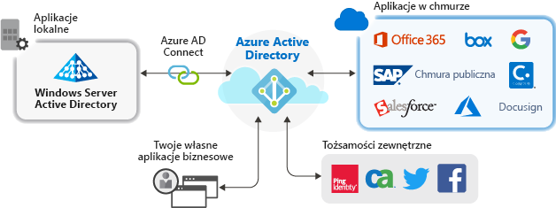

# Zarządzanie aplikacjami przy użyciu usługi Azure Active Directory

Usługa Azure Active Directory (Azure AD) zapewnia bezpieczny i bezproblemowy dostęp do aplikacji lokalnych i działających w chmurze. Użytkownicy mogą logować się raz w celu uzyskania dostępu do usługi Office 365 i innych aplikacji biznesowych firmy Microsoft oraz aplikacji typu SaaS (oprogramowanie jako usługa), aplikacji lokalnych i aplikacji biznesowych (LOB). Aby zmniejszyć koszty administracyjne, można zautomatyzować aprowizowanie użytkowników. Użycie uwierzytelniania wieloskładnikowego i zasad dostępu warunkowego pozwoli zagwarantować bezpieczny dostęp do aplikacji.

## Dlaczego warto zarządzać aplikacjami przy użyciu rozwiązania w chmurze?

Organizacje mają często setki aplikacji, których użytkownicy potrzebują do wykonania swojej pracy. Użytkownicy uzyskują dostęp do tych aplikacji z wielu urządzeń i lokalizacji. Nowe aplikacje są dodawane, tworzone i wycofywane każdego dnia. Przy tak wielu aplikacjach i punktach dostępu zarządzanie dostępem użytkowników do wszystkich aplikacji przy użyciu rozwiązania opartego na chmurze jest teraz ważniejsze niż kiedykolwiek wcześniej.

## Zarządzanie ryzykiem przy użyciu zasad dostępu warunkowego
Połączenie logowania jednokrotnego do usługi Azure AD z zasadami dostępu warunkowego zapewnia wysoki poziom zabezpieczeń podczas uzyskiwania dostępu do aplikacji. Możliwości zabezpieczeń obejmują ochronę tożsamości w skali chmury, kontrolę dostępu opartą na ryzyku, natywne uwierzytelnianie wieloskładnikowe oraz zasady dostępu warunkowego. Te funkcje pozwalają na stosowanie zasad szczegółowej kontroli w oparciu o aplikacje lub grupy, które potrzebują wyższego poziomu zabezpieczeń.

## Zwiększanie produktywności dzięki logowaniu jednokrotnemu
Włączenie logowania jednokrotnego w aplikacjach i usłudze Office 365 zapewnia doskonałe środowisko logowania dla istniejących użytkowników dzięki ograniczeniu lub wyeliminowaniu monitów dotyczących logowania. Środowisko użytkownika wydaje się bardziej spójne i mniej rozpraszające bez wielu monitów i potrzeby zarządzania wieloma hasłami. Grupa biznesowa może zarządzać dostępem i zatwierdzać go za pośrednictwem samoobsługi i członkostwa dynamicznego. Zezwolenie odpowiednim osobom osób w firmie na zarządzanie dostępem do aplikacji zwiększa bezpieczeństwo systemu tożsamości.

Logowanie jednokrotne zwiększa bezpieczeństwo. *Bez logowania jednokrotnego* administratorzy muszą tworzyć i aktualizować konta użytkowników dla poszczególnych aplikacji, co zajmuje czas. Ponadto użytkownicy muszą śledzić wiele poświadczeń, aby uzyskiwać dostęp do swoich aplikacji. W rezultacie użytkownicy zwykle notują hasła lub używają innych rozwiązań do zarządzania hasłami, które wprowadzają zagrożenia bezpieczeństwa danych. 

## Obsługa zarządzania i zgodności
Dzięki usłudze Azure AD można monitorować logowania do aplikacji za pomocą raportów korzystających z narzędzi do zarządzania informacjami i zdarzeniami zabezpieczeń (SIEM). Raporty są dostępne z poziomu portalu lub interfejsów API. Można również programowo przeprowadzać inspekcję użytkowników z dostępem do aplikacji i usuwać prawa dostępu do nieaktywnych użytkowników za pośrednictwem przeglądów dostępu.

## Zarządzanie kosztami
Dzięki migracji do usługi Azure AD można obniżyć koszty i rozwiązać problemy związane z zarządzaniem infrastrukturą lokalną. Usługa Azure AD oferuje również samoobsługowy dostęp do aplikacji, co pozwala zaoszczędzić czas pracy administratorów i użytkowników. Logowanie jednokrotne eliminuje hasła specyficzne dla aplikacji. Możliwość zalogowania się tylko raz pozwala zmniejszyć koszty związane z resetowaniem haseł aplikacji oraz utratą produktywności podczas pobierania haseł.

