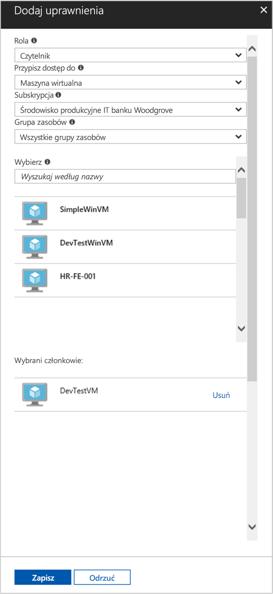

# <a name="use-a-linux-vm-system-assigned-managed-identity-to-access-azure-resource-manager"></a>Używanie przypisanej przez system tożsamości zarządzanej maszyny wirtualnej z systemem Linux do uzyskiwania dostępu do usługi Azure Resource Manager

[!INCLUDE [preview-notice](../../../includes/active-directory-msi-preview-notice.md)]

Ten samouczek przedstawia sposób używania tożsamości przypisanej przez system do maszyny wirtualnej z systemem Linux w celu uzyskania dostępu do interfejsu API usługi Azure Resource Manager. Tożsamości zarządzane dla zasobów platformy Azure są automatycznie zarządzane przez platformę Azure. Umożliwiają uwierzytelnianie w usługach obsługujących uwierzytelnianie usługi Azure AD bez potrzeby wprowadzania poświadczeń do kodu. Omawiane kwestie:

> [!div class="checklist"]
> * Udzielanie maszynie wirtualnej dostępu do grupy zasobów w usłudze Azure Resource Manager 
> * Uzyskiwanie tokenu dostępu przy użyciu tożsamości maszyny wirtualnej oraz używanie go do wywołania usługi Azure Resource Manager 

## <a name="prerequisites"></a>Wymagania wstępne

[!INCLUDE [msi-tut-prereqs](../../../includes/active-directory-msi-tut-prereqs.md)]

## <a name="grant-your-vm-access-to-a-resource-group-in-azure-resource-manager"></a>Udzielanie maszynie wirtualnej dostępu do grupy zasobów w usłudze Azure Resource Manager 

Używając tożsamości zarządzanych dla zasobów platformy Azure, kod może uzyskiwać tokeny dostępu, aby uwierzytelniać się w zasobach obsługujących uwierzytelnianie usługi Azure AD. Interfejs API usługi Azure Resource Manager obsługuje uwierzytelnianie usługi Azure AD. Najpierw musimy zapewnić tożsamości tej maszyny wirtualnej dostęp do zasobu w usłudze Azure Resource Manager — w tym przypadku do grupy zasobów, która zawiera maszynę wirtualną.  

1. Przejdź do karty **Grupy zasobów**.
2. Wybierz określoną **grupę zasobów**, która została utworzona wcześniej.
3. Przejdź do pozycji **Kontrola dostępu (IAM)** w panelu po lewej stronie.
4. Kliknij, aby **dodać** nowy przydział roli do maszyny wirtualnej. W pozycji **Rola** wybierz opcję **Czytelnik**.
5. Na następnej liście rozwijanej **Przypisz dostęp do** zasobu **Maszyna wirtualna**.
6. Następnie upewnij się, że odpowiednia subskrypcja znajduje się na liście rozwijanej **Subskrypcja**. W pozycji **Grupa zasobów** wybierz opcję **Wszystkie grupy zasobów**.
7. Na koniec w pozycji **Wybierz** użyj listy rozwijanej, aby wybrać maszynę wirtualną z systemem Linux, i kliknij przycisk **Zapisz**.

    

## <a name="get-an-access-token-using-the-vms-system-assigned-managed-identity-and-use-it-to-call-resource-manager"></a>Uzyskiwanie tokenu dostępu przy użyciu przypisanej przez system tożsamości zarządzanej maszyny wirtualnej i używanie jej do wywołania usługi Resource Manager 

Aby wykonać te kroki, będziesz potrzebować klienta SSH. Jeśli używasz systemu Windows, możesz użyć klienta SSH w pozycji [Podsystem Windows dla systemu Linux](https://msdn.microsoft.com/commandline/wsl/about). Jeżeli potrzebujesz pomocy w konfigurowaniu kluczy klienta SSH, zobacz [Jak używać kluczy SSH z systemem Windows na platformie Azure](../../virtual-machines/linux/ssh-from-windows.md) lub [Jak utworzyć i użyć parę publicznego i prywatnego klucza SSH dla maszyn wirtualnych z systemem Linux na platformie Azure](../../virtual-machines/linux/mac-create-ssh-keys.md).

1. W portalu przejdź do maszyny wirtualnej z systemem Linux i w pozycji **Przegląd** kliknij opcję **Połącz**.  
2. **Połącz** się z maszyną wirtualną przy użyciu wybranego klienta SSH. 
3. W oknie terminala wyślij za pomocą narzędzia `curl` żądanie do lokalnego punktu końcowego tożsamości zarządzanych dla zasobów platformy Azure, aby uzyskać token dostępu do usługi Azure Resource Manager.  
 
    Żądanie programu `curl` dla tokenu dostępu znajduje się poniżej.  
    
    ```bash
    curl 'http://169.254.169.254/metadata/identity/oauth2/token?api-version=2018-02-01&resource=https://management.azure.com/' -H Metadata:true   
    ```
    
    > [!NOTE]
    > Wartość parametru „resource” musi być dokładnie dopasowana do tego, czego oczekujemy od usługi Azure AD.  W przypadku użycia identyfikatora zasobu usługi Resource Manager należy uwzględnić końcowy ukośnik w identyfikatorze URI. 
    
    Odpowiedź zawiera token dostępu wymagany do uzyskania dostępu do usługi Azure Resource Manager. 
    
    Odpowiedź:  

    ```bash
    {"access_token":"eyJ0eXAiOi...",
    "refresh_token":"",
    "expires_in":"3599",
    "expires_on":"1504130527",
    "not_before":"1504126627",
    "resource":"https://management.azure.com",
    "token_type":"Bearer"} 
    ```
    
    Możesz użyć tego tokenu dostępu w celu uzyskania dostępu do usługi Azure Resource Manager, np. aby odczytać właściwości grupy zasobów, do której wcześniej udzielono dostępu tej maszynie wirtualnej. Zastąp wartości \<IDENTYFIKATOR SUBSKRYPCJI\>, \<GRUPA ZASOBÓW\> oraz \<TOKEN DOSTĘPU\> wcześniej utworzonymi. 
    
    > [!NOTE]
    > W adresie URL rozróżniana jest wielkość liter, więc upewnij się, że użyto takich samych wartości jak wcześniej, podczas nazywania grupy zasobów — z wielką literą „G” w nazwie „resourceGroup”.  
    
    ```bash 
    curl https://management.azure.com/subscriptions/<SUBSCRIPTION ID>/resourceGroups/<RESOURCE GROUP>?api-version=2016-09-01 -H "Authorization: Bearer <ACCESS TOKEN>" 
    ```
    
    Odpowiedz przy użyciu konkretnych informacji o grupie zasobów:    
    ```bash
    {"id":"/subscriptions/98f51385-2edc-4b79-bed9-7718de4cb861/resourceGroups/DevTest","name":"DevTest","location":"westus","properties":{"provisioningState":"Succeeded"}} 
    ```

## <a name="next-steps"></a>Następne kroki

W tym przewodniku Szybki start przedstawiono sposób używania tożsamości zarządzanej przypisanej przez system w celu uzyskania dostępu do interfejsu API usługi Azure Resource Manager.  Aby dowiedzieć się więcej o usłudze Azure Resource Manager, zobacz:

> [!div class="nextstepaction"]
>[Azure Resource Manager](/azure/azure-resource-manager/resource-group-overview)
