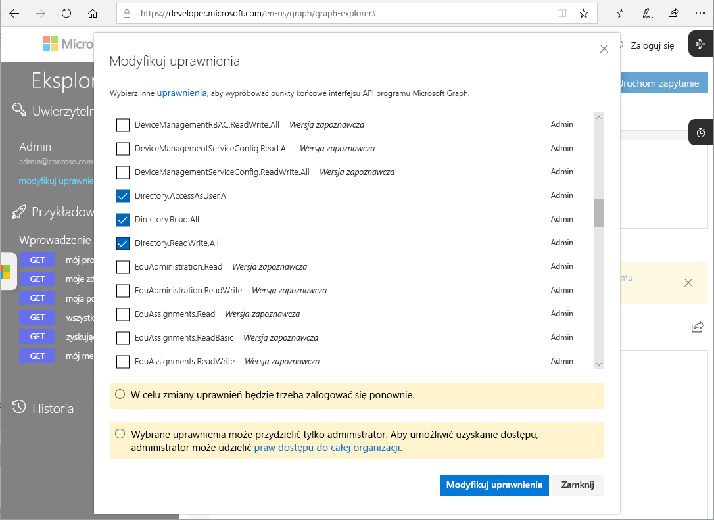

# Microsoft Graph interfejsów API dla Privileged Identity Management (wersja zapoznawcza)

Privileged Identity Management zadania można wykonywać za pomocą [Microsoft Graph interfejsów API](/graph/overview) dla Azure Active Directory. W tym artykule opisano ważne koncepcje dotyczące używania Microsoft Graph interfejsów API dla Privileged Identity Management.

Szczegółowe informacje na temat interfejsów API programu Microsoft Graph można znaleźć w [dokumentacji interfejsu API usługi Azure AD Privileged Identity Management](/graph/api/resources/privilegedidentitymanagement-root?view=graph-rest-beta).

> [!IMPORTANT]
> Interfejsy API w wersji beta w programie Microsoft Graph są w wersji zapoznawczej i mogą ulec zmianie. Te interfejsy API nie są obsługiwane w zastosowaniach produkcyjnych.

## Wymagane uprawnienia

Aby wywołać Microsoft Graph interfejsów API dla Privileged Identity Management, musisz mieć **co najmniej jedno** z następujących uprawnień:

- `Directory.AccessAsUser.All`
- `Directory.Read.All`
- `Directory.ReadWrite.All`
- `PrivilegedAccess.ReadWrite.AzureAD`

### Ustawianie uprawnień

Aby aplikacje mogły wywołać Microsoft Graph interfejsów API dla Privileged Identity Management, muszą mieć wymagane uprawnienia. Najprostszym sposobem określenia wymaganych uprawnień jest użycie [platformy wyrażania zgody w usłudze Azure AD](../develop/consent-framework.md).

### Ustawianie uprawnień w Eksploratorze programu Graph

Jeśli do testowania wywołań używasz Eksploratora programu Graph, możesz określić uprawnienia w tym narzędziu.

1. Zaloguj się do [Eksploratora programu Graph](https://developer.microsoft.com/graph/graph-explorer) jako administrator globalny.

1. Kliknij pozycję **Modyfikuj uprawnienia**.

    

1. Zaznacz pola wyboru obok uprawnień, które chcesz uwzględnić. Uprawnienia `PrivilegedAccess.ReadWrite.AzureAD` nie są jeszcze dostępne w Eksploratorze programu Graph.

    

1. Kliknij pozycję **Modyfikuj uprawnienia**, aby zastosować zmiany uprawnień.

## Następne kroki

- [Dokumentacja interfejsu API usługi Azure AD Privileged Identity Management](/graph/api/resources/privilegedidentitymanagement-root?view=graph-rest-beta)