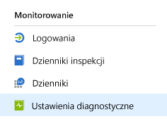

# Co to jest funkcja monitorowania usługi Azure Active Directory?

Przy użyciu funkcji monitorowania usługi Azure Active Directory (Azure AD) możesz teraz przekierowywać dzienniki aktywności usługi Azure AD do różnych punktów końcowych. Możesz następnie przechowywać je na potrzeby długoterminowego użytkowania lub zintegrować je z narzędziami do zarządzania informacjami i zdarzeniami zabezpieczeń (SIEM) innych firm, aby uzyskać wgląd w środowisko.

Obecnie dzienniki można przekierowywać do następujących lokalizacji:

- Konto usługi Azure Storage.
- Centrum zdarzeń platformy Azure, aby możliwe było zintegrowanie z wystąpieniami usług Splunk i Sumologic.
- Obszar roboczy usługi Azure Log Analytics, w którym można przeanalizować dane oraz utworzyć pulpit nawigacyjny i alert dla określonych zdarzeń

> [!VIDEO https://www.youtube.com/embed/syT-9KNfug8]

[!INCLUDE [azure-monitor-log-analytics-rebrand](../../../includes/azure-monitor-log-analytics-rebrand.md)]

## Konfiguracji ustawień diagnostyki

Aby skonfigurować ustawienia monitorowania dla dzienników aktywności usługi Azure AD, najpierw zaloguj się w witrynie [Azure Portal](https://portal.azure.com), a następnie wybierz pozycję **Azure Active Directory**. Z tego miejsca możesz uzyskać dostęp do strony konfiguracji ustawień diagnostycznych na dwa sposoby:

* Wybierz pozycję **Ustawienia diagnostyczne** w sekcji **Monitorowanie**.

    
    
* Wybierz pozycję **Dzienniki inspekcji** lub **Logowania**, a następnie wybierz pozycję **Eksportuj ustawienia**. 

    

## Przekierowywanie dzienników do konta magazynu

Przekierowując dzienniki do konta magazynu usługi Azure, możesz przechowywać je dłużej niż w przypadku domyślnego okresu przechowywania określonego w [zasadach przechowywania](reference-reports-data-retention.md). Dowiedz się, jak [kierować dane do konta magazynu](quickstart-azure-monitor-route-logs-to-storage-account.md).

## Przesyłanie strumieniowe dzienników do centrum zdarzeń

Przekierowywanie dzienników do centrum zdarzeń platformy Azure umożliwia integrację z narzędziami SIEM takimi jak Sumologic i Splunk. Ta integracja pozwala połączyć dane dzienników aktywności usługi Azure AD z innymi danymi zarządzanymi przez rozwiązania SIEM, co zapewnia lepszy wgląd w środowisko. Dowiedz się, jak [wysyłać strumieniowo dzienniki do centrum zdarzeń](tutorial-azure-monitor-stream-logs-to-event-hub.md).

## Wysyłanie dzienników do dzienników usługi Azure Monitor

[Dzienniki usługi Azure Monitor](https://docs.microsoft.com/azure/log-analytics/log-analytics-overview) to rozwiązanie, które konsoliduje dane monitorowania z różnych źródeł oraz udostępnia język zapytań i aparat analityczny, które zapewniają wgląd w działanie aplikacji i zasobów. Wysyłając dzienniki aktywności usługi Azure AD do dzienników usługi Azure Monitor, możesz szybko pobierać i monitorować zebrane dane oraz wysyłać dotyczące ich alerty. Dowiedz się, jak [wysyłać dane do dzienników usługi Azure Monitor](howto-integrate-activity-logs-with-log-analytics.md).

Możesz także zainstalować wstępnie utworzone widoki dla dzienników aktywności usługi Azure AD, aby monitorować typowe scenariusze obejmujące logowania i zdarzenia inspekcji. Dowiedz się, jak [zainstalować widoki analizy dzienników dla dzienników aktywności usługi Azure AD i używać ich](howto-install-use-log-analytics-views.md).

## Następne kroki

* [Dzienniki aktywności w usłudze Azure Monitor](concept-activity-logs-azure-monitor.md)
* [Przesyłanie strumieniowe dzienników do centrum zdarzeń](tutorial-azure-monitor-stream-logs-to-event-hub.md)
* [Wysyłanie dzienników do dzienników usługi Azure Monitor](howto-integrate-activity-logs-with-log-analytics.md)