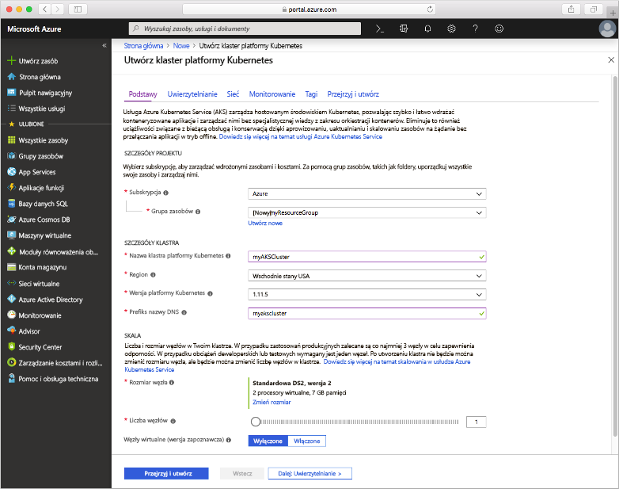
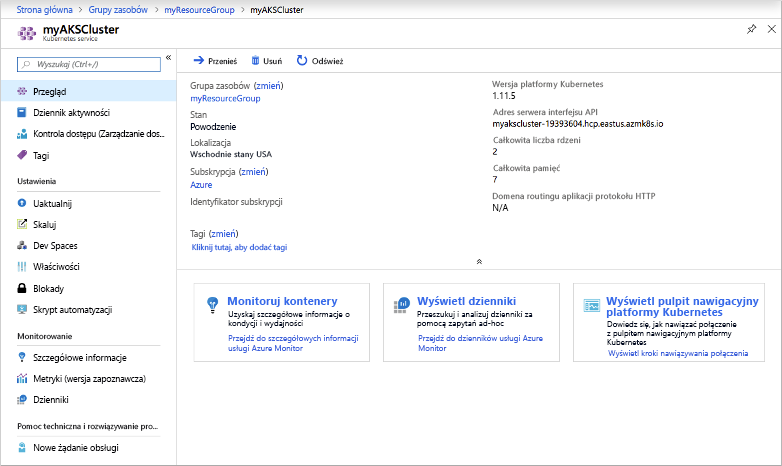
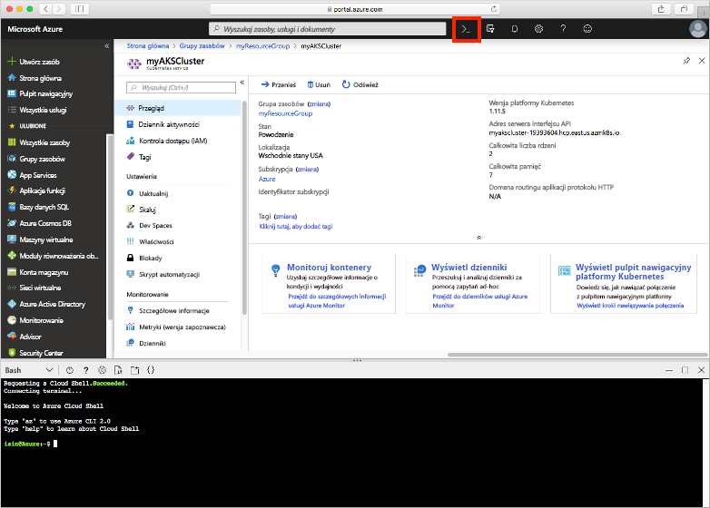
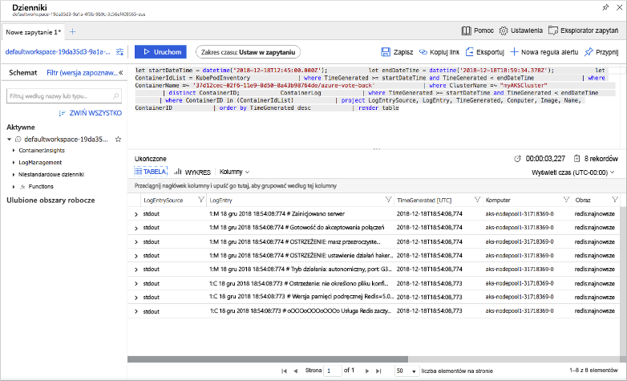

# <a name="quickstart-deploy-an-azure-kubernetes-service-aks-cluster-using-the-azure-portal"></a>Szybki Start: Wdrażanie klastra usługi Azure Kubernetes Service (AKS) przy użyciu Azure Portal

Azure Kubernetes Service (AKS) to zarządzana usługa platformy Kubernetes, która umożliwia szybkie wdrażanie klastrów i zarządzanie nimi. W tym przewodniku Szybki start wdrażany jest klaster AKS przy użyciu witryny Azure Portal. W klastrze jest uruchamiana aplikacja obsługująca wiele kontenerów, która składa się z frontonu internetowego i wystąpienia pamięci podręcznej Redis. Następnie zobaczysz, jak monitorować kondycję klastra i zasobników, w których działa Twoja aplikacja.


W tym przewodniku Szybki start założono, że masz podstawową wiedzę na temat pojęć związanych z rozwiązaniem Kubernetes. Aby uzyskać więcej informacji, zobacz [Podstawowe pojęcia dotyczące usługi Azure Kubernetes Service (AKS)][kubernetes-concepts].

Jeśli nie masz subskrypcji platformy Azure, przed rozpoczęciem utwórz [bezpłatne konto](https://azure.microsoft.com/free/?WT.mc_id=A261C142F).

## <a name="sign-in-to-azure"></a>Logowanie do platformy Azure

Zaloguj się do witryny Azure Portal pod adresem [https://portal.azure.com](https://portal.azure.com).

## <a name="create-an-aks-cluster"></a>Tworzenie klastra AKS

Aby utworzyć klaster usługi AKS, wykonaj następujące czynności:

1. W menu witryny Azure Portal lub na **stronie głównej** wybierz pozycję **Utwórz zasób**.

2. Wybierz pozycję **kontenery**  >   **Kubernetes usługi**.

3. Na stronie **podstawowe** skonfiguruj następujące opcje:
    - **Szczegóły projektu**: Wybierz **subskrypcję**platformy Azure, a następnie wybierz lub Utwórz **grupę zasobów**platformy Azure, taką jak grupa *zasobów*.
    - **Szczegóły klastra**: wprowadź **nazwę klastra Kubernetes**, na przykład *myAKSCluster*. Wybierz **region**, **wersję Kubernetes**i **prefiks nazwy DNS** dla klastra AKS.
    - **Pula węzłów podstawowych**: Wybierz **rozmiar węzła** maszyny wirtualnej dla węzłów AKS. *Nie* można zmienić rozmiaru maszyny wirtualnej po wdrożeniu klastra AKS. 
            -Wybierz liczbę węzłów, które mają zostać wdrożone w klastrze. Na potrzeby tego przewodnika Szybki start ustaw pozycję **Liczba węzłów** na *1*. Liczbę węzłów *można* dostosować po wdrożeniu klastra.
    
    

    Wybierz pozycję **Dalej: Skaluj** po zakończeniu.

4. Na stronie **Skala** Zachowaj opcje domyślne. W dolnej części ekranu kliknij przycisk **Dalej: uwierzytelnianie**.
    > [!CAUTION]
    > Utworzenie nowych jednostek usługi AAD może potrwać kilka minut, aby można było propagować i stać się dostępne, powodując nieznalezienie błędów jednostki usługi i niepowodzenia walidacji w Azure Portal. Jeśli trafisz, odwiedź [tutaj](troubleshooting.md#received-an-error-saying-my-service-principal-wasnt-found-or-is-invalid-when-i-try-to-create-a-new-cluster) , aby rozwiązać problem.

5. Na stronie **uwierzytelnianie** skonfiguruj następujące opcje:
    - Utwórz nową nazwę główną usługi, pozostawiając pole **nazwy głównej usługi** z **(nową) domyślną**jednostką usługi. Możesz też wybrać pozycję *Konfiguruj nazwę główną usługi* , aby użyć istniejącej. Jeśli używasz istniejącej usługi, musisz podać identyfikator klienta i klucz tajny SPN.
    - Włącz opcję dla funkcji kontroli dostępu opartej na rolach (RBAC) w rozwiązaniu Kubernetes. Zapewni to dokładniejszą kontrolę nad dostępem do zasobów Kubernetes wdrożonych w klastrze AKS.

    Alternatywnie można użyć tożsamości zarządzanej zamiast nazwy głównej usługi. Aby uzyskać więcej informacji, zobacz temat [Używanie tożsamości zarządzanych](use-managed-identity.md) .

Domyślnie używana jest sieć *Podstawowa* i włączona jest usługa Azure Monitor dla kontenerów. Kliknij przycisk **Przegląd + Utwórz** , a następnie **Utwórz** po zakończeniu walidacji.

Utworzenie klastra AKS może potrwać kilka minut. Po zakończeniu wdrażania kliknij pozycję **Przejdź do zasobu**lub przejdź do grupy zasobów klastra AKS, *na przykład grupa zasobów, a*następnie wybierz zasób AKS, taki jak *myAKSCluster*. Zostanie wyświetlony pulpit nawigacyjny klastra AKS, jak w poniższym przykładzie:



## <a name="connect-to-the-cluster"></a>Łączenie z klastrem

Aby zarządzać klastrem Kubernetes, należy użyć klienta wiersza polecenia usługi Kubernetes — narzędzia [kubectl][kubectl]. Klient `kubectl` jest instalowany wstępnie wraz z usługą Azure Cloud Shell.

Otwórz Cloud Shell przy użyciu `>_` przycisku w górnej części Azure Portal.



Aby skonfigurować narzędzie `kubectl` w celu nawiązania połączenia z klastrem Kubernetes, użyj polecenia [az aks get-credentials][az-aks-get-credentials]. To polecenie powoduje pobranie poświadczeń i zastosowanie ich w konfiguracji interfejsu wiersza polecenia Kubernetes. Poniższy przykład umożliwia pobranie poświadczeń dla nazwy klastra *myAKSCluster* w grupie zasobów *myResourceGroup*:

```azurecli-interactive
az aks get-credentials --resource-group myResourceGroup --name myAKSCluster
```

Aby sprawdzić połączenie z klastrem, użyj polecenia [kubectl get][kubectl-get], aby powrócić do listy węzłów klastra.

```console
kubectl get nodes
```

Poniższe przykładowe dane wyjściowe zawierają jeden węzeł utworzony w poprzednich krokach. Upewnij się, że stan węzła to *Gotowy*:

```output
NAME                       STATUS    ROLES     AGE       VERSION
aks-agentpool-14693408-0   Ready     agent     15m       v1.11.5
```

## <a name="run-the-application"></a>Uruchamianie aplikacji

Plik manifestu platformy Kubernetes definiuje żądany stan klastra, w tym informacje o obrazach kontenera do uruchomienia. W tym przewodniku Szybki start manifest służy do tworzenia wszystkich obiektów potrzebnych do uruchomienia aplikacji Azure Vote. Ten manifest obejmuje dwa [wdrożenia platformy Kubernetes][kubernetes-deployment] — jedno dla aplikacji Azure Vote w języku Python i jedno dla wystąpienia usługi Redis. Tworzone są również dwie [usługi platformy Kubernetes][kubernetes-service] — wewnętrzna usługa dla wystąpienia usługi Redis i zewnętrzna usługa służąca do uzyskiwania dostępu do aplikacji Azure Vote z Internetu.

> [!TIP]
> W tym przewodniku Szybki start ręcznie utworzysz i wdrożysz manifesty aplikacji w klastrze AKS. W bardziej rzeczywistych scenariuszach można użyć obszarów [Azure Dev Spaces][azure-dev-spaces], aby szybko iterować i debugować kod bezpośrednio w klastrze AKS. Obszarów Dev Spaces można używać na różnych platformach systemów operacyjnych i w środowiskach deweloperskich, aby pracować razem z innymi członkami zespołu.

W Cloud Shell Użyj `nano azure-vote.yaml` polecenia lub, `vi azure-vote.yaml` Aby utworzyć plik o nazwie `azure-vote.yaml` . Następnie skopiuj w następującej definicji YAML:

```yaml
apiVersion: apps/v1
kind: Deployment
metadata:
  name: azure-vote-back
spec:
  replicas: 1
  selector:
    matchLabels:
      app: azure-vote-back
  template:
    metadata:
      labels:
        app: azure-vote-back
    spec:
      nodeSelector:
        "beta.kubernetes.io/os": linux
      containers:
      - name: azure-vote-back
        image: redis
        resources:
          requests:
            cpu: 100m
            memory: 128Mi
          limits:
            cpu: 250m
            memory: 256Mi
        ports:
        - containerPort: 6379
          name: redis
---
apiVersion: v1
kind: Service
metadata:
  name: azure-vote-back
spec:
  ports:
  - port: 6379
  selector:
    app: azure-vote-back
---
apiVersion: apps/v1
kind: Deployment
metadata:
  name: azure-vote-front
spec:
  replicas: 1
  selector:
    matchLabels:
      app: azure-vote-front
  template:
    metadata:
      labels:
        app: azure-vote-front
    spec:
      nodeSelector:
        "beta.kubernetes.io/os": linux
      containers:
      - name: azure-vote-front
        image: microsoft/azure-vote-front:v1
        resources:
          requests:
            cpu: 100m
            memory: 128Mi
          limits:
            cpu: 250m
            memory: 256Mi
        ports:
        - containerPort: 80
        env:
        - name: REDIS
          value: "azure-vote-back"
---
apiVersion: v1
kind: Service
metadata:
  name: azure-vote-front
spec:
  type: LoadBalancer
  ports:
  - port: 80
  selector:
    app: azure-vote-front
```

Wdróż aplikację przy użyciu polecenia [kubectl apply][kubectl-apply] i podaj nazwę manifestu YAML:

```console
kubectl apply -f azure-vote.yaml
```

Następujące przykładowe dane wyjściowe przedstawiają pomyślnie utworzone wdrożenia i usługi:

```output
deployment "azure-vote-back" created
service "azure-vote-back" created
deployment "azure-vote-front" created
service "azure-vote-front" created
```

## <a name="test-the-application"></a>Testowanie aplikacji

Podczas uruchamiania aplikacji usługa Kubernetes uwidacznia fronton aplikacji w Internecie. Ten proces może potrwać kilka minut.

Aby monitorować postęp, użyj polecenia [kubectl get-service][kubectl-get] z argumentem `--watch`.

```console
kubectl get service azure-vote-front --watch
```

Początkowo adres *EXTERNAL-IP* dla usługi *azure-vote-front* jest wyświetlany jako *oczekujący*.

```output
NAME               TYPE           CLUSTER-IP   EXTERNAL-IP   PORT(S)        AGE
azure-vote-front   LoadBalancer   10.0.37.27   <pending>     80:30572/TCP   6s
```

Gdy dla adresu *EXTERNAL-IP* wartość *oczekujący* zmieni się na rzeczywisty publiczny adres IP, naciśnij klawisze `CTRL-C`, aby zatrzymać proces śledzenia narzędzia `kubectl`. Następujące przykładowe dane wyjściowe przedstawiają prawidłowy publiczny adres IP przypisany do usługi:

```output
azure-vote-front   LoadBalancer   10.0.37.27   52.179.23.131   80:30572/TCP   2m
```

Aby wyświetlić działającą aplikację Azure Vote, otwórz zewnętrzny adres IP usługi w przeglądarce internetowej.


## <a name="monitor-health-and-logs"></a>Monitorowanie kondycji i dzienników

Podczas tworzenia klastra włączono usługę Azure Monitor dla kontenerów. Ta funkcja monitorowania udostępnia metryki dotyczące kondycji zasobników i klastra usługi AKS działających w klastrze.

Zebranie tych danych w witrynie Azure Portal może zająć kilka minut. Aby wyświetlić bieżący stan, czas pracy i użycie zasobów na potrzeby zasobników aplikacji Azure Vote, wróć do zasobu usługi AKS, takiego jak *myAKSCluster*, w witrynie Azure Portal. Możesz uzyskać dostęp do stanu kondycji w następujący sposób:

1. W obszarze **Monitorowanie** po lewej stronie wybierz pozycję **Insights**
1. U góry wybierz pozycję **+ Dodaj filtr**
1. Wybierz wartość *Namespace* (Przestrzeń nazw) jako właściwość, a następnie wybierz pozycję *\<All but kube-system\>* (Wszystko oprócz kube-system)
1. Wybierz pozycję **Kontenery**, aby ją wyświetlić.

Zostaną wyświetlone kontenery *azure-vote-back* i *azure-vote-front*, jak pokazano w poniższym przykładzie:


Aby wyświetlić dzienniki dla obszaru `azure-vote-front` pod, wybierz pozycję **Wyświetl dzienniki kontenerów** z listy rozwijanej na liście kontenerów. Te dzienniki obejmują strumienie *stdout* i *stderr* z kontenera.



## <a name="delete-cluster"></a>Usuwanie klastra

Gdy klaster nie będzie już potrzebny, usuń zasób klastra, co spowoduje usunięcie wszystkich skojarzonych zasobów. Tę operację można wykonać w Azure Portal, wybierając przycisk **Usuń** na pulpicie nawigacyjnym klastra AKS. Alternatywnie można użyć polecenia [AZ AKS Delete][az-aks-delete] w Cloud Shell:

```azurecli-interactive
az aks delete --resource-group myResourceGroup --name myAKSCluster --no-wait
```

> [!NOTE]
> Po usunięciu klastra jednostka usługi Azure Active Directory używana przez klaster usługi AKS nie jest usuwana. Aby sprawdzić, jak usunąć jednostkę usługi, zobacz [AKS service principal considerations and deletion (Uwagi dotyczące jednostki usługi AKS i jej usuwanie)][sp-delete]. Jeśli używana jest tożsamość zarządzana, tożsamość jest zarządzana przez platformę i nie wymaga usunięcia.

## <a name="get-the-code"></a>Uzyskiwanie kodu

W tym przewodniku Szybki start utworzono wdrożenie platformy Kubernetes za pomocą utworzonych wcześniej obrazów kontenerów. Powiązany kod aplikacji, plik Dockerfile i plik manifestu rozwiązania Kubernetes są dostępne w serwisie GitHub.

[https://github.com/Azure-Samples/azure-voting-app-redis][azure-vote-app]

## <a name="next-steps"></a>Następne kroki

W tym przewodniku Szybki start wdrożono klaster Kubernetes oraz wdrożono w nim aplikację obsługującą wiele kontenerów.

Aby dowiedzieć się więcej o usłudze AKS i poznać dokładnie proces od kompletnego kodu do wdrożenia, przejdź do samouczka dotyczącego klastra Kubernetes.

> [!div class="nextstepaction"]
> [Samouczek usługi AKS][aks-tutorial]

<!-- LINKS - external -->
[azure-vote-app]: https://github.com/Azure-Samples/azure-voting-app-redis.git
[kubectl]: https://kubernetes.io/docs/user-guide/kubectl/
[kubectl-apply]: https://kubernetes.io/docs/reference/generated/kubectl/kubectl-commands#apply
[kubectl-get]: https://kubernetes.io/docs/reference/generated/kubectl/kubectl-commands#get
[kubernetes-documentation]: https://kubernetes.io/docs/home/

<!-- LINKS - internal -->
[kubernetes-concepts]: concepts-clusters-workloads.md
[az-aks-get-credentials]: /cli/azure/aks?view=azure-cli-latest#az-aks-get-credentials
[az-aks-delete]: /cli/azure/aks#az-aks-delete
[aks-monitor]: ../monitoring/monitoring-container-health.md
[aks-network]: ./concepts-network.md
[aks-tutorial]: ./tutorial-kubernetes-prepare-app.md
[http-routing]: ./http-application-routing.md
[sp-delete]: kubernetes-service-principal.md#additional-considerations
[azure-dev-spaces]: https://docs.microsoft.com/azure/dev-spaces/
[kubernetes-deployment]: concepts-clusters-workloads.md#deployments-and-yaml-manifests
[kubernetes-service]: concepts-network.md#services
