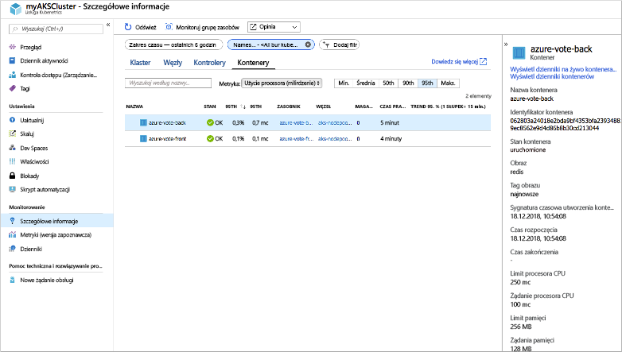
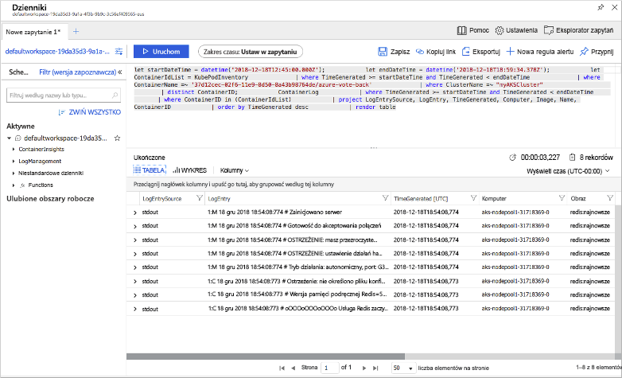

# <a name="quickstart-deploy-an-azure-kubernetes-service-aks-cluster-using-the-azure-cli"></a>Szybki start: Wdrażanie klastra usługi Azure Kubernetes Service (AKS) przy użyciu interfejsu wiersza polecenia platformy Azure

Azure Kubernetes Service (AKS) to zarządzana usługa platformy Kubernetes, która umożliwia szybkie wdrażanie klastrów i zarządzanie nimi. W tym przewodniku Szybki start wdrożysz klaster AKS przy użyciu interfejsu wiersza polecenia platformy Azure. W klastrze jest uruchamiana aplikacja obsługująca wiele kontenerów, która składa się z frontonu internetowego i wystąpienia pamięci podręcznej Redis. Następnie zobaczysz, jak monitorować kondycję klastra i zasobników, w których działa Twoja aplikacja.

Jeśli chcesz używać kontenerów systemu Windows Server (obecnie dostępna w wersji zapoznawczej w usłudze AKS), zobacz [Tworzenie klastra AKS, która obsługuje kontenery systemu Windows Server][windows-container-cli].


W tym przewodniku Szybki start założono, że masz podstawową wiedzę na temat pojęć związanych z rozwiązaniem Kubernetes. Aby uzyskać więcej informacji, zobacz temat [Kubernetes core concepts for Azure Kubernetes Service (AKS)][kubernetes-concepts] (Kubernetes — podstawowe pojęcia dotyczące usługi Azure Kubernetes Service (AKS)).

Jeśli nie masz subskrypcji platformy Azure, przed rozpoczęciem utwórz [bezpłatne konto](https://azure.microsoft.com/free/?WT.mc_id=A261C142F).

[!INCLUDE [cloud-shell-try-it.md](../../includes/cloud-shell-try-it.md)]

Jeśli zdecydujesz się zainstalować i korzystać z interfejsu wiersza polecenia lokalnie, ten przewodnik Szybki Start wymaga, czy korzystasz z wiersza polecenia platformy Azure w wersji 2.0.64 lub nowszej. Uruchom polecenie `az --version`, aby dowiedzieć się, jaka wersja jest używana. Jeśli konieczna będzie instalacja lub uaktualnienie, zobacz [Instalowanie interfejsu wiersza polecenia platformy Azure][azure-cli-install].

## <a name="create-a-resource-group"></a>Tworzenie grupy zasobów

Grupa zasobów platformy Azure to logiczna grupa przeznaczona do wdrażania zasobów platformy Azure i zarządzania nimi. Podczas tworzenia grupy zasobów użytkownik jest proszony o określenie lokalizacji. Ta lokalizacja jest, gdzie przechowywane są metadane grupy zasobów, jest również, gdy zasoby uruchamianie na platformie Azure, jeśli nie określisz innego regionu podczas tworzenia zasobu. Utwórz grupę zasobów przy użyciu polecenia [az group create][az-group-create].

Poniższy przykład obejmuje tworzenie grupy zasobów o nazwie *myResourceGroup* w lokalizacji *eastus*.

```azurecli-interactive
az group create --name myResourceGroup --location eastus
```

Następujące przykładowe dane wyjściowe przedstawiają pomyślnie utworzoną grupę zasobów:

```json
{
  "id": "/subscriptions/<guid>/resourceGroups/myResourceGroup",
  "location": "eastus",
  "managedBy": null,
  "name": "myResourceGroup",
  "properties": {
    "provisioningState": "Succeeded"
  },
  "tags": null
}
```

## <a name="create-aks-cluster"></a>Tworzenie klastra AKS

Utwórz klaster AKS za pomocą polecenia [az aks create][az-aks-create]. W poniższym przykładzie pokazano tworzenie klastra o nazwie *myAKSCluster* z jednym węzłem. Usługę Azure Monitor dla kontenerów można również włączyć przy użyciu parametru *--enable-addons monitoring*.

```azurecli-interactive
az aks create \
    --resource-group myResourceGroup \
    --name myAKSCluster \
    --node-count 1 \
    --enable-addons monitoring \
    --generate-ssh-keys
```

Po kilku minutach polecenie zostanie wykonane i zwróci informacje o klastrze w formacie JSON.

## <a name="connect-to-the-cluster"></a>Łączenie z klastrem

Aby zarządzać klastrem Kubernetes, należy użyć klienta wiersza polecenia usługi Kubernetes — narzędzia [kubectl][kubectl]. Jeśli korzystasz z usługi Azure Cloud Shell, narzędzie `kubectl` jest już zainstalowane. Aby zainstalować narzędzie `kubectl` lokalnie, użyj polecenia [az aks install-cli][az-aks-install-cli]:

```azurecli
az aks install-cli
```

Aby skonfigurować narzędzie `kubectl` w celu nawiązania połączenia z klastrem Kubernetes, użyj polecenia [az aks get-credentials][az-aks-get-credentials]. To polecenie powoduje pobranie poświadczeń i skonfigurowanie interfejsu wiersza polecenia Kubernetes do ich użycia.

```azurecli-interactive
az aks get-credentials --resource-group myResourceGroup --name myAKSCluster
```

Aby zweryfikować połączenie z klastrem, użyj polecenia [kubectl get][kubectl-get] w celu zwrócenia listy węzłów klastra.

```azurecli-interactive
kubectl get nodes
```

Poniższe przykładowe dane wyjściowe zawierają jeden węzeł utworzony w poprzednich krokach. Upewnij się, że stan węzła to *Gotowy*:

```
NAME                       STATUS   ROLES   AGE     VERSION
aks-nodepool1-31718369-0   Ready    agent   6m44s   v1.12.8
```

## <a name="run-the-application"></a>Uruchamianie aplikacji

Plik manifestu platformy Kubernetes definiuje żądany stan klastra, w tym informacje o obrazach kontenera do uruchomienia. W tym przewodniku Szybki start manifest służy do tworzenia wszystkich obiektów potrzebnych do uruchomienia aplikacji Azure Vote. Ten manifest obejmuje dwa [wdrożenia platformy Kubernetes][kubernetes-deployment] — jedno dla aplikacji Azure Vote w języku Python i jedno dla wystąpienia usługi Redis. Tworzone są również dwie [usługi platformy Kubernetes][kubernetes-service] — wewnętrzna usługa dla wystąpienia usługi Redis i zewnętrzna usługa służąca do uzyskiwania dostępu do aplikacji Azure Vote z Internetu.

> [!TIP]
> W tym przewodniku Szybki start ręcznie utworzysz i wdrożysz manifesty aplikacji w klastrze AKS. W bardziej rzeczywistych scenariuszach można użyć obszarów [Azure Dev Spaces][azure-dev-spaces], aby szybko iterować i debugować kod bezpośrednio w klastrze AKS. Obszarów Dev Spaces można używać na różnych platformach systemów operacyjnych i w środowiskach deweloperskich, aby pracować razem z innymi członkami zespołu.

Utwórz plik o nazwie `azure-vote.yaml` i skopiuj go do poniższej definicji YAML. Jeśli używasz usługi Azure Cloud Shell, ten plik można utworzyć przy użyciu programu `vi` lub `nano`, tak jak podczas pracy w systemie wirtualnym lub fizycznym:

```yaml
apiVersion: apps/v1
kind: Deployment
metadata:
  name: azure-vote-back
spec:
  replicas: 1
  selector:
    matchLabels:
      app: azure-vote-back
  template:
    metadata:
      labels:
        app: azure-vote-back
    spec:
      nodeSelector:
        "beta.kubernetes.io/os": linux
      containers:
      - name: azure-vote-back
        image: redis
        resources:
          requests:
            cpu: 100m
            memory: 128Mi
          limits:
            cpu: 250m
            memory: 256Mi
        ports:
        - containerPort: 6379
          name: redis
---
apiVersion: v1
kind: Service
metadata:
  name: azure-vote-back
spec:
  ports:
  - port: 6379
  selector:
    app: azure-vote-back
---
apiVersion: apps/v1
kind: Deployment
metadata:
  name: azure-vote-front
spec:
  replicas: 1
  selector:
    matchLabels:
      app: azure-vote-front
  template:
    metadata:
      labels:
        app: azure-vote-front
    spec:
      nodeSelector:
        "beta.kubernetes.io/os": linux
      containers:
      - name: azure-vote-front
        image: microsoft/azure-vote-front:v1
        resources:
          requests:
            cpu: 100m
            memory: 128Mi
          limits:
            cpu: 250m
            memory: 256Mi
        ports:
        - containerPort: 80
        env:
        - name: REDIS
          value: "azure-vote-back"
---
apiVersion: v1
kind: Service
metadata:
  name: azure-vote-front
spec:
  type: LoadBalancer
  ports:
  - port: 80
  selector:
    app: azure-vote-front
```

Wdróż aplikację przy użyciu polecenia [kubectl apply][kubectl-apply] i podaj nazwę manifestu YAML:

```azurecli-interactive
kubectl apply -f azure-vote.yaml
```

Następujące przykładowe dane wyjściowe przedstawiają pomyślnie utworzone wdrożenia i usługi:

```
deployment "azure-vote-back" created
service "azure-vote-back" created
deployment "azure-vote-front" created
service "azure-vote-front" created
```

## <a name="test-the-application"></a>Testowanie aplikacji

Podczas uruchamiania aplikacji usługa Kubernetes uwidacznia fronton aplikacji w Internecie. Ten proces może potrwać kilka minut.

Aby monitorować postęp, użyj polecenia [kubectl get-service][kubectl-get] z argumentem `--watch`.

```azurecli-interactive
kubectl get service azure-vote-front --watch
```

Początkowo adres *EXTERNAL-IP* dla usługi *azure-vote-front* jest wyświetlany jako *oczekujący*.

```
NAME               TYPE           CLUSTER-IP   EXTERNAL-IP   PORT(S)        AGE
azure-vote-front   LoadBalancer   10.0.37.27   <pending>     80:30572/TCP   6s
```

Gdy dla adresu *EXTERNAL-IP* wartość *oczekujący* zmieni się na rzeczywisty publiczny adres IP, naciśnij klawisze `CTRL-C`, aby zatrzymać proces śledzenia narzędzia `kubectl`. Następujące przykładowe dane wyjściowe przedstawiają prawidłowy publiczny adres IP przypisany do usługi:

```
azure-vote-front   LoadBalancer   10.0.37.27   52.179.23.131   80:30572/TCP   2m
```

Aby wyświetlić działającą aplikację Azure Vote, otwórz zewnętrzny adres IP usługi w przeglądarce internetowej.


## <a name="monitor-health-and-logs"></a>Monitorowanie kondycji i dzienników

Podczas tworzenia klastra usługi AKS włączono usługę Azure Monitor dla kontenerów, aby przechwycić metryki kondycji dla zasobników i węzłów klastra. Te metryki kondycji są dostępne w witrynie Azure Portal.

Aby wyświetlić bieżący stan, czas pracy i użycie zasobów na potrzeby zasobników aplikacji Azure Vote, wykonaj następujące czynności:

1. Otwórz witrynę Azure Portal [https://portal.azure.com][azure-portal] w przeglądarce internetowej.
1. Wybierz grupę zasobów, taką jak *myResourceGroup*, a następnie wybierz klaster AKS, taki jak *myAKSCluster*.
1. W obszarze **Monitorowanie** po lewej stronie wybierz pozycję **Insights**
1. U góry wybierz pozycję **+ Dodaj filtr**
1. Wybierz wartość *Namespace* (Przestrzeń nazw) jako właściwość, a następnie wybierz pozycję *\<All but kube-system\>* (Wszystko oprócz kube-system)
1. Wybierz pozycję **Kontenery**, aby ją wyświetlić.

Zostaną wyświetlone kontenery *azure-vote-back* i *azure-vote-front*, jak pokazano w poniższym przykładzie:



Na przeglądanie dzienników dla `azure-vote-front` zasobników, wybierz opcję, aby **Wyświetl w obszarze analiza**, a następnie wybierz **wyświetlanie dzienników kontenera** łącza po prawej stronie na liście kontenerów. Dzienniki te obejmują strumienie *stdout* i *stderr* z kontenera.



## <a name="delete-cluster"></a>Usuń klaster

Gdy klaster nie będzie już potrzebny, usuń grupę zasobów, usługę kontenera i wszystkie pokrewne zasoby za pomocą polecenia [az group delete][az-group-delete].

```azurecli-interactive
az group delete --name myResourceGroup --yes --no-wait
```

> [!NOTE]
> Po usunięciu klastra jednostka usługi Azure Active Directory używana przez klaster usługi AKS nie jest usuwana. Aby sprawdzić, jak usunąć jednostkę usługi, zobacz [AKS service principal considerations and deletion (Uwagi dotyczące jednostki usługi AKS i jej usuwanie)][sp-delete].

## <a name="get-the-code"></a>Uzyskiwanie kodu

W tym przewodniku Szybki start utworzono wdrożenie platformy Kubernetes za pomocą utworzonych wcześniej obrazów kontenerów. Powiązany kod aplikacji, plik Dockerfile i plik manifestu rozwiązania Kubernetes są dostępne w serwisie GitHub.

[https://github.com/Azure-Samples/azure-voting-app-redis][azure-vote-app]

## <a name="next-steps"></a>Następne kroki

W tym przewodniku Szybki start wdrożono klaster Kubernetes oraz wdrożono w nim aplikację obsługującą wiele kontenerów. Możesz również [dostęp do pulpitu nawigacyjnego sieci web rozwiązania Kubernetes] [ kubernetes-dashboard] dla klastra usługi AKS.

Aby dowiedzieć się więcej o usłudze AKS i poznać dokładnie proces od kompletnego kodu do wdrożenia, przejdź do samouczka dotyczącego klastra Kubernetes.

> [!div class="nextstepaction"]
> [Samouczek usługi AKS][aks-tutorial]

<!-- LINKS - external -->
[azure-vote-app]: https://github.com/Azure-Samples/azure-voting-app-redis.git
[kubectl]: https://kubernetes.io/docs/user-guide/kubectl/
[kubectl-apply]: https://kubernetes.io/docs/reference/generated/kubectl/kubectl-commands#apply
[kubectl-get]: https://kubernetes.io/docs/reference/generated/kubectl/kubectl-commands#get
[azure-dev-spaces]: https://docs.microsoft.com/azure/dev-spaces/

<!-- LINKS - internal -->
[kubernetes-concepts]: concepts-clusters-workloads.md
[aks-monitor]: https://aka.ms/coingfonboarding
[aks-tutorial]: ./tutorial-kubernetes-prepare-app.md
[az-aks-browse]: /cli/azure/aks?view=azure-cli-latest#az-aks-browse
[az-aks-create]: /cli/azure/aks?view=azure-cli-latest#az-aks-create
[az-aks-get-credentials]: /cli/azure/aks?view=azure-cli-latest#az-aks-get-credentials
[az-aks-install-cli]: /cli/azure/aks?view=azure-cli-latest#az-aks-install-cli
[az-group-create]: /cli/azure/group#az-group-create
[az-group-delete]: /cli/azure/group#az-group-delete
[azure-cli-install]: /cli/azure/install-azure-cli
[sp-delete]: kubernetes-service-principal.md#additional-considerations
[azure-portal]: https://portal.azure.com
[kubernetes-deployment]: concepts-clusters-workloads.md#deployments-and-yaml-manifests
[kubernetes-service]: concepts-network.md#services
[kubernetes-dashboard]: kubernetes-dashboard.md
[windows-container-cli]: windows-container-cli.md