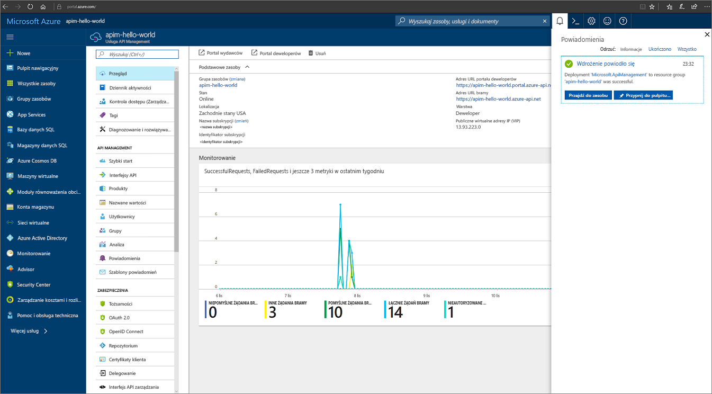
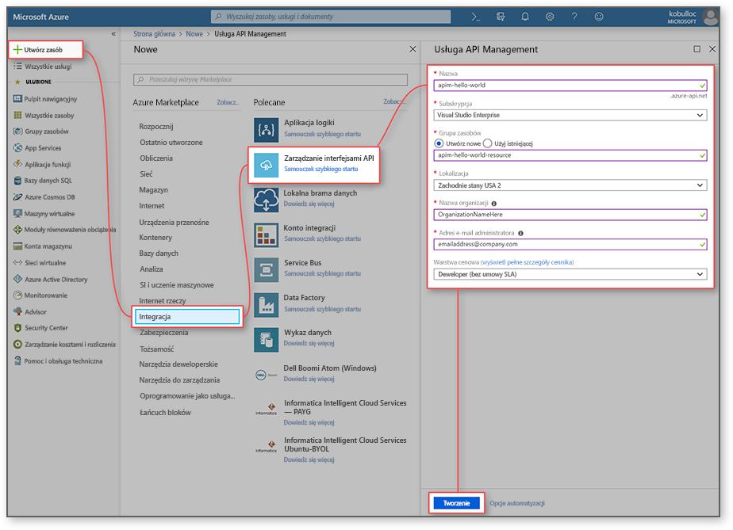
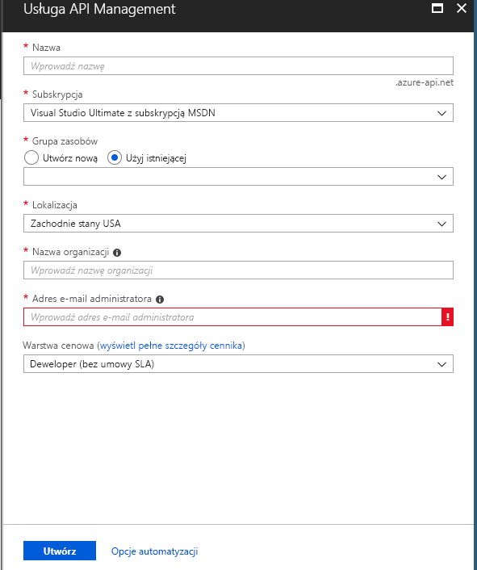
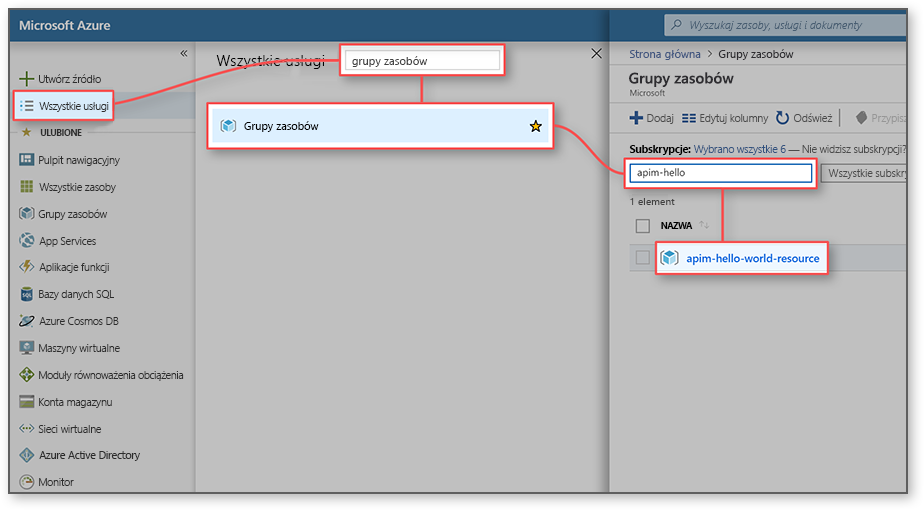
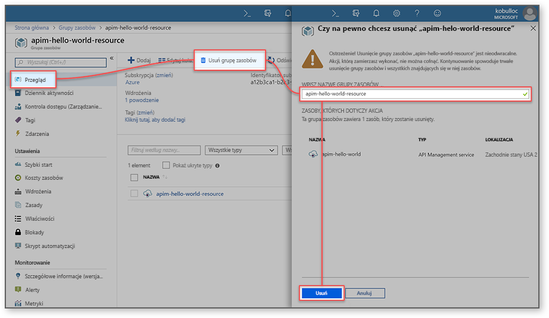

# Tworzenie nowego wystąpienia usługi Azure API Management

Usługa Azure API Management (APIM) pomaga organizacjom publikować interfejsy API dla deweloperów zewnętrznych, partnerskich i wewnętrznych, aby w pełni wykorzystać potencjał danych i usług. Usługa API Management zapewnia podstawowe możliwości, które pozwalają na pomyślne programowanie interfejsów API przez zaangażowanych deweloperów, a także udostępnia wgląd w kwestie biznesowe, analizy, zabezpieczenia i ochronę. Usługa APIM pozwala tworzyć nowoczesne bramy interfejsów API dla istniejących usług zaplecza hostowanych w dowolnym miejscu oraz zarządzać tymi bramami. Aby uzyskać więcej informacji, zobacz temat [Omówienie](api-management-key-concepts.md).

W tym przewodniku Szybki start opisano procedurę tworzenia nowego wystąpienia usługi API Management za pomocą witryny Azure Portal.

[!INCLUDE [quickstarts-free-trial-note](../../includes/quickstarts-free-trial-note.md)]

## Logowanie do platformy Azure

Zaloguj się w witrynie [Azure Portal](https://portal.azure.com).

## Tworzenie nowej usługi

1. W menu witryny Azure Portal wybierz pozycję **Utwórz zasób**. Możesz również wybrać pozycję **Utwórz zasób** na stronie **głównej** platformy Azure. 
   
   
   
1. Na **nowym** ekranie wybierz pozycję **integracja** , a następnie wybierz pozycję **API Management**.
   
   
   
1. Na ekranie **usługi API Management** wprowadź ustawienia.
   
   
   
   | Ustawienie                 | Sugerowana wartość                               | Opis                                                                                                                                                                                                                                                                                                                         |
|-------------------------|-----------------------------------------------|-------------------------------------------------------------------------------------------------------------------------------------------------------------------------------------------------------------------------------------------------------------------------------------------------------------------------------------|
| **Nazwa**                | Unikatowa nazwa dla usługi API Management | Nazwy nie można później zmienić. Nazwa usługi jest używana do generowania domyślnej nazwy domeny w postaci *{nazwa}.azure-api.net.* Jeśli chcesz użyć niestandardowej nazwy domeny, zobacz [Konfigurowanie domeny niestandardowej](configure-custom-domain.md).   Nazwa usługi jest używana do odwoływania się do usługi i odpowiedniego zasobu platformy Azure. |
| **Subskrypcja**        | Twoja subskrypcja                             | Subskrypcja, w ramach której zostanie utworzone to nowe wystąpienie usługi. Możesz wybrać jedną z różnych subskrypcji Azure, do których masz dostęp.                                                                                                                                                            |
| **Grupa zasobów**      | *apimResourceGroup*                           | Możesz wybrać nowy lub istniejący zasób. Grupa zasobów jest kolekcją zasobów, które mają ten sam cykl życia, uprawnienia i zasady. Dowiedz się więcej [tutaj](../azure-resource-manager/management/overview.md#resource-groups).                                                                                                  |
| **Lokalizacja**            | *Zachodnie stany USA*                                    | Wybierz region geograficzny w pobliżu. Na liście rozwijanej są wyświetlane tylko regiony dostępne w usłudze API Management.                                                                                                                                                                                                          |
| **Nazwa organizacji**   | Nazwa organizacji                 | Ta nazwa jest używana w wielu miejscach, w tym w tytule portalu dla deweloperów i nadawcy wiadomości e-mail z powiadomieniem.                                                                                                                                                                                                             |
| **Adres e-mail administratora** | *\@org.com administratora*                               | Ustaw adres e-mail, na który będą wysyłane wszystkie powiadomienia z usługi **API Management**.                                                                                                                                                                                                                                              |
| **Warstwa cenowa**        | *Pisał*                                   | Skonfiguruj warstwę **Developer**, aby ocenić usługę. Ta warstwa nie jest do użytku produkcyjnego. Aby uzyskać więcej informacji na temat skalowania warstw usługi API Management, zobacz [Upgrade and scale](upgrade-and-scale.md) (Uaktualnianie i skalowanie).                                                                                                                                    |

3. Wybierz pozycję **Utwórz**.

    > [!TIP]
    > Zazwyczaj utworzenie usługi API Management trwa 20–30 minut. Wybranie pozycji **Przypnij do pulpitu nawigacyjnego** ułatwia znajdowanie nowo utworzonej usługi.

[!INCLUDE [api-management-navigate-to-instance](../../includes/api-management-navigate-to-instance.md)]

## Czyszczenie zasobów

Gdy grupa zasobów i wszystkie pokrewne zasoby nie będą już potrzebne, można je usunąć, wykonując następujące kroki:

1. W Azure Portal Wyszukaj i wybierz pozycję **grupy zasobów**. Możesz również wybrać **grupy zasobów** na stronie **głównej** . 

   

1. Na stronie **grupy zasobów** wybierz grupę zasobów.

   

1. Na stronie Grupa zasobów wybierz pozycję **Usuń grupę zasobów**. 
   
1. Wpisz nazwę grupy zasobów, a następnie wybierz pozycję **Usuń**.

   

## Kolejne kroki

> [!div class="nextstepaction"]
> [Importowanie i publikowanie pierwszego interfejsu API](import-and-publish.md)