# <a name="create-an-aspnet-framework-web-app-in-azure"></a>Tworzenie aplikacji internetowej środowiska ASP.NET Framework na platformie Azure

Usługa [Azure App Service](overview.md) oferuje wysoce skalowalną i samonaprawialną usługę hostingu w Internecie.  Ten przewodnik Szybki start zawiera informacje dotyczące sposobu wdrożenia pierwszej aplikacji internetowej ASP.NET w usłudze Azure App Service. Po zakończeniu będzie istnieć grupa zasobów składająca się z planu usługi App Service i aplikacji usługi App Service wraz z wdrożoną aplikacją internetową.


[!INCLUDE [quickstarts-free-trial-note](../../includes/quickstarts-free-trial-note.md)]

## <a name="prerequisites"></a>Wymagania wstępne

Aby ukończyć ten samouczek, zainstaluj program <a href="https://www.visualstudio.com/downloads/" target="_blank">Visual Studio 2017</a> z pakietem roboczym **Programowanie dla platformy ASP.NET i sieci Web**.

Jeśli masz już zainstalowany program Visual Studio 2017:

- Zainstaluj najnowsze aktualizacje w programie Visual Studio, klikając pozycje **Pomoc** > **Sprawdź aktualizacje**.
- Dodaj pakiet roboczy, klikając pozycje **Narzędzia** > **Pobierz narzędzia i funkcje**.

## <a name="create-an-aspnet-web-app"></a>Tworzenie aplikacji internetowej platformy ASP.NET

W programie Visual Studio utwórz nowy projekt, wybierając pozycję **Plik > Nowy > Projekt**. 

W oknie dialogowym **Nowy projekt** kliknij pozycję **Visual C# &gt; Internet &gt; Aplikacja internetowa ASP.NET (program .NET Framework)** .

Nadaj aplikacji nazwę _myFirstAzureWebApp_, a następnie kliknij przycisk **OK**.
   
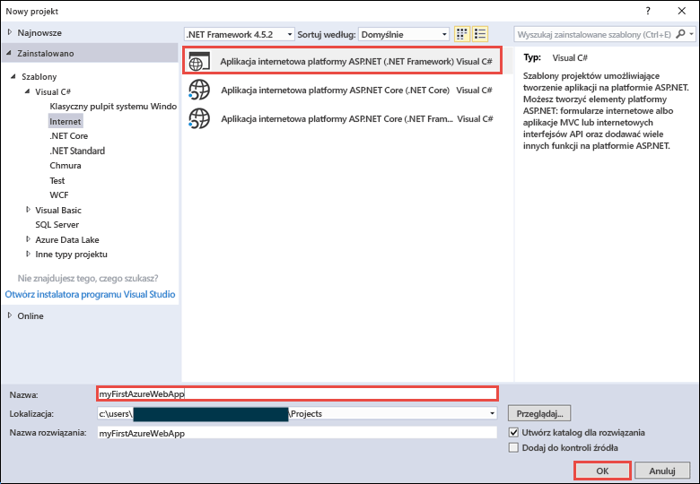

Na platformie Azure można wdrożyć dowolny typ aplikacji internetowej platformy ASP.NET. Do celów tego przewodnika Szybki start wybierz szablon **MVC** i upewnij się, że uwierzytelnianie jest ustawione na wartość **Bez uwierzytelniania**.
      
Kliknij przycisk **OK**.

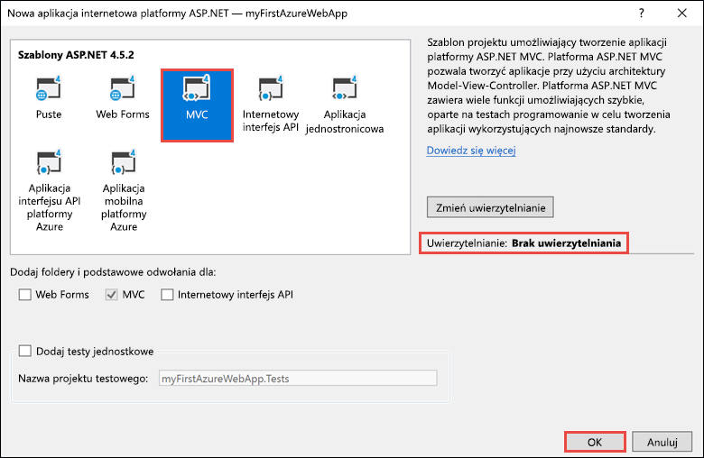

Z menu wybierz pozycję **Debuguj > Uruchom bez debugowania**, aby lokalnie uruchomić aplikację internetową.

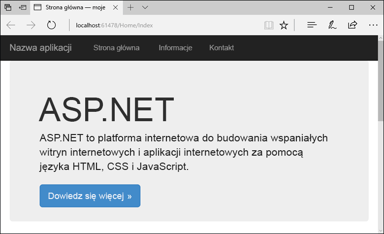

## <a name="launch-the-publish-wizard"></a>Uruchamianie kreatora publikacji

W obszarze **Eksplorator rozwiązań** kliknij prawym przyciskiem myszy projekt **myFirstAzureWebApp**, a następnie wybierz polecenie **Publikuj**.


Kreator publikowania jest uruchamiany automatycznie. Wybierz pozycje **App Service** > **Publikuj**, aby otworzyć okno dialogowe **Utwórz usługę App Service**.

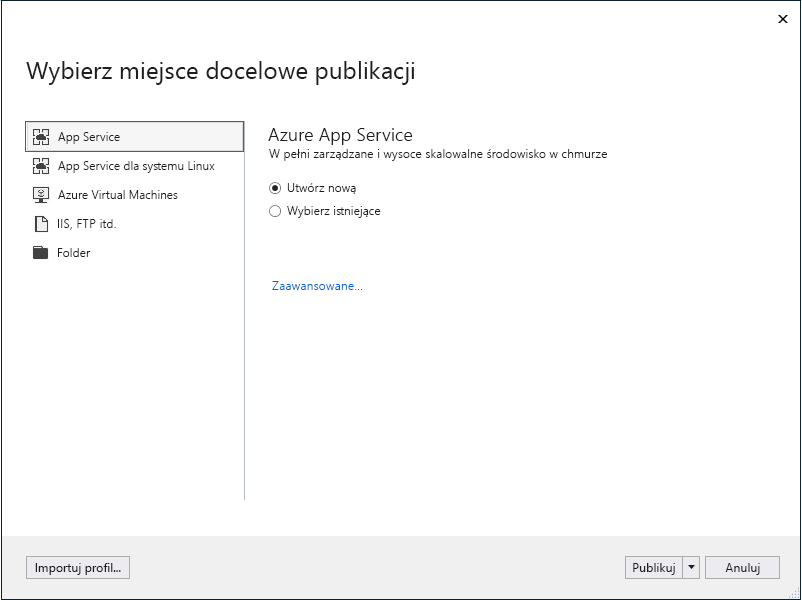

## <a name="sign-in-to-azure"></a>Logowanie do platformy Azure

W oknie dialogowym **Tworzenie usługi App Service** wybierz pozycję **Dodaj konto** i zaloguj się do swojej subskrypcji platformy Azure. Po zalogowaniu wybierz z listy rozwijanej konto zawierające odpowiednią subskrypcję.

> [!NOTE]
> Jeśli przeprowadzono już logowanie, nie wybieraj jeszcze pozycji **Utwórz**.
>
>
   
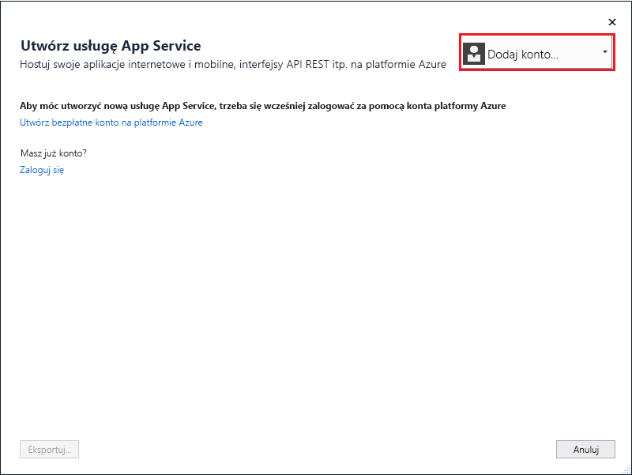

## <a name="create-a-resource-group"></a>Tworzenie grupy zasobów

[!INCLUDE [resource group intro text](../../includes/resource-group.md)]

Obok pozycji **Grupa zasobów** wybierz pozycję **Nowa**.

Nadaj grupie zasobów nazwę **myResourceGroup**, a następnie kliknij przycisk **OK**.

## <a name="create-an-app-service-plan"></a>Tworzenie planu usługi App Service

[!INCLUDE [app-service-plan](../../includes/app-service-plan.md)]

Obok pozycji **Plan hostingu** wybierz pozycję **Nowy**. 

W oknie dialogowym **Konfiguruj plan hostingu** użyj ustawień znajdujących się w tabeli poniżej zrzutu ekranu.

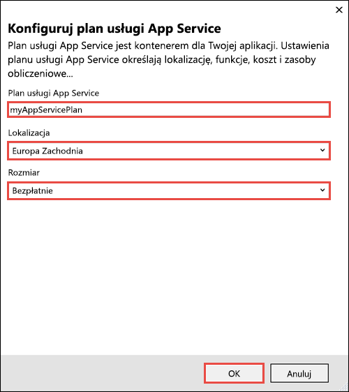

| Ustawienie | Sugerowana wartość | Opis |
|-|-|-|
|Plan usługi App Service| myAppServicePlan | Nazwa planu usługi App Service. |
| Location | Europa Zachodnia | Centrum danych, w którym hostowana jest aplikacja internetowa. |
| Size | Bezpłatna | [Warstwa cenowa](https://azure.microsoft.com/pricing/details/app-service/?ref=microsoft.com&utm_source=microsoft.com&utm_medium=docs&utm_campaign=visualstudio) określa funkcje hostowania. |

Kliknij przycisk **OK**.

## <a name="create-and-publish-the-web-app"></a>Tworzenie i publikowanie aplikacji internetowej

W polu **Nazwa aplikacji** wpisz unikatową nazwę aplikacji (dozwolone znaki to `a-z`, `0-9` i `-`) lub zaakceptuj automatycznie wygenerowaną unikatową nazwę. Adres URL aplikacji internetowej to `http://<app_name>.azurewebsites.net`, gdzie `<app_name>` to nazwa aplikacji.

Wybierz pozycję **Utwórz**, aby rozpocząć tworzenie zasobów platformy Azure.

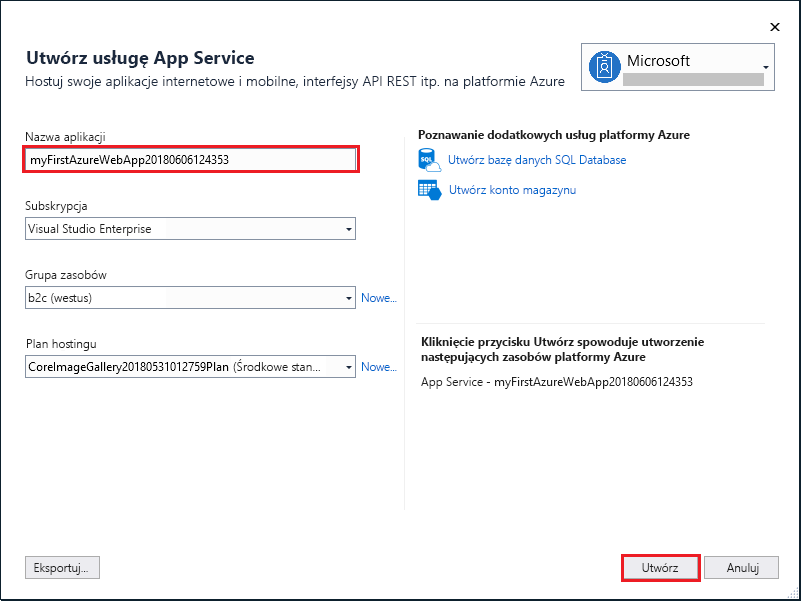

Po zakończeniu działania kreatora aplikacja internetowa ASP.NET zostanie opublikowana na platformie Azure, a następnie uruchomiona w domyślnej przeglądarce.


Nazwa aplikacji określona w [kroku tworzenia i publikowania](#create-and-publish-the-web-app) jest używana jako prefiks adresu URL w formacie `http://<app_name>.azurewebsites.net`.

Gratulacje, Twoja aplikacja internetowa ASP.NET działa w usłudze Azure App Service.

## <a name="update-the-app-and-redeploy"></a>Aktualizowanie aplikacji i ponowne wdrażanie

Za pomocą **Eksploratora rozwiązań** otwórz plik _Views\Home\Index.cshtml_.

Znajdź tag HTML `<div class="jumbotron">` u góry i zastąp cały element następującym kodem:

```HTML
<div class="jumbotron">
    <h1>ASP.NET in Azure!</h1>
    <p class="lead">This is a simple app that we’ve built that demonstrates how to deploy a .NET app to Azure App Service.</p>
</div>
```

Aby przeprowadzić ponowne wdrożenie na platformie Azure, kliknij prawym przyciskiem myszy projekt **myFirstAzureWebApp** w **Eksploratorze rozwiązań**, a następnie wybierz polecenie **Publikuj**.

Na stronie publikowania wybierz pozycję **Publikuj**.
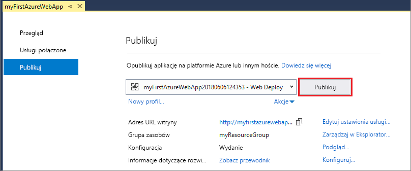

Po zakończeniu publikowania program Visual Studio otworzy w przeglądarce adres URL aplikacji internetowej.

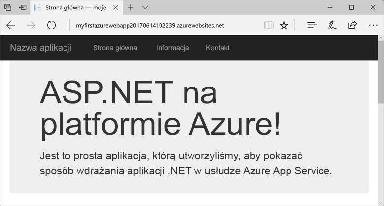

## <a name="manage-the-azure-app"></a>Zarządzanie aplikacją platformy Azure

Przejdź do witryny <a href="https://portal.azure.com" target="_blank">Azure Portal</a>, aby zarządzać aplikacją internetową.

W lewym menu wybierz pozycję **App Services**, a następnie wybierz nazwę swojej aplikacji platformy Azure.

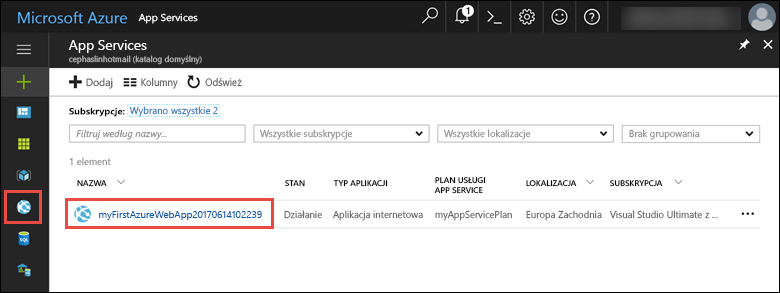

Zostanie wyświetlona strona Omówienie aplikacji internetowej. Tutaj możesz wykonywać podstawowe zadania zarządzania, takie jak przeglądanie, zatrzymywanie, uruchamianie, ponowne uruchamianie i usuwanie. 

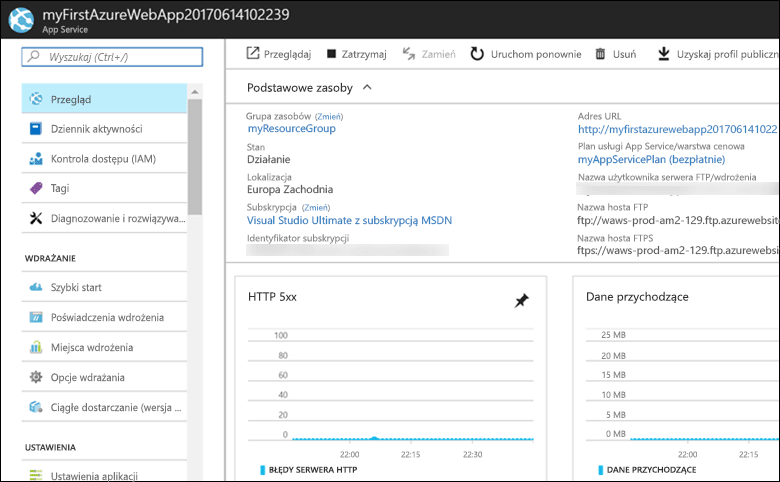

Menu po lewej stronie zawiera różne strony służące do konfigurowania aplikacji. 

## <a name="video"></a>Połączenia wideo

Obejrzyj wideo, aby zobaczyć, jak działa ten przewodnik Szybki start, a następnie wykonaj kroki samodzielnie, aby opublikować swoją pierwszą aplikację .NET na platformie Azure.

> [!VIDEO https://channel9.msdn.com/Shows/Azure-for-NET-Developers/Create-a-NET-app-in-Azure-Quickstart/player]

[!INCLUDE [Clean-up section](../../includes/clean-up-section-portal.md)]

## <a name="next-steps"></a>Następne kroki

> [!div class="nextstepaction"]
> [Platforma .ASP.NET z usługą SQL Database](app-service-web-tutorial-dotnet-sqldatabase.md)
