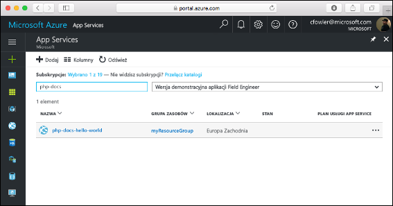

# <a name="create-a-php-web-app-in-azure"></a>Tworzenie aplikacji sieci Web w języku PHP na platformie Azure

> [!NOTE]
> W tym artykule opisano wdrażanie aplikacji w usłudze App Service w systemie Windows. Aby wdrożyć aplikację w usłudze App Service w systemie _Linux_, zobacz [Tworzenie aplikacji internetowej w języku PHP w usłudze App Service w systemie Linux](./containers/quickstart-php.md).
>

Usługa [Azure Web Apps](app-service-web-overview.md) oferuje wysoce skalowalną i samonaprawialną usługę hostowaną w Internecie.  Ten samouczek Szybki start przedstawia sposób wdrażania aplikacji PHP w usłudze Azure Web Apps. Aplikacja internetowa zostanie utworzona przy użyciu [interfejsu wiersza polecenia platformy Azure](https://docs.microsoft.com/cli/azure/get-started-with-azure-cli) w usłudze Cloud Shell, a przykład kodu w języku PHP zostanie wdrożony w aplikacji internetowej za pomocą [pliku ZIP](app-service-deploy-zip.md).

![Przykładowa aplikacja działająca na platformie Azure]](media/app-service-web-get-started-php/hello-world-in-browser.png)

Poniższe kroki możesz wykonać przy użyciu komputera z systemem Mac, Windows lub Linux. Po zainstalowaniu wymagań wstępnych wykonanie czynności trwa około pięciu minut.

[!INCLUDE [quickstarts-free-trial-note](../../includes/quickstarts-free-trial-note.md)]

## <a name="prerequisites"></a>Wymagania wstępne

Aby ukończyć ten przewodnik Szybki start:

* <a href="https://php.net" target="_blank">Zainstaluj środowisko PHP</a>

## <a name="download-the-sample-locally"></a>Pobieranie przykładu na maszynę lokalną

Pobierz przykładowy projekt języka PHP ze strony [https://github.com/Azure-Samples/php-docs-hello-world/archive/master.zip](https://github.com/Azure-Samples/php-docs-hello-world/archive/master.zip) i wyodrębnij archiwum ZIP.

W oknie terminalu przejdź do katalogu głównego przykładowego projektu języka PHP (zawierającego plik _index.php_).

## <a name="run-the-app-locally"></a>Lokalne uruchamianie aplikacji

Uruchom aplikację lokalnie, otwierając okno terminala i korzystając z polecenia `php` w celu uruchomienia wbudowanego serwera internetowego środowiska PHP.

```bash
php -S localhost:8080
```

Otwórz przeglądarkę internetową i przejdź do przykładowej aplikacji pod adresem `http://localhost:8080`.

Na stronie zostanie wyświetlony komunikat **Hello World!** z przykładowej aplikacji.


W oknie terminalu naciśnij kombinację klawiszy **Ctrl + C**, aby zamknąć serwer sieci Web.

[!INCLUDE [Create ZIP file](../../includes/app-service-web-create-zip.md)]

[!INCLUDE [cloud-shell-try-it.md](../../includes/cloud-shell-try-it.md)]

[!INCLUDE [Create resource group](../../includes/app-service-web-create-resource-group.md)]

[!INCLUDE [Create app service plan](../../includes/app-service-web-create-app-service-plan.md)]

## <a name="create-a-web-app"></a>Tworzenie aplikacji sieci Web

W usłudze Cloud Shell utwórz aplikację internetową w planie usługi App Service `myAppServicePlan` za pomocą polecenia [`az webapp create`](/cli/azure/webapp?view=azure-cli-latest#az_webapp_create). 

W poniższym przykładzie zastąp ciąg `<app_name>` globalnie unikatową nazwą aplikacji (prawidłowe znaki to `a-z`, `0-9` i `-`). Środowisko uruchomieniowe ma ustawioną wartość `PHP|7.0`. Aby wyświetlić wszystkie obsługiwane środowiska uruchomieniowe, uruchom polecenie [`az webapp list-runtimes`](/cli/azure/webapp?view=azure-cli-latest#az_webapp_list_runtimes). 

```azurecli-interactive
az webapp create --resource-group myResourceGroup --plan myAppServicePlan --name <app_name> --runtime "PHP|7.0"
```

Po utworzeniu aplikacji internetowej w interfejsie wiersza polecenia platformy Azure zostaną wyświetlone dane wyjściowe podobne do następujących:

```json
{
  "availabilityState": "Normal",
  "clientAffinityEnabled": true,
  "clientCertEnabled": false,
  "cloningInfo": null,
  "containerSize": 0,
  "dailyMemoryTimeQuota": 0,
  "defaultHostName": "<app_name>.azurewebsites.net",
  "enabled": true,
  < JSON data removed for brevity. >
}
```

Przejdź do nowo utworzonej aplikacji internetowej. Zastąp ciąg _&lt;nazwa aplikacji>_ unikatową nazwą aplikacji.

```bash
http://<app name>.azurewebsites.net
```

Tak powinna wyglądać nowa aplikacja internetowa:


[!INCLUDE [Deploy ZIP file](../../includes/app-service-web-deploy-zip.md)]

## <a name="browse-to-the-app"></a>Przechodzenie do aplikacji

Przejdź do wdrożonej aplikacji za pomocą przeglądarki sieci Web.

```
http://<app_name>.azurewebsites.net
```

Przykładowy kod w języku PHP jest uruchamiany w aplikacji internetowej usługi Azure App Service.


**Gratulacje!** Udało Ci się wdrożyć pierwszą własną aplikację w języku PHP w usłudze App Service.

## <a name="update-locally-and-redeploy-the-code"></a>Lokalne aktualizowanie i ponowne wdrażanie kodu

Za pomocą lokalnego edytora tekstów otwórz plik `index.php` w aplikacji w języku PHP i wprowadź niewielką zmianę w tekście ciągu obok polecenia `echo`:

```php
echo "Hello Azure!";
```

W lokalnym oknie terminalu przejdź do katalogu głównego aplikacji i utwórz nowy plik ZIP dla zaktualizowanego projektu.

```
# Bash
zip -r myUpdatedAppFiles.zip .

# PowerShell
Compress-Archive -Path * -DestinationPath myUpdatedAppFiles.zip
``` 

Wdróż ten nowy plik ZIP w usłudze App Service, korzystając z tych samych kroków w sekcji [Przekazywanie pliku ZIP](#upload-the-zip-file).

Przejdź z powrotem do okna przeglądarki otwartego w kroku **przechodzenia do aplikacji**, a następnie odśwież stronę.


## <a name="manage-your-new-azure-web-app"></a>Zarządzanie nową aplikacją sieci Web platformy Azure

Przejdź do witryny <a href="https://portal.azure.com" target="_blank">Azure Portal</a>, aby zarządzać utworzoną aplikacją internetową.

W menu po lewej stronie kliknij pozycję **App Services**, a następnie kliknij nazwę swojej aplikacji internetowej platformy Azure.



Zostanie wyświetlona strona Omówienie aplikacji internetowej. Tutaj możesz wykonywać podstawowe zadania zarządzania, takie jak przeglądanie, zatrzymywanie, uruchamianie, ponowne uruchamianie i usuwanie.


Menu po lewej stronie zawiera różne strony służące do konfigurowania aplikacji. 

[!INCLUDE [cli-samples-clean-up](../../includes/cli-samples-clean-up.md)]

## <a name="next-steps"></a>Następne kroki

> [!div class="nextstepaction"]
> [Środowisko PHP z bazą danych MySQL](app-service-web-tutorial-php-mysql.md)
