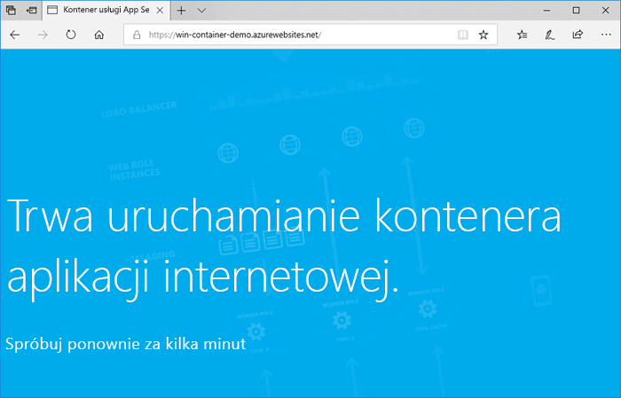
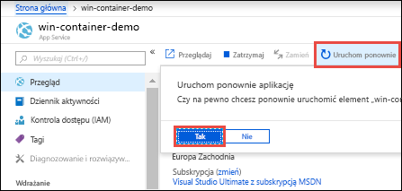

# <a name="run-a-custom-windows-container-in-azure-preview"></a>Uruchamianie niestandardowego kontenera systemu Windows na platformie Azure (wersja zapoznawcza)

[Usługa Azure App Service](overview.md) udostępnia wstępnie zdefiniowane stosy aplikacji w systemie Windows, takie jak ASP.NET lub Node.js, działające w usługach IIS. Wstępnie skonfigurowane środowisko systemu Windows blokuje system operacyjny z poziomu dostępu administracyjnego, instalacji oprogramowania, zmian w globalnej pamięci podręcznej zestawów itd. Aby uzyskać więcej informacji, zobacz [Funkcja systemu operacyjnego na Azure App Service](operating-system-functionality.md). Jeśli aplikacja wymaga szerszego dostępu niż ten, na który pozwala wstępnie skonfigurowane środowisko, możesz wdrożyć niestandardowy kontener systemu Windows.

Ten przewodnik Szybki Start przedstawia sposób wdrażania aplikacji ASP.NET w obrazie systemu Windows w usłudze [Docker Hub](https://hub.docker.com/) z programu Visual Studio. Aplikacja jest uruchamiana w kontenerze niestandardowym w Azure App Service.

## <a name="prerequisites"></a>Wymagania wstępne

W celu ukończenia tego samouczka:

- <a href="https://hub.docker.com/" target="_blank">Załóż konto usługi Docker Hub</a>
- <a href="https://docs.docker.com/docker-for-windows/install/" target="_blank">Zainstaluj program Docker for Windows</a>.
- <a href="https://docs.microsoft.com/virtualization/windowscontainers/quick-start/quick-start-windows-10" target="_blank">Przełącz platformę Docker na potrzeby uruchamiania kontenerów systemu Windows</a>.
- <a href="https://www.visualstudio.com/downloads/" target="_blank">Zainstaluj program Visual Studio 2019</a> przy użyciu obciążeń **ASP.NET oraz tworzenia aplikacji sieci Web** i **platformy Azure** . Jeśli zainstalowano już program Visual Studio 2019:

    - Zainstaluj najnowsze aktualizacje programu Visual Studio, wybierając pozycję **Pomoc** > **Sprawdź dostępność aktualizacji**.
    - Dodaj obciążenia w programie Visual Studio, wybierając kolejno pozycje **Narzędzia** > **Pobierz narzędzia i funkcje**.

## <a name="create-an-aspnet-web-app"></a>Tworzenie aplikacji internetowej platformy ASP.NET

Utwórz aplikację internetową ASP.NET, wykonując następujące czynności:

1. Otwórz program Visual Studio, a następnie wybierz pozycję **Utwórz nowy projekt**.

1. W obszarze **Utwórz nowy projekt**Znajdź i wybierz pozycję **aplikacja sieci Web ASP.NET (.NET Framework)** dla C#usługi, a następnie wybierz pozycję **dalej**.

1. W obszarze **Konfigurowanie nowego projektu**Nadaj nazwę aplikacji _myFirstAzureWebApp_, a następnie wybierz pozycję **Utwórz**.

   

1. Na platformie Azure można wdrożyć dowolny typ aplikacji internetowej platformy ASP.NET. Na potrzeby tego przewodnika Szybki Start wybierz szablon **MVC** .

1. Wybierz opcję **Obsługa platformy Docker**i upewnij się, że uwierzytelnianie jest ustawione na wartość **bez uwierzytelniania**. Wybierz pozycję **Utwórz**.

   

1. Jeśli plik _Dockerfile_ nie zostanie automatycznie otwarty, otwórz go w **Eksploratorze rozwiązań**.

1. Potrzebujesz [obsługiwanego obrazu nadrzędnego](#use-a-different-parent-image). Zmień obraz nadrzędny, zastępując wiersz `FROM` następującym kodem i zapisując plik:

   ```Dockerfile
   FROM mcr.microsoft.com/dotnet/framework/aspnet:4.7.2-windowsservercore-ltsc2019
   ```

1. Z menu programu Visual Studio wybierz pozycję **Debuguj** > **Uruchom bez debugowania** , aby uruchomić aplikację internetową lokalnie.

   

## <a name="publish-to-docker-hub"></a>Publikowanie w usłudze Docker Hub

1. W **Eksplorator rozwiązań**kliknij prawym przyciskiem myszy projekt **myFirstAzureWebApp** i wybierz polecenie **Publikuj**.

1. Wybierz **App Service** a następnie wybierz pozycję **Publikuj**.

1. W obszarze Wybieranie **elementu docelowego publikowania**wybierz pozycję **Container Registry** i usługa **Docker Hub**, a następnie kliknij pozycję **Publikuj**.

   

1. Podaj poświadczenia konta centrum platformy Docker i wybierz pozycję **Zapisz**.

   Zaczekaj na zakończenie wdrożenia. Na stronie **Publikuj** jest teraz wyświetlana nazwa repozytorium do użycia później.

   

1. Skopiuj tę nazwę repozytorium do późniejszego użycia.

## <a name="create-a-windows-container-app"></a>Tworzenie aplikacji kontenera systemu Windows

1. Zaloguj się w witrynie [Azure Portal]( https://portal.azure.com).

1. W lewym górnym rogu okna witryny Azure Portal wybierz pozycję **Utwórz zasób**.

1. W polu wyszukiwania powyżej listy zasobów portalu Azure Marketplace Wyszukaj pozycję **Web App for Containers**i wybierz pozycję **Utwórz**.

1. W obszarze **Tworzenie aplikacji sieci Web**wybierz subskrypcję i **grupę zasobów**. W razie konieczności można utworzyć nową grupę zasobów.

1. Podaj nazwę aplikacji, taką jak *win-Container-Demonstracja* , i wybierz **system Windows** dla **systemu operacyjnego**. Wybierz opcję **Dalej:**  Aby kontynuować, Zadokuj.

   

1. W polu **Źródło obrazu**wybierz pozycję **centrum Docker** i pozycję **obraz i tag**, a następnie wprowadź nazwę repozytorium skopiowaną w obszarze publikowanie w [usłudze Docker Hub](#publish-to-docker-hub).

   

    Jeśli masz obraz niestandardowy dla aplikacji internetowej w innym miejscu, na przykład w [usłudze Azure Container Registry](/azure/container-registry/) lub w innym prywatnym repozytorium, możesz skonfigurować go tutaj.

1. Wybierz pozycję **Przejrzyj i Utwórz** , a następnie **Utwórz** i poczekaj na platformę Azure, aby utworzyć wymagane zasoby.

## <a name="browse-to-the-container-app"></a>Przechodzenie do aplikacji kontenera

Po zakończeniu operacji platformy Azure zostanie wyświetlone okno powiadomienia.


1. Kliknij pozycję **Przejdź do zasobu**.

1. W obszarze przegląd tego zasobu Użyj linku obok pozycji **adres URL**.

Zostanie otwarta nowa strona przeglądarki na następującej stronie:



Poczekaj kilka minut i spróbuj ponownie, dopóki nie zostanie wyświetlona domyślna strona główna aplikacji ASP.NET:


**Gratulacje!** Uruchamiasz swój pierwszy niestandardowy kontener systemu Windows w usłudze Azure App Service.

## <a name="see-container-start-up-logs"></a>Wyświetlanie dzienników uruchamiania kontenera

Może upłynąć trochę czasu, zanim kontener systemu Windows zostanie załadowany. Aby wyświetlić postęp, przejdź do następującego adresu URL, zastępując ciąg *\<nazwa_aplikacji>* nazwą swojej aplikacji.
```
https://<app_name>.scm.azurewebsites.net/api/logstream
```

Przesyłane strumieniowo dzienniki wyglądają następująco:

```
2018-07-27T12:03:11  Welcome, you are now connected to log-streaming service.
27/07/2018 12:04:10.978 INFO - Site: win-container-demo - Start container succeeded. Container: facbf6cb214de86e58557a6d073396f640bbe2fdec88f8368695c8d1331fc94b
27/07/2018 12:04:16.767 INFO - Site: win-container-demo - Container start complete
27/07/2018 12:05:05.017 INFO - Site: win-container-demo - Container start complete
27/07/2018 12:05:05.020 INFO - Site: win-container-demo - Container started successfully
```

## <a name="update-locally-and-redeploy"></a>Lokalne aktualizowanie i ponowne wdrażanie

1. W programie Visual Studio w **Eksplorator rozwiązań**Otwórz **Widok** > **główny** > **index. cshtml**.

1. Znajdź tag HTML `<div class="jumbotron">` u góry i zastąp cały element następującym kodem:

   ```HTML
   <div class="jumbotron">
       <h1>ASP.NET in Azure!</h1>
       <p class="lead">This is a simple app that we’ve built that demonstrates how to deploy a .NET app to Azure App Service.</p>
   </div>
   ```

1. Aby ponownie wdrożyć na platformie Azure, kliknij prawym przyciskiem myszy projekt **myFirstAzureWebApp** w **Eksplorator rozwiązań** i wybierz polecenie **Publikuj**.

1. Na stronie publikowania wybierz pozycję **Publikuj** i poczekaj na ukończenie procesu publikowania.

1. Aby nakazać usłudze App Service ściągnięcie obrazu z usługi Docker Hub, uruchom ponownie aplikację. Na stronie aplikacji w portalu kliknij pozycję **Uruchom ponownie** > **Tak**.

   

Ponownie [przejdź do aplikacji kontenera](#browse-to-the-container-app). Po odświeżeniu strony internetowej najpierw powinna być widoczna strona „Uruchamianie”, a następnie po kilku minutach powinna zostać wyświetlona zaktualizowana strona internetowa.


## <a name="use-a-different-parent-image"></a>Używanie innego obrazu nadrzędnego

Możesz użyć innego niestandardowego obrazu platformy Docker, aby uruchomić aplikację. Musisz jednak wybrać właściwy [obraz nadrzędny](https://docs.docker.com/develop/develop-images/baseimages/) dla wybranej platformy:

- Aby wdrożyć aplikacje .NET Framework, Użyj obrazu nadrzędnego na podstawie wersji [LTSC (Long-Term Servicing Channel)](https://docs.microsoft.com/windows-server/get-started-19/servicing-channels-19#long-term-servicing-channel-ltsc) systemu Windows Server Core 2019. 
- Aby wdrażać aplikacje platformy .NET Core, Użyj obrazu nadrzędnego na podstawie wersji systemu Windows Server nano 1809 [częściowo-rocznego kanału obsługi (SAC)](https://docs.microsoft.com/windows-server/get-started-19/servicing-channels-19#semi-annual-channel) . 

Pobieranie obrazu nadrzędnego podczas uruchamiania aplikacji może zająć trochę czasu. Można jednak skrócić czas uruchamiania, korzystając z jednego z następujących obrazów nadrzędnych, które już zostały zbuforowane w usłudze Azure App Service:

- [MCR.Microsoft.com/dotnet/Framework/ASPNET](https://hub.docker.com/_/microsoft-dotnet-framework-aspnet/): 4.7.2-windowsservercore-ltsc2019
- [MCR.Microsoft.com/Windows/nanoserver](https://hub.docker.com/_/microsoft-windows-nanoserver/): 1809 — ten obraz jest kontenerem bazowym używanym w obrazach Microsoft [ASP.NET Core](https://hub.docker.com/_microsoft-dotnet-cores-aspnet) Microsoft Windows nano Server.

## <a name="next-steps"></a>Następne kroki

> [!div class="nextstepaction"]
> [Migrowanie do kontenera systemu Windows na platformie Azure](app-service-web-tutorial-windows-containers-custom-fonts.md)
