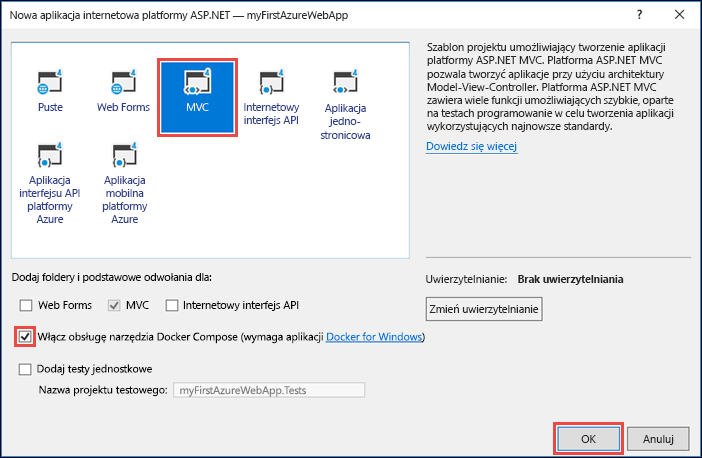
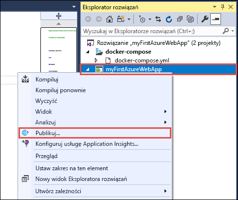
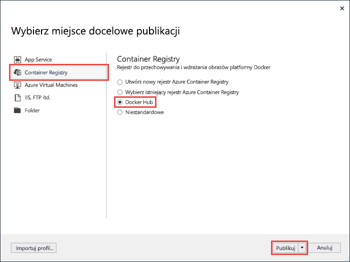
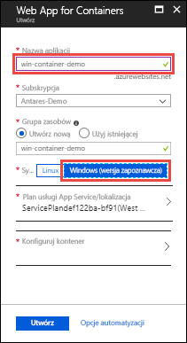
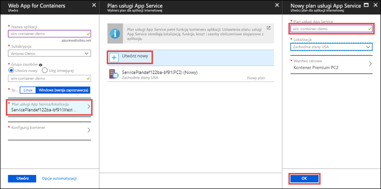
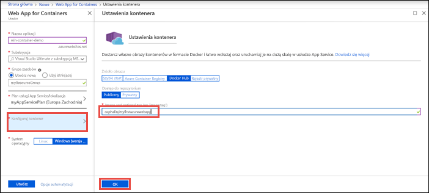

# <a name="run-a-custom-windows-container-in-azure-preview"></a>Uruchamianie niestandardowego kontenera systemu Windows na platformie Azure (wersja zapoznawcza)

[Usługa Azure App Service](overview.md) udostępnia wstępnie zdefiniowane stosy aplikacji w systemie Windows, takie jak ASP.NET lub Node.js, działające w usługach IIS. Wstępnie skonfigurowane środowisko systemu Windows blokuje możliwość dostępu administracyjnego, instalacji oprogramowania, zmian w globalnej pamięci podręcznej zestawów itd. w systemie operacyjnym. Zobacz [Operating system functionality on Azure App Service](operating-system-functionality.md) (Funkcjonalność systemu operacyjnego w usłudze Azure App Service). Jeśli aplikacja wymaga szerszego dostępu niż ten, na który pozwala wstępnie skonfigurowane środowisko, możesz wdrożyć niestandardowy kontener systemu Windows. W tym przewodniku Szybki start przedstawiono sposób wdrażania aplikacji ASP.NET z obrazu systemu Windows w usłudze [Docker Hub](https://hub.docker.com/) z poziomu programu Visual Studio i uruchamiania jej w niestandardowym kontenerze w usłudze Azure App Service.


## <a name="prerequisites"></a>Wymagania wstępne

W celu ukończenia tego samouczka:

- <a href="https://hub.docker.com/" target="_blank">Załóż konto usługi Docker Hub</a>
- <a href="https://docs.docker.com/docker-for-windows/install/" target="_blank">Zainstaluj program Docker for Windows</a>.
- <a href="https://docs.microsoft.com/virtualization/windowscontainers/quick-start/quick-start-windows-10" target="_blank">Przełącz platformę Docker na potrzeby uruchamiania kontenerów systemu Windows</a>.
- <a href="https://www.visualstudio.com/downloads/" target="_blank">Zainstaluj program Visual Studio 2017</a> z pakietami roboczymi **Tworzenie aplikacji na platformie ASP.NET i aplikacji internetowych** oraz **Tworzenie aplikacji na platformie Azure**. Jeśli masz już zainstalowany program Visual Studio 2017:
    - Zainstaluj najnowsze aktualizacje w programie Visual Studio, klikając pozycje **Pomoc** > **Sprawdź aktualizacje**.
    - Dodaj pakiety robocze w programie Visual Studio, klikając pozycje **Narzędzia** > **Pobierz narzędzia i funkcje**.

## <a name="create-an-aspnet-web-app"></a>Tworzenie aplikacji internetowej platformy ASP.NET

W programie Visual Studio utwórz nowy projekt, wybierając pozycję **Plik > Nowy > Projekt**. 

W oknie dialogowym **Nowy projekt** kliknij pozycję **Visual C# &gt; Internet &gt; Aplikacja internetowa ASP.NET (program .NET Framework)**.

Nadaj aplikacji nazwę _myFirstAzureWebApp_, a następnie kliknij przycisk **OK**.
   


Na platformie Azure można wdrożyć dowolny typ aplikacji internetowej platformy ASP.NET. Do celów tego przewodnika Szybki start wybierz szablon **MVC** i upewnij się, że uwierzytelnianie jest ustawione na wartość **Bez uwierzytelniania**.

Wybierz pozycję **Włącz obsługę narzędzia Docker Compose**.

Kliknij przycisk **OK**.



Jeśli plik _Dockerfile_ nie zostanie automatycznie otwarty, otwórz go w **Eksploratorze rozwiązań**.

Konieczne będzie użycie [obsługiwanego obrazu nadrzędnego](#use-a-different-parent-image). Zmień obraz nadrzędny, zastępując wiersz `FROM` następującym kodem i zapisując plik:

```Dockerfile
FROM mcr.microsoft.com/dotnet/framework/aspnet:4.7.2-windowsservercore-ltsc2019
```

Z menu wybierz pozycję **Debuguj > Uruchom bez debugowania**, aby lokalnie uruchomić aplikację internetową.


## <a name="publish-to-docker-hub"></a>Publikowanie w usłudze Docker Hub

W obszarze **Eksplorator rozwiązań** kliknij prawym przyciskiem myszy projekt **myFirstAzureWebApp**, a następnie wybierz polecenie **Publikuj**.



Kreator publikowania jest uruchamiany automatycznie. Wybierz kolejno pozycje **Container Registry** > **Docker Hub** > **Publikuj**.



Podaj poświadczenia konta usługi Docker Hub i kliknij przycisk **Zapisz**. 

Zaczekaj na zakończenie wdrożenia. Na stronie **Publikowanie** jest teraz wyświetlana nazwa repozytorium, której użyjesz później w usłudze App Service.


Skopiuj tę nazwę repozytorium do późniejszego użycia.

## <a name="sign-in-to-azure"></a>Logowanie do platformy Azure

Zaloguj się do witryny Azure Portal pod adresem https://portal.azure.com.

## <a name="create-a-windows-container-app"></a>Tworzenie aplikacji kontenera systemu Windows

1. W lewym górnym rogu okna witryny Azure Portal wybierz pozycję **Utwórz zasób**.

2. W polu wyszukiwania nad listą zasobów w portalu Azure Marketplace wpisz **Web App for Containers**, aby wyszukać i wybrać tę pozycję.

3. Podaj nazwę aplikacji, na przykład *win-container-demo*, zaakceptuj wartości domyślne, aby utworzyć nową grupę zasobów, a następnie kliknij pozycję **Windows (wersja zapoznawcza)** w polu **System operacyjny**.

    

4. Utwórz plan usługi App Service, klikając pozycję **Plan usługi App Service/lokalizacja** > **Utwórz nowy**. Nadaj nazwę nowemu planowi, zaakceptuj wartości domyślne, a następnie kliknij przycisk **OK**.

    

5. Kliknij pozycję **Konfiguruj kontener**. W obszarze **Obraz i opcjonalny tag** użyj nazwy repozytorium skopiowanej w sekcji [Publikowanie w usłudze Docker Hub](#publish-to-docker-hub), a następnie kliknij przycisk **OK**.

    

    Jeśli masz obraz niestandardowy dla aplikacji internetowej w innym miejscu, na przykład w [usłudze Azure Container Registry](/azure/container-registry/) lub w innym prywatnym repozytorium, możesz skonfigurować go tutaj.

6. Kliknij przycisk **Utwórz** i poczekaj na utworzenie wymaganych zasobów przez platformę Azure.

## <a name="browse-to-the-container-app"></a>Przechodzenie do aplikacji kontenera

Po zakończeniu operacji platformy Azure zostanie wyświetlone okno powiadomienia.


1. Kliknij pozycję **Przejdź do zasobu**.

2. Na stronie aplikacji kliknij link w obszarze **Adres URL**.

W przeglądarce zostanie otwarta następująca strona:


Poczekaj kilka minut i spróbuj ponownie, dopóki nie zostanie wyświetlona domyślna strona główna aplikacji ASP.NET:


**Gratulacje!** Uruchamiasz swój pierwszy niestandardowy kontener systemu Windows w usłudze Azure App Service.

## <a name="see-container-start-up-logs"></a>Wyświetlanie dzienników uruchamiania kontenera

Może upłynąć trochę czasu, zanim kontener systemu Windows zostanie załadowany. Aby wyświetlić postęp, przejdź do następującego adresu URL, zastępując ciąg *\<nazwa_aplikacji>* nazwą swojej aplikacji.
```
https://<app_name>.scm.azurewebsites.net/api/logstream
```

Przesyłane strumieniowo dzienniki wyglądają następująco:

```
2018-07-27T12:03:11  Welcome, you are now connected to log-streaming service.
27/07/2018 12:04:10.978 INFO - Site: win-container-demo - Start container succeeded. Container: facbf6cb214de86e58557a6d073396f640bbe2fdec88f8368695c8d1331fc94b
27/07/2018 12:04:16.767 INFO - Site: win-container-demo - Container start complete
27/07/2018 12:05:05.017 INFO - Site: win-container-demo - Container start complete
27/07/2018 12:05:05.020 INFO - Site: win-container-demo - Container started successfully
```

## <a name="update-locally-and-redeploy"></a>Lokalne aktualizowanie i ponowne wdrażanie

Za pomocą **Eksploratora rozwiązań** otwórz plik _Views\Home\Index.cshtml_.

Znajdź tag HTML `<div class="jumbotron">` u góry i zastąp cały element następującym kodem:

```HTML
<div class="jumbotron">
    <h1>ASP.NET in Azure!</h1>
    <p class="lead">This is a simple app that we’ve built that demonstrates how to deploy a .NET app to Azure App Service.</p>
</div>
```

Aby przeprowadzić ponowne wdrożenie na platformie Azure, kliknij prawym przyciskiem myszy projekt **myFirstAzureWebApp** w **Eksploratorze rozwiązań**, a następnie wybierz polecenie **Publikuj**.

Na stronie publikowania wybierz pozycję **Publikuj** i poczekaj na ukończenie procesu publikowania.

Aby nakazać usłudze App Service ściągnięcie obrazu z usługi Docker Hub, uruchom ponownie aplikację. Na stronie aplikacji w portalu kliknij pozycję **Uruchom ponownie** > **Tak**.


Ponownie [przejdź do aplikacji kontenera](#browse-to-the-container-app). Po odświeżeniu strony internetowej najpierw powinna być widoczna strona „Uruchamianie”, a następnie po kilku minutach powinna zostać wyświetlona zaktualizowana strona internetowa.


## <a name="use-a-different-parent-image"></a>Używanie innego obrazu nadrzędnego

Możesz użyć innego niestandardowego obrazu platformy Docker do uruchamiania aplikacji. Musisz jednak wybrać właściwy [obraz nadrzędny](https://docs.docker.com/develop/develop-images/baseimages/) dla wybranej platformy: 

- Wdrażanie aplikacji .NET Framework, należy użyć obrazu nadrzędnego na podstawie 2019 systemu Windows Server Core [Long-Term Servicing Channel (LTSC)](https://docs.microsoft.com/windows-server/get-started/semi-annual-channel-overview#long-term-servicing-channel-ltsc) wydania. 
- Aby wdrożyć aplikacje platformy .NET Core, należy użyć obrazu nadrzędnego, w oparciu o 1809 Nano Server systemu Windows [kanał obsługi półroczny (SAC)](https://docs.microsoft.com/windows-server/get-started-19/servicing-channels-19#semi-annual-channel) wydania. 

Pobieranie obrazu nadrzędnego podczas uruchamiania aplikacji może zająć trochę czasu. Można jednak skrócić czas uruchamiania, korzystając z jednego z następujących obrazów nadrzędnych, które już zostały zbuforowane w usłudze Azure App Service:

- [mcr.microsoft.com/dotnet/framework/aspnet](https://hub.docker.com/_/microsoft-dotnet-framework-aspnet/):4.7.2-windowsservercore-ltsc2019
- [MCR.microsoft.com/Windows/nanoserver](https://hub.docker.com/_/microsoft-windows-nanoserver/): 1809 — jest to podstawowy kontener używane w całym Microsoft [platformy ASP.NET Core](https://hub.docker.com/_microsoft-dotnet-cores-aspnet) obrazów systemu Nano Server w bazie wiedzy Microsoft Windows.

## <a name="next-steps"></a>Kolejne kroki

> [!div class="nextstepaction"]
> [Migrowanie do kontenera systemu Windows na platformie Azure](app-service-web-tutorial-windows-containers-custom-fonts.md)
