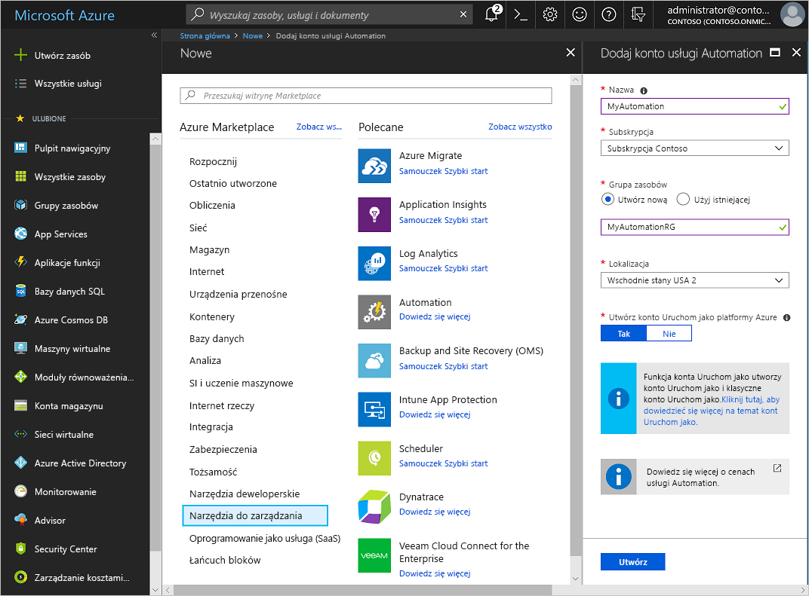

# Tworzenie konta usługi Azure Automation

Możesz utworzyć konto Azure Automation za pośrednictwem platformy Azure, korzystając z Azure Portal, interfejsu użytkownika opartego na przeglądarce, który umożliwia dostęp do wielu zasobów. Jedno konto usługi Automation może zarządzać zasobami między wszystkimi regionami i subskrypcjami dla danej dzierżawy. 

Ten przewodnik Szybki Start przedstawia sposób tworzenia konta usługi Automation i uruchamiania elementu Runbook w ramach konta. Jeśli nie masz subskrypcji platformy Azure, przed rozpoczęciem Utwórz [bezpłatne konto platformy Azure](https://azure.microsoft.com/free/?WT.mc_id=A261C142F) .

## Logowanie do platformy Azure

[Zaloguj się do platformy Azure](https://portal.azure.com).

## Tworzenie konta usługi Automation

1. Wybierz nazwę swojego konta platformy Azure. Nazwy kont usługi Automation są unikatowe dla poszczególnych regionów i grup zasobów. Nazwy kont usługi Automation, które zostały usunięte, mogą nie być od razu dostępne.

    > [!NOTE]
    > Nie można zmienić nazwy konta, gdy została wprowadzona w interfejsie użytkownika. 

2. Kliknij przycisk **Utwórz zasób** znajdujący się w lewym górnym rogu Azure Portal.

3. Wybierz **go & narzędzia do zarządzania**, a następnie wybierz **automatyzację**.

4. Wprowadź informacje o koncie, w tym nazwę wybranego konta. W obszarze **Utwórz konto Uruchom jako platformy Azure** wybierz pozycję **Tak**, aby artefakty upraszczające uwierzytelnianie zostały automatycznie włączone. Po zakończeniu tych informacji kliknij pozycję **Utwórz** , aby rozpocząć wdrażanie konta usługi Automation.

      

    > [!NOTE]
    > Zaktualizowaną listę lokalizacji, do których można wdrożyć konto usługi Automation, znajduje się w temacie [dostępne produkty według regionów](https://azure.microsoft.com/global-infrastructure/services/?products=automation&regions=all).

5. Po zakończeniu wdrażania kliknij pozycję **wszystkie usługi**.

6. Wybierz pozycję **konta usługi Automation** , a następnie wybierz utworzone konto usługi Automation.

    

## Uruchamianie elementu runbook

Uruchom jeden z elementów runbook z samouczka.

1. Kliknij pozycję **elementy Runbook** w obszarze **Automatyzacja procesów**. Zostanie wyświetlona lista elementów runbook. Domyślnie na koncie jest włączonych kilka elementów Runbook samouczków.

    

1. Wybierz element runbook **AzureAutomationTutorialScript**. Ta akcja spowoduje otwarcie strony przeglądu elementu runbook.

    

1. Kliknij pozycję **Uruchom**, a na stronie Uruchamianie elementu runbook kliknij przycisk **OK**, aby uruchomić element runbook.

    

1. Po stanie zadania `Running` kliknij pozycję **dane wyjściowe** lub **wszystkie dzienniki** , aby wyświetlić dane wyjściowe zadania elementu Runbook. W przypadku tego elementu runbook z samouczka danymi wyjściowymi jest lista Twoich zasobów platformy Azure.

## Następne kroki

W tym przewodniku Szybki start wdrożono konto usługi Automation, uruchomiono element runbook i wyświetlono wyniki zadania. Aby dowiedzieć się więcej na temat usługi Azure Automation, przejdź do przewodnika Szybki start dotyczącego tworzenia pierwszego elementu runbook.

> [!div class="nextstepaction"]
> [Przewodnik Szybki Start dotyczący automatyzacji — tworzenie Azure Automation elementu Runbook](./automation-quickstart-create-runbook.md)

