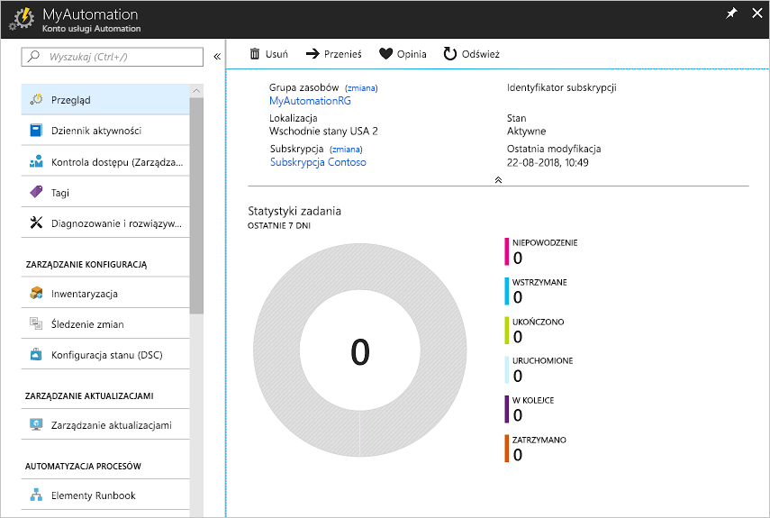
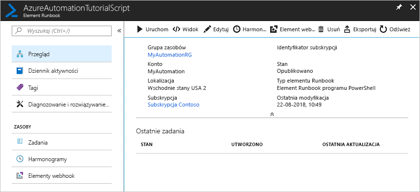

# Tworzenie konta usługi Azure Automation

Konto usługi Azure Automation można utworzyć za pośrednictwem platformy Azure przy użyciu witryny Azure portal, interfejsu użytkownika opartego na przeglądarce, umożliwiającego dostęp do wielu zasobów. Jedno konto automatyzacji może zarządzać zasobami we wszystkich regionach i subskrypcjach dla danej dzierżawy. 

Ten przewodnik szybki start prowadzi cię podczas tworzenia konta automatyzacji i uruchamiania ego księgi runbook na koncie. Jeśli nie masz subskrypcji platformy Azure, utwórz [bezpłatne konto platformy Azure](https://azure.microsoft.com/free/?WT.mc_id=A261C142F) przed rozpoczęciem.

## Logowanie do platformy Azure

[Zaloguj się na platformie Azure](https://portal.azure.com).

## Tworzenie konta usługi Automation

1. Wybierz nazwę swojego konta platformy Azure. Nazwy kont automatyzacji są unikatowe dla regionu i grupy zasobów. Nazwy kont automatyzacji, które zostały usunięte, mogą nie być natychmiast dostępne.

    > [!NOTE]
    > Nie można zmienić nazwy konta po wprowadzeniu jej w interfejsie użytkownika. 

2. Kliknij przycisk **Utwórz zasób** znaleziony w lewym górnym rogu witryny Azure Portal.

3. Wybierz **pozycję Narzędzia do zarządzania &** IT, a następnie wybierz pozycję **Automatyzacja**.

4. Wprowadź informacje o koncie, w tym nazwę wybranego konta. W obszarze **Utwórz konto Uruchom jako platformy Azure** wybierz pozycję **Tak**, aby artefakty upraszczające uwierzytelnianie zostały automatycznie włączone. Po zakończeniu tych informacji kliknij przycisk **Utwórz,** aby rozpocząć wdrażanie konta automatyzacji.

      

    > [!NOTE]
    > Aby uzyskać zaktualizowaną listę lokalizacji, do których można wdrożyć konto automatyzacji, zobacz [Produkty dostępne według regionu](https://azure.microsoft.com/global-infrastructure/services/?products=automation&regions=all).

5. Po zakończeniu wdrażania kliknij pozycję **Wszystkie usługi**.

6. Wybierz **pozycję Konta automatyzacji,** a następnie wybierz utworzone konto automatyzacji.

    

## Uruchamianie elementu runbook

Uruchom jeden z elementów runbook z samouczka.

1. Kliknij **pozycję Elementy runbook w** obszarze **Automatyzacja procesów**. Zostanie wyświetlona lista elementów runbook. Domyślnie na koncie jest włączonych kilka uruchomieniu cząs.

    

1. Wybierz element runbook **AzureAutomationTutorialScript**. Ta akcja spowoduje otwarcie strony przeglądu elementu runbook.

    

1. Kliknij pozycję **Uruchom**, a na stronie Uruchamianie elementu runbook kliknij przycisk **OK**, aby uruchomić element runbook.

    

1. Po stanie zadania `Running`kliknij pozycję **Dane wyjściowe** lub **Wszystkie dzienniki,** aby wyświetlić dane wyjściowe zadania runbook. W przypadku tego elementu runbook z samouczka danymi wyjściowymi jest lista Twoich zasobów platformy Azure.

## Następne kroki

W tym przewodniku Szybki start wdrożono konto usługi Automation, uruchomiono element runbook i wyświetlono wyniki zadania. Aby dowiedzieć się więcej na temat usługi Azure Automation, przejdź do przewodnika Szybki start dotyczącego tworzenia pierwszego elementu runbook.

> [!div class="nextstepaction"]
> [Przewodnik Szybki start usługi Automation — tworzenie elementu runbook](./automation-quickstart-create-runbook.md)

