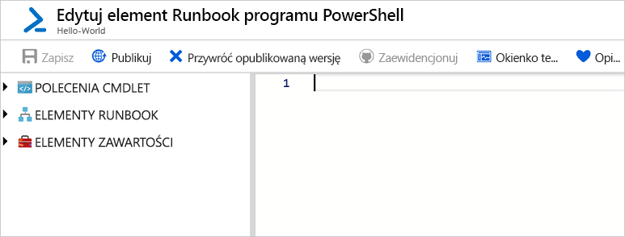
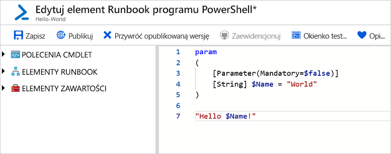
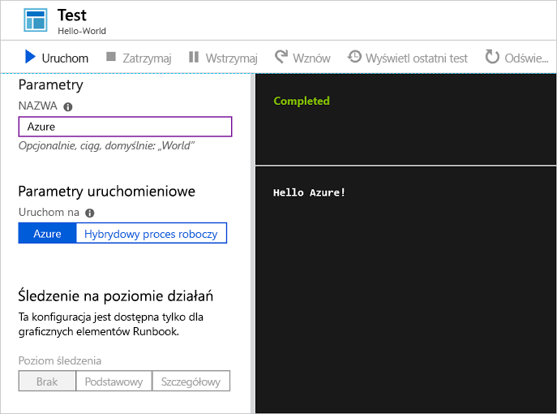
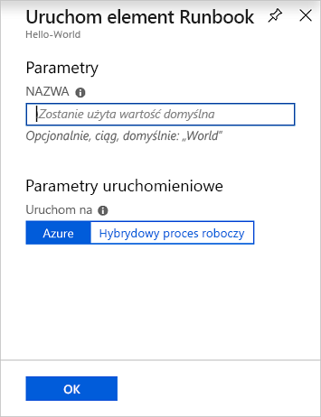
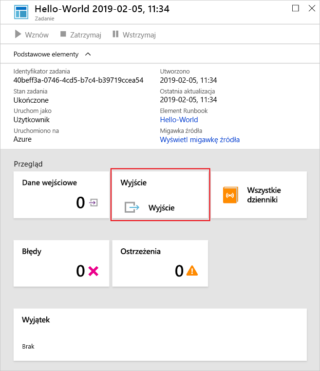
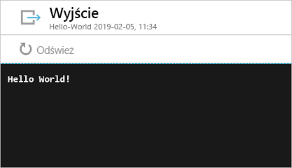

# <a name="create-an-azure-automation-runbook"></a>Tworzenie elementu runbook usługi Azure Automation

Elementy runbook usługi Azure Automation można tworzyć za pośrednictwem platformy Azure. Ta metoda zapewnia oparty na przeglądarce interfejs użytkownika przeznaczony do tworzenia elementów runbook usługi Automation. W tym przewodniku Szybki start opisano tworzenie, edytowanie, testowanie i publikowanie elementu runbook programu PowerShell usługi Automation.

Jeśli nie masz subskrypcji platformy Azure, utwórz [bezpłatne konto platformy Azure](https://azure.microsoft.com/free/?WT.mc_id=A261C142F) przed rozpoczęciem.

## <a name="sign-in-to-azure"></a>Logowanie do platformy Azure

Zaloguj się na https://portal.azure.complatformie Azure na poziomie .

## <a name="create-the-runbook"></a>Tworzenie śmiętu

Najpierw utwórz element runbook. Przykładowy element runbook tworzony w tym przewodniku Szybki start domyślnie wyświetla tekst `Hello World`.

1. Otwórz konto usługi Automation.

1. Kliknij **pozycję Elementy runbook w** obszarze **Automatyzacja procesów**. Zostanie wyświetlona lista elementów runbook.

1. Kliknij **pozycję Utwórz projekt runbook** u góry listy.

1. Wprowadź `Hello-World` nazwę uruchomieniu w polu **Nazwa** i wybierz pozycję **PowerShell** dla pola **Typ yjka.** 

   

1. Kliknij przycisk **Utwórz**. Element runbook zostanie utworzony i zostanie otworzona strona Edytuj element runbook programu PowerShell.

    

1. Wpisz lub skopiuj i wklej następujący kod do okienka edycji. Tworzy opcjonalny parametr `Name` wejściowy wywoływany `World`z domyślną wartością programu , i wyprowadza ciąg, który używa tej wartości wejściowej:

   ```powershell-interactive
   param
   (
       [Parameter(Mandatory=$false)]
       [String] $Name = "World"
   )

   "Hello $Name!"
   ```

1. Kliknij **przycisk Zapisz,** aby zapisać kopię roboczą likwiatu.

    

## <a name="test-the-runbook"></a>Testowanie elementu runbook

Po utworzeniu śmigięcie należy przetestować projekt runbook, aby sprawdzić, czy działa.

1. Kliknij pozycję **Okienko testowania**, aby otworzyć okienko testowania.

1. Wprowadź wartość w polu **Nazwa** i kliknij pozycję **Uruchom**. Zadanie testowania zostanie uruchomione oraz zostaną wyświetlone stan zadania i danej wyjściowe.

    

1. Zamknij okienko testu, klikając x **w** prawym górnym rogu. Wybierz przycisk **OK** w wyświetlonym oknie podręcznym.

1. Na stronie Edytuj element runbook programu PowerShell kliknij pozycję **Publikuj**, aby opublikować element runbook jako oficjalną wersję elementu runboook na koncie.

   

## <a name="run-the-runbook"></a>Uruchamianie elementu runbook

Po opublikowaniu elementu runbook zostanie wyświetlona strona przeglądu.

1. Na stronie przeglądu elementu runbook kliknij pozycję **Uruchom**, aby otworzyć stronę konfiguracji Uruchamianie elementu Runbook dla tego elementu runbook.

   

1. Zostaw pole **Nazwa** puste, aby została użyta wartość domyślna, i kliknij przycisk **OK**. Zadanie runbooka zostanie przesłane, a na stronie Zadanie zostanie wyświetlona strona Zadanie.

   

1. Gdy stan zadania `Running` `Completed`jest lub , kliknij przycisk **Dane wyjściowe,** aby otworzyć okienko Dane wyjściowe i wyświetlić dane wyjściowe uruchomieniu. 105/

   

## <a name="clean-up-resources"></a>Oczyszczanie zasobów

Gdy element runbook nie będzie już potrzebny, usuń go. Aby to zrobić, zaznacz element runbook na liście i kliknij pozycję **Usuń**.

## <a name="next-steps"></a>Następne kroki

W tym przewodniku Szybki start utworzono, edytowano, przetestowano i opublikowano element runbook oraz uruchomiono zadanie elementu runbook. Aby dowiedzieć się więcej o elementach runbook usługi Automation, przejdź do artykułu opisującego różne typy elementów runbook, które można tworzyć i z nich korzystać w usłudze Automation.

> [!div class="nextstepaction"]
> [Instrukcje dotyczące usługi Automation — typy elementów runbook](./automation-runbook-types.md)
