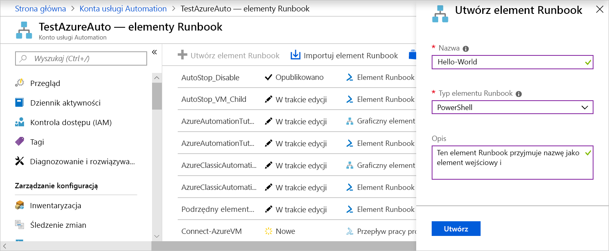

# <a name="create-an-azure-automation-runbook"></a>Tworzenie elementu runbook usługi Azure Automation

Elementy runbook usługi Azure Automation można tworzyć za pośrednictwem platformy Azure. Ta metoda zapewnia oparty na przeglądarce interfejs użytkownika przeznaczony do tworzenia elementów runbook usługi Automation. W tym przewodniku Szybki start opisano tworzenie, edytowanie, testowanie i publikowanie elementu runbook programu PowerShell usługi Automation.

Jeśli nie masz subskrypcji platformy Azure, przed rozpoczęciem Utwórz [bezpłatne konto platformy Azure](https://azure.microsoft.com/free/?WT.mc_id=A261C142F) .

## <a name="sign-in-to-azure"></a>Logowanie do platformy Azure

Zaloguj się do platformy Azure pod adresem https://portal.azure.com .

## <a name="create-the-runbook"></a>Tworzenie elementu Runbook

Najpierw utwórz element runbook. Przykładowy element runbook tworzony w tym przewodniku Szybki start domyślnie wyświetla tekst `Hello World`.

1. Otwórz konto usługi Automation.

1. Kliknij pozycję **elementy Runbook** w obszarze **Automatyzacja procesów**. Zostanie wyświetlona lista elementów runbook.

1. Kliknij pozycję **Utwórz element Runbook** w górnej części listy.

1. Wprowadź `Hello-World` nazwę elementu Runbook w polu **Nazwa** , a następnie wybierz opcję **PowerShell** dla pola **Typ elementu Runbook** . 

   

1. Kliknij pozycję **Utwórz**. Element runbook zostanie utworzony i zostanie otworzona strona Edytuj element runbook programu PowerShell.

    :::image type="content" source="./media/automation-quickstart-create-runbook/automation-edit-runbook-empty.png" alt-text="Zrzut ekranu przedstawiający stronę Edytowanie elementu Runbook programu PowerShell.":::

1. Wpisz lub skopiuj i wklej następujący kod do okienka edycji. Powoduje utworzenie opcjonalnego parametru wejściowego o nazwie `Name` domyślnej wartości `World` i wyjście ciągu, który używa tej wartości wejściowej:

   ```powershell-interactive
   param
   (
       [Parameter(Mandatory=$false)]
       [String] $Name = "World"
   )

   "Hello $Name!"
   ```

1. Kliknij przycisk **Zapisz** , aby zapisać kopię roboczą elementu Runbook.

    :::image type="content" source="./media/automation-quickstart-create-runbook/automation-edit-runbook.png" alt-text="Zrzut ekranu przedstawiający stronę Edytowanie elementu Runbook programu PowerShell.":::

## <a name="test-the-runbook"></a>Testowanie elementu runbook

Po utworzeniu elementu Runbook należy przetestować element Runbook, aby sprawdzić, czy działa.

1. Kliknij pozycję **Okienko testowania**, aby otworzyć okienko testowania.

1. Wprowadź wartość w polu **Nazwa** i kliknij pozycję **Uruchom**. Zadanie testowania zostanie uruchomione oraz zostaną wyświetlone stan zadania i danej wyjściowe.

    :::image type="content" source="./media/automation-quickstart-create-runbook/automation-test-runbook.png" alt-text="Zrzut ekranu przedstawiający stronę Edytowanie elementu Runbook programu PowerShell.":::

1. Zamknij okienko testowania, klikając **symbol X** w prawym górnym rogu. Wybierz przycisk **OK** w wyświetlonym oknie podręcznym.

1. Na stronie Edytuj element runbook programu PowerShell kliknij pozycję **Publikuj**, aby opublikować element runbook jako oficjalną wersję elementu runboook na koncie.

   :::image type="content" source="./media/automation-quickstart-create-runbook/automation-hello-world-runbook-job.png" alt-text="Zrzut ekranu przedstawiający stronę Edytowanie elementu Runbook programu PowerShell.":::

## <a name="run-the-runbook"></a>Uruchamianie elementu runbook

Po opublikowaniu elementu runbook zostanie wyświetlona strona przeglądu.

1. Na stronie przeglądu elementu runbook kliknij pozycję **Uruchom**, aby otworzyć stronę konfiguracji Uruchamianie elementu Runbook dla tego elementu runbook.

   :::image type="content" source="./media/automation-quickstart-create-runbook/automation-hello-world-runbook-start.png" alt-text="Zrzut ekranu przedstawiający stronę Edytowanie elementu Runbook programu PowerShell.":::

1. Zostaw pole **Nazwa** puste, aby została użyta wartość domyślna, i kliknij przycisk **OK**. Zadanie elementu Runbook zostało przesłane i zostanie wyświetlona strona zadanie.

   :::image type="content" source="./media/automation-quickstart-create-runbook/automation-job-page.png" alt-text="Zrzut ekranu przedstawiający stronę Edytowanie elementu Runbook programu PowerShell.":::

1. Gdy zadanie ma stan `Running` lub `Completed` , kliknij pozycję **dane wyjściowe** , aby otworzyć okienko dane wyjściowe i wyświetlić dane wyjściowe elementu Runbook.

   :::image type="content" source="./media/automation-quickstart-create-runbook/automation-hello-world-runbook-job-output.png" alt-text="Zrzut ekranu przedstawiający stronę Edytowanie elementu Runbook programu PowerShell.":::

## <a name="clean-up-resources"></a>Czyszczenie zasobów

Gdy element runbook nie będzie już potrzebny, usuń go. Aby to zrobić, zaznacz element runbook na liście i kliknij pozycję **Usuń**.

## <a name="next-steps"></a>Następne kroki

W tym przewodniku Szybki start utworzono, edytowano, przetestowano i opublikowano element runbook oraz uruchomiono zadanie elementu runbook. Aby dowiedzieć się więcej o elementach runbook usługi Automation, przejdź do artykułu opisującego różne typy elementów runbook, które można tworzyć i z nich korzystać w usłudze Automation.

> [!div class="nextstepaction"]
> [Azure Automation typy elementów Runbook](./automation-runbook-types.md)
