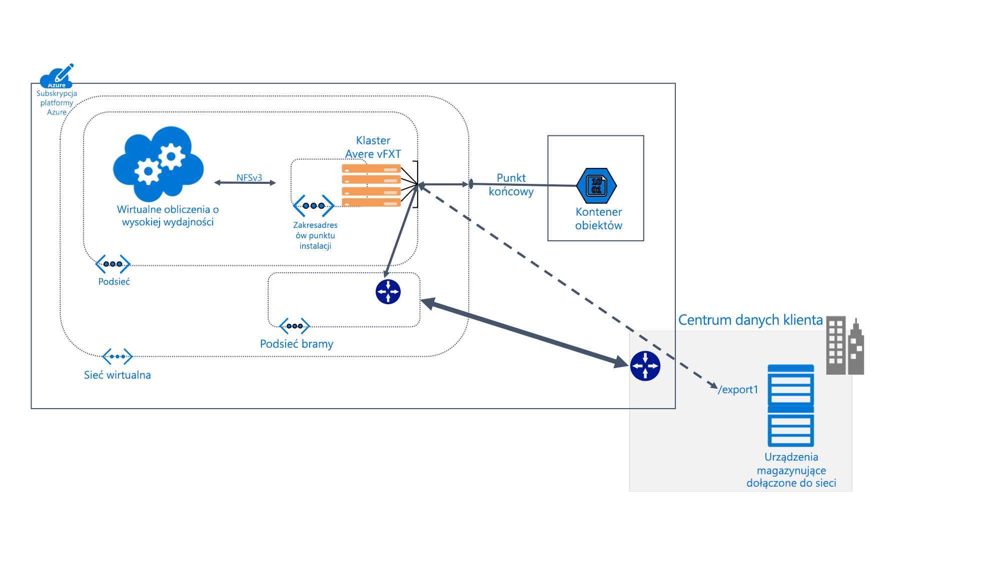

# Co to jest system Avere vFXT for Azure?

System Avere vFXT for Azure to rozwiązanie pamięci podręcznej systemu plików na potrzeby zadań obliczeń o wysokiej wydajności (HPC) intensywnie korzystających z danych. System ten pozwala wykorzystać zalety skalowalności chmury obliczeniowej w celu udostępnienia danych w wymaganym miejscu i czasie — dotyczy to nawet danych przechowywanych na sprzęcie lokalnym.

System Avere vFXT obsługuje następujące typowe scenariusze obliczeniowe:

* Architektura chmury hybrydowej — Avere vFXT for Azure może współpracować ze sprzętowym systemem magazynowania, który zapewnia korzyści z przetwarzania w chmurze bez konieczności przenoszenia plików.

* Chmura bursting — Avere vFXT for Azure może pomóc przenieść dane do chmury dla jednego projektu lub "lift and shift" całego przepływu pracy na stałe.

Avere vFXT for Azure najlepiej nadaje się do następujących sytuacji:

* Operacje z dużą liczbą odczytów dla obciążeń HPC
* Aplikacje korzystające ze wspólnego protokołu systemu plików NFS
* Farmy obliczeniowe składające się z od 1000 do 40 000 rdzeni procesorów CPU
* Integracja z lokalnym, sprzętowym magazynem NAS, usługą Azure Blob Storage lub oboma tymi rozwiązaniami

Aby uzyskać więcej informacji, zobacz <https://azure.microsoft.com/services/storage/avere-vfxt/>

## Kto używa systemu Avere vFXT for Azure?

System Avere vFXT może być przydatny w przypadku wszelkiego rodzaju zadań z dużą liczbą odczytów:

### Renderowanie efektów wizualnych

W branży multimediów i rozrywki klaster Avere vFXT może przyspieszyć dostęp do danych dla projektów renderowania, w przypadku których czas ma kluczowe znaczenie. Ponieważ na platformie Azure można zwiększyć obszar pamięci podręcznej oraz dodać więcej węzłów obliczeniowych, pozwala to w sposób wydajny i elastyczny obsługiwać duże projekty.

### Nauki przyrodnicze

Avere vFXT umożliwia badaczom uruchamianie wtórnych przepływów pracy analizy w usłudze Azure Compute i uzyskiwanie dostępu do danych genomicznych bez względu na ich lokalizację.

W badaniach farmaceutycznych klastry Avere vFXT mogą przyspieszyć odkrywanie leków, pomagając naukowcom przewidzieć interakcje między lekami a celami i analizować dane badawcze.

### Analiza usług finansowych

Klaster Avere vFXT może przyspieszyć obliczenia analizy ilościowej, co daje firmom świadczącym usługi finansowe szczegółowe informacje ułatwiające podejmowanie strategicznych decyzji.

## Funkcje i specyfikacje

System Avere vFXT składa się z co najmniej trzech wirtualnych brzegowych węzłów nadzorczych skonfigurowanych w klastrze. Może on znajdować się w pobliżu maszyn klienckich, na których instalowany jest klaster zamiast instalowania magazynu bezpośrednio.

Klaster Avere vFXT umieszcza pliki w pamięci podręcznej w momencie ich żądania. Ponowne żądania mogą być obsługiwane z pamięci podręcznej przez ponad 80% czasu.

### Zgodność

* Zgodny ze sprzętowymi systemami NAS platformy NetApp lub Dell EMC Isilon
* Zgodny z obiektami blob platformy Azure
* Używa protokołu NFSv3 lub SMB2

Avere vFXT for Azure używa następujących zasobów platformy Azure:

|Składnik platformy Azure|   |
|----------|-----------|
|Maszyny wirtualne|3 lub więcej E32s_v3|
|Magazyn SSD w warstwie Premium|200 GB na system operacyjny i od 1 TB do 4 TB miejsca obszaru pamięci podręcznej na węzeł |
|Konto magazynu (opcjonalnie) |v2|
|Magazyn zaplecza danych (opcjonalnie) | Jeden pusty kontener obiektów blob magazynu lokalnie nadmiarowego |

## Następne kroki

Przeczytaj te artykuły, aby zaplanować i utworzyć własne wdrożenie Avere vFXT dla platformy Azure.

* [Zaplanuj swój system](avere-vfxt-deploy-plan.md)
* [Omówienie wdrażania](avere-vfxt-deploy-overview.md)
* [Tworzenie systemu vFXT](avere-vfxt-deploy.md)
