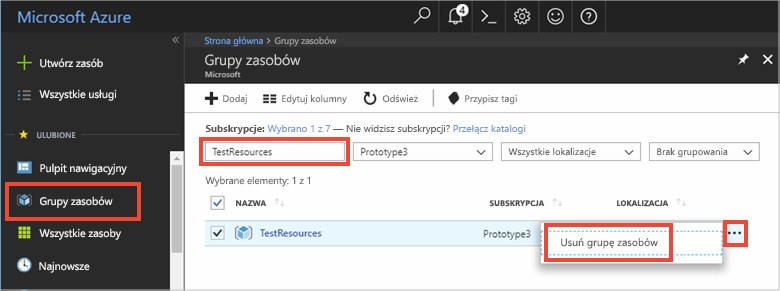

# <a name="quickstart-use-azure-cache-for-redis-with-python"></a>Szybki start: korzystanie z usługi Azure Cache for Redis za pomocą języka Python

W tym przewodniku szybki start dodaliśmy usługę Azure cache for Redis do aplikacji w języku Python, aby uzyskać dostęp do bezpiecznej, dedykowanej pamięci podręcznej dostępnej z dowolnej aplikacji na platformie Azure.

## <a name="prerequisites"></a>Wymagania wstępne

- Subskrypcja platformy Azure — [Utwórz ją bezpłatnie](https://azure.microsoft.com/free/)
- [Python 2 lub 3](https://www.python.org/downloads/)

## <a name="create-an-azure-cache-for-redis-on-azure"></a>Tworzenie usługi Azure Cache for Redis na platformie Azure
[!INCLUDE [redis-cache-create](../../includes/redis-cache-create.md)]

[!INCLUDE [redis-cache-create](../../includes/redis-cache-access-keys.md)]

## <a name="install-redis-py"></a>Instalowanie klienta redis-py

[Redis-py](https://github.com/andymccurdy/redis-py) to interfejs języka Python dla usługi Azure Cache for Redis. Użyj dostępnego w języku Python narzędzia do obsługi pakietów *pip*, aby zainstalować pakiet redis-py. 

W poniższym przykładzie użyto *PIP3* for python3 do zainstalowania pakietu Redis-PR w systemie Windows 10 przy użyciu wiersza polecenia dla deweloperów programu Visual Studio 2019 z podniesionymi uprawnieniami administratora.

```python
    pip3 install redis
```


## <a name="read-and-write-to-the-cache"></a>Odczytywanie i zapisywanie w pamięci podręcznej

Uruchom środowisko Python i przetestuj korzystanie z pamięci podręcznej z poziomu wiersza polecenia. Zastąp `<Your Host Name>` i `<Your Access Key>` wartościami odpowiednimi dla używanej pamięci podręcznej Azure Cache for Redis. 

```python
>>> import redis
>>> r = redis.StrictRedis(host='<Your Host Name>.redis.cache.windows.net',
        port=6380, db=0, password='<Your Access Key>', ssl=True)
>>> r.set('foo', 'bar')
True
>>> r.get('foo')
b'bar'
```

> [!IMPORTANT]
> W przypadku wersji Redis jest 3,0 lub wyższa, wymuszana jest kontrola certyfikatu SSL. ssl_ca_certs musi być jawnie ustawiona podczas nawiązywania połączenia z Redis. W przypadku RH Linux ssl_ca_certs można znaleźć w module certyfikatu "/etc/pki/tls/certs/CA-Bundle.CRT".

## <a name="create-a-python-script"></a>Tworzenie skryptu w języku Python

Utwórz nowy plik tekstowy skryptu o nazwie *PythonApplication1.py*.

Dodaj następujący skrypt do pliku *PythonApplication1.py* i zapisz go. Ten skrypt przetestuje dostęp do pamięci podręcznej. Zastąp `<Your Host Name>` i `<Your Access Key>` wartościami odpowiednimi dla używanej pamięci podręcznej Azure Cache for Redis. 

```python
import redis

myHostname = "<Your Host Name>.redis.cache.windows.net"
myPassword = "<Your Access Key>"

r = redis.StrictRedis(host=myHostname, port=6380,
                      password=myPassword, ssl=True)

result = r.ping()
print("Ping returned : " + str(result))

result = r.set("Message", "Hello!, The cache is working with Python!")
print("SET Message returned : " + str(result))

result = r.get("Message")
print("GET Message returned : " + result.decode("utf-8"))

result = r.client_list()
print("CLIENT LIST returned : ")
for c in result:
    print("id : " + c['id'] + ", addr : " + c['addr'])
```

Uruchom skrypt języka Python.


## <a name="clean-up-resources"></a>Oczyszczanie zasobów

Jeśli zamierzasz przejść do innego samouczka, możesz zachować zasoby utworzone w tym przewodniku Szybki start i użyć ich ponownie.

W przeciwnym razie po zakończeniu pracy z przykładową aplikacją poradnika Szybki start możesz usunąć zasoby platformy Azure utworzone w tym poradniku Szybki start, aby uniknąć naliczania opłat. 

> [!IMPORTANT]
> Usunięcie grupy zasobów jest nieodwracalne i grupa zasobów oraz wszystkie zawarte w niej zasoby zostaną trwale usunięte. Uważaj, aby nie usunąć przypadkowo niewłaściwych zasobów lub grupy zasobów. Jeśli zasoby do hostowania tego przykładu zostały utworzone wewnątrz istniejącej grupy zasobów zawierającej zasoby, które chcesz zachować, możesz usunąć każdy zasób oddzielnie z odpowiadającego mu bloku zamiast usuwać całą grupę zasobów.
>

Zaloguj się do witryny [Azure Portal](https://portal.azure.com) i wybierz pozycję **Grupy zasobów**.

W polu tekstowym **Filtruj według nazwy...** wprowadź nazwę grupy zasobów. Instrukcje w tym artykule używają grupy zasobów o nazwie *TestResources*. W grupie zasobów na liście wynik wybierz pozycję **...** , a następnie **Usuń grupę zasobów**.



Zobaczysz prośbę o potwierdzenie usunięcia grupy zasobów. Aby potwierdzić, wprowadź nazwę grupy zasobów, a następnie wybierz pozycję **Usuń**.

Po krótkim czasie grupa zasobów i wszystkie zawarte w niej zasoby zostaną usunięte.

## <a name="next-steps"></a>Następne kroki

> [!div class="nextstepaction"]
> [Tworzenie prostej aplikacji internetowej platformy ASP.NET, która korzysta z usługi Azure Cache for Redis.](./cache-web-app-howto.md)

<!--Image references-->
[1]: ./media/cache-python-get-started/redis-cache-new-cache-menu.png
[2]: ./media/cache-python-get-started/redis-cache-cache-create.png
