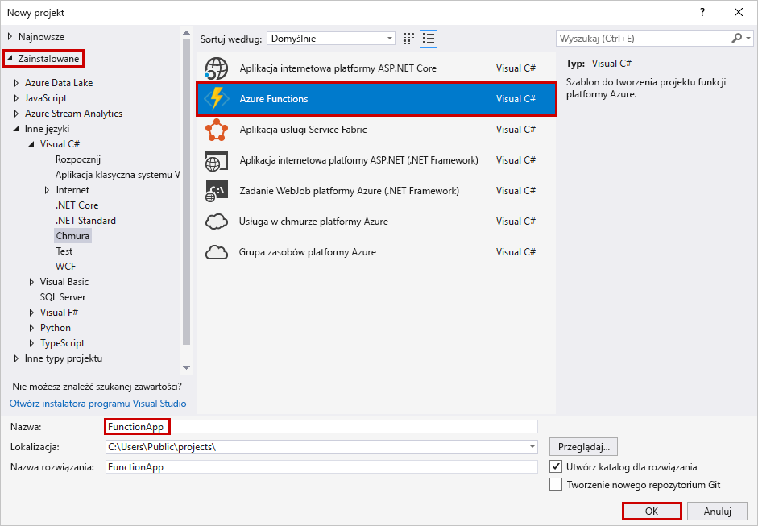
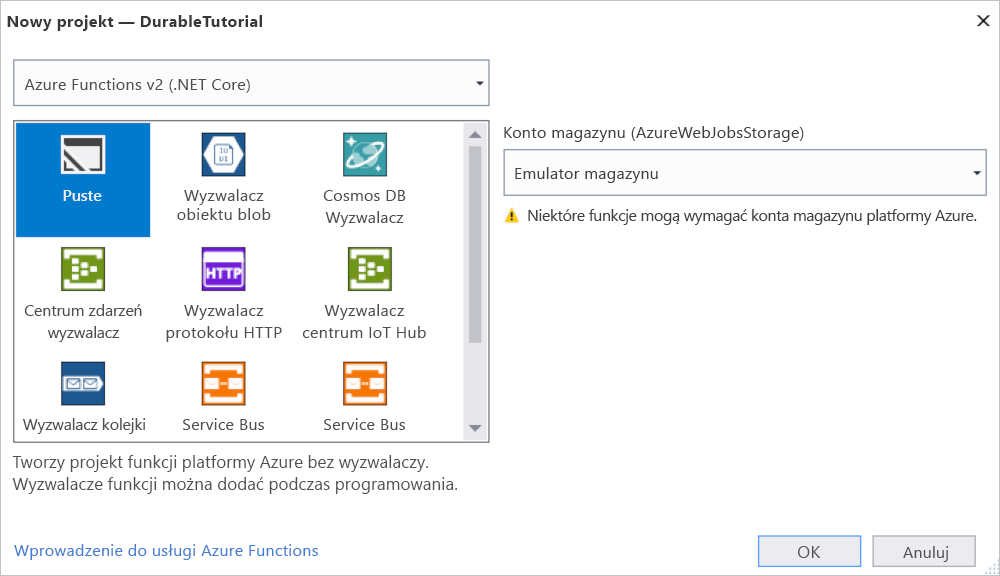
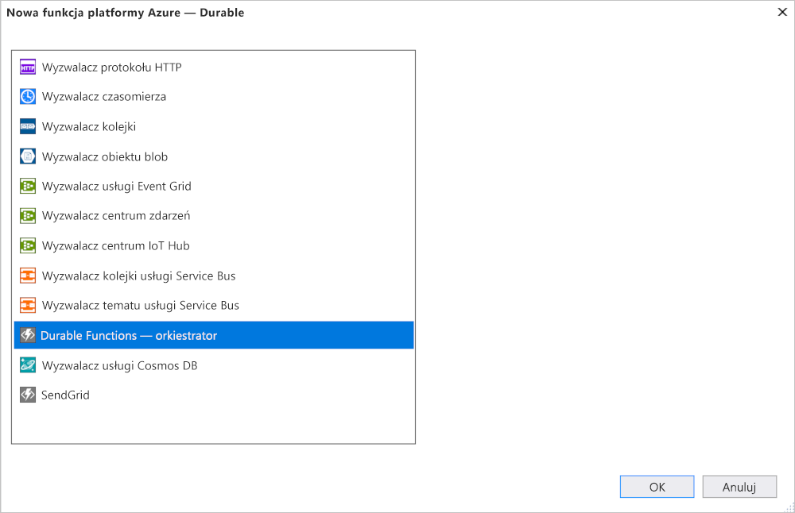

# <a name="create-your-first-durable-function-in-c"></a>Tworzenie pierwszej funkcji trwałej w języku C\#

*Durable Functions* to rozszerzenie usługi [Azure Functions](../functions-overview.md) umożliwiające zapisywanie funkcji stanowych w środowisku bezserwerowym. Rozszerzenie zarządza stanem, punktami kontrolnymi i ponownym uruchamianiem.

W tym artykule dowiesz się, jak używać programu Visual Studio 2019 do lokalnego tworzenia i testowania trwałej funkcji "Hello World".  Ta funkcja aranżuje i łączy w łańcuchy wywołania do innych funkcji. Kod funkcji zostanie następnie opublikowany na platformie Azure. Te narzędzia są dostępne w ramach obciążeń programistycznych platformy Azure w programie Visual Studio 2019.


## <a name="prerequisites"></a>Wymagania wstępne

W celu ukończenia tego samouczka:

* Zainstaluj [program Visual Studio 2019](https://visualstudio.microsoft.com/vs/). Upewnij się, że obciążenie **programowanie na platformie Azure** jest również instalowane. Program Visual Studio 2017 obsługuje także programowanie Durable Functions, ale interfejs użytkownika i kroki różnią się.

* Sprawdź, czy zainstalowano i uruchomiono [emulator magazynu Azure](../../storage/common/storage-use-emulator.md).

[!INCLUDE [quickstarts-free-trial-note](../../../includes/quickstarts-free-trial-note.md)]

## <a name="create-a-function-app-project"></a>Tworzenie projektu aplikacji funkcji

Szablon projektu usługi Azure Functions umożliwia utworzenie projektu, który można opublikować w aplikacji funkcji na platformie Azure. Aplikacja funkcji umożliwia grupowanie funkcji w jednostki logiczne, co ułatwia wdrażanie i udostępnianie zasobów oraz zarządzanie nimi.

1. W programie Visual Studio wybierz pozycję **Nowy** > **Projekt** z menu **Plik**.

1. W oknie dialogowym **Dodawanie nowego projektu** Wyszukaj `functions`, wybierz szablon **Azure Functions** i kliknij przycisk **dalej**. 

    

1. Wpisz **nazwę projektu** , a następnie wybierz **przycisk OK**. Nazwa projektu musi być prawidłowa jako C# przestrzeń nazw, dlatego nie należy używać podkreśleń, łączników ani żadnych innych znaków niealfanumerycznych.

1. W obszarze **Utwórz nową aplikację Azure Functions**Użyj ustawień określonych w tabeli, która następuje po obrazie.

    

    | Ustawienie      | Sugerowana wartość  | Opis                      |
    | ------------ |  ------- |----------------------------------------- |
    | **Wersja** | Azure Functions 2.x <br />(.NET Core) | Tworzy projekt funkcji korzystający ze środowiska uruchomieniowego usługi Azure Functions w wersji 2.x, które obsługuje platformę .Net Core. Usługa Azure Functions 1.x obsługuje program .NET Framework. Aby uzyskać więcej informacji, zobacz [How to target Azure Functions runtime version (Wybieranie wersji środowiska uruchomieniowego usługi Azure Functions)](../functions-versions.md).   |
    | **Szablon** | Pusty | Tworzy pustą aplikację funkcji. |
    | **Konto magazynu**  | Emulator magazynu | Konto magazynu jest wymagane do zarządzania stanem funkcji trwałej. |

4. Wybierz pozycję **Utwórz** , aby utworzyć pusty projekt funkcji. Ten projekt zawiera pliki konfiguracji podstawowej wymagane do uruchomienia Twoich funkcji.

## <a name="add-functions-to-the-app"></a>Dodawanie funkcji do aplikacji

Poniższe kroki używają szablonu do tworzenia trwałego kodu funkcji w projekcie.

1. Kliknij prawym przyciskiem myszy projekt w programie Visual Studio i wybierz polecenie **Dodaj** > **Nowa funkcja platformy Azure**.

    

1. Sprawdź, czy **Funkcja platformy Azure** została wybrana z menu Dodaj, wpisz nazwę C# pliku, a następnie wybierz pozycję **Dodaj**.

1. Wybierz szablon **Durable Functions aranżacji** , a następnie wybierz przycisk **OK** .

      

Nowa trwała funkcja jest dodawana do aplikacji.  Otwórz nowy plik cs, aby wyświetlić jego zawartość. Ta trwała funkcja jest prostym przykładem łączenia funkcji w łańcuch przy użyciu następujących metod:  

| Metoda | FunctionName | Opis |
| -----  | ------------ | ----------- |
| **`RunOrchestrator`** | `<file-name>` | Zarządza trwałą aranżacją. W tym przypadku aranżacja się rozpoczyna, tworzy listę i dodaje wynik trzech wywołań funkcji do listy.  Po ukończeniu trzech wywołań funkcji zwraca listę. |
| **`SayHello`** | `<file-name>_Hello` | Funkcja zwraca hello. Jest to funkcja, która zawiera aranżowaną logikę biznesową. |
| **`HttpStart`** | `<file-name>_HttpStart` | [Funkcja wyzwalana przez protokół HTTP](../functions-bindings-http-webhook.md), która uruchamia wystąpienie aranżacji i zwraca odpowiedź stanu kontroli. |

Po utworzeniu projektu funkcji i funkcji trwałej można ją przetestować na komputerze lokalnym.

## <a name="test-the-function-locally"></a>Lokalne testowanie funkcji

Podstawowe narzędzia usługi Azure Functions umożliwiają uruchamianie projektu usługi Azure Functions na lokalnym komputerze deweloperskim. Monit o zainstalowanie tych narzędzi pojawia się przy pierwszym uruchomieniu funkcji w programie Visual Studio.

1. Aby przetestować funkcję, naciśnij klawisz F5. Po wyświetleniu monitu zaakceptuj żądanie programu Visual Studio dotyczące pobrania i zainstalowania podstawowych narzędzi usługi Azure Functions (CLI). Może także być konieczne włączenie wyjątku zapory, aby umożliwić narzędziom obsługę żądań HTTP.

2. Skopiuj adres URL funkcji z danych wyjściowych środowiska uruchomieniowego usługi Azure Functions.

    

3. Wklej adres URL żądania HTTP w pasku adresu przeglądarki i wykonaj żądanie. Na poniższym obrazie przedstawiono wyświetloną w przeglądarce odpowiedź na lokalne żądanie GET zwróconą przez funkcję:

    

    Odpowiedź to początkowy wynik z funkcji HTTP informujący o pomyślnym uruchomieniu aranżacji trwałej.  Nie jest to jeszcze końcowy wynik aranżacji.  Odpowiedź zawiera kilka przydatnych adresów URL.  Na razie wykonajmy zapytanie o stan aranżacji.

4. Skopiuj wartość adresu URL z właściwości `statusQueryGetUri`, wklej ją w pasku adresu przeglądarki i wykonaj żądanie.

    Żądanie wykona zapytanie o stan wystąpienia aranżacji. W końcu powinna zostać zwrócona odpowiedź podobna do następującej.  Pokazuje ona, że wystąpienie zostało zakończone, i obejmuje dane wyjściowe lub wyniki funkcji trwałej.

    ```json
    {
        "instanceId": "d495cb0ac10d4e13b22729c37e335190",
        "runtimeStatus": "Completed",
        "input": null,
        "customStatus": null,
        "output": [
            "Hello Tokyo!",
            "Hello Seattle!",
            "Hello London!"
        ],
        "createdTime": "2018-11-08T07:07:40Z",
        "lastUpdatedTime": "2018-11-08T07:07:52Z"
    }
    ```

5. Aby zatrzymać debugowanie, naciśnij klawisze **Shift+F5**.

Gdy będziesz mieć pewność, że funkcja działa poprawnie na komputerze lokalnym, możesz opublikować projekt na platformie Azure.

## <a name="publish-the-project-to-azure"></a>Publikowanie projektu na platformie Azure

Aby opublikować projekt, musisz mieć aplikację funkcji w swojej subskrypcji platformy Azure. Aplikację funkcji możesz utworzyć bezpośrednio w programie Visual Studio.

[!INCLUDE [Publish the project to Azure](../../../includes/functions-vstools-publish.md)]

## <a name="test-your-function-in-azure"></a>Testowanie funkcji na platformie Azure

1. Skopiuj podstawowy adres URL aplikacji funkcji ze strony profilu publikowania. Część `localhost:port` adresu URL używaną podczas lokalnego testowania funkcji zastąp nowym podstawowym adresem URL.

    Adres URL, który wywołuje wyzwalacz HTTP funkcji trwałej, powinien mieć następujący format:

        http://<APP_NAME>.azurewebsites.net/api/<FUNCTION_NAME>_HttpStart

2. Wklej nowy adres URL żądania HTTP na pasku adresu przeglądarki. Podczas korzystania z opublikowanej aplikacji powinna zostać zwrócona taka sama odpowiedź dotycząca stanu.

## <a name="next-steps"></a>Następne kroki

Utworzono i opublikowano aplikację funkcji trwałej w języku C# za pomocą programu Visual Studio.

> [!div class="nextstepaction"]
> [Dowiedz się więcej na temat typowych wzorców funkcji trwałej.](durable-functions-concepts.md)
