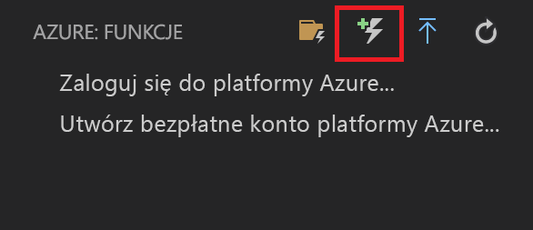
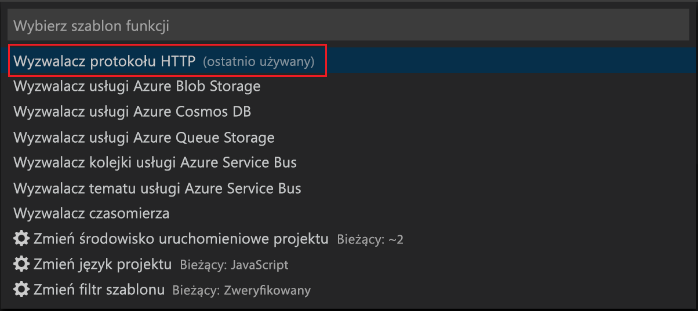

# <a name="create-your-first-durable-function-in-javascript"></a>Tworzenie pierwszej funkcji trwałej w języku Java Script

*Durable Functions* to rozszerzenie usługi [Azure Functions](../functions-overview.md) umożliwiające zapisywanie funkcji stanowych w środowisku bezserwerowym. Rozszerzenie zarządza stanem, punktami kontrolnymi i ponownym uruchamianiem.

W tym artykule przedstawiono użycie rozszerzenia programu Visual Studio Code dla usługi Azure Functions w celu lokalnego utworzenia i przetestowania funkcji trwałej „hello world”.  Ta funkcja będzie aranżować i łączyć w łańcuchy wywołania do innych funkcji. Kod funkcji zostanie następnie opublikowany na platformie Azure.


## <a name="prerequisites"></a>Wymagania wstępne

W celu ukończenia tego samouczka:

* Zainstaluj narzędzie [Visual Studio Code](https://code.visualstudio.com/download).

* Upewnij się, że masz [najnowsze narzędzia usługi Azure Functions](../functions-develop-vs.md#check-your-tools-version).

* Na komputerze z systemem Windows sprawdź, czy zainstalowano i uruchomiono [emulator usługi Azure Storage](../../storage/common/storage-use-emulator.md). Na komputerze Mac lub komputerze z systemem Linux należy użyć rzeczywistego konta usługi Azure Storage.

* Upewnij się, że zainstalowano środowisko [Node.js](https://nodejs.org/) w wersji 8.0 lub nowszej.

[!INCLUDE [quickstarts-free-trial-note](../../../includes/quickstarts-free-trial-note.md)]

[!INCLUDE [functions-install-vs-code-extension](../../../includes/functions-install-vs-code-extension.md)]

[!INCLUDE [functions-create-function-app-vs-code](../../../includes/functions-create-function-app-vs-code.md)]

## <a name="install-the-durable-functions-npm-package"></a>Instalowanie pakietu npm rozszerzenia Durable Functions

1. Zainstaluj pakiet npm `durable-functions`, uruchamiając polecenie `npm install durable-functions` w katalogu głównym aplikacji funkcji.

## <a name="create-a-starter-function"></a>Tworzenie funkcji Starter

Najpierw należy utworzyć funkcję wyzwalaną przez protokół HTTP, która rozpoczyna aranżację funkcji trwałej.

1. Z obszaru **Azure: Functions** wybierz ikonę tworzenia funkcji.

    

2. Wybierz folder z projektem aplikacji funkcji i wybierz szablon funkcji **wyzwalacza HTTP**.

    

3. Wpisz `HttpStart` jako nazwę funkcji i naciśnij klawisz Enter, a następnie wybierz uwierzytelnianie **anonimowe**.

    

    Funkcja zostanie utworzona w wybranym języku i przy użyciu szablonu funkcji wyzwalanej przez protokół HTTP.

4. Zastąp plik index.js poniższym kodem języka JavaScript:

    [!code-javascript[Main](~/samples-durable-functions/samples/javascript/HttpStart/index.js)]

5. Zastąp plik function.json poniższym kodem JSON:

    [!code-json[Main](~/samples-durable-functions/samples/javascript/HttpStart/function.json)]

Teraz utworzyliśmy punkt wejścia do naszej funkcji trwałej. Dodajmy orkiestratora.

## <a name="create-an-orchestrator-function"></a>Tworzenie funkcji orkiestratora

Następnie należy utworzyć kolejną funkcję, która będzie pełnić rolę orkiestratora. Dla wygody użyjemy szablonu funkcji wyzwalacza HTTP. Sam kod funkcji jest zastępowany kodem orkiestratora.

1. Powtórz kroki z poprzedniej sekcji, aby utworzyć drugą funkcję przy użyciu szablonu wyzwalacza HTTP. Tym razem nadaj funkcji nazwę `OrchestratorFunction`.

2. Otwórz plik index.js dla nowej funkcji i zastąp zawartość następującym kodem:

    [!code-json[Main](~/samples-durable-functions/samples/javascript/E1_HelloSequence/index.js)]

3. Otwórz plik function.json i zastąp go następującym kodem JSON:

    [!code-json[Main](~/samples-durable-functions/samples/javascript/E1_HelloSequence/function.json)]

Dodaliśmy orkiestrator w celu koordynowania funkcji działania. Dodajmy teraz funkcję przywoływanego działania.

## <a name="create-an-activity-function"></a>Tworzenie funkcji działania

1. Powtórz kroki z poprzednich sekcji, aby utworzyć trzecią funkcję przy użyciu szablonu wyzwalacza HTTP. Ale tym razem nadaj funkcji nazwę `E1_SayHello`.

2. Otwórz plik index.js dla nowej funkcji i zastąp zawartość następującym kodem:

    [!code-javascript[Main](~/samples-durable-functions/samples/javascript/E1_SayHello/index.js)]

3. Zastąp plik function.json poniższym kodem JSON:

    [!code-json[Main](~/samples-durable-functions/samples/csx/E1_SayHello/function.json)]

Dodaliśmy już wszystkie składniki potrzebne do rozpoczęcia aranżacji i utworzenia łańcucha funkcji działań.

## <a name="test-the-function-locally"></a>Lokalne testowanie funkcji

Podstawowe narzędzia usługi Azure Functions umożliwiają uruchamianie projektu usługi Azure Functions na lokalnym komputerze deweloperskim. Monit o zainstalowanie tych narzędzi pojawia się przy pierwszym uruchomieniu funkcji w programie Visual Studio Code.  

1. Na komputerze z systemem Windows uruchom emulator usługi Azure Storage, a następnie upewnij się, że właściwość **AzureWebJobsStorage** pliku local.settings.json została ustawiona na `UseDevelopmentStorage=true`. Na komputerze Mac lub komputerze z system Linux ustaw właściwość **AzureWebJobsStorage** na parametry połączenia istniejącego konta usługi Azure Storage. W dalszej części tego artykułu utworzysz konto magazynu.

2. Aby przetestować funkcję, ustaw punkt przerwania w kodzie funkcji, a następnie naciśnij klawisz F5, aby uruchomić projekt aplikacji funkcji. Dane wyjściowe z pakietu Core Tools są wyświetlane na panelu **terminalu**. Jeśli po raz pierwszy używasz funkcji trwałych, jest instalowane rozszerzenie Durable Functions, a kompilacja może potrwać kilka sekund.

    > [!NOTE]
    > Rozszerzenie Durable Functions języka JavaScript wymaga wersji **1.7.0** lub większej rozszerzenia **Microsoft.Azure.WebJobs.Extensions.DurableTask**. Sprawdź, czy wersja rozszerzenia Durable Functions w Twoim pliku `extensions.csproj` spełnia to wymaganie. Jeśli nie, zatrzymaj aplikację funkcji, zmień wersję i naciśnij klawisz F5, aby ponownie uruchomić aplikację funkcji.

3. W panelu **terminalu** skopiuj punkt końcowy adresu URL funkcji wyzwalanej przez protokół HTTP.

    

4. Zastąp element `{functionName}` pytaniem `OrchestratorFunction`.

5. Za pomocą narzędzia takiego jak [Postman](https://www.getpostman.com/) lub [cURL](https://curl.haxx.se/) wyślij żądanie HTTP POST do punktu końcowego adresu URL.

    Odpowiedź to początkowy wynik z funkcji HTTP informujący o pomyślnym uruchomieniu aranżacji trwałej.  Nie jest to jeszcze końcowy wynik aranżacji.  Odpowiedź zawiera kilka przydatnych adresów URL.  Na razie wykonajmy zapytanie o stan aranżacji.

6. Skopiuj wartość adresu URL dla `statusQueryGetUri`, wklej go w pasku adresu przeglądarki i wykonaj żądanie.

    Żądanie wykona zapytanie o stan wystąpienia aranżacji. W końcu powinna zostać zwrócona odpowiedź podobna do następującej.  Pokazuje ona, że wystąpienie zostało zakończone, i obejmuje dane wyjściowe lub wyniki funkcji trwałej.

    ```json
    {
        "instanceId": "d495cb0ac10d4e13b22729c37e335190",
        "runtimeStatus": "Completed",
        "input": null,
        "customStatus": null,
        "output": [
            "Hello Tokyo!",
            "Hello Seattle!",
            "Hello London!"
        ],
        "createdTime": "2018-11-08T07:07:40Z",
        "lastUpdatedTime": "2018-11-08T07:07:52Z"
    }
    ```

7. Aby zatrzymać debugowanie, naciśnij klawisz **Shift + F5** w programie VS Code.

Gdy będziesz mieć pewność, że funkcja działa poprawnie na komputerze lokalnym, możesz opublikować projekt na platformie Azure.

[!INCLUDE [functions-create-function-app-vs-code](../../../includes/functions-sign-in-vs-code.md)]

[!INCLUDE [functions-publish-project-vscode](../../../includes/functions-publish-project-vscode.md)]

## <a name="test-your-function-in-azure"></a>Testowanie funkcji na platformie Azure

1. Skopiuj adres URL wyzwalacza HTTP z panelu **Dane wyjściowe**. Adres URL, który wywołuje funkcję wyzwalaną przez protokół HTTP, powinien mieć następujący format:

        http://<functionappname>.azurewebsites.net/orchestrators/<functionname>

2. Wklej nowy adres URL żądania HTTP na pasku adresu przeglądarki. Podczas korzystania z opublikowanej aplikacji powinna zostać zwrócona taka sama odpowiedź dotycząca stanu.

## <a name="next-steps"></a>Następne kroki

Utworzono i opublikowano aplikację funkcji trwałej w języku JavaScript za pomocą narzędzia Visual Studio Code.

> [!div class="nextstepaction"]
> [Więcej informacji na temat typowych wzorców trwałe — funkcja](durable-functions-concepts.md)
