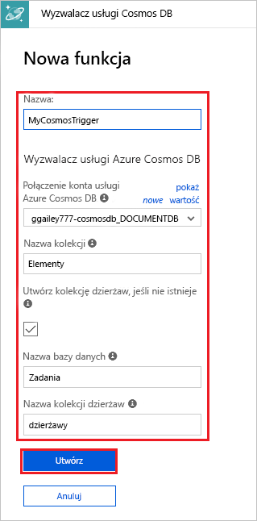
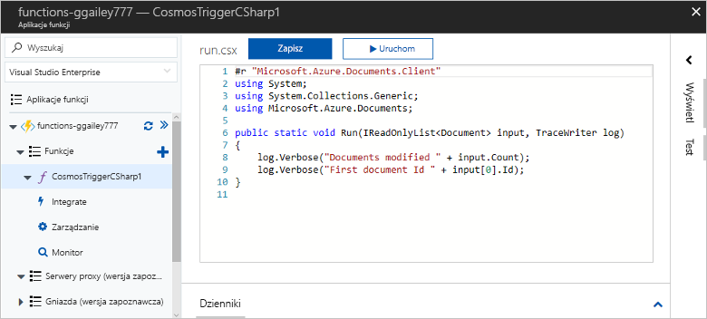

# Tworzenie funkcji wyzwalanych bazy danych Azure rozwiązania Cosmos

Dowiedz się, jak utworzyć funkcję wyzwalane, gdy dane są dodawane do lub zmienione w usłudze Azure DB rozwiązania Cosmos. Aby dowiedzieć się więcej na temat bazy danych rozwiązania Cosmos Azure, zobacz [bazy danych Azure rozwiązania Cosmos: pliki bazy danych obliczeniowych, przy użyciu usługi Azure Functions](..\cosmos-db\serverless-computing-database.md).

## Wymagania wstępne

W celu ukończenia tego samouczka:

+ Jeśli nie masz subskrypcji platformy Azure, przed rozpoczęciem utwórz [bezpłatne konto](https://azure.microsoft.com/free/?WT.mc_id=A261C142F).

[!INCLUDE [functions-portal-favorite-function-apps](../../includes/functions-portal-favorite-function-apps.md)]

## Tworzenie aplikacji funkcji platformy Azure

[!INCLUDE [Create function app Azure portal](../../includes/functions-create-function-app-portal.md)]

Następnie należy utworzyć funkcję w nowej aplikacji funkcji.

## Tworzenie bazy danych Azure rozwiązania Cosmos wyzwalacza

1. Rozwiń aplikację funkcji i kliknij przycisk **+** obok pozycji **Funkcje**. Jeśli jest to pierwsza funkcja w aplikacji funkcji, wybierz pozycję **Funkcja niestandardowa**. Spowoduje to wyświetlenie pełnego zestawu szablonów funkcji.

    

2. Zlokalizuj i wybierz **Azure CosmosDBTrigger** szablon odpowiedni język.

    

3. Skonfiguruj nowy wyzwalacz za pomocą ustawień określonych w tabeli poniżej obrazu.

    
    
    | Ustawienie      | Sugerowana wartość  | Opis                                |
    | ------------ | ---------------- | ------------------------------------------ |
    | **Nazwa funkcji** | Domyślne | Użyj funkcji domyślną nazwę sugerowaną przez szablon. |
    | **Nazwa bazy danych** | Zadania | Nazwa bazy danych z kolekcji do monitorowania. |
    | **Nazwa kolekcji** | Items | Nazwa kolekcji do monitorowania. |
    | **Tworzenie kolekcji dzierżawy, jeśli nie istnieje** | Zaznaczone | Kolekcja jeszcze nie istnieje, więc należy ją utworzyć. |

4. Wybierz **nowy** obok **połączenia konta bazy danych Azure rozwiązania Cosmos** etykiety i wybrać istniejące konto DB rozwiązania Cosmos lub **+ Utwórz nowy**. 
 
    

6. Podczas tworzenia nowego konta rozwiązania Cosmos bazy danych, użyj **nowe konto** ustawienia określone w tabeli.

    | Ustawienie      | Sugerowana wartość  | Opis                                |
    | ------------ | ---------------- | ------------------------------------------ |
    | **Identyfikator** | Nazwa bazy danych | Unikatowy identyfikator dla bazy danych Azure DB rozwiązania Cosmos  |
    | **Interfejs API** | SQL (DocumentDB) | W tym temacie korzysta z bazą danych dokumentów interfejsu API.  |
    | **Subskrypcja** | Subskrypcja platformy Azure | Subskrypcja platformy Azure  |
    | **Grupa zasobów** | myResourceGroup |  Użyj istniejącej grupy zasobów zawierającej aplikację funkcji. |
    | **Lokalizacja**  | WestEurope | Wybierz lokalizację znajdującą się w pobliżu aplikacji funkcji lub innych aplikacji, które korzystają z przechowywanych dokumentów.  |

6. Kliknij przycisk **OK**, aby utworzyć bazę danych. Tworzenie bazy danych może potrwać kilka minut. Po utworzeniu bazy danych parametry połączenia bazy danych są przechowywane jako ustawienie aplikacji funkcji. Nazwa tego ustawienia aplikacji jest wstawiana **połączenia konta bazy danych Azure rozwiązania Cosmos**. 

7. Kliknij przycisk **Utwórz** wyzwalane funkcji, można utworzyć bazy danych programu Azure rozwiązania Cosmos. Po utworzeniu funkcji kod na podstawie szablonu funkcji jest wyświetlany.  

    

    Ten szablon funkcji zapisuje liczbę dokumentów i pierwszy identyfikator dokumentu w dziennikach. 

Następnie połącz się z kontem usługi Azure DB rozwiązania Cosmos i utworzyć **zadania** kolekcji w bazie danych. 

## Tworzenie kolekcji elementów

1. Otwórz drugie wystąpienie [portalu Azure](https://portal.azure.com) na nowej karcie w przeglądarce. 

2. Po lewej stronie portalu, rozwiń pasek ikon typu `cosmos` w polu wyszukiwania i wybierz **bazy danych Azure rozwiązania Cosmos**.

    

2. Wybierz konto bazy danych rozwiązania Cosmos platformy Azure, a następnie wybierz **Eksploratora danych**. 
 
3. W **kolekcje**, wybierz **taskDatabase** i wybierz **nowej kolekcji**.

    

4. W **Dodaj kolekcji**, użyj ustawienia wyświetlane w tabeli poniżej obrazu. 
 
    
 
    | Ustawienie|Sugerowana wartość|Opis |
    | ---|---|--- |
    | **Identyfikator bazy danych** | Zadania |Nazwa nowej bazy danych. To musi być zgodna z nazwą zdefiniowaną w wiązania funkcji. |
    | **Identyfikator kolekcji** | Items | Nazwa nowej kolekcji. To musi być zgodna z nazwą zdefiniowaną w wiązania funkcji.  |
    | **Pojemność magazynu** | Stała (10 GB)|Użyj wartości domyślnej. Ta wartość to pojemność magazynu bazy danych. |
    | **Przepływność** |400 RU| Użyj wartości domyślnej. Jeśli chcesz zmniejszyć opóźnienie, możesz później przeskalować przepływność w górę. |
    | **[Klucz partycji](../cosmos-db/partition-data.md#design-for-partitioning)** | /category|Klucz partycji służący do równomiernego dystrybuowania danych do każdej partycji. Wybór odpowiedniego klucza partycji jest ważny w celu utworzenia wydajnej kolekcji. | 

1. Kliknij przycisk **OK** utworzyć **zadania** kolekcji. Może potrwać chwilę dla kolekcji tworzone.

Po istnieje kolekcja określona w powiązanie funkcji, można przetestować funkcji przez dodawanie dokumentów do tej nowej kolekcji.

## Testowanie funkcji

1. Rozwiń nowy **taskCollection** wybierz kolekcję w Eksploratorze danych **dokumenty**, a następnie wybierz pozycję **nowy dokument**.

    

2. Zastąp zawartość nowy dokument o następującej zawartości, a następnie wybierz pozycję **zapisać**.

        {
            "id": "task1",
            "category": "general",
            "description": "some task"
        }

1. Przełącz na pierwszej karcie przeglądarki zawierający funkcji w portalu. Rozwiń węzeł Dzienniki funkcji i sprawdź, czy nowy dokument wyzwolił funkcji. Zobacz, który `task1` wartość Identyfikatora dokumentu jest zapisywane w dziennikach. 

    

4. (Opcjonalnie) Przejdź wstecz do dokumentu, wprowadzić zmiany, a następnie kliknij przycisk **aktualizacji**. Następnie wróć do dzienniki funkcji i sprawdź aktualizacji również wyzwolił funkcji.

## Oczyszczanie zasobów

[!INCLUDE [Next steps note](../../includes/functions-quickstart-cleanup.md)]

## Następne kroki

Utworzono funkcję, która jest uruchamiana, gdy dodane lub zmodyfikowane w sieci Azure DB rozwiązania Cosmos dokumentu.

[!INCLUDE [Next steps note](../../includes/functions-quickstart-next-steps.md)]

Aby uzyskać więcej informacji na temat wyzwalaczy usługi Queue Storage, zobacz [Powiązania usługi Queue Storage w usłudze Azure Functions](functions-bindings-storage-queue.md).
