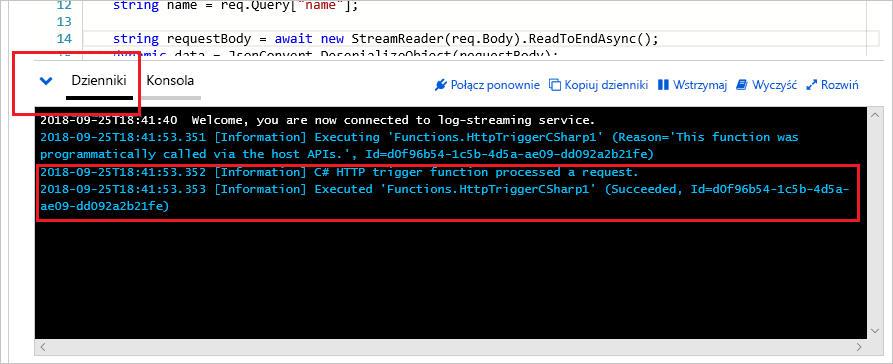

# Tworzenie pierwszej funkcji w witrynie Azure Portal

Azure Functions umożliwia uruchamianie kodu w środowisku bezserwerowym bez konieczności uprzedniego tworzenia maszyny wirtualnej lub publikowania aplikacji sieci Web. W tym artykule dowiesz się, jak za pomocą Azure Functions utworzyć funkcję wyzwalacza HTTP "Hello World" w Azure Portal.

Zalecamy [Tworzenie lokalnych funkcji](functions-develop-local.md) i publikowanie ich w aplikacji funkcji na platformie Azure.  
Użyj jednego z poniższych linków, aby rozpocząć pracę z wybranym lokalnym środowiskiem programistycznym i językiem:

| Visual Studio Code | Terminal/wiersz polecenia | Visual Studio |
| --- | --- | --- |
|  &bull;&nbsp;[Wprowadzenie do języka C #](./functions-create-first-function-vs-code.md?pivots=programming-language-csharp) &bull;&nbsp;[Wprowadzenie do języka Java](./functions-create-first-function-vs-code.md?pivots=programming-language-java) &bull;&nbsp;[Wprowadzenie do języka JavaScript](./functions-create-first-function-vs-code.md?pivots=programming-language-javascript) &bull;&nbsp;[Wprowadzenie do programu PowerShell](./functions-create-first-function-vs-code.md?pivots=programming-language-powershell) &bull;&nbsp;[Wprowadzenie do języka Python](./functions-create-first-function-vs-code.md?pivots=programming-language-python) |&bull;&nbsp;[Wprowadzenie do języka C #](./functions-create-first-azure-function-azure-cli.md?pivots=programming-language-csharp) &bull;&nbsp;[Wprowadzenie do języka Java](./functions-create-first-azure-function-azure-cli.md?pivots=programming-language-java) &bull;&nbsp;[Wprowadzenie do języka JavaScript](./functions-create-first-azure-function-azure-cli.md?pivots=programming-language-javascript) &bull;&nbsp;[Wprowadzenie do programu PowerShell](./functions-create-first-azure-function-azure-cli.md?pivots=programming-language-powershell) &bull;&nbsp;[Wprowadzenie do języka Python](./functions-create-first-azure-function-azure-cli.md?pivots=programming-language-python) | [Wprowadzenie do języka C #](functions-create-your-first-function-visual-studio.md) |

[!INCLUDE [quickstarts-free-trial-note](../../includes/quickstarts-free-trial-note.md)]

## Logowanie do platformy Azure

Zaloguj się w [witrynie Azure Portal](https://portal.azure.com) przy użyciu danych konta Azure.

## Tworzenie aplikacji funkcji

Do obsługi wykonywania funkcji potrzebna jest aplikacja funkcji. Aplikacja funkcji umożliwia grupowanie funkcji jako jednostki logicznej, co ułatwia zarządzanie, wdrażanie, skalowanie i udostępnianie zasobów.

[!INCLUDE [Create function app Azure portal](../../includes/functions-create-function-app-portal.md)]

Następnie Utwórz funkcję w nowej aplikacji funkcji.

## Tworzenie funkcji wyzwalacza HTTP

1. W menu po lewej stronie okna **funkcje** wybierz pozycję **funkcje**, a następnie wybierz pozycję **Dodaj** z górnego menu. 
 
1. W oknie **Nowa funkcja** wybierz pozycję **wyzwalacz http**.

    

1. W oknie **Nowa funkcja** Zaakceptuj nazwę domyślną **nowej funkcji**lub wprowadź nową nazwę. 

1. Z listy rozwijanej **poziom autoryzacji** wybierz pozycję **anonimowe** , a następnie wybierz pozycję **Utwórz funkcję**.

    Platforma Azure tworzy funkcję wyzwalacza HTTP. Możesz teraz uruchomić nową funkcję, wysyłając żądanie HTTP.

## Testowanie funkcji

1. W nowej funkcji wyzwalacza HTTP wybierz pozycję **Kod + test** z menu po lewej stronie, a następnie wybierz pozycję **Pobierz adres URL funkcji** z górnego menu.

    

1. W oknie dialogowym **pobieranie adresu URL funkcji** wybierz opcję **domyślne** z listy rozwijanej, a następnie wybierz ikonę **Kopiuj do schowka** . 

    

1. Wklej adres URL funkcji do paska adresu przeglądarki. Dodaj wartość ciągu zapytania `?name=<your_name>` na końcu tego adresu URL i naciśnij klawisz ENTER, aby uruchomić żądanie. 

    Poniższy przykład przedstawia odpowiedź w przeglądarce:

    

    Adres URL żądania zawiera klucz, który domyślnie jest wymagany do uzyskania dostępu do funkcji za pośrednictwem protokołu HTTP.

1. Gdy funkcja działa, informacje o śledzeniu są zapisywane w dziennikach. Aby wyświetlić dane wyjściowe śledzenia, Wróć do strony **Code + test** w portalu i rozwiń strzałkę **dzienniki** w dolnej części strony.

   

## Czyszczenie zasobów

[!INCLUDE [Clean-up resources](../../includes/functions-quickstart-cleanup.md)]

## Następne kroki

[!INCLUDE [Next steps note](../../includes/functions-quickstart-next-steps.md)]

