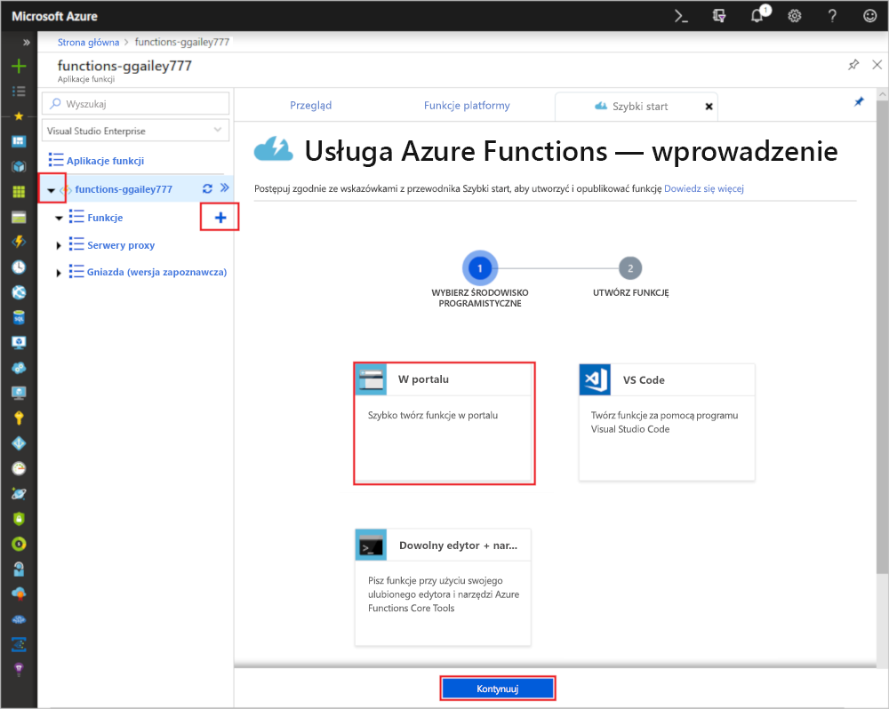

# Tworzenie pierwszej funkcji w witrynie Azure Portal

Azure Functions umożliwia uruchamianie kodu w środowisku bezserwerowym bez konieczności uprzedniego tworzenia maszyny wirtualnej lub publikowania aplikacji sieci Web. W tym artykule dowiesz się, jak za pomocą Azure Functions utworzyć w Azure Portal funkcję wyzwalaną przez protokół HTTP "Hello World".

[!INCLUDE [quickstarts-free-trial-note](../../includes/quickstarts-free-trial-note.md)]

Jeśli jesteś deweloperem języka C#, rozważ [utworzenie pierwszej funkcji w programie Visual Studio 2019](functions-create-your-first-function-visual-studio.md) zamiast w portalu. 

## Logowanie do platformy Azure

Zaloguj się do [Azure Portal](https://portal.azure.com) przy użyciu konta platformy Azure.

## Tworzenie aplikacji funkcji

Do obsługi wykonywania funkcji potrzebna jest aplikacja funkcji. Aplikacja funkcji umożliwia grupowanie funkcji jako jednostki logicznej, co ułatwia zarządzanie, wdrażanie, skalowanie i udostępnianie zasobów.

[!INCLUDE [Create function app Azure portal](../../includes/functions-create-function-app-portal.md)]

Następnie Utwórz funkcję w nowej aplikacji funkcji.

## Tworzenie funkcji wyzwalanej przez protokół HTTP

1. Rozwiń nową **+** aplikację funkcji, wybierz przycisk obok pozycji **funkcje**, wybierz pozycję **w portalu**, a następnie wybierz pozycję **Kontynuuj**.

    

1. Wybierz **element webhook i interfejs API**, a następnie wybierz pozycję **Utwórz**.

    

   Funkcja zostanie utworzona przy użyciu szablonu funkcji wyzwalanej przez protokół HTTP właściwego dla danego języka.

Możesz teraz uruchomić nową funkcję, wysyłając żądanie HTTP.

## Testowanie funkcji

1. W nowej funkcji wybierz pozycję **</> Pobierz adres URL funkcji** w prawym górnym rogu. 

1. W oknie dialogowym **pobieranie adresu URL funkcji** wybierz pozycję **domyślne (klawisz funkcyjny)** z listy rozwijanej, a następnie wybierz pozycję **Kopiuj**. 

    

1. Wklej adres URL funkcji do paska adresu przeglądarki. Dodaj wartość `&name=<your_name>` ciągu zapytania na końcu tego adresu URL i naciśnij klawisz ENTER, aby uruchomić żądanie. 

    Poniższy przykład przedstawia odpowiedź w przeglądarce:

    

    Adres URL żądania zawiera klucz, który domyślnie jest wymagany do uzyskania dostępu do funkcji za pośrednictwem protokołu HTTP.

1. Gdy funkcja działa, informacje o śledzeniu są zapisywane w dziennikach. Aby wyświetlić dane wyjściowe śledzenia z poprzedniego wykonania, Wróć do funkcji w portalu i wybierz strzałkę w dolnej części ekranu, aby rozwinąć **dzienniki**.

   

## Oczyszczanie zasobów

[!INCLUDE [Clean-up resources](../../includes/functions-quickstart-cleanup.md)]

## Następne kroki

[!INCLUDE [Next steps note](../../includes/functions-quickstart-next-steps.md)]

