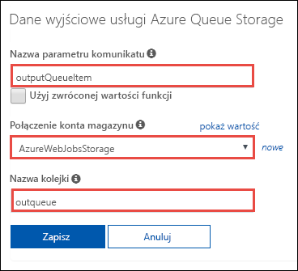

# <a name="add-messages-to-an-azure-storage-queue-using-functions"></a>Dodawanie komunikatów do kolejki usługi Azure Storage przy użyciu funkcji

W usłudze Azure Functions powiązania danych wejściowych i wyjściowych zapewniają deklaratywną metodę łączenia z danymi usług zewnętrznych z funkcji. W tym temacie dowiesz się, jak zaktualizować istniejącą funkcję, dodając powiązanie danych wyjściowych, które wysyła komunikaty do kolejki usługi magazynu Azure.  


## <a name="prerequisites"></a>Wymagania wstępne 

[!INCLUDE [Previous topics](../../includes/functions-quickstart-previous-topics.md)]

* Zainstaluj program [Microsoft Azure Storage Explorer](http://storageexplorer.com/).

## <a name="add-binding"></a>Dodawanie powiązania danych wyjściowych
 
1. Rozwiń aplikację funkcji i funkcję.

2. Wybierz pozycje **Integracja** i **+ Nowe dane wyjściowe**, a następnie wybierz pozycję **Azure Queue Storage** i kliknij przycisk **Wybierz**.
    
    

3. Użyj ustawień określonych w tabeli: 

    

    | Ustawienie      |  Sugerowana wartość   | Opis                              |
    | ------------ |  ------- | -------------------------------------------------- |
    | **Nazwa kolejki**   | myqueue-items    | Nazwa kolejki, z którą zostanie nawiązane połączenie na koncie magazynu. |
    | **Połączenie konta magazynu** | AzureWebJobStorage | Możesz skorzystać z połączenia konta magazynu już używanego przez aplikację funkcji lub utworzyć nowe.  |
    | **Nazwa parametru komunikatu** | outQueueItem | Nazwa parametru powiązania danych wyjściowych. | 

4. Kliknij pozycję **Zapisz**, aby dodać powiązanie.
 
Po zdefiniowaniu powiązania danych wyjściowych musisz zaktualizować kod, tak aby stosować powiązanie do dodawania komunikatów do kolejki.  

## <a name="update-the-function-code"></a>Aktualizacja kodu funkcji

1. Wybierz funkcję,której kod ma zostać wyświetlony w edytorze. 

2. W przypadku funkcji C# zaktualizuj definicję funkcji w następujący sposób, aby dodać parametr powiązania magazynu **outQueueItem**. Pomiń ten krok w przypadku funkcji JavaScript.

    ```cs   
    public static async Task<HttpResponseMessage> Run(HttpRequestMessage req, 
        ICollector<string> outQueueItem, TraceWriter log)
    {
        ....
    }
    ```

3. Dodaj następujący kod do funkcji tuż przed powrotem z metody. Użyj fragmentu kodu odpowiedniego dla języka danej funkcji.

    ```javascript
    context.bindings.outQueueItem = "Name passed to the function: " + 
                (req.query.name || req.body.name);
    ```

    ```cs
    outQueueItem.Add("Name passed to the function: " + name);     
    ```

4. Wybierz przycisk **Zapisz**, aby zapisać zmiany.

Wartość przekazana do wyzwalacza HTTP jest uwzględniona w komunikacie dodanym do kolejki.
 
## <a name="test-the-function"></a>Testowanie funkcji 

1. Po zapisaniu zmian w kodzie wybierz przycisk **Uruchom**. 

    

2. Sprawdź dzienniki, aby upewnić się, że funkcja zakończyła się pomyślnie. Środowisko uruchomieniowe funkcji utworzy nową kolejkę o nazwie **outqueue** w koncie magazynu przy pierwszym użyciu powiązania danych wyjściowych.

Następnie możesz nawiązać połączenie z kontem magazynu, aby sprawdzić nową kolejkę i dodany do niej komunikat. 

## <a name="connect-to-the-queue"></a>Połączenie z kolejką

Pomiń pierwsze trzy kroki, jeśli już zainstalowano program Storage Explorer i połączono go z kontem magazynu.    

1. W funkcji wybierz przycisk **Integracja** i nowe powiązanie danych wyjściowych usługi **Azure Queue Storage**, a następnie rozwiń pozycję **Dokumentacja**. Skopiuj wartości **Nazwa konta** i **Klucz konta**. Te poświadczenia służą do nawiązywania połączenia z kontem magazynu.
 
    

2. Uruchom narzędzie [Microsoft Azure Storage Explorer](http://storageexplorer.com/), wybierz ikonę połączenia po lewej stronie, wybierz pozycję **Użyj klucza i nazwy konta magazynu** i wybierz przycisk **Dalej**.

    
    
3. Wklej pozycje **Nazwa konta** i **Klucz konta** z kroku 1 w odpowiednie pola, a następnie wybierz przyciski **Dalej** i **Połącz**. 
  
    

4. Rozwiń powiązane konto magazynu, kliknij prawym przyciskiem myszy pozycję **Kolejki** i sprawdź, czy istnieje kolejka o nazwie **myqueue-items**. Komunikat powinien być już także widoczny w kolejce.  
 
    
 

## <a name="clean-up-resources"></a>Oczyszczanie zasobów

[!INCLUDE [Next steps note](../../includes/functions-quickstart-cleanup.md)]

## <a name="next-steps"></a>Następne kroki

Dodano powiązanie danych wyjściowych do istniejącej funkcji. 

[!INCLUDE [Next steps note](../../includes/functions-quickstart-next-steps.md)]

Aby uzyskać więcej informacji na temat tworzenia powiązań z kolejką magazynu, zobacz [Powiązania kolejki magazynu w usłudze Azure Functions](functions-bindings-storage-queue.md). 


