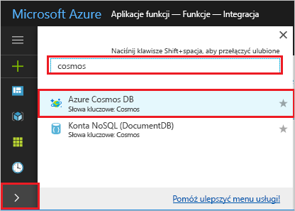
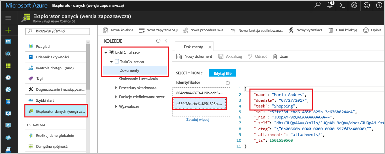

# <a name="store-unstructured-data-using-azure-functions-and-azure-cosmos-db"></a>Przechowywanie danych niestrukturalnych przy użyciu usług Azure Functions i Azure Cosmos DB

[Usługa Azure Cosmos DB](https://azure.microsoft.com/services/cosmos-db/) to świetny sposób na przechowywanie danych nieustrukturyzowanych i JSON. Dzięki połączeniu usług Azure Functions i Cosmos DB przechowywanie danych staje się szybkie i proste oraz wymaga znacznie krótszego kodu niż w przypadku przechowywania danych w relacyjnej bazie danych.

> [!NOTE]
> W tej chwili wyzwalacz usługi Azure Cosmos DB, powiązania danych wejściowych i powiązania danych wyjściowych współpracują tylko z kontami interfejsu API SQL i interfejsu API programu Graph.

W usłudze Azure Functions powiązania danych wejściowych i wyjściowych zapewniają deklaratywną metodę łączenia z danymi usług zewnętrznych z funkcji. W tym artykule opisano, jak zaktualizować istniejącą funkcję w celu dodania powiązania danych wyjściowych, które zapisuje dane bez struktury w dokumencie usługi Azure Cosmos DB.


## <a name="prerequisites"></a>Wymagania wstępne

W celu ukończenia tego samouczka:

[!INCLUDE [Previous quickstart note](../../includes/functions-quickstart-previous-topics.md)]

## <a name="create-an-azure-cosmos-db-account"></a>Tworzenie konta usługi Azure Cosmos DB

Do utworzenia powiązania danych wyjściowych konieczne jest posiadanie konta usługi Azure Cosmos DB, które używa interfejsu API SQL.

[!INCLUDE [cosmos-db-create-dbaccount](../../includes/cosmos-db-create-dbaccount.md)]

## <a name="add-an-output-binding"></a>Dodawanie powiązania danych wyjściowych

1. W portalu przejdź do utworzonej wcześniej aplikacji funkcji i rozwiń zarówno aplikację funkcji, jak i funkcję.

1. Wybierz pozycje **Integracja** i **+ Nowe dane wyjściowe** znajdujące się w prawej górnej części strony. Wybierz pozycję **Azure Cosmos DB** i kliknij przycisk **Wybierz**.

    

1. Jeśli zostanie wyświetlony komunikat **Rozszerzenia niezainstalowane**, wybierz polecenie **Instaluj**, aby zainstalować rozszerzenie powiązań usługi Azure Cosmos DB w aplikacji funkcji. Instalacja może zająć od jednej do dwóch minut.

    

1. Użyj ustawień **Dane wyjściowe usługi Azure Cosmos DB** określonych w tabeli:

    

    | Ustawienie      | Sugerowana wartość  | Opis                                |
    | ------------ | ---------------- | ------------------------------------------ |
    | **Nazwa parametru dokumentu** | taskDocument | Nazwa, która odwołuje się do obiektu Cosmos DB w kodzie. |
    | **Nazwa bazy danych** | taskDatabase | Nazwa bazy danych do zapisywania dokumentów. |
    | **Nazwa kolekcji** | TaskCollection | Nazwa bazy kolekcji bazy danych. |
    | **W przypadku wartości true tworzy bazę danych i kolekcję usługi Cosmos DB** | Zaznaczone | Kolekcja jeszcze nie istnieje, więc należy ją utworzyć. |
    | **Połączenie konta usługi Azure Cosmos DB** | Nowe ustawienie | Wybierz pozycję **Nowy**, swoją **subskrypcję**, utworzone wcześniej **konto bazy danych** i polecenie **Wybierz**. Spowoduje to utworzenie ustawienia aplikacji na potrzeby połączenia konta. To ustawienie jest używane przez powiązanie do nawiązywania połączenia z bazą danych. |
    | **Przepływność kolekcji** |400 RU| Jeśli chcesz zmniejszyć opóźnienie, możesz później przeskalować przepływność w górę. |

1. Wybierz pozycję **Zapisz**, aby utworzyć powiązanie.

## <a name="update-the-function-code"></a>Aktualizacja kodu funkcji

Zastąp istniejący kod funkcji w następującym kodem w wybranym języku:

# <a name="c"></a>[C #](#tab/csharp)

Zastąp istniejącą funkcję w języku C# następującym kodem:

```csharp
#r "Newtonsoft.Json"

using Microsoft.AspNetCore.Mvc;
using Microsoft.AspNetCore.Http;
using Microsoft.Extensions.Logging;

public static IActionResult Run(HttpRequest req, out object taskDocument, ILogger log)
{
    string name = req.Query["name"];
    string task = req.Query["task"];
    string duedate = req.Query["duedate"];

    // We need both name and task parameters.
    if (!string.IsNullOrEmpty(name) && !string.IsNullOrEmpty(task))
    {
        taskDocument = new
        {
            name,
            duedate,
            task
        };

        return (ActionResult)new OkResult();
    }
    else
    {
        taskDocument = null;
        return (ActionResult)new BadRequestResult();
    }
}
```

# <a name="javascript"></a>[Javascript](#tab/javascript)

Zastąp istniejącą funkcję w języku JavaScript następującym kodem:

```js
module.exports = async function (context, req) {

    // We need both name and task parameters.
    if (req.query.name && req.query.task) {

        // Set the output binding data from the query object.
        context.bindings.taskDocument = req.query;

        // Success.
        context.res = {
            status: 200
        };
    }
    else {
        context.res = {
            status: 400,
            body: "The query options 'name' and 'task' are required."
        };
    }
};
```
---

Ten przykładowy kod odczytuje ciągi zapytań żądania HTTP i przypisuje je do pól w obiekcie `taskDocument`. Powiązanie `taskDocument` wysyła dane obiektu z tego parametru powiązania do przechowywania w powiązanej bazie danych dokumentów. Baza danych zostanie utworzona przy pierwszym uruchomieniu funkcji.

## <a name="test-the-function-and-database"></a>Testowanie funkcji i bazy danych

1. Rozwiń okno po prawej stronie i wybierz pozycję **Testuj**. W obszarze **Zapytanie** kliknij pozycję **+ Dodaj parametr** i dodaj następujące parametry do ciągu zapytania:

    + `name`
    + `task`
    + `duedate`

1. Kliknij pozycję **Uruchom** i sprawdź, czy zwracany jest stan 200.

    

1. W witrynie Azure Portal rozwiń pasek ikon po lewej stronie, wpisz ciąg `cosmos` w polu wyszukiwania, a następnie wybierz pozycję **Azure Cosmos DB**.

    

1. Wybierz konto usługi Azure Cosmos DB, a następnie wybierz pozycję **Eksplorator danych**.

1. Rozwiń węzły **Kolekcje**, wybierz nowy dokument i upewnij się, że zawiera on wartości ciągu zapytania wraz z pewnymi dodatkowymi metadanymi.

    

Powiązanie zostało pomyślnie dodane do wyzwalacza HTTP w celu zapisania danych bez struktury w bazie danych Azure Cosmos DB.

[!INCLUDE [Clean-up section](../../includes/clean-up-section-portal.md)]

## <a name="next-steps"></a>Następne kroki

Aby uzyskać więcej informacji na temat tworzenia powiązań z bazą danych usługi Cosmos DB, zobacz temat [Powiązania bazy danych usługi Cosmos DB w usłudze Azure Functions](functions-bindings-cosmosdb.md).

[!INCLUDE [functions-quickstart-next-steps](../../includes/functions-quickstart-next-steps-2.md)]
