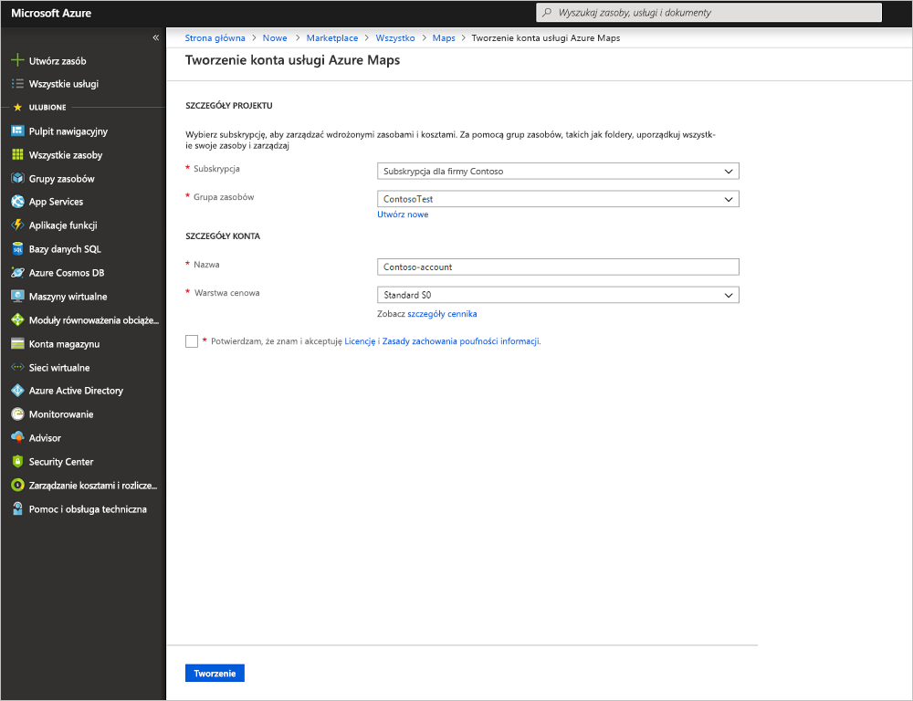

# Uruchamianie interaktywnego wyszukiwania na mapie przy użyciu usługi Azure Maps

W tym artykule przedstawiono możliwości usługi Azure Maps w zakresie tworzenia mapy umożliwiającej użytkownikom interaktywne wyszukiwanie. W artykule przedstawiono podstawowe kroki tworzenia własnego konta usługi Maps i uzyskiwania klucza konta na potrzeby korzystania z demonstracyjnej aplikacji internetowej. 

Jeśli nie masz subskrypcji platformy Azure, przed rozpoczęciem utwórz [bezpłatne konto](https://azure.microsoft.com/free/?WT.mc_id=A261C142F).

## Logowanie do witryny Azure Portal

Zaloguj się do witryny [Azure Portal](https://portal.azure.com/).

## Tworzenie konta i uzyskiwanie klucza

1. W lewym górnym rogu witryny [Azure Portal](https://portal.azure.com) kliknij przycisk **Utwórz zasób**.
2. W polu *Wyszukaj w portalu Marketplace* wpisz **Maps**.
3. Z listy *Wyniki* wybierz pozycję **Maps**. Kliknij przycisk **Utwórz** znajdujący się poniżej mapy. 
4. Na stronie **Tworzenie konta usługi Maps** wprowadź następujące wartości:
    - *Nazwa* nowego konta. 
    - *Subskrypcja*, która ma być używana dla tego konta.
    - *Grupa zasobów* dla tego konta. Można wybrać pozycję *Utwórz nowe* lub *Użyj istniejącego* dla grupy zasobów.
    - Wybierz *lokalizację grupy zasobów*.
    - Zapoznaj się z *Licencją* oraz *Zasadami zachowania poufności informacji* i zaznacz pole wyboru, aby zaakceptować warunki. 
    - Na koniec kliknij przycisk **Utwórz**.

    

5. Po pomyślnym utworzeniu konta otwórz je i znajdź sekcję ustawień menu konta. Kliknij pozycję **Klucze**, aby wyświetlić klucze podstawowe i pomocnicze dla Twojego konta usługi Azure Maps. Skopiuj wartość pola **Klucz podstawowy** do lokalnego schowka do użycia w następnej sekcji. 

## Pobieranie aplikacji

1. Pobierz lub skopiuj zawartość pliku [interactiveSearch.html](https://github.com/Azure-Samples/azure-maps-samples/blob/master/src/interactiveSearch.html).
2. Zapisz lokalnie zawartość tego pliku jako **AzureMapDemo.html** i otwórz go w edytorze tekstów.
3. Wyszukaj ciąg `<insert-key>` i zamień go na wartość pola **Klucz podstawowy** uzyskaną w poprzedniej sekcji. 

## Uruchamianie aplikacji

1. Otwórz plik **AzureMapDemo.html** w wybranej przeglądarce.
2. Spójrz na mapę Los Angeles. Powiększ i pomniejsz, aby zobaczyć, jak mapa jest automatycznie renderowana z większą lub mniejszą ilością informacji w zależności od poziomu powiększenia. 
3. Zmień domyślny środek mapy. W pliku **AzureMapDemo.html** wyszukaj zmienną o nazwie **center**. Zastąp parę wartości długości i szerokości geograficznej tej zmiennej nowymi wartościami **[-74.0060, 40.7128]**. Zapisz plik i odśwież przeglądarkę. 
3. Wypróbuj funkcję wyszukiwania interaktywnego. W polu wyszukiwania w lewym górnym rogu demonstracyjnej aplikacji internetowej wyszukaj **restauracje**. 
4. Przesuń wskaźnik myszy na listę adresów/lokalizacji wyświetlonych poniżej pola wyszukiwania i zaobserwuj, jak odpowiedni punkt na mapie wyświetla informacje o konkretnej lokalizacji. Ze względu na ochronę danych prywatnych firm wyświetlono fikcyjne nazwy i adresy. 

    

## Oczyszczanie zasobów

W tych samouczkach opisano szczegółowo sposób użycia i konfigurowania usługi Maps dla konta. Jeśli planujesz kontynuować pracę z samouczkami, nie usuwaj zasobów utworzonych w tym przewodniku Szybki start. Jeśli nie planujesz kontynuować pracy, wykonaj poniższe kroki, aby usunąć wszystkie zasoby utworzone w ramach tego przewodnika Szybki start.

1. Zamknij przeglądarkę z uruchomioną aplikacją internetową **AzureMapDemo.html**.
2. W witrynie Azure Portal w menu po lewej stronie kliknij pozycję **Wszystkie zasoby**, a następnie wybierz swoje konto usługi Maps. U góry bloku **Wszystkie zasoby** kliknij pozycję **Usuń**.

## Następne kroki

W tym przewodniku Szybki start utworzyliśmy konto usługi Maps i uruchomiliśmy demonstracyjną aplikację. Aby się dowiedzieć, jak utworzyć własną aplikację przy użyciu interfejsu API usługi Maps, przejdź do następnego samouczka.

> [!div class="nextstepaction"]
> [Wyszukiwanie punktów orientacyjnych za pomocą usługi Maps](./tutorial-search-location.md)

Aby uzyskać dodatkowe przykłady kodu i zapoznać się z interaktywnym środowiskiem kodowania, zobacz poniższe przewodniki z instrukcjami.

> [!div class="nextstepaction"]
> [How to search for an address using Azure Maps REST APIs](./how-to-search-for-address.md) (Jak wyszukać adres przy użyciu interfejsów API REST usługi Azure Maps)

> [!div class="nextstepaction"]
> [How to use Azure Maps map control](./how-to-use-map-control.md) (Jak używać formantu mapy usługi Azure Maps)
