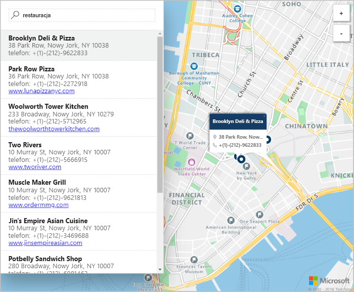

# Szybki Start: Tworzenie mapy wyszukiwania interaktywnego za pomocą Azure Maps

W tym artykule przedstawiono możliwości usługi Azure Maps w zakresie tworzenia mapy umożliwiającej użytkownikom interaktywne wyszukiwanie. Przeprowadza on użytkownika przez następujące podstawowe kroki:
* Tworzenie konta usługi Azure Maps.
* Uzyskiwanie klucza konta do użycia w demonstracyjnej aplikacji internetowej.

Jeśli nie masz subskrypcji platformy Azure, przed rozpoczęciem utwórz [bezpłatne konto](https://azure.microsoft.com/free/?WT.mc_id=A261C142F).

## Logowanie się do witryny Azure Portal

Zaloguj się do [portalu Azure](https://portal.azure.com).

## Tworzenie konta przy użyciu usługi Azure Maps

Utwórz nowe konto usługi Maps, wykonując następujące czynności:

1. W lewym górnym rogu witryny [Azure Portal](https://portal.azure.com) kliknij przycisk **Utwórz zasób**.
2. W polu *Wyszukaj w portalu Marketplace* wpisz **Maps**.
3. Z listy *Wyniki* wybierz pozycję **Maps**. Kliknij przycisk **Utwórz** znajdujący się poniżej mapy.
4. Na stronie **Tworzenie konta usługi Maps** wprowadź następujące wartości:
    * *Subskrypcja*, która ma być używana dla tego konta.
    * Nazwa *grupy zasobów* dla tego konta. Można wybrać pozycję *Utwórz nowe* lub *Użyj istniejącego* dla grupy zasobów.
    * *Nazwa* nowego konta.
    * *Warstwa cenowa* dla tego konta.
    * Zapoznaj się z *Licencją* oraz *Zasadami zachowania poufności informacji* i zaznacz pole wyboru, aby zaakceptować warunki.
    * Kliknij przycisk **Utwórz**.

## Pobieranie klucza podstawowego konta

Po pomyślnym utworzeniu konta usługi Maps pobierz klucz, który umożliwia wysyłanie zapytań do interfejsów API usługi Maps. Podczas wywoływania usług Azure Maps zalecamy użycie klucza podstawowego Twojego konta jako klucza subskrypcji.

1. Otwórz konto usługi Maps w portalu.
2. W sekcji Ustawienia wybierz pozycję **uwierzytelnianie**.
3. Skopiuj **klucz podstawowy** do schowka. Zapisz go lokalnie — będzie używany w dalszej części tego samouczka.

## Pobieranie aplikacji

1. Pobierz lub skopiuj zawartość pliku [interactiveSearch.html](https://github.com/Azure-Samples/AzureMapsCodeSamples/blob/master/AzureMapsCodeSamples/Tutorials/interactiveSearch.html).
2. Zapisz lokalnie zawartość tego pliku jako **AzureMapDemo.html**. Otwórz ten plik w edytorze tekstów.
3. Wyszukaj ciąg `<Your Azure Maps Key>`. Zastąp go wartością pola **Klucz podstawowy** z poprzedniej sekcji.

## Otwieranie aplikacji

1. Otwórz plik **AzureMapDemo.html** w wybranej przeglądarce.
2. Spójrz na mapę miasta Los Angeles. Powiększ i pomniejsz, aby zobaczyć, jak mapa jest automatycznie renderowana z większą lub mniejszą ilością informacji w zależności od poziomu powiększenia. 
3. Zmień domyślny środek mapy. W pliku **AzureMapDemo.html** wyszukaj zmienną o nazwie **center**. Zastąp parę wartości długości i szerokości geograficznej tej zmiennej nowymi wartościami **[-74.0060, 40.7128]** . Zapisz plik i odśwież przeglądarkę.
4. Wypróbuj funkcję wyszukiwania interaktywnego. W polu wyszukiwania w lewym górnym rogu demonstracyjnej aplikacji internetowej wyszukaj **restauracje**.
5. Przesuń wskaźnik myszy na liście adresów i lokalizacji, które są wyświetlane pod polem wyszukiwania. Zwróć uwagę, jak za pomocą odpowiedniej pinezki na mapie wyświetlane są informacje o tej lokalizacji. Ze względu na ochronę danych prywatnych firm wyświetlono fikcyjne nazwy i adresy.

    

## Oczyszczanie zasobów

W tych samouczkach szczegółowo opisano sposób użycia i konfigurowania usługi Azure Maps dla konta. Jeśli planujesz kontynuować pracę z samouczkami, nie usuwaj zasobów utworzonych w tym przewodniku Szybki start. Jeśli nie planujesz kontynuowania pracy, wykonaj następujące kroki, aby usunąć zasoby:

1. Zamknij przeglądarkę z uruchomioną aplikacją internetową **AzureMapDemo.html**.
2. W menu po lewej stronie w witrynie Azure Portal wybierz pozycję **Wszystkie zasoby**. Następnie wybierz swoje konto usługi Azure Maps. W górnej części okienka **Wszystkie zasoby** wybierz pozycję **Usuń**.

## Następne kroki

W tym przewodniku Szybki start utworzyliśmy konto usługi Azure Maps i utworzyliśmy aplikację demonstracyjną. Zapoznaj się z następującymi samouczkami, aby dowiedzieć się więcej na temat Azure Maps:

> [!div class="nextstepaction"]
> [Wyszukiwanie pobliskich punktów orientacyjnych za pomocą usługi Azure Maps](tutorial-search-location.md)

Aby uzyskać dodatkowe przykłady kodu i zapoznać się z interaktywnym środowiskiem kodowania, przejrzyj następujące przewodniki:

> [!div class="nextstepaction"]
> [Find an address by using the Azure Maps search service (Wyszukiwanie adresu przy użyciu usługi wyszukiwania Azure Maps)](how-to-search-for-address.md)

> [!div class="nextstepaction"]
> [How to use Azure Maps map control (Jak używać kontrolki mapy usługi Azure Maps)](how-to-use-map-control.md)
