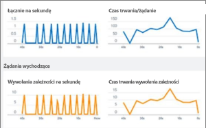
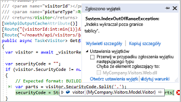

# Co to jest usługa Application Insights?
Usługa Application Insights jest rozszerzalną usługą zarządzania wydajnością aplikacji (APM) dla deweloperów sieci Web na wielu platformach. Użyj tej usługi do monitorowania aplikacji internetowej na żywo. Usługa automatycznie wykryje nieprawidłowości w zakresie wydajności. Obejmuje ona zaawansowane narzędzia analityczne, dzięki którym możesz diagnozować problemy i zrozumieć sposób korzystania z aplikacji przez użytkowników.  Usługa ta pomaga w ciągłym doskonaleniu wydajności i użyteczności tworzonych rozwiązań. Działa w przypadku aplikacji na różnych platformach, w tym .NET, Node.js i J2EE, hostowanych lokalnie w środowisku hybrydowym lub w dowolnej chmurze publicznej. Integruje się ona z procesem DevOps i ma punkty połączenia z szeroką gamą narzędzi programistycznych. Może monitorować i analizować dane telemetryczne z aplikacji mobilnych dzięki integracji z usługą Visual Studio App Center.

[Obejrzyj animację wprowadzającą](https://www.youtube.com/watch?v=fX2NtGrh-Y0).

## Jak działa usługa Application Insights?
Zainstaluj mały pakiet instrumentacji w swojej aplikacji i skonfiguruj zasób usługi Application Insights w witrynie Microsoft Azure Portal. Instrumentacja monitoruje Twoją aplikację i wysyła dane telemetryczne do portalu. (Aplikację można uruchomić gdziekolwiek — nie musi być ona hostowana na platformie Azure).

Instrumentacja może obejmować nie tylko aplikację usługi sieci Web, ale również wszystkie składniki tła i skrypty JavaScript na samych stronach sieci Web. 

Ponadto możesz ściągnąć dane telemetryczne ze środowisk hostów, takich jak liczniki wydajności, diagnostyka platformy Azure lub dzienniki platformy Docker. Możesz też skonfigurować testy sieci Web, które okresowo wysyłają syntetyczne żądania do usługi sieci Web.

Wszystkie te strumienie telemetrii są zintegrowane w witrynie Azure Portal, gdzie możesz zastosować zaawansowane narzędzia do analizy i wyszukiwania do danych pierwotnych.

### Co to jest narzut?
Wpływ na wydajność Twojej aplikacji jest bardzo mały. Wywołania śledzenia nie powodują blokowania oraz są łączone w partie i wysłane w oddzielnym wątku.

## Co monitoruje usługa Application Insights?

Usługa Application Insights jest przeznaczona dla zespołu deweloperów po to, aby pomóc zrozumieć, jak działa Twoja aplikacja i jak jest używana. Monitoruje ona:

* **Liczby żądań, czasy reakcji i współczynniki błędów** — dowiedz się, które strony są najbardziej popularne, o jakiej porze dnia i gdzie są Twoi użytkownicy. Zobacz, które strony działają najlepiej. Jeśli Twoje czasy odpowiedzi i częstotliwości awarii są duże, gdy jest więcej żądań, być może masz problem z zasobami. 
* **Współczynniki zależności, czasy reakcji i współczynniki błędów** — dowiedz się, czy usługi zewnętrzne nie spowalniają pracy.
* **Wyjątki** — analizowanie zagregowanych danych statystycznych lub wybieranie określonych wystąpień i przechodzenie do szczegółów śladu stosu i powiązanych żądań. Są zgłaszane zarówno wyjątki serwera, jak i przeglądarki.
* **Wydajność ładowania i wyświetleń stron** — zgłoszona przez przeglądarki użytkowników.
* **Wywołania AJAX** ze stron sieci Web — liczba, czasy reakcji i współczynniki błędów.
* **Liczby użytkowników i sesji**.
* **Liczniki wydajności** z serwerów systemu Windows lub Linux, takie jak użycie procesora CPU, pamięci i sieci. 
* **Diagnostyka hosta** z platformy Docker lub Azure. 
* **Diagnostyczne dzienniki śledzenia** z Twojej aplikacji — dzięki temu możesz skorelować zdarzenia śledzenia z żądaniami.
* **Niestandardowe zdarzenia i metryki**, które samodzielnie zapisujesz w kodzie klienta lub serwera, do śledzenia zdarzeń biznesowych, takich jak sprzedane towary lub wygrane gry.

## Gdzie mogę zobaczyć swoją telemetrię?

Istnieje wiele sposobów eksploracji danych. Zapoznaj się z następującymi artykułami:

|  |  |
| --- | --- |
| [**Inteligentne wykrywanie i ręczne alerty**](../../azure-monitor/app/proactive-diagnostics.md) Alerty automatyczne dostosowują się do normalnych wzorców telemetrii Twojej aplikacji i są wyzwalane, gdy wystąpi coś poza zwykłym wzorcem. Możesz też [ustawić alerty](../../azure-monitor/app/alerts.md) dla konkretnych poziomów metryk niestandardowych lub standardowych. | |
| [**Mapa aplikacji**](../../azure-monitor/app/app-map.md) Składniki Twojej aplikacji wraz z kluczowymi metrykami i alertami. |  |
| [**Profiler**](../../azure-monitor/app/profiler.md) Inspekcja profilów wykonania próbek żądań. | |
| [**Analiza użycia**](../../azure-monitor/app/usage-overview.md) Analiza segmentacji i utrzymywania użytkowników.| |
| [**Wyszukiwanie diagnostyczne danych dla wystąpienia**](../../azure-monitor/app/diagnostic-search.md) Wyszukiwanie i filtrowanie zdarzeń, takich jak żądania, wyjątki, wywołania zależności, dzienniki śledzenia i wyświetlenia stron.  | |
| [**Eksplorator metryk dla danych zagregowanych**](../../azure-monitor/app/metrics-explorer.md) Eksploruj, filtruj i segmentuj zagregowane dane, takie jak liczby żądań, błędów i wyjątków, czasy reakcji, czasy ładowania stron. | |
| [**Pulpity nawigacyjne**](../../azure-monitor/app/app-insights-dashboards.md#dashboards) Połącz dane z wielu zasobów i udostępnij innym osobom. Opcja ta doskonale nadaje się dla aplikacji wieloskładnikowych i ciągłego wyświetlania w pomieszczeniu zespołu. | |
| [**Transmisja strumieniowa metryk na żywo**](../../azure-monitor/app/live-stream.md) Podczas wdrażania nowej kompilacji obejrzyj te wskaźniki wydajności prawie w czasie rzeczywistym, aby upewnić się, że wszystko działa zgodnie z oczekiwaniami. | |
| [**Analiza**](../../azure-monitor/app/analytics.md) Odpowiedz na trudne pytania dotyczące wydajności i użycia Twojej aplikacji za pomocą tego zaawansowanego języka zapytań. | |
| [**Program Visual Studio**](../../azure-monitor/app/visual-studio.md) Zobacz dane dotyczące wydajności w kodzie. Przejdź do kodu ze śladów stosu.| |
| [**Debuger migawek**](../../azure-monitor/app/snapshot-debugger.md) Debuguje próbki migawek pobrane z operacji na żywo, używając wartości parametrów.| |
| [**Power BI**](../../azure-monitor/app/export-power-bi.md ) Integruje metryki użycia z innymi analizami biznesowymi.| |
| [**Interfejs API REST**](https://dev.applicationinsights.io/) Napisz kod, aby uruchamiać zapytania dla swoich metryk i danych pierwotnych.|  |
| [**Eksport ciągły**](../../azure-monitor/app/export-telemetry.md) Zbiorczy eksport danych pierwotnych do magazynu zaraz po ich odebraniu. | |

## Jak mogę używać usługi Application Insights?

### Monitorowanie
Zainstaluj usługę Application Insights w swojej aplikacji, skonfiguruj [testy sieci Web dostępności](../../azure-monitor/app/monitor-web-app-availability.md) oraz:

* Skonfiguruj [pulpit nawigacyjny](../../azure-monitor/app/app-insights-dashboards.md) dla pomieszczenia zespołu, aby śledzić obciążenie, elastyczność i wydajność zależności, ładowania stron i wywołania AJAX.
* Wykryj, jakie żądania są najwolniejsze i najczęściej kończą się niepowodzeniem.
* Obejrzyj [transmisję strumieniową na żywo](../../azure-monitor/app/live-stream.md) podczas wdrażania nowej wersji, aby od razu dowiedzieć się o wszelkich pogorszeniach.

### Wykrywanie, diagnozowanie
Po odebraniu alertu lub odnalezieniu problemu:

* Oceń, na ilu użytkowników ma to wpływ.
* Skoreluj błędy z wyjątkami, wywołaniami i śledzeniem zależności.
* Sprawdź profilera, migawki, zrzuty stosu i dzienniki śledzenia.

### Kompilowanie, mierzenie, poznawanie
[Zmierz efektywność](../../azure-monitor/app/usage-overview.md) każdej nowo wdrażanej funkcji.

* Zaplanuj pomiar sposobu używania nowych funkcji środowiska użytkownika lub biznesowych przez klientów.
* Zapisz niestandardową telemetrię do kodu.
* Oprzyj następny cyklu rozwoju na twardych dowodach ze swojej telemetrii.

## Rozpoczęcie pracy
Usługa Application Insights jest jedną z wielu usług hostowanych na platformie Microsoft Azure, a dane telemetryczne są przesyłane do analizy i prezentacji. Dlatego przed wykonaniem jakichkolwiek innych czynności będzie potrzebna subskrypcja platformy [Microsoft Azure](https://azure.com). Rejestracja jest bezpłatna, a jeśli wybierzesz podstawowy [plan cenowy](https://azure.microsoft.com/pricing/details/application-insights/) usługi Application Insights, nie będzie opłat do chwili, gdy aplikacja rozrośnie się na tyle, aby mieć znaczne wykorzystanie. Jeśli Twoja organizacja ma już subskrypcję, może ona dodać do niej Twoje konto Microsoft.

Istnieje kilka sposobów, aby rozpocząć. Zacznij od tego, co najlepiej sprawdza się w Twoim przypadku. Resztę możesz dodać później.

* **W czasie wykonywania: wdróż instrumentację aplikacji internetowej na serwerze.** Pozwala uniknąć wszelkich aktualizacji kodu. Musisz mieć dostęp administracyjny do serwera.
  * [**Usługi IIS lokalnie lub na maszynie wirtualnej**](../../azure-monitor/app/monitor-performance-live-website-now.md)
  * [**Aplikacja internetowa lub maszyna wirtualna na platformie Azure**](../../azure-monitor/app/monitor-performance-live-website-now.md)
  * [**J2EE**](../../azure-monitor/app/java-live.md)
* **W czasie tworzenia: dodaj usługę Application Insights do swojego kodu.** Umożliwia pisanie niestandardowych telemetrii oraz instrumentację zaplecza i aplikacji komputerowych.
  * [Program Visual Studio](../../azure-monitor/app/asp-net.md) 2013 Update 2 lub nowszy.
  * [Java](../../azure-monitor/app/java-get-started.md)
  * [Node.js](../../azure-monitor/app/nodejs.md)
  * [Inne platformy](../../azure-monitor/app/platforms.md)
* **[Instrumentacja stron sieci Web](../../azure-monitor/app/javascript.md)** dla widoku strony, wywołań AJAX i innych telemetrii po stronie klienta.
* **[Analizowanie użycia aplikacji mobilnej](../../azure-monitor/learn/mobile-center-quickstart.md)** dzięki integracji z usługą Visual Studio App Center.
* **[Testy dostępności](../../azure-monitor/app/monitor-web-app-availability.md)** — regularnie używaj polecenia ping dla witryny sieci Web z naszych serwerów.

## Następne kroki
Rozpocznij pracę w czasie wykonywania za pomocą rozwiązań:

* [Serwer usług IIS](../../azure-monitor/app/monitor-performance-live-website-now.md)
* [Serwer J2EE](../../azure-monitor/app/java-live.md)

Rozpocznij pracę w czasie programowania za pomocą rozwiązań:

* [ASP.NET](../../azure-monitor/app/asp-net.md)
* [Java](../../azure-monitor/app/java-get-started.md)
* [Node.js](../../azure-monitor/app/nodejs.md)

## Pomoc techniczna i opinie
* Pytania i problemy:
  * [Rozwiązywanie problemów][qna]
  * [Forum MSDN](https://social.msdn.microsoft.com/Forums/vstudio/home?forum=ApplicationInsights)
  * [StackOverflow](https://stackoverflow.com/questions/tagged/ms-application-insights)
* Twoje sugestie:
  * [UserVoice](https://feedback.azure.com/forums/357324-application-insights/filters/top)
* Blog:
  * [Blog usługi Application Insights](https://azure.microsoft.com/blog/tag/application-insights)

## Filmy wideo

> [!VIDEO https://channel9.msdn.com/events/Connect/2016/100/player] 

<!--Link references-->

[android]: ../../azure-monitor/learn/mobile-center-quickstart.md
[azure]: ../../insights-perf-analytics.md
[client]: ../../azure-monitor/app/javascript.md
[desktop]: ../../azure-monitor/app/windows-desktop.md
[detect]: ../../azure-monitor/app/detect-triage-diagnose.md
[greenbrown]: ../../azure-monitor/app/asp-net.md
[ios]: ../../azure-monitor/learn/mobile-center-quickstart.md
[java]: ../../azure-monitor/app/java-get-started.md
[knowUsers]: app-insights-web-track-usage.md
[platforms]: ../../azure-monitor/app/platforms.md
[portal]: https://portal.azure.com/
[qna]: ../../azure-monitor/app/troubleshoot-faq.md
[redfield]: ../../azure-monitor/app/monitor-performance-live-website-now.md
