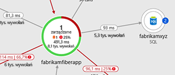
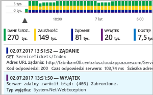
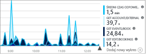
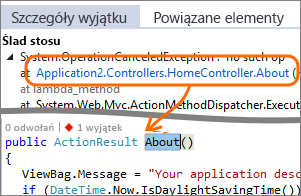
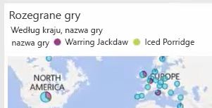

# Co to jest usługa Application Insights?
Application Insights, funkcja [Azure monitor](../overview.md), to rozszerzalna usługa zarządzania wydajnością aplikacji (APM) dla deweloperów i informatyków DevOps. Służy do monitorowania aplikacji na żywo. Automatycznie wykryje anomalie wydajności i oferuje zaawansowane narzędzia analityczne ułatwiające diagnozowanie problemów oraz zrozumienie, jakie użytkownicy faktycznie są w tej aplikacji.  Usługa ta pomaga w ciągłym doskonaleniu wydajności i użyteczności tworzonych rozwiązań. Działa w przypadku aplikacji na różnych platformach, w tym .NET, Node.js, Java i Python hostowanych lokalnie, hybrydowych lub dowolnej chmurze publicznej. Integruje się ona z procesem DevOps i ma punkty połączenia z szeroką gamą narzędzi programistycznych. Może monitorować i analizować dane telemetryczne z aplikacji mobilnych dzięki integracji z usługą Visual Studio App Center.

## Jak działa usługa Application Insights?
Zainstalujesz niewielki pakiet Instrumentacji (SDK) w aplikacji lub Włącz Application Insights przy użyciu agenta Application Insights, jeśli jest [obsługiwany](./platforms.md). Instrumentacja monitoruje aplikację i kieruje dane telemetryczne do zasobu usługi Azure Application Insights przy użyciu unikatowego identyfikatora GUID, który odwołuje się jako klucz Instrumentacji.

Instrumentacja może obejmować nie tylko aplikację usługi sieci Web, ale również wszystkie składniki tła i skrypty JavaScript na samych stronach sieci Web. Aplikacja i jej składniki mogą działać w dowolnym miejscu — nie musi być hostowana na platformie Azure.

Ponadto możesz ściągnąć dane telemetryczne ze środowisk hostów, takich jak liczniki wydajności, diagnostyka platformy Azure lub dzienniki platformy Docker. Możesz też skonfigurować testy internetowe, które okresowo wysyłają syntetyczne żądania do usługi internetowej.

Wszystkie te strumienie telemetrii są zintegrowane z Azure Monitor. W Azure Portal można zastosować zaawansowane narzędzia analityczne i wyszukiwania do danych pierwotnych.

### Co to jest narzut?
Wpływ na wydajność aplikacji jest mały. Wywołania śledzenia nie powodują blokowania oraz są łączone w partie i wysłane w oddzielnym wątku.

## Co monitoruje usługa Application Insights?

Usługa Application Insights jest przeznaczona dla zespołu deweloperów po to, aby pomóc zrozumieć, jak działa Twoja aplikacja i jak jest używana. Monitoruje ona:

* **Liczby żądań, czasy reakcji i współczynniki błędów** — dowiedz się, które strony są najbardziej popularne, o jakiej porze dnia i gdzie są Twoi użytkownicy. Zobacz, które strony działają najlepiej. Jeśli Twoje czasy odpowiedzi i częstotliwości awarii są duże, gdy jest więcej żądań, być może masz problem z zasobami. 
* **Współczynniki zależności, czasy reakcji i współczynniki błędów** — dowiedz się, czy usługi zewnętrzne nie spowalniają pracy.
* **Wyjątki** — analizowanie zagregowanych danych statystycznych lub wybieranie określonych wystąpień i przechodzenie do szczegółów śladu stosu i powiązanych żądań. Są zgłaszane zarówno wyjątki serwera, jak i przeglądarki.
* **Wydajność ładowania i wyświetleń stron** — zgłoszona przez przeglądarki użytkowników.
* **Wywołania AJAX** ze stron sieci Web — liczba, czasy reakcji i współczynniki błędów.
* **Liczby użytkowników i sesji**.
* **Liczniki wydajności** z serwerów systemu Windows lub Linux, takie jak użycie procesora CPU, pamięci i sieci. 
* **Diagnostyka hosta** z platformy Docker lub Azure. 
* **Diagnostyczne dzienniki śledzenia** z Twojej aplikacji — dzięki temu możesz skorelować zdarzenia śledzenia z żądaniami.
* **Niestandardowe zdarzenia i metryki**, które samodzielnie zapisujesz w kodzie klienta lub serwera, do śledzenia zdarzeń biznesowych, takich jak sprzedane towary lub wygrane gry.

## Gdzie mogę zobaczyć swoją telemetrię?

Istnieje wiele sposobów eksploracji danych. Zapoznaj się z następującymi artykułami:

|  |  |
| --- | --- |
| [**Inteligentne wykrywanie i ręczne alerty**](./proactive-diagnostics.md) Skonfiguruj automatyczne alerty, które dostosowują się do zwykłych wzorców danych telemetrycznych i wyzwalaczy, gdy istnieje coś poza zwykłym wzorcem. Możesz również [ustawić alerty](../platform/alerts-log.md) dla konkretnych poziomów metryk niestandardowych lub standardowych. | |
| [**Mapa aplikacji**](./app-map.md) Poznaj składniki aplikacji z kluczowymi metrykami i alertami. |  |
| [**Profiler**](./profiler.md) Inspekcja profilów wykonania próbek żądań. | |
| [**Analiza użycia**](./usage-overview.md) Analiza segmentacji i utrzymywania użytkowników.| |
| [**Wyszukiwanie diagnostyczne danych dla wystąpienia**](./diagnostic-search.md) Wyszukiwanie i filtrowanie zdarzeń, takich jak żądania, wyjątki, wywołania zależności, dzienniki śledzenia i wyświetlenia stron.  | |
| [**Eksplorator metryk dla danych zagregowanych**](../platform/metrics-charts.md) Eksploruj, filtruj i segmentuj zagregowane dane, takie jak liczby żądań, błędów i wyjątków, czasy reakcji, czasy ładowania stron. | |
| [**Pulpity nawigacyjne**](./overview-dashboard.md) Połącz dane z wielu zasobów i udostępnij innym osobom. Opcja ta doskonale nadaje się dla aplikacji wieloskładnikowych i ciągłego wyświetlania w pomieszczeniu zespołu. | |
| [**Transmisja strumieniowa metryk na żywo**](./live-stream.md) Podczas wdrażania nowej kompilacji obejrzyj te wskaźniki wydajności prawie w czasie rzeczywistym, aby upewnić się, że wszystko działa zgodnie z oczekiwaniami. | |
| [**Analiza**](../log-query/log-query-overview.md) Odpowiedz na trudne pytania dotyczące wydajności i użycia Twojej aplikacji za pomocą tego zaawansowanego języka zapytań. | |
| [**Visual Studio**](./visual-studio.md) Zobacz dane dotyczące wydajności w kodzie. Przejdź do kodu ze śladów stosu.| |
| [**Debuger migawek**](./snapshot-debugger.md) Debuguje próbki migawek pobrane z operacji na żywo, używając wartości parametrów.| |
| [**Power BI**](./export-power-bi.md) Integruje metryki użycia z innymi analizami biznesowymi.| |
| [**Interfejs API REST**](https://dev.applicationinsights.io/) Napisz kod, aby uruchamiać zapytania dla swoich metryk i danych pierwotnych.|  |
| [**Eksport ciągły**](./export-telemetry.md) Zbiorczy eksport danych pierwotnych do magazynu zaraz po ich odebraniu. | |

## Jak mogę używać usługi Application Insights?

### Monitorowanie
Zainstaluj usługę Application Insights w swojej aplikacji, skonfiguruj [testy sieci Web dostępności](./monitor-web-app-availability.md) oraz:

* Sprawdź domyślny [pulpit nawigacyjny aplikacji](./overview-dashboard.md) dla pokoju zespołu, aby śledzić obciążenie, czas odpowiedzi oraz wydajność zależności, obciążeń stron i wywołań AJAX.
* Wykryj, jakie żądania są najwolniejsze i najczęściej kończą się niepowodzeniem.
* Obejrzyj [transmisję strumieniową na żywo](./live-stream.md) podczas wdrażania nowej wersji, aby od razu dowiedzieć się o wszelkich pogorszeniach.

### Wykrywanie, diagnozowanie
Po odebraniu alertu lub odnalezieniu problemu:

* Oceń, na ilu użytkowników ma to wpływ.
* Skoreluj błędy z wyjątkami, wywołaniami zależności i śladami.
* Sprawdź profilera, migawki, zrzuty stosu i dzienniki śledzenia.

### Kompilowanie, mierzenie, poznawanie
[Zmierz efektywność](./usage-overview.md) każdej nowej funkcji, która zostanie wdrożona.

* Zaplanuj pomiar sposobu używania nowych funkcji środowiska użytkownika lub biznesowych przez klientów.
* Zapisz niestandardową telemetrię do kodu.
* Oprzyj następny cyklu rozwoju na twardych dowodach ze swojej telemetrii.

## Rozpoczęcie pracy
Usługa Application Insights jest jedną z wielu usług hostowanych na platformie Microsoft Azure, a dane telemetryczne są przesyłane do analizy i prezentacji. Dlatego przed wykonaniem jakichkolwiek innych czynności będzie potrzebna subskrypcja platformy [Microsoft Azure](https://azure.com). Rejestracja jest bezpłatna, a jeśli wybierzesz podstawowy [plan cenowy](https://azure.microsoft.com/pricing/details/application-insights/) usługi Application Insights, nie będzie opłat do chwili, gdy aplikacja rozrośnie się na tyle, aby mieć znaczne wykorzystanie. Jeśli Twoja organizacja ma już subskrypcję, może ona dodać do niej Twoje konto Microsoft.

Istnieje kilka sposobów, aby rozpocząć. Zacznij od tego, co najlepiej sprawdza się w Twoim przypadku. Resztę możesz dodać później.

* **W czasie wykonywania: wdróż instrumentację aplikacji internetowej na serwerze.** Idealne rozwiązanie w przypadku aplikacji, które zostały już wdrożone. Pozwala uniknąć wszelkich aktualizacji kodu.
  * [**Aplikacje ASP.NET lub ASP.NET Core hostowane na platformie Azure Web Apps**](./azure-web-apps.md)
  * [**ASP.NET aplikacje hostowane w usługach IIS na maszynie wirtualnej platformy Azure lub w zestawie skalowania maszyn wirtualnych platformy Azure**](./azure-vm-vmss-apps.md)
  * [**ASP.NET aplikacje hostowane w lokalnych maszynach wirtualnych usług IIS**](./monitor-performance-live-website-now.md)
* **W czasie tworzenia: dodaj usługę Application Insights do swojego kodu.** Pozwala dostosować zbieranie danych telemetrycznych i wysyłać dodatkowe dane telemetryczne.
  * [Aplikacje ASP.NET](./asp-net.md)
  * [ASP.NET Core aplikacji](./asp-net-core.md)
  * [Aplikacje konsolowe platformy .NET](./console.md)
  * [Java](./java-get-started.md)
  * [Node.js](./nodejs.md)
  * [Python](./opencensus-python.md)
  * [Inne platformy](./platforms.md)
* **[Instrumentacja stron internetowych](./javascript.md)** dla widoku strony, wywołań AJAX i innej telemetrii po stronie klienta.
* **[Analizowanie użycia aplikacji mobilnej](../learn/mobile-center-quickstart.md)** dzięki integracji z usługą Visual Studio App Center.
* **[Testy dostępności](./monitor-web-app-availability.md)** — regularnie używaj polecenia ping dla witryny sieci Web z naszych serwerów.

## Następne kroki
Rozpocznij pracę w czasie wykonywania za pomocą rozwiązań:

* [Maszyna wirtualna platformy Azure i zestaw skalowania maszyn wirtualnych platformy Azure — aplikacje hostowane](./azure-vm-vmss-apps.md)
* [Serwer usług IIS](./monitor-performance-live-website-now.md)
* [Aplikacje internetowe platformy Azure](./azure-web-apps.md)

Rozpocznij pracę w czasie programowania za pomocą rozwiązań:

* [ASP.NET](./asp-net.md)
* [ASP.NET Core](./asp-net-core.md)
* [Java](./java-get-started.md)
* [Node.js](./nodejs.md)
* [Python](./opencensus-python.md)

## Pomoc techniczna i opinie
* Pytania i problemy:
  * [Rozwiązywanie problemów][qna]
  * [Strona pytania&pytań i odpowiedzi](/answers/topics/azure-monitor.html)
  * [Witryna StackOverflow](https://stackoverflow.com/questions/tagged/ms-application-insights)
* Twoje sugestie:
  * [UserVoice](https://feedback.azure.com/forums/357324-application-insights/filters/top)
* Blog:
  * [Blog usługi Application Insights](https://azure.microsoft.com/blog/tag/application-insights)

<!--Link references-->

[android]: ../learn/mobile-center-quickstart.md
[azure]: ../../insights-perf-analytics.md
[client]: ./javascript.md
[desktop]: ./windows-desktop.md
[greenbrown]: ./asp-net.md
[ios]: ../learn/mobile-center-quickstart.md
[java]: ./java-get-started.md
[knowUsers]: app-insights-web-track-usage.md
[platforms]: ./platforms.md
[portal]: https://portal.azure.com/
[qna]: ../faq.md
[redfield]: ./monitor-performance-live-website-now.md

