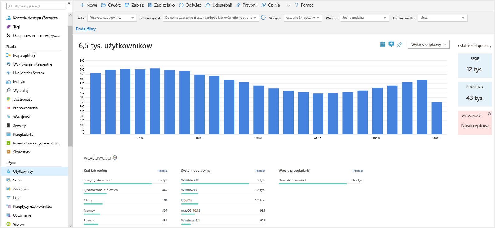

# <a name="quickstart-start-monitoring-your-website-with-azure-monitor-application-insights"></a>Szybki Start: Rozpoczynanie monitorowania witryny sieci Web za pomocą Azure Monitor Application Insights

W tym przewodniku szybki start dowiesz się, jak dodać zestaw SDK JavaScript Application Insights "open source" do witryny sieci Web. Dowiesz się również, jak lepiej zrozumieć środowisko klienta/przeglądarki dla odwiedzających witrynę sieci Web.

Usługa Azure Monitor Application Insights umożliwia łatwe monitorowanie dostępności, wydajności i użycia witryny internetowej. Pozwala też szybko identyfikować i diagnozować błędy w aplikacji bez oczekiwania na zgłoszenie ich przez użytkownika. Application Insights udostępnia funkcje monitorowania po stronie serwera i klienta/przeglądarki.

## <a name="prerequisites"></a>Wymagania wstępne

* Konto platformy Azure z aktywną subskrypcją. [Utwórz konto bezpłatnie](https://azure.microsoft.com/free/?ref=microsoft.com&utm_source=microsoft.com&utm_medium=docs&utm_campaign=visualstudio).
* Witryna sieci Web, do której można dodać Application Insights JavaScript SDK.

## <a name="enable-application-insights"></a>Włączanie usługi Application Insights

Application Insights może zbierać dane telemetryczne z dowolnej aplikacji połączonej z Internetem działającej lokalnie lub w chmurze. Aby wyświetlić te dane, wykonaj następujące kroki:

1. Zaloguj się do [portalu Azure](https://portal.azure.com/).
1. Wybierz **pozycję Utwórz** > **Management tools** > **Application Insights**narzędzia do zarządzania zasobami.

   > [!NOTE]
   >Jeśli po raz pierwszy utworzysz zasób Application Insights, zobacz [Tworzenie zasobu Application Insights](https://docs.microsoft.com/azure/azure-monitor/app/create-new-resource).
1. Gdy pojawi się okno Konfiguracja, użyj poniższej tabeli, aby ukończyć pola wejściowe:

    | Ustawienia        | Wartość           | Opis  |
   | ------------- |:-------------|:-----|
   | **Nazwa**      | Wartość unikatowa w skali globalnej | Nazwa identyfikująca monitorowaną aplikację. |
   | **Grupa zasobów**     | myResourceGroup      | Nazwa nowej grupy zasobów, która będzie hostować Application Insights dane. istnieje możliwość utworzenia nowej lub użycia istniejącej grupy zasobów. |
   | **Lokalizacja** | Wschodnie stany USA | Wybierz lokalizację znajdującą się w sąsiedztwie lub w miejscu, w którym znajduje się aplikacja. |
1. Wybierz przycisk **Utwórz**.

## <a name="create-an-html-file"></a>Tworzenie pliku HTML

1. Na komputerze lokalnym utwórz plik o nazwie ``hello_world.html``. Na potrzeby tego przykładu Utwórz plik w katalogu głównym dysku C, aby wyglądał na to ``C:\hello_world.html``.
1. Skopiuj i wklej następujący skrypt do ``hello_world.html``:

    ```html
    <!DOCTYPE html>
    <html>
    <head>
    <title>Azure Monitor Application Insights</title>
    </head>
    <body>
    <h1>Azure Monitor Application Insights Hello World!</h1>
    <p>You can use the Application Insights JavaScript SDK to perform client/browser-side monitoring of your website. To learn about more advanced JavaScript SDK configurations, visit the <a href="https://github.com/Microsoft/ApplicationInsights-JS/blob/master/API-reference.md" title="API Reference">API reference</a>.</p>
    </body>
    </html>
    ```

## <a name="configure-application-insights-sdk"></a>Konfigurowanie Application Insights SDK

1. Wybierz pozycję **Przegląd** > **podstawowe**, a następnie skopiuj **klucz Instrumentacji**aplikacji.

   

1. Dodaj następujący skrypt do ``hello_world.html`` pliku przed tagiem zamykającym: ``</head>``

   ```javascript
   <script type="text/javascript">
      var sdkInstance="appInsightsSDK";window[sdkInstance]="appInsights";var aiName=window[sdkInstance],aisdk=window[aiName]||function(e){function n(e){t[e]=function(){var n=arguments;t.queue.push(function(){t[e].apply(t,n)})}}var t={config:e};t.initialize=!0;var i=document,a=window;setTimeout(function(){var n=i.createElement("script");n.src=e.url||"https://az416426.vo.msecnd.net/scripts/b/ai.2.min.js",i.getElementsByTagName("script")[0].parentNode.appendChild(n)});try{t.cookie=i.cookie}catch(e){}t.queue=[],t.version=2;for(var r=["Event","PageView","Exception","Trace","DependencyData","Metric","PageViewPerformance"];r.length;)n("track"+r.pop());n("startTrackPage"),n("stopTrackPage");var s="Track"+r[0];if(n("start"+s),n("stop"+s),n("setAuthenticatedUserContext"),n("clearAuthenticatedUserContext"),n("flush"),!(!0===e.disableExceptionTracking||e.extensionConfig&&e.extensionConfig.ApplicationInsightsAnalytics&&!0===e.extensionConfig.ApplicationInsightsAnalytics.disableExceptionTracking)){n("_"+(r="onerror"));var o=a[r];a[r]=function(e,n,i,a,s){var c=o&&o(e,n,i,a,s);return!0!==c&&t["_"+r]({message:e,url:n,lineNumber:i,columnNumber:a,error:s}),c},e.autoExceptionInstrumented=!0}return t}(
      {
         instrumentationKey:"INSTRUMENTATION_KEY"
      }
      );window[aiName]=aisdk,aisdk.queue&&0===aisdk.queue.length&&aisdk.trackPageView({});
   </script>
   ```

1. Edytuj plik ``hello_world.html`` i dodaj swój klucz instrumentacji.

1. Otwórz plik ``hello_world.html`` w lokalnej sesji przeglądarki. Ta akcja powoduje utworzenie pojedynczego widoku strony. Możesz odświeżyć przeglądarkę, aby wygenerować wiele widoków stron testowych.

## <a name="monitor-your-website-in-the-azure-portal"></a>Monitoruj witrynę sieci Web w Azure Portal

1. Ponownie otwórz stronę **przeglądu** Application Insights w Azure Portal, aby wyświetlić szczegóły aktualnie uruchomionej aplikacji. Na stronie Przegląd znajduje się **informacje** o tym, gdzie pobrano klucz Instrumentacji.

   Cztery domyślne wykresy na stronie przeglądu są ograniczone do danych aplikacji po stronie serwera. Ze względu na to, że Instrumentacja jest współdziałanie ze strony klienta/przeglądarki z zestawem JavaScript SDK, ten konkretny widok nie ma zastosowania, chyba że jest zainstalowany zestaw SDK po stronie serwera.

1. Wybierz **Analytics** mapy aplikacji analizy.  Ta akcja powoduje otwarcie programu **Analytics**, który oferuje bogaty język zapytań umożliwiający analizowanie wszystkich danych zebranych przez Application Insights. Aby wyświetlić dane związane z żądaniami przeglądarki po stronie klienta, uruchom następujące zapytanie:

    ```kusto
    // average pageView duration by name
    let timeGrain=1s;
    let dataset=pageViews
    // additional filters can be applied here
    | where timestamp > ago(15m)
    | where client_Type == "Browser" ;
    // calculate average pageView duration for all pageViews
    dataset
    | summarize avg(duration) by bin(timestamp, timeGrain)
    | extend pageView='Overall'
    // render result in a chart
    | render timechart
    ```

   

1. Wróć do strony **Przegląd**. Pod nagłówkiem **Zbadaj** wybierz pozycję **przeglądarka**, a następnie wybierz pozycję **wydajność**.  Są wyświetlane metryki związane z wydajnością witryny sieci Web. Istnieje odpowiedni widok służący do analizowania błędów i wyjątków w witrynie sieci Web. Możesz wybrać **przykłady** , aby uzyskać dostęp do [szczegółowych informacji o transakcji](../../azure-monitor/app/transaction-diagnostics.md).

   

1. W menu głównym Application Insights w obszarze nagłówek **użycia** wybierz pozycję [**Użytkownicy**](../../azure-monitor/app/usage-segmentation.md) , aby rozpocząć Eksplorowanie [narzędzi analizy zachowań użytkownika](../../azure-monitor/app/usage-overview.md). Ponieważ przeprowadzamy testy z jednego komputera, zostaną wyświetlone tylko dane dla jednego użytkownika. W przypadku działającej witryny sieci Web dystrybucja użytkowników może wyglądać następująco:

     

1. Aby uzyskać bardziej złożoną witrynę sieci Web z wieloma stronami, można użyć narzędzia [**przepływy użytkownika**](../../azure-monitor/app/usage-flows.md) do śledzenia ścieżki, którą odwiedzający mogą wykonać przez poszczególne części witryny sieci Web.

   

Aby dowiedzieć się więcej na temat zaawansowanych konfiguracji monitorowania witryn sieci Web, zobacz [Dokumentacja interfejsu API zestawu SDK języka JavaScript](https://github.com/Microsoft/ApplicationInsights-JS/blob/master/API-reference.md).

## <a name="clean-up-resources"></a>Oczyszczanie zasobów

Jeśli planujesz kontynuować pracę z dodatkowymi przewodnikami szybki start lub samouczkami, nie czyść zasobów utworzonych w tym przewodniku Szybki Start. W przeciwnym razie wykonaj następujące kroki, aby usunąć wszystkie zasoby utworzone w ramach tego przewodnika Szybki Start w Azure Portal.

> [!NOTE]
> Jeśli użyto istniejącej grupy zasobów, następujące instrukcje nie będą działały. Zamiast tego można po prostu usunąć pojedynczy zasób Application Insights. Należy pamiętać, że po usunięciu grupy zasobów wszystkie zasoby underyling, które są członkami tej grupy, również zostaną usunięte.

1. W menu po lewej stronie Azure Portal wybierz pozycję **grupy zasobów**, a następnie wybierz pozycję Moja **Resource** Group lub nazwę tymczasowej grupy zasobów.
1. Na stronie grupy zasobów wybierz pozycję **Usuń**, wpisz w polu tekstowym pozycję Grupa **zasobów** , a następnie wybierz pozycję **Usuń**.

## <a name="next-steps"></a>Następne kroki

> [!div class="nextstepaction"]
> [Wyszukiwanie i diagnozowanie problemów z wydajnością](https://docs.microsoft.com/azure/application-insights/app-insights-analytics)
