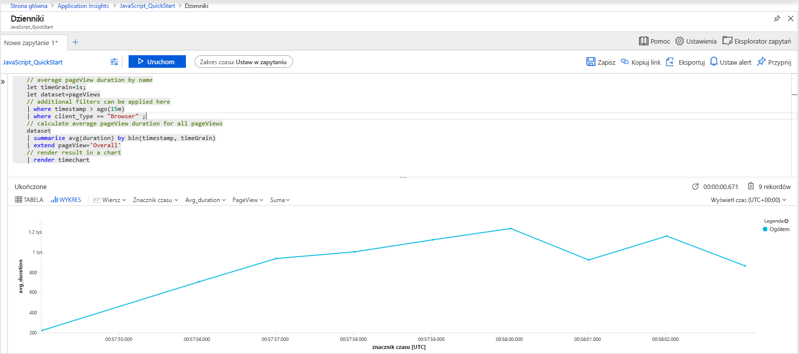
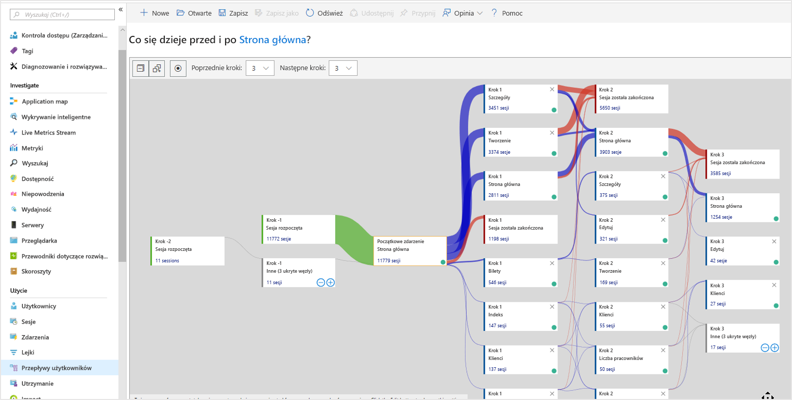

# <a name="quickstart-start-monitoring-your-website-with-azure-monitor-application-insights"></a>Szybki start: rozpoczynanie monitorowania witryny sieci Web za pomocą usługi Azure Monitor Application Insights

W tym przewodniku Szybki start nauczysz się dodawać sdk JavaScript usługi Open source Application Insights do witryny sieci Web. Dowiesz się również, jak lepiej zrozumieć doświadczenie klienta / przeglądarki dla odwiedzających Twoją witrynę.

Usługa Azure Monitor Application Insights umożliwia łatwe monitorowanie dostępności, wydajności i użycia witryny internetowej. Pozwala też szybko identyfikować i diagnozować błędy w aplikacji bez oczekiwania na zgłoszenie ich przez użytkownika. Usługa Application Insights zapewnia zarówno monitorowanie po stronie serwera, jak i funkcje monitorowania po stronie klienta/przeglądarki.

## <a name="prerequisites"></a>Wymagania wstępne

* Konto platformy Azure z aktywną subskrypcją. [Utwórz konto za darmo](https://azure.microsoft.com/free/?ref=microsoft.com&utm_source=microsoft.com&utm_medium=docs&utm_campaign=visualstudio).
* Witryna sieci Web, do której można dodać sdk JavaScript aplikacji Insights.

## <a name="enable-application-insights"></a>Włączanie usługi Application Insights

Usługa Application Insights umożliwia zbieranie danych telemetrycznych z dowolnej aplikacji połączonej z Internetem uruchomionej lokalnie lub w chmurze. Aby rozpocząć wyświetlanie tych danych, wykonaj poniższe czynności.

1. Zaloguj się do [Portalu Azure](https://portal.azure.com/).
2. Wybierz pozycję Tworzenie > **narzędzi do** > zarządzania **zasobami****Usługi Application Insights**.

   > [!NOTE]
   >Jeśli jest to pierwszy raz tworzenia zasobu usługi Application Insights można dowiedzieć się więcej, odwiedzając [tworzenie zasobów usługi Application Insights](https://docs.microsoft.com/azure/azure-monitor/app/create-new-resource) artykułu.

   Zostanie wyświetlone okno konfiguracji. Wypełnij pola wejściowe, używając poniższej tabeli.

    | Ustawienia        | Wartość           | Opis  |
   | ------------- |:-------------|:-----|
   | **Nazwa**      | Wartość unikatowa w skali globalnej | Nazwa identyfikująca monitorowana aplikacja |
   | **Grupa zasobów**     | myResourceGroup      | Nazwa nowej grupy zasobów do hosta danych usługi Application Insights. istnieje możliwość utworzenia nowej lub użycia istniejącej grupy zasobów. |
   | **Lokalizacja** | Wschodnie stany USA | Wybierz lokalizację w pobliżu Ciebie lub w pobliżu miejsca hostowania aplikacji |

3. Kliknij przycisk **Utwórz**.

## <a name="create-an-html-file"></a>Tworzenie pliku HTML

1. Na komputerze lokalnym utwórz plik o nazwie ``hello_world.html``. W tym przykładzie plik zostanie umieszczony w folderze głównym dysku C: w ścieżce ``C:\hello_world.html``.
2. Skopiuj poniższy skrypt do pliku ``hello_world.html``:

    ```html
    <!DOCTYPE html>
    <html>
    <head>
    <title>Azure Monitor Application Insights</title>
    </head>
    <body>
    <h1>Azure Monitor Application Insights Hello World!</h1>
    <p>You can use the Application Insights JavaScript SDK to perform client/browser-side monitoring of your website. To learn about more advanced JavaScript SDK configurations visit the <a href="https://github.com/Microsoft/ApplicationInsights-JS/blob/master/API-reference.md" title="API Reference">API reference</a>.</p>
    </body>
    </html>
    ```

## <a name="configure-application-insights-sdk"></a>Konfigurowanie sdk usługi Application Insights

1. Wybierz **opcję Przegląd** > **Podstawowe** > skopiuj **klucz instrumentacji**aplikacji .

   

2. Dodaj następujący skrypt do Twojego pliku ``hello_world.html`` przed tagiem zamykającym ``</head>``:

   ```javascript
   <script type="text/javascript">
      var sdkInstance="appInsightsSDK";window[sdkInstance]="appInsights";var aiName=window[sdkInstance],aisdk=window[aiName]||function(e){function n(e){t[e]=function(){var n=arguments;t.queue.push(function(){t[e].apply(t,n)})}}var t={config:e};t.initialize=!0;var i=document,a=window;setTimeout(function(){var n=i.createElement("script");n.src=e.url||"https://az416426.vo.msecnd.net/scripts/b/ai.2.min.js",i.getElementsByTagName("script")[0].parentNode.appendChild(n)});try{t.cookie=i.cookie}catch(e){}t.queue=[],t.version=2;for(var r=["Event","PageView","Exception","Trace","DependencyData","Metric","PageViewPerformance"];r.length;)n("track"+r.pop());n("startTrackPage"),n("stopTrackPage");var s="Track"+r[0];if(n("start"+s),n("stop"+s),n("setAuthenticatedUserContext"),n("clearAuthenticatedUserContext"),n("flush"),!(!0===e.disableExceptionTracking||e.extensionConfig&&e.extensionConfig.ApplicationInsightsAnalytics&&!0===e.extensionConfig.ApplicationInsightsAnalytics.disableExceptionTracking)){n("_"+(r="onerror"));var o=a[r];a[r]=function(e,n,i,a,s){var c=o&&o(e,n,i,a,s);return!0!==c&&t["_"+r]({message:e,url:n,lineNumber:i,columnNumber:a,error:s}),c},e.autoExceptionInstrumented=!0}return t}(
      {
         instrumentationKey:"INSTRUMENTATION_KEY"
      }
      );window[aiName]=aisdk,aisdk.queue&&0===aisdk.queue.length&&aisdk.trackPageView({});
   </script>
   ```

3. Edytuj plik ``hello_world.html`` i dodaj swój klucz instrumentacji.

4. Otwórz plik ``hello_world.html`` w lokalnej sesji przeglądarki. Ta akcja tworzy pojedynczy odsłonę strony. Możesz odświeżyć przeglądarkę, aby wygenerować wiele wyświetleń strony testu.

## <a name="start-monitoring-in-the-azure-portal"></a>Rozpoczynanie monitorowania w witrynie Azure Portal

1. Teraz można ponownie otworzyć stronę **Przegląd usługi** Application Insights w witrynie Azure Portal, aby wyświetlić szczegółowe informacje o aktualnie uruchomionej aplikacji. Na stronie **Przegląd** znajduje się klucz instrumentacji. Cztery domyślne wykresy na stronie przeglądu są ograniczone do danych aplikacji po stronie serwera. Ponieważ instrumentujemy interakcje po stronie klienta/przeglądarki z zestawem JavaScript SDK, ten konkretny widok nie ma zastosowania, chyba że mamy również zainstalowany zestaw SDK po stronie serwera.

2. Kliknij pozycję  **Analiza**.  Ta akcja otwiera **Analytics**, który zapewnia bogaty język zapytań do analizowania wszystkich danych zebranych przez usługa Application Insights. Aby wyświetlić dane dotyczące żądania przeglądarki po stronie klienta, uruchom następujące zapytanie:

    ```kusto
    // average pageView duration by name
    let timeGrain=1s;
    let dataset=pageViews
    // additional filters can be applied here
    | where timestamp > ago(15m)
    | where client_Type == "Browser" ;
    // calculate average pageView duration for all pageViews
    dataset
    | summarize avg(duration) by bin(timestamp, timeGrain)
    | extend pageView='Overall'
    // render result in a chart
    | render timechart
    ```

   

3. Wróć do strony **Przegląd**. Kliknij pozycję **Przeglądarka** z obszaru nagłówka **Zbadaj**, a następnie wybierz pozycję **Wydajność**, gdzie znajdziesz metryki związane z wydajnością własnej witryny internetowej. Istnieje również odpowiedni widok do analizowania błędów i wyjątków w witrynie. Możesz kliknąć pozycję **Przykłady**, aby przejść do szczegółowych danych poszczególnych transakcji. Z tego miejsca możesz uzyskać dostęp do środowiska [całościowych szczegółów transakcji](../../azure-monitor/app/transaction-diagnostics.md).

   

4. Aby rozpocząć eksplorację [narzędzi analizy zachowania użytkownika](../../azure-monitor/app/usage-overview.md), wybierz z menu głównego usługi Application Insights pozycję [**Użytkownicy**](../../azure-monitor/app/usage-segmentation.md) w obszarze nagłówka **Użycie**. Ponieważ testujemy z jednego komputera, zobaczymy tylko dane dla jednego użytkownika. W przypadku witryny internetowej na żywo dystrybucja użytkowników może wyglądać w następujący sposób:

     

5. Jeśli użyliśmy instrumentacji dla bardziej złożonej witryny internetowej z wieloma stronami, innym przydatnym narzędziem są [**Przepływy użytkownika**](../../azure-monitor/app/usage-flows.md). Za pomocą narzędzia **Przepływy użytkownika** możesz śledzić ścieżki, po których poruszają się odwiedzający między różnymi częściami Twojej witryny internetowej.

   

Aby zapoznać się z bardziej zaawansowanymi konfiguracjami do monitorowania witryn internetowych, zobacz [dokumentacja interfejsu API zestawu SDK języka JavaScript](https://github.com/Microsoft/ApplicationInsights-JS/blob/master/API-reference.md).

## <a name="clean-up-resources"></a>Oczyszczanie zasobów

Jeśli planujesz kontynuować pracę z dodatkowymi przewodnikami Szybki start lub z samouczkami, nie czyścić zasobów utworzonych w tym przewodniku Szybki start. W przeciwnym razie jeśli nie planujesz kontynuować, użyj następujących kroków, aby usunąć wszystkie zasoby utworzone przez ten szybki start w witrynie Azure portal.

> [!NOTE]
> Jeśli użyto istniejącej grupy zasobów, poniższe instrukcje nie będą działać i trzeba będzie po prostu usunąć pojedynczy zasób usługi Application Insights. Pamiętaj, że w każdej chwili usuniesz grupę zasobów, wszystkie zasoby, które są członkami tej grupy, zostaną usunięte.

1. W menu po lewej stronie w witrynie Azure portal kliknij pozycję **Grupy zasobów**, a następnie kliknij **pozycję myResourceGroup** lub nazwę tymczasowej grupy zasobów.
2. Na stronie grupy zasobów kliknij pozycję **Usuń**, wpisz **myResourceGroup** w polu tekstowym, a następnie kliknij pozycję **Usuń**.

## <a name="next-steps"></a>Następne kroki

> [!div class="nextstepaction"]
> [Wyszukiwanie i diagnozowanie problemów z wydajnością](https://docs.microsoft.com/azure/application-insights/app-insights-analytics)
