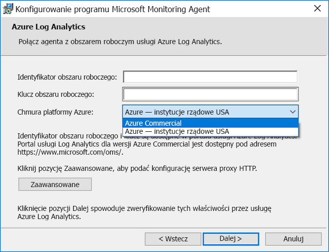
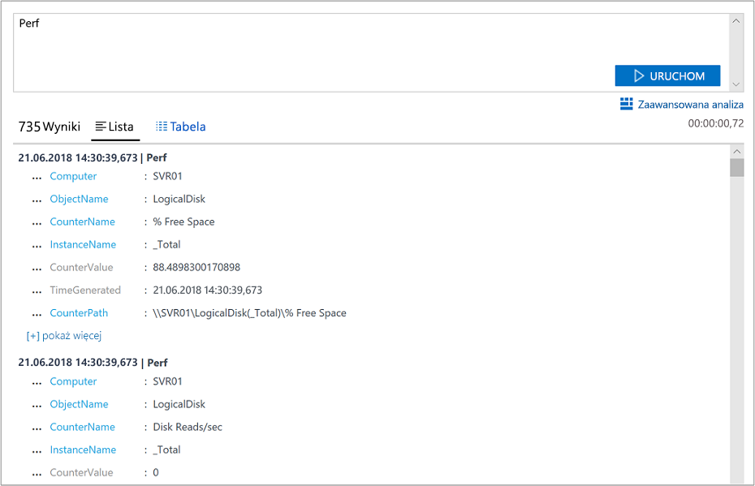

# Zbieranie danych z komputera z systemem Windows w środowisku hybrydowym z Azure Monitor

[Azure monitor](../overview.md) może zbierać dane bezpośrednio z Twoich fizycznych lub wirtualnych komputerów z systemem Windows w środowisku do log Analytics obszaru roboczego w celu uzyskania szczegółowej analizy i korelacji. Zainstalowanie [agenta log Analytics](../platform/log-analytics-agent.md) pozwala Azure monitor zbierać dane z centrum danych lub innego środowiska chmury. W tym przewodniku Szybki start opisano, jak w kilku prostych krokach skonfigurować i rozpocząć zbieranie danych z komputera z systemem Windows. Aby uzyskać informacje o maszynach wirtualnych z systemem Windows Azure, zobacz [zbieranie danych o maszynach wirtualnych platformy Azure](./quick-collect-azurevm.md).  

Aby zrozumieć obsługiwaną konfigurację, zobacz [obsługiwane systemy operacyjne](../platform/agents-overview.md#supported-operating-systems) i [Konfiguracja zapory sieciowej](../platform/log-analytics-agent.md#network-requirements).
 
Jeśli nie masz subskrypcji platformy Azure, przed rozpoczęciem utwórz [bezpłatne konto](https://azure.microsoft.com/free/?WT.mc_id=A261C142F).

## Logowanie do witryny Azure Portal

Zaloguj się do witryny Azure Portal pod adresem [https://portal.azure.com](https://portal.azure.com). 

## Tworzenie obszaru roboczego

1. W Azure Portal wybierz pozycję **wszystkie usługi**. Na liście zasobów wpisz **Log Analytics**. Po rozpoczęciu pisania zawartość listy jest filtrowana w oparciu o wpisywane dane. Wybierz **log Analytics obszary robocze**.

       

2. Wybierz pozycję **Utwórz**, a następnie wybierz opcje dla następujących elementów:

   * Podaj nazwę nowego **obszaru roboczego log Analytics**, na przykład *DefaultLAWorkspace*.  
   * Wybierz **Subskrypcję** do połączenia poprzez wybór subskrypcji z listy rozwijanej, jeśli domyślnie wybrana subskrypcja jest niewłaściwa.
   * W obszarze **Grupa zasobów** wybierz istniejącą grupę zasobów, która zawiera co najmniej jedną maszynę wirtualną platformy Azure.  
   * W polu **Lokalizacja** wybierz lokalizację, w której wdrożono maszyny wirtualne.  Aby uzyskać dodatkowe informacje, sprawdź, w których [regionach jest dostępna usługa Log Analytics](https://azure.microsoft.com/regions/services/).
   * W przypadku tworzenia obszaru roboczego w nowej subskrypcji utworzonej po 2 kwietnia 2018 r. zostanie automatycznie użyty plan cenowy *Na GB*, a opcja wyboru warstwy cenowej będzie niedostępna.  W przypadku tworzenia obszaru roboczego dla istniejącej subskrypcji utworzonej przed 2 kwietnia lub dla subskrypcji powiązanej z istniejącą rejestracją umowy EA wybierz preferowaną warstwę cenową.  Aby uzyskać dodatkowe informacje dotyczące konkretnej warstwy, zobacz [Log Analytics — cennik](https://azure.microsoft.com/pricing/details/log-analytics/).
  
         

3. Po podania wymaganych informacji w okienku **obszaru roboczego log Analytics** wybierz pozycję **OK**.  

Podczas weryfikowania informacji i tworzenia obszaru roboczego możesz śledzić postęp w sekcji **Powiadomienia** z poziomu menu. 

## Pobierz identyfikator i klucz obszaru roboczego

Przed zainstalowaniem agenta Log Analytics dla systemu Windows (nazywanego również Microsoft Monitoring Agent (MMA)) potrzebny jest identyfikator i klucz obszaru roboczego dla obszaru roboczego Log Analytics. Kreator instalacji potrzebuje tych informacji, aby prawidłowo skonfigurować agenta i upewnić się, że może komunikować się z Azure Monitor.  

1. W lewym górnym rogu Azure Portal wybierz pozycję **wszystkie usługi**. W polu wyszukiwania wprowadź **log Analytics**. Podczas wpisywania lista jest filtrowana na podstawie danych wejściowych. Wybierz **log Analytics obszary robocze**.

2. Na liście obszarów roboczych Log Analytics wybierz utworzony wcześniej obszar roboczy. (Może być nazwany IT **DefaultLAWorkspace**).

3. Wybierz pozycję **Ustawienia zaawansowane**:

    
  
4. Wybierz **Połączone źródła**, a następnie **Serwery Windows**.

5. Skopiuj wartości z prawej strony **Identyfikator obszaru roboczego** i **klucz podstawowy**. Wklej je do ulubionego edytora.

## Instalacja agenta dla systemu Windows

Poniższe kroki instalują i konfigurują agenta dla Log Analytics na platformie Azure i Azure Government. Użyjesz Microsoft Monitoring Agent Instalatora, aby zainstalować agenta na komputerze.

1. Kontynuując poprzedni zestaw kroków, na stronie serwery z **systemem Windows** wybierz wersję **agenta pobierania systemu Windows** , którą chcesz pobrać. Wybierz odpowiednią wersję architektury procesora systemu operacyjnego Windows.

2. Uruchom Instalatora, aby zainstalować agenta na komputerze.

3. Na **stronie powitalnej** wybierz pozycję **Dalej**.

4. Na stronie **Postanowienia licencyjne** zapoznaj się z postanowieniami licencyjnymi, a następnie wybierz pozycję **Zgadzam się**.

5. Na stronie **Folder docelowy** zmień lub pozostaw domyślny folder instalacji, a następnie wybierz pozycję **Dalej**.

6. Na stronie **Opcje instalacji agenta** Połącz agenta z usługą Azure log Analytics a następnie wybierz przycisk **dalej**.

7. Na stronie **log Analytics platformy Azure** wykonaj następujące czynności:

   1. Wklej wcześniej skopiowany **Identyfikator obszaru roboczego** i **klucz obszaru roboczego (klucz podstawowy)** . Jeśli komputer powinien raportować do obszaru roboczego Log Analytics w Azure Government, wybierz pozycję **Azure USA** na liście w **chmurze platformy Azure** .  
   2. Jeśli komputer musi komunikować się z usługą Log Analytics za pośrednictwem serwera proxy, wybierz pozycję **Zaawansowane** i podaj adres URL i numer portu serwera proxy. Jeśli serwer proxy wymaga uwierzytelnienia, wprowadź nazwę użytkownika i hasło do uwierzytelniania za pomocą serwera proxy, a następnie wybierz przycisk **dalej**.  

8. Po dodaniu ustawień konfiguracji wybierz pozycję **dalej** :

    

9. Na stronie **Gotowe do zainstalowania** przejrzyj wybrane opcje, a następnie wybierz pozycję **Zainstaluj**.

10. Na stronie **Konfiguracja została ukończona pomyślnie** wybierz pozycję **Zakończ**.

Po zakończeniu instalacji i instalacji Microsoft Monitoring Agent pojawia się w panelu sterowania. Możesz przejrzeć konfigurację i sprawdzić, czy Agent jest połączony z obszarem roboczym Log Analytics. Po nawiązaniu połączenia na karcie **log Analytics Azure** Agent wyświetli następujący komunikat: **Microsoft Monitoring Agent pomyślnie nawiązał połączenie z usługą Microsoft log Analytics.**   

## Zbieranie danych zdarzeń i wydajności

Azure Monitor może zbierać zdarzenia określone z dzienników zdarzeń systemu Windows i liczników wydajności w celu przeprowadzenia analizy i raportowania w dłuższym czasie. Może również podejmować działania po wykryciu określonego warunku. Wykonaj następujące kroki, aby skonfigurować zbieranie zdarzeń z dziennika zdarzeń systemu Windows oraz, na początek, z kilku typowych liczników wydajności.  

1. W lewym dolnym rogu Azure Portal wybierz pozycję **więcej usług**. W polu wyszukiwania wprowadź **log Analytics**. Podczas wpisywania lista jest filtrowana na podstawie danych wejściowych. Wybierz **log Analytics obszary robocze**.

2. Wybierz pozycję **Ustawienia zaawansowane**:

    
 
3. Wybierz pozycję **Dane**, a następnie pozycję **Dzienniki zdarzeń systemu Windows**.  

4. Dodaj dziennik zdarzeń, wprowadzając nazwę dziennika. Wprowadź **system**, a następnie wybierz znak plus ( **+** ).  

5. W tabeli wybierz **Błędy** i **ostrzeżenia** .

6. Wybierz pozycję **Zapisz** w górnej części strony.

7. Wybierz pozycję **Liczniki wydajności systemu Windows**, aby włączyć zbieranie liczników wydajności na komputerze z systemem Windows.

8. Podczas pierwszej konfiguracji liczników wydajności systemu Windows dla nowego obszaru roboczego Log Analytics można szybko utworzyć kilka typowych liczników. Każda opcja jest wyświetlana obok pola wyboru:

    .
    
    Wybierz pozycję **Dodaj wybrane liczniki wydajności**. Liczniki są dodawane i wstępnie ustawione z dziesięciu-sekundowym interwałem próbkowania kolekcji.

9. Wybierz pozycję **Zapisz** w górnej części strony.

## Wyświetlanie zebranych danych

Teraz, po włączeniu zbierania danych, uruchom proste wyszukiwanie w dzienniku, aby wyświetlić dane z komputera docelowego.  

1. W wybranym obszarze roboczym w okienku po lewej stronie wybierz pozycję **dzienniki**.

2. Na stronie kwerendy dzienników wpisz `Perf` w edytorze zapytań i wybierz polecenie **Uruchom**.
 
    

    Na przykład zapytanie na tym obrazie zwróciło 10 000 rekordów wydajności. W Twoim przypadku wyników będzie znacznie mniej.

    

## Czyszczenie zasobów

Można usunąć agenta z komputera i usunąć obszar roboczy Log Analytics, jeśli nie są już potrzebne.  

Aby usunąć agenta, wykonaj następujące kroki:

1. Otwórz Panel sterowania.

2. Otwórz aplet **Programy i funkcje**.

3. W obszarze **programy i funkcje**wybierz pozycję **Microsoft Monitoring Agent** a następnie wybierz pozycję **Odinstaluj**.

Aby usunąć utworzony wcześniej obszar roboczy Log Analytics, zaznacz go, a następnie na stronie zasób wybierz pozycję **Usuń**:

## Następne kroki

Teraz, gdy zbierasz dane operacyjne i wydajności z komputera z systemem Windows, możesz łatwo rozpocząć Eksplorowanie, analizowanie i *działanie na zbieranych danych.*  

Aby dowiedzieć się, jak wyświetlać i analizować dane, przejdź do samouczka:

> [!div class="nextstepaction"]
> [Wyświetlanie i analizowanie danych w usłudze Log Analytics](../log-query/get-started-portal.md)

