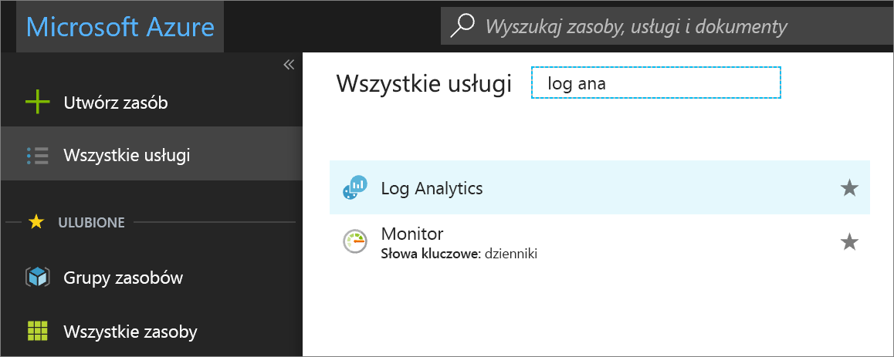
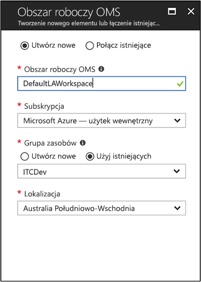
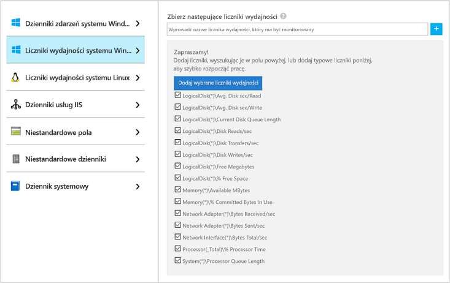

# Konfigurowanie agenta usługi Log Analytics dla komputerów Windows w środowisku hybrydowym
[Usługa Azure Log Analytics](../../azure-monitor/platform/agent-windows.md) umożliwia zbieranie danych bezpośrednio z fizycznych i wirtualnych komputerów Windows do pojedynczego repozytorium na potrzeby szczegółowej analizy i korelacji. Usługa log Analytics może zbierać dane z centrum danych lub w innym środowisku chmury. W tym przewodniku Szybki start opisano, jak w kilku prostych krokach skonfigurować i rozpocząć zbieranie danych z komputera z systemem Windows.  Aby uzyskać informacje o maszynach wirtualnych Windows Azure, zobacz [zbierać dane dotyczące maszyn wirtualnych platformy Azure](../../azure-monitor/learn/quick-collect-azurevm.md).  

Informacje o obsługiwanych konfiguracji znajdziesz [Windows obsługiwanych systemów operacyjnych](../../azure-monitor/platform/log-analytics-agent.md#supported-windows-operating-systems) i [konfiguracja zapory sieciowej](../../azure-monitor/platform/log-analytics-agent.md#network-firewall-requirements).
 
Jeśli nie masz subskrypcji platformy Azure, przed rozpoczęciem utwórz [bezpłatne konto](https://azure.microsoft.com/free/?WT.mc_id=A261C142F).

## Logowanie się do witryny Azure Portal
Zaloguj się do witryny Azure Portal pod adresem [https://portal.azure.com](https://portal.azure.com).

## Tworzenie obszaru roboczego
1. W witrynie Azure Portal wybierz pozycję **Wszystkie usługi**. W polu wyszukiwania wprowadź **usługi Log Analytics**. Podczas wpisywania listy jest filtrowana w oparciu o wpisywane dane. Wybierz **Log Analytics**:

    
  
2. Wybierz **Utwórz**, a następnie podaj następujące szczegóły:

   * Wprowadź nazwę dla nowego **obszar roboczy usługi Log Analytics**. Podobnie **DefaultLAWorkspace**.
   * Wybierz **subskrypcji** się połączyć. Jeśli domyślnie nie jest tym, którego chcesz użyć, należy wybrać inny z listy.
   * Aby uzyskać **grupy zasobów**, wybierz istniejącą grupę zasobów, która zawiera jeden lub więcej maszyn wirtualnych platformy Azure.  
   * W polu **Lokalizacja** wybierz lokalizację, w której wdrożono maszyny wirtualne. W tym miejscu znajduje się lista [regionów, w których jest dostępna usługa Log Analytics](https://azure.microsoft.com/regions/services/).  
   * Jeśli tworzysz obszaru roboczego w ramach subskrypcji, który został utworzony po 2 kwietnia 2018 r., obszar roboczy zostanie automatycznie użyty **na GB** plan cenowy. Nie można wybrać warstwę cenową. Jeśli tworzysz obszaru roboczego w ramach subskrypcji, który został utworzony przed 2 kwietnia 2018 r. lub w ramach subskrypcji powiązanej z istniejącą rejestracją umowy EA, wybierz warstwę cenową, którego chcesz używać. Zobacz [usługi Log Analytics w szczegółach cennika](https://azure.microsoft.com/pricing/details/log-analytics/) uzyskać informacji o warstwach.

           

3. Po podaniu wymaganych informacji w **obszar roboczy usługi Log Analytics** okienku wybierz **OK**.  

Podczas weryfikowania informacji i utworzeniu obszaru roboczego, możesz śledzić postęp w obszarze **powiadomienia** w menu.

## Pobierz klucz i identyfikator obszaru roboczego
Przed zainstalowaniem programu Microsoft Monitoring Agent for Windows, potrzebne są identyfikator obszaru roboczego i klucz obszaru roboczego usługi Log Analytics. Kreator instalacji wymaga tych informacji w celu poprawnego skonfigurowania agenta i upewnij się, że będzie mogła komunikować się z usługą Log Analytics.  

1. W lewym górnym rogu witryny Azure portal wybierz **wszystkich usług**. W polu wyszukiwania wprowadź **usługi Log Analytics**. Podczas wpisywania listy jest filtrowana w oparciu o wpisywane dane. Wybierz pozycję **Log Analytics**.
2. Na liście obszarów roboczych usługi Log Analytics wybierz obszar roboczy, która została utworzona wcześniej. (Użytkownik może nazwał ją **DefaultLAWorkspace**.)
3. Wybierz **Zaawansowane ustawienia**:

    
  
4. Wybierz **Połączone źródła**, a następnie **Serwery Windows**.
5. Skopiuj wartości z prawej strony **identyfikator obszaru roboczego** i **klucz podstawowy**. Wklej je do ulubionego edytora.

## Instalacja agenta dla systemu Windows
Poniższe kroki Zainstaluj i skonfiguruj agenta usługi Log Analytics na platformie Azure i Azure dla instytucji rządowych. Użyjesz program Instalator programu Microsoft Monitoring Agent, aby zainstalować agenta na komputerze.

1. Z poprzedniego zestawu kroków, w ramach starań na rzecz **serwerów Windows** wybierz opcję **Pobierz agenta Windows** wersji, który chcesz pobrać. Wybierz odpowiednią wersję dla architektury procesora systemu operacyjnego Windows.
2. Uruchom Instalatora, aby zainstalować agenta na komputerze.
2. Na **stronie powitalnej** wybierz pozycję **Dalej**.
3. Na stronie **Postanowienia licencyjne** zapoznaj się z postanowieniami licencyjnymi, a następnie wybierz pozycję **Zgadzam się**.
4. Na stronie **Folder docelowy** zmień lub pozostaw domyślny folder instalacji, a następnie wybierz pozycję **Dalej**.
5. Na **opcje instalacji agenta** strony, Połącz agenta z usługą Azure Log Analytics, a następnie wybierz pozycję **dalej**.
6. Na **usługi Azure Log Analytics** strony, wykonaj następujące kroki:
   1. Wklej **identyfikator obszaru roboczego** i **klucz obszaru roboczego (klucz podstawowy)** skopiowany wcześniej. Jeśli komputer powinien wysyłać raporty do obszaru roboczego usługi Log Analytics na platformie Azure Government, wybierz opcję **dla administracji USA** w **w chmurze platformy Azure** listy.  
   2. Jeśli komputer musi komunikować się z usługą Log Analytics za pośrednictwem serwera proxy, wybierz pozycję **Zaawansowane** i podaj adres URL i numer portu serwera proxy. Jeśli Twój serwer proxy wymaga uwierzytelniania, wprowadź nazwę użytkownika i hasło do uwierzytelniania przy użyciu serwera proxy, a następnie wybierz **dalej**.  
7. Wybierz **dalej** po dodaniu ustawienia konfiguracji:

    

8. Na stronie **Gotowe do zainstalowania** przejrzyj wybrane opcje, a następnie wybierz pozycję **Zainstaluj**.
9. Na **konfiguracja została zakończona pomyślnie** wybierz opcję **Zakończ**.

Po zakończeniu instalacji i konfiguracji programu Microsoft Monitoring Agent zostanie wyświetlona w Panelu sterowania. Możesz przejrzeć konfigurację i sprawdzić, czy agent jest połączony z usługą Log Analytics. Po nawiązaniu połączenia na **usługi Azure Log Analytics** karcie agent wyświetla ten komunikat: **Usługa Microsoft Monitoring Agent pomyślnie nawiązała połączenie z usługą Microsoft Log Analytics.**   

## Zbieranie danych zdarzeń i wydajności
Log Analytics może zbierać zdarzenia, które określisz, od Windows dziennika zdarzeń i liczniki wydajności dla dłuższy okres analizy i raportowania. Można również wykonać akcję po wykryciu określonego warunku. Wykonaj następujące kroki, aby skonfigurować zbieranie zdarzeń z dziennika zdarzeń systemu Windows oraz, na początek, z kilku typowych liczników wydajności.  

1. W lewym dolnym rogu witryny Azure portal wybierz **więcej usług**. W polu wyszukiwania wprowadź **usługi Log Analytics**. Podczas wpisywania listy jest filtrowana w oparciu o wpisywane dane. Wybierz pozycję **Log Analytics**.
2. Wybierz **Zaawansowane ustawienia**:

    
 
3. Wybierz pozycję **Dane**, a następnie pozycję **Dzienniki zdarzeń systemu Windows**.  
4. Możesz dodać dziennik zdarzeń, wprowadzając nazwę dziennika. Wprowadź **systemu**, a następnie wybierz znak plus (**+**).  
5. W tabeli, wybierz **błąd** i **ostrzeżenie** ważności.
6. Wybierz **Zapisz** w górnej części strony.
7. Wybierz pozycję **Liczniki wydajności systemu Windows**, aby włączyć zbieranie liczników wydajności na komputerze z systemem Windows.
8. Podczas pierwszej konfiguracji liczników wydajności Windows dla nowego obszaru roboczego usługi Log Analytics, teraz skorzystać z opcji, aby szybko utworzyć kilka typowych liczników. Każda opcja jest wyświetlany na liście, pole wyboru obok niego:

    .
    
    Wybierz **Dodaj wybrane liczniki wydajności**. Liczniki są dodawane i ustawiane wstępnie z interwałem próbkowania kolekcji dziesięć sekund.

9. Wybierz **Zapisz** w górnej części strony.

## Przeglądanie zebranych danych
Teraz, zostało włączone zbieranie danych, uruchom przeszukiwania dzienników prosty, aby wyświetlić dane z komputera docelowego.  

1. W witrynie Azure portal w wybranym obszarze roboczym, wybierz **wyszukiwanie w dzienniku** kafelka.  
2. Na **wyszukiwanie w dzienniku** okienka w oknie zapytania wprowadź **wydajności** a następnie naciśnij klawisz Enter lub kliknij przycisk wyszukiwania z prawej strony pola zapytania:
 
    

    Na przykład zapytanie na tej ilustracji zwróciło 735 rekordów wydajności:

    

## Oczyszczanie zasobów
Można usunąć agenta z komputera i usunąć obszar roboczy usługi Log Analytics, jeśli ich nie są już potrzebne.  

Aby usunąć agenta, wykonaj następujące kroki:

1. Otwórz Panel sterowania.
2. Otwórz aplet **Programy i funkcje**.
3. W **programy i funkcje**, wybierz opcję **Microsoft Monitoring Agent** , a następnie wybierz **Odinstaluj**.

Aby usunąć obszar roboczy usługi Log Analytics została utworzona wcześniej, zaznacz go i, na stronie zasobów wybierz **Usuń**:

## Kolejne kroki
Teraz, kiedy są zbierane dane operacyjne i dane dotyczące wydajności z komputera Windows, możesz łatwo rozpocząć przeglądanie, analizowanie i działających na danych, należy zebrać, aby uzyskać *bezpłatne*.  

Aby dowiedzieć się, jak wyświetlać i analizować dane, przejdź do samouczka:

> [!div class="nextstepaction"]
> [Wyświetlanie i analizowanie danych w usłudze Log Analytics](tutorial-viewdata.md)
