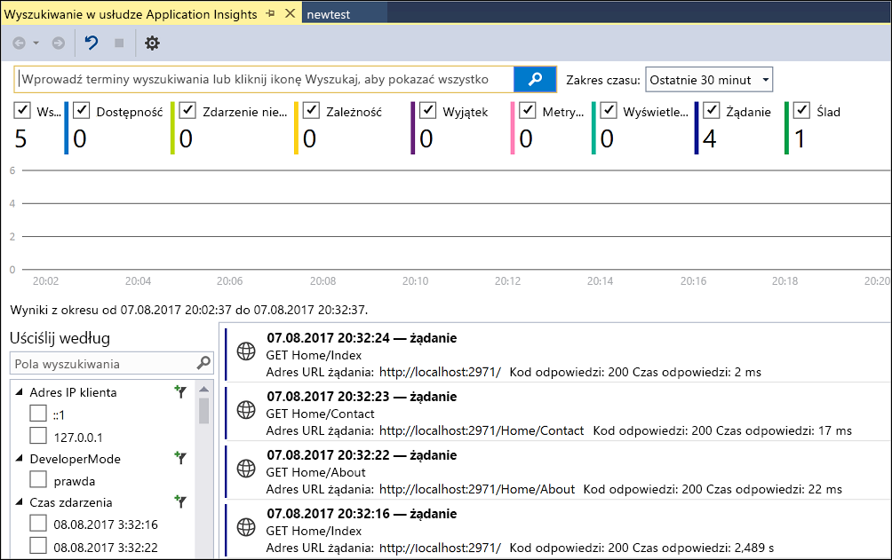
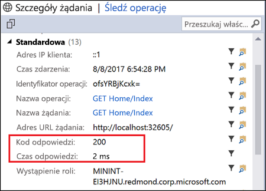

# <a name="start-monitoring-your-aspnet-web-application"></a>Rozpoczynanie monitorowania aplikacji internetowej ASP.NET

Usługa Azure Application Insights umożliwia łatwe monitorowanie dostępności, wydajności i użycia aplikacji internetowej.  Pozwala też szybko identyfikować i diagnozować błędy w aplikacji bez oczekiwania na zgłoszenie ich przez użytkownika.  Dzięki uzyskiwanym za pomocą usługi Application Insights informacjom o wydajności i efektywności aplikacji można dokonywać świadomych wyborów dotyczących konserwacji i udoskonalania aplikacji.

W tym przewodniku Szybki start pokazano, jak dodać usługę Application Insights do istniejącej aplikacji internetowej ASP.NET i rozpocząć korzystanie z jednej z wielu metod analizowania aplikacji — badania statystyk udostępnianych na żywo. Jeśli nie masz aplikacji sieci Web ASP.NET, możesz ją utworzyć za pomocą [przewodnika Szybki Start dotyczącego tworzenia aplikacji sieci web ASP.NET](../../app-service/app-service-web-get-started-dotnet-framework.md).

## <a name="prerequisites"></a>Wymagania wstępne
Aby ukończyć ten przewodnik Szybki Start:

- Zainstaluj [program Visual Studio 2019](https://www.visualstudio.com/downloads/) z następującymi obciążeniami:
    - Tworzenie aplikacji na platformie ASP.NET i aplikacji internetowych
    - Tworzenie aplikacji na platformie Azure


Jeśli nie masz subskrypcji platformy Azure, przed rozpoczęciem utwórz [bezpłatne](https://azure.microsoft.com/free/) konto.

## <a name="enable-application-insights"></a>Włączanie usługi Application Insights

1. Otwórz projekt w programie Visual Studio 2019.
2. Wybierz pozycję **Konfiguruj usługę Application Insights** z menu Projekt. Program Visual Studio doda zestaw SDK usługi Application Insights do aplikacji.

    > [!IMPORTANT]
    > Proces dodawania usługi Application Insights różni się w zależności od typu szablonu platformy ASP.NET. Jeśli używasz szablonu **Pusty** lub **Aplikacja mobilna platformy Azure**, wybierz pozycję **Projekt** > **Dodaj Telemetrię usługi Application Insights**. W przypadku wszystkich pozostałych szablonów platformy ASP.NET zapoznaj się z instrukcjami w powyższym kroku. 

3. Kliknij przycisk **Rozpocznij pracę** (w starszych wersjach programu Visual Studio zamiast tego przycisku znajduje się przycisk **Rozpocznij bezpłatnie**).

    

4. Wybierz swoją subskrypcję i kliknij przycisk **Zarejestruj**.

5. Wybierz **projekt** > **zarządzać pakietami NuGet** > **Źródło pakietów: nuget.org** > **zaktualizować** pakiety SDK Application Insights do najnowszej wersji.

6. Uruchom aplikację, wybierając pozycję **Rozpocznij debugowanie** z menu **Debuguj** lub naciskając klawisz F5.

## <a name="confirm-app-configuration"></a>Potwierdzanie konfiguracji aplikacji

Usługa Application Insights zbiera dane telemetryczne aplikacji niezależnie od tego, gdzie jest ona uruchomiona. Aby rozpocząć wyświetlanie tych danych, wykonaj poniższe czynności.

1. Otwórz usługę Application Insights, klikając pozycję **Widok** -> **Inne okna** -> **Wyszukiwanie usługi Application Insights**.  Pojawią się dane telemetryczne z bieżącej sesji.<BR><br>

2. Kliknij pierwsze żądanie na liście (w tym przykładzie GET Home/Index), aby wyświetlić jego szczegóły. Zwróć uwagę, że są widoczne kod stanu i czas odpowiedzi, a także inne cenne informacje dotyczące żądania.<br><br>

## <a name="start-monitoring-in-the-azure-portal"></a>Rozpoczynanie monitorowania w witrynie Azure Portal

Możesz teraz otworzyć usługę Application Insights w witrynie Azure Portal i wyświetlić różne szczegółowe informacje o uruchomionej aplikacji.

1. Rozwiń folder **usługi połączone** (ikona chmury i wtyczki) w Eksplorator rozwiązań następnie kliknij prawym przyciskiem myszy folder **Application Insights** i kliknij polecenie **Otwórz Portal Application Insights**.  Pojawią się wybrane informacje o aplikacji i różne opcje.

    

2. Kliknij pozycję **Mapa aplikacji**, aby uzyskać wizualny układ relacji zależności między składnikami aplikacji.  Każdy składnik przedstawia kluczowe wskaźniki wydajności, takie jak obciążenie, wydajność, błędy i alerty.

    

3. Kliknij ikonę **Analiza aplikacji**  **Widok w dziennikach (analiza)** na jednym ze składników aplikacji. Spowoduje to otwarcie **dzienników (analiza)** , który oferuje bogaty język zapytań umożliwiający analizowanie wszystkich danych zebranych przez Application Insights. W tym przypadku jest generowane zapytanie, które renderuje liczbę żądań w formie wykresu. Możesz pisać własne zapytania do analizy innych danych.

    

4. Kliknij **Live Metrics Stream** po lewej stronie w obszarze Zbadaj. Spowoduje to wyświetlenie danych statystycznych dotyczących uruchomionej aplikacji. Dane te obejmują informacje dotyczące liczby żądań przychodzących, czasu trwania tych żądań i błędów. Można też sprawdzić krytyczne metryki wydajności, takie jak wydajność procesora i pamięci.

    

    Jeśli wszystko jest gotowe do hostowania aplikacji na platformie Azure, można opublikować aplikację. Wykonaj instrukcje opisane w artykule [Create an ASP.NET Web App Quickstart (Przewodnik Szybki Start dotyczący tworzenia aplikacji internetowej ASP.NET)](../../app-service/app-service-web-get-started-dotnet.md#update-the-app-and-redeploy).

5. Jeśli dodajesz monitorowanie w usłudze Application Insights za pomocą programu Visual Studio, możesz automatycznie dodać monitorowanie po stronie klienta. Aby ręcznie dodać do aplikacji monitorowanie po stronie klienta, dodaj do niej następujący kod JavaScript:

```html
<!-- 
To collect user behavior analytics about your application, 
insert the following script into each page you want to track.
Place this code immediately before the closing </head> tag,
and before any other scripts. Your first data will appear 
automatically in just a few seconds.
-->
<script type="text/javascript">
var appInsights=window.appInsights||function(a){
  function b(a){c[a]=function(){var b=arguments;c.queue.push(function(){c[a].apply(c,b)})}}var c={config:a},d=document,e=window;setTimeout(function(){var b=d.createElement("script");b.src=a.url||"https://az416426.vo.msecnd.net/scripts/a/ai.0.js",d.getElementsByTagName("script")[0].parentNode.appendChild(b)});try{c.cookie=d.cookie}catch(a){}c.queue=[];for(var f=["Event","Exception","Metric","PageView","Trace","Dependency"];f.length;)b("track"+f.pop());if(b("setAuthenticatedUserContext"),b("clearAuthenticatedUserContext"),b("startTrackEvent"),b("stopTrackEvent"),b("startTrackPage"),b("stopTrackPage"),b("flush"),!a.disableExceptionTracking){f="onerror",b("_"+f);var g=e[f];e[f]=function(a,b,d,e,h){var i=g&&g(a,b,d,e,h);return!0!==i&&c["_"+f](a,b,d,e,h),i}}return c
  }({
      instrumentationKey:"<your instrumentation key>"
  });

window.appInsights=appInsights,appInsights.queue&&0===appInsights.queue.length&&appInsights.trackPageView();
</script>
```

Aby dowiedzieć się więcej, odwiedź repozytorium GitHub [naszego zestawu SDK typu open-source dla języka JavaScript](https://github.com/Microsoft/ApplicationInsights-JS).

## <a name="video"></a>Wideo

* Zewnętrzne wideo krok po kroku dotyczące [konfigurowania Application Insights z użyciem aplikacji .NET od podstaw](https://www.youtube.com/watch?v=blnGAVgMAfA).

## <a name="clean-up-resources"></a>Oczyszczanie zasobów
Po zakończeniu testowania można usunąć grupę zasobów i wszystkie powiązane zasoby. W tym celu wykonaj poniższe kroki.
1. W menu znajdującym się po lewej stronie w witrynie Azure Portal kliknij pozycję **Grupy zasobów**, a następnie kliknij pozycję **myResourceGroup**.
2. Na stronie grupy zasobów kliknij pozycję **Usuń**, wpisz w polu tekstowym nazwę **myResourceGroup**, a następnie kliknij pozycję **Usuń**.

## <a name="next-steps"></a>Następne kroki
W tym przewodniku szybki start włączono aplikację do monitorowania za pomocą usługi Azure Application Insights.  Przejdź do kolejnych samouczków, aby dowiedzieć się, jak użyć tej usługi do monitorowania statystyk i wykrywania problemów w aplikacji.

> [!div class="nextstepaction"]
> [Samouczki dotyczące usługi Azure Application Insights](tutorial-runtime-exceptions.md)
