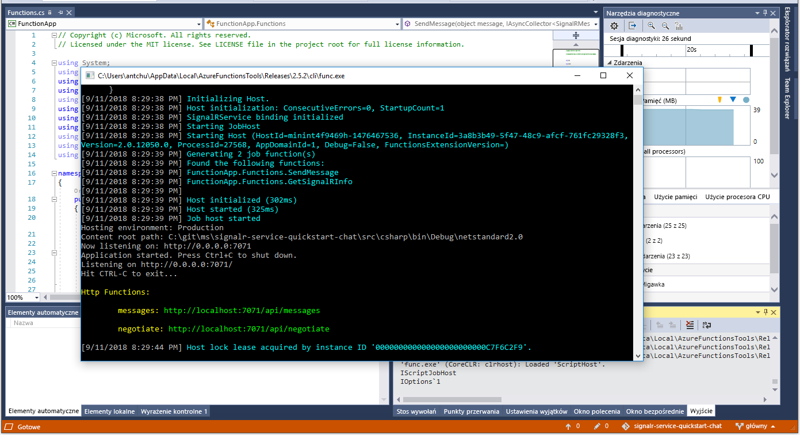

# Szybki start: tworzenie pokoju rozmów za pomocą usług Azure Functions i SignalR Service oraz przy użyciu języka C#

Usługa Azure SignalR Service umożliwia łatwe dodawanie funkcji czasu rzeczywistego do aplikacji. Usługa Azure Functions to bezserwerowa platforma, która pozwala uruchamiać kod bez zarządzania jakąkolwiek infrastrukturą. W tym przewodniku Szybki start dowiesz się, jak utworzyć bezserwerową aplikację czatu w czasie rzeczywistym za pomocą usług SignalR Service i Functions.

## Wymagania wstępne

Jeśli nie masz jeszcze zainstalowanego programu Visual Studio 2017, możesz pobrać program [Visual Studio 2017 Community Edition](https://www.visualstudio.com/downloads/) i używać go **bezpłatnie**. Podczas instalacji programu Visual Studio upewnij się, że jest włączona opcja **Programowanie na platformie Azure**.

[!INCLUDE [quickstarts-free-trial-note](../../includes/quickstarts-free-trial-note.md)]

## Zaloguj się do platformy Azure.

Zaloguj się do witryny Azure Portal pod adresem <https://portal.azure.com/> przy użyciu danych konta Azure.

[!INCLUDE [Create instance](includes/signalr-quickstart-create-instance.md)]

[!INCLUDE [Clone application](includes/signalr-quickstart-clone-application.md)]

## Konfigurowanie i uruchamianie aplikacji funkcji platformy Azure

1. Uruchom program Visual Studio i otwórz rozwiązanie w folderze *chat\src\csharp* sklonowanego repozytorium.

1. W przeglądarce z otwartą witryną Azure Portal potwierdź, że wdrożone wcześniej wystąpienie usługi SignalR Service zostało pomyślnie utworzone, wyszukując jego nazwę w polu wyszukiwania w górnej części witryny. Wybierz wystąpienie, aby je otworzyć.

    

1. Wybierz pozycję **Klucze**, aby wyświetlić parametry połączenia dla wystąpienia usługi SignalR Service.

1. Zaznacz i skopiuj podstawowe parametry połączenia.

1. W programie Visual Studio w Eksploratorze rozwiązań zmień nazwę pliku *local.settings.sample.json* na *local.settings.json*.

1. W pliku **local.settings.json** wklej parametry połączenia jako wartość ustawienia **AzureSignalRConnectionString**. Zapisz plik.

1. Otwórz plik **Functions.cs**. W tej aplikacji funkcji znajdują się dwie funkcje wyzwalane przez protokół HTTP:

    - **GetSignalRInfo** — ta funkcja generuje i zwraca informacje o prawidłowym połączeniu przy użyciu danych wejściowych powiązania *SignalRConnectionInfo*.
    - **SendMessage** — ta funkcja otrzymuje wiadomość rozmowy w treści żądania i używa powiązania danych wyjściowych usługi *SignalR* do rozpowszechnienia komunikatu do wszystkich połączonych aplikacji klienckich.

1. W menu **Debugowanie** wybierz pozycję **Rozpocznij debugowanie**, aby uruchomić aplikację.

    

[!INCLUDE [Run web application](includes/signalr-quickstart-run-web-application.md)]

[!INCLUDE [Cleanup](includes/signalr-quickstart-cleanup.md)]

## Następne kroki

W tym przewodniku Szybki start utworzono i uruchomiono bezserwerową aplikację czasu rzeczywistego w programie VS Code. Teraz dowiedz się więcej o sposobie wdrażania usługi Azure Functions z programu VS Code.

> [!div class="nextstepaction"]
> [Wdrażanie usługi Azure Functions za pomocą programu VS Code](https://code.visualstudio.com/tutorials/functions-extension/getting-started)