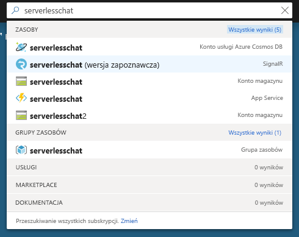

# <a name="quickstart-create-a-chat-room-with-azure-functions-and-signalr-service-using-javascript"></a>Szybki start: tworzenie pokoju czatu za pomocą usług Azure Functions i SignalR Service przy użyciu języka JavaScript

Usługa Azure SignalR Service umożliwia łatwe dodawanie funkcji czasu rzeczywistego do aplikacji. Usługa Azure Functions to bezserwerowa platforma, która pozwala uruchamiać kod bez zarządzania jakąkolwiek infrastrukturą. W tym przewodniku Szybki start dowiesz się, jak utworzyć bezserwerową aplikację czatu w czasie rzeczywistym za pomocą usług SignalR Service i Functions.

## <a name="prerequisites"></a>Wymagania wstępne

Czynności przedstawione w tym przewodniku Szybki start można wykonywać w systemie macOS, Windows lub Linux.

Upewnij się, że masz zainstalowany edytor kodu, taki jak [Visual Studio Code](https://code.visualstudio.com/).

Zainstaluj [Azure Functions Core Tools](https://github.com/Azure/azure-functions-core-tools#installing) (wersja 2 lub nowsza), aby lokalnie uruchamiać aplikacje funkcji platformy Azure.

Ten przewodnik Szybki Start używa środowiska [Node. js](https://nodejs.org/en/download/) 10. x, ale powinien współpracować z innymi wersjami. Więcej informacji na temat obsługiwanych wersji środowiska Node. js znajduje się w [dokumentacji Azure Functions Runtime](../azure-functions/functions-versions.md#languages) .

[!INCLUDE [quickstarts-free-trial-note](../../includes/quickstarts-free-trial-note.md)]

## <a name="log-in-to-azure"></a>Zaloguj się do platformy Azure.

Zaloguj się do witryny Azure Portal pod adresem <https://portal.azure.com/> przy użyciu danych konta Azure.

[!INCLUDE [Create instance](includes/signalr-quickstart-create-instance.md)]

[!INCLUDE [Clone application](includes/signalr-quickstart-clone-application.md)]

## <a name="configure-and-run-the-azure-function-app"></a>Konfigurowanie i uruchamianie aplikacji funkcji platformy Azure

1. W przeglądarce z otwartą witryną Azure Portal potwierdź, że wdrożone wcześniej wystąpienie usługi SignalR Service zostało pomyślnie utworzone, wyszukując jego nazwę w polu wyszukiwania w górnej części witryny. Wybierz wystąpienie, aby je otworzyć.

    

1. Wybierz pozycję **Klucze**, aby wyświetlić parametry połączenia dla wystąpienia usługi SignalR Service.

1. Zaznacz i skopiuj podstawowe parametry połączenia.

    

1. W edytorze kodu Otwórz folder *src/Chat/JavaScript* w sklonowanym repozytorium.

1. Zmień nazwę pliku *local.settings.sample.json* na *local.settings.json*.

1. W pliku **local.settings.json** wklej parametry połączenia jako wartość ustawienia **AzureSignalRConnectionString**. Zapisz plik.

1. Funkcje języka JavaScript są organizowane w foldery. W każdym folderze znajdują się dwa pliki: plik *function.json* definiuje powiązania używane w funkcji, a plik *index.js* to treść funkcji. W tej aplikacji funkcji znajdują się dwie funkcje wyzwalane przez protokół HTTP:

    - **negotiate** — ta funkcja generuje i zwraca ważne informacje o połączeniu przy użyciu danych wejściowych powiązania *SignalRConnectionInfo*.
    - **messages** — ta funkcja otrzymuje wiadomość czatu w treści żądania i używa powiązania danych wyjściowych *SignalR* do rozgłoszenia wiadomości do wszystkich połączonych aplikacji klienckich.

1. Upewnij się, że jesteś w folderze *src/Chat/JavaScript* . Uruchom aplikację funkcji.

    ```bash
    func start
    ```

    

[!INCLUDE [Run web application](includes/signalr-quickstart-run-web-application.md)]

[!INCLUDE [Cleanup](includes/signalr-quickstart-cleanup.md)]

## <a name="next-steps"></a>Następne kroki

W tym przewodniku szybki start utworzono i uruchomiono aplikację bezserwerową w czasie rzeczywistym w VS Code. Teraz dowiedz się więcej o sposobie wdrażania usługi Azure Functions z programu VS Code.

> [!div class="nextstepaction"]
> [Wdrażanie usługi Azure Functions za pomocą programu VS Code](/azure/javascript/tutorial-vscode-serverless-node-01)
