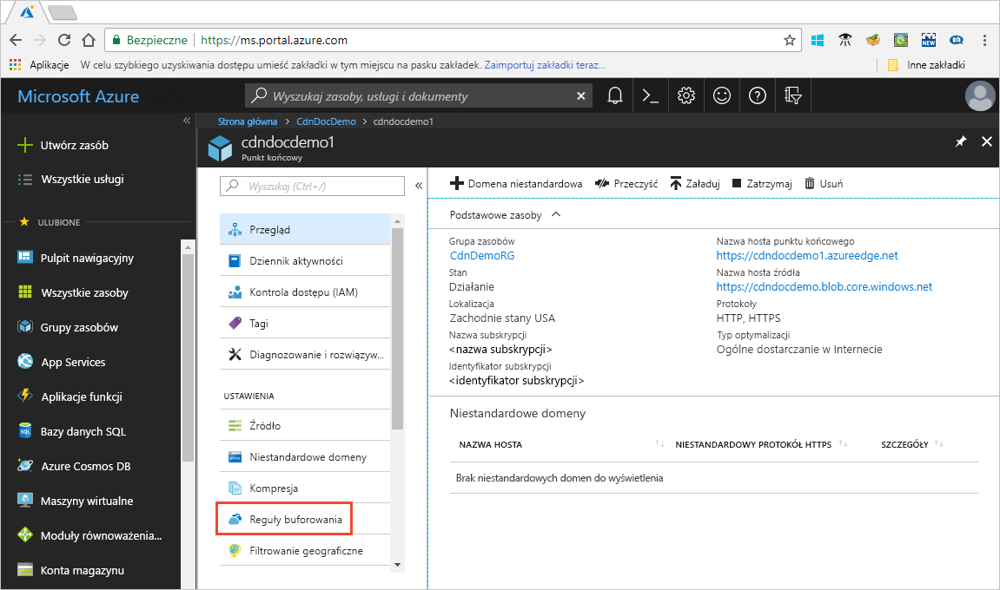

# Formant Azure CDN zachowanie buforowania z buforowaniem reguły

> [!NOTE] 
> Reguły buforowania są dostępne tylko dla **Azure CDN Standard from Verizon** i **Azure CDN Standard from Akamai**. Dla **Azure CDN Premium from Verizon**, można użyć [aparatu reguł Azure CDN](cdn-rules-engine.md) w **Zarządzaj** portalu dla podobnych możliwościach.
 
Azure sieci dostarczania zawartości (CDN) oferuje dwa sposoby kontrolowania, jak są buforowane pliki: 

- Buforowanie reguł: w tym artykule opisano, jak można użyć sieci dostarczania zawartości (CDN) buforowanie reguły można ustawić lub zmodyfikować domyślne zachowanie wygaśnięcia pamięci podręcznej globalnie i z warunkami niestandardowych, takich jak ścieżki i rozszerzenia adresu URL. Usługi Azure CDN oferuje dwa typy zasad buforowania:

   - Globalny buforowanie reguł: jedną globalnego regułę buforowania dla każdego punktu końcowego można ustawić w Twoim profilu, który ma wpływ na wszystkie żądania do punktu końcowego. Globalna reguła buforowania zastępuje wszelkie nagłówki dyrektywy pamięci podręcznej HTTP, jeśli ustawiona.

   - Niestandardowe reguły buforowania: można skonfigurować jeden lub więcej buforowanie niestandardowe reguły dla każdego punktu końcowego w profilu. Niestandardowe buforowanie reguł dopasowania określonej ścieżki i rozszerzenia plików, są przetwarzane w kolejności i zastąpienie reguły globalnej pamięci podręcznej, jeśli ustawiona. 

- Buforowanie ciągu zapytania: można dostosować, jak usługa Azure CDN traktuje buforowania żądań z ciągami zapytań. Aby uzyskać informacje, zobacz [kontroli usługi Azure CDN buforowanie z ciągami zapytań](cdn-query-string.md). Jeśli plik nie jest buforowalnej, ustawienie buforowania ciągu kwerendy nie ma znaczenia, oparte na buforowanie reguły i zachowania domyślnego CDN.

Informacje domyślne zachowanie buforowania i buforowanie dyrektywy nagłówków, zobacz [działa jak buforowanie](cdn-how-caching-works.md). 

## Uzyskiwanie dostępu do usługi Azure CDN reguły buforowania

1. Otwórz Azure portal, wybierz profil CDN, a następnie wybierz punkt końcowy.

2. W lewym okienku w obszarze Ustawienia zaznacz **buforowanie reguły**.

   

   **Buforowanie reguły** zostanie wyświetlona strona.

   

## Ustawienia zachowania buforowania
Globalne i niestandardowych reguł buforowania, można określić następujące **zachowanie buforowania** ustawienia:

- **Obejście pamięci podręcznej**: nie pamięci podręcznej i Ignoruj nagłówków pamięci podręcznej dyrektywy dostarczane do źródła.

- **Zastąpienie**: Ignoruj udostępnione źródła nagłówków pamięci podręcznej dyrektywy; zamiast niej użyj czas buforowania podana.

- **Jeśli brakuje**: Honoruj dostarczane do pochodzenia nagłówki dyrektywy pamięci podręcznej, jeśli istnieją; w przeciwnym razie użyj czas buforowania podana.

## Czas wygasania pamięci podręcznej
Globalne i niestandardowych reguł buforowania można określić czas trwania wygasania pamięci podręcznej w dni, godziny, minuty i sekundy:

- Dla **zastąpienia** i **Jeśli brak** **zachowanie buforowania** ustawień, prawidłową pamięć podręczną czasów trwania zakresu od 0 sekund do 366 dni. Wartości 0 sekund sieć CDN buforuje zawartość, ale musi ponownie zatwierdzać każdego żądania w serwerze źródłowym.

- Dla **obejścia pamięci podręcznej** ustawienie, czas trwania pamięci podręcznej jest automatycznie ustawiana na 0 sekund i nie można zmienić.

## Reguły niestandardowe buforowania warunki dopasowania

Reguły niestandardowe pamięci podręcznej dostępne są niezgodne dwa warunki:
 
- **Ścieżka**: ten stan zgodna ze ścieżką URL, z wyjątkiem nazwy domeny i obsługuje od symbolu wieloznacznego (\*). Na przykład _/myfile.html_, _/Moje/folderu / *_, i _/my/images/*.jpg_. Maksymalna długość to 260 znaków.

- **Rozszerzenie**: ten stan pasuje do rozszerzenia pliku żądanego pliku. Można podać listę rozszerzeń plików rozdzielanych przecinkami do dopasowania. Na przykład _.jpg_, _MP3_, lub _.png_. Maksymalna liczba rozszerzeń wynosi 50, a maksymalna liczba znaków w rozszerzeniu wynosi 16. 

## Kolejność przetwarzania reguły globalne i niestandardowych
Reguły buforowania globalne i niestandardowe są przetwarzane w następującej kolejności:

- Globalne reguły buforowania pierwszeństwo nad CDN buforowania domyślnie (ustawienia pamięci podręcznej dyrektywy nagłówka HTTP). 

- Niestandardowe reguły buforowania pierwszeństwo globalne reguły buforowania, gdy mają one zastosowanie. Reguły buforowania niestandardowe są przetwarzane w kolejności od góry do dołu. Oznacza to gdy żądanie spełnia oba warunki, reguły w dolnej części listy pierwszeństwo reguły na początku listy. W związku z tym należy umieścić bardziej szczegółowych reguł niższe na liście.

**Przykład**:
- Globalna reguła buforowania: 
   - Zachowanie buforowania: **zastąpienia**
   - Buforuj czas wygaśnięcia: 1 dzień

- Niestandardowe reguły #1 buforowania:
   - Zgodne warunkiem: **ścieżki**
   - Odpowiada wartości:   _/home / *_
   - Zachowanie buforowania: **zastąpienia**
   - Buforuj czas wygaśnięcia: 2 dni

- Niestandardowe reguły #2 buforowania:
   - Zgodne warunkiem: **rozszerzenia**
   - Odpowiada wartości: _.html_
   - Zachowanie buforowania: **Jeśli brak**
   - Buforuj czas wygaśnięcia: 3 dni

Gdy te zasady zostały ustawione, żądanie  _&lt;hosta punktu końcowego&gt;_ wyzwalaczy.azureedge.net/home/index.html buforowanie niestandardowe reguły #2, która jest ustawiona na: **Jeśli brak** i 3 Liczba dni. W związku z tym jeśli *index.html* plik ma `Cache-Control` lub `Expires` nagłówki HTTP są go uznać; w przeciwnym razie jeśli te nagłówki nie są ustawione, plik jest buforowany przez 3 dni.

> [!NOTE] 
> Pliki, które są buforowane przed zmianą reguły Obsługa ustawienie czasu trwania pamięci podręcznej ich źródła. Aby zresetować ich czas trwania pamięci podręcznej, należy najpierw [przeczyścić pliku](cdn-purge-endpoint.md). Aby uzyskać **Azure CDN from Verizon** punktów końcowych, może potrwać do 90 minut na nowe reguły buforowania zaczęły obowiązywać.

## Zobacz także

- [Jak działa buforowanie](cdn-how-caching-works.md)
- [Samouczek: Zestaw Azure CDN buforowanie reguły](cdn-caching-rules-tutorial.md)
