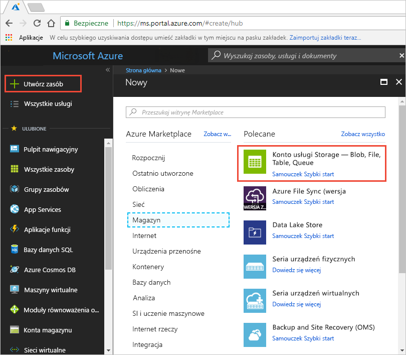
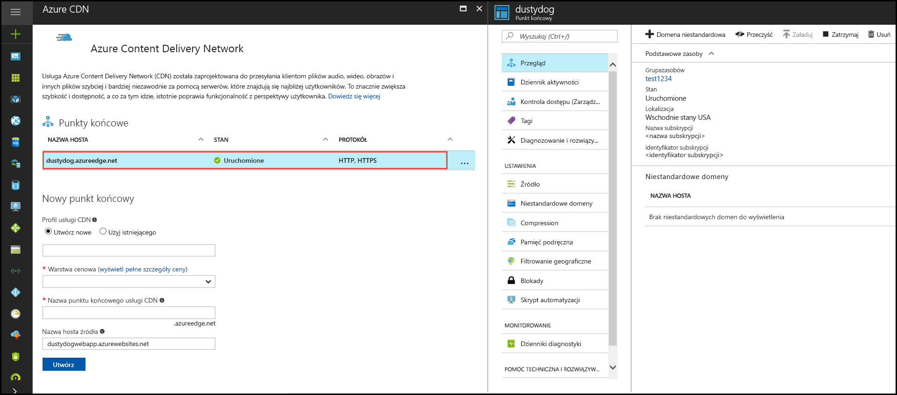

# Szybki Start: Integrowanie konta usługi Azure Storage z usługą Azure CDN

W tym przewodniku szybki start włączysz [usługę azure Content Delivery Network (CDN)](cdn-overview.md) w celu buforowania zawartości z usługi Azure Storage. Usługa Azure CDN oferuje deweloperom globalne rozwiązanie umożliwiające dostarczanie zawartości z wysoką przepustowością. Może buforować obiekty blob oraz zawartość statyczną wystąpień obliczeniowych na węzłach fizycznych w Stanach Zjednoczonych, Europie, Azji, Australii i Ameryce Południowej.

## Wymagania wstępne

- Konto platformy Azure z aktywną subskrypcją. [Utwórz konto bezpłatnie](https://azure.microsoft.com/free/?ref=microsoft.com&utm_source=microsoft.com&utm_medium=docs&utm_campaign=visualstudio).

## Logowanie się do witryny Azure Portal

Zaloguj się w [witrynie Azure Portal](https://portal.azure.com) przy użyciu danych konta Azure.

## Tworzenie konta magazynu

Konto magazynu zapewnia dostęp do usług Azure Storage. Konto magazynu reprezentuje najwyższy poziom przestrzeni nazw do uzyskiwania dostępu do poszczególnych składników usługi Azure Storage: Azure Blob Storage, Queue Storage oraz Table Storage. Aby uzyskać więcej informacji, zobacz [Wprowadzenie do usługi Microsoft Azure Storage](../storage/common/storage-introduction.md).

Aby utworzyć konto magazynu, musisz być administratorem usługi albo współadministratorem subskrypcji skojarzonej.

1. W Azure Portal wybierz pozycję **Utwórz zasób** w lewym górnym rogu. Zostanie wyświetlone okienko **Nowy**.

1. Wyszukaj **konto magazynu** i wybierz pozycję **konto magazynu — obiekt BLOB, plik, tabela, kolejka** z listy rozwijanej. Następnie wybierz pozycję **Utwórz**:
    
    

1. W **okienku Tworzenie konta magazynu**wprowadź następujące szczegóły:

    | Ustawienie | Wartość | 
    | --- | --- |
    | Szczegóły projektu > Grupa zasobów | Wybierz pozycję **Utwórz nową** i użyj nazwy *CDNQuickstart-RG*. Jeśli wolisz, możesz również użyć istniejącej grupy zasobów. |
    | Szczegóły wystąpienia > nazwa konta magazynu | Wprowadź nazwę konta, używając tylko małych liter i cyfr 3-24. Nazwa musi być unikatowa w obrębie platformy Azure i stać się nazwą hosta w adresie URL używanym do adresowania zasobów obiektów blob, kolejek lub tabel w ramach subskrypcji. Aby rozwiązać zasób kontenera w usłudze BLOB Storage, użyj identyfikatora URI w następującym formacie: http://* &lt; storageaccountname &gt; *. blob.Core.Windows.NET/* &lt; Container-Name &gt; *.
    | Szczegóły wystąpienia > lokalizacji | Wybierz region platformy Azure znajdujący się w sąsiedztwie z listy rozwijanej. |
    
    Pozostaw wszystkie inne szczegóły ustawione na wartości domyślne, a następnie wybierz pozycję **Przegląd + Utwórz**.

1. Utworzenie konta magazynu może potrwać kilka minut. Po zakończeniu tworzenia wybierz pozycję **Przejdź do zasobu** , aby otworzyć stronę konta magazynu dla kolejnego kroku.

## Włączanie usługi Azure CDN dla konta magazynu

1. Na stronie konta magazynu wybierz pozycję **BLOB Service**  >  **Azure CDN** z menu po lewej stronie. Zostanie wyświetlona strona **Azure CDN**.

    
    
1. W sekcji **nowy punkt końcowy** wprowadź następujące informacje:

    | Ustawienie  | Wartość |
    | -------- | ----- |
    | **Profil CDN** | Wybierz pozycję **Utwórz nową** i wprowadź nazwę profilu, na przykład *CDN-profile-123*. Profil jest kolekcją punktów końcowych. |
    | **Warstwa cenowa** | Wybierz jedną z opcji **standardowych** , takich jak **standardowa firma Microsoft**. |
    | **Nazwa punktu końcowego usługi CDN** | Wprowadź nazwę hosta punktu końcowego, na przykład *CDN-Endpoint-123*. Ta nazwa musi być globalnie unikatowa na platformie Azure, ponieważ umożliwia dostęp do buforowanych zasobów przy użyciu adresu URL _ &lt; punktu końcowego name &gt; _. azureedge.NET. |
    | **Nazwa hosta źródła** | Domyślnie nowy punkt końcowy CDN używa jako nazwy serwera pochodzenia nazwy hosta konta magazynu. |

1. Wybierz przycisk **Utwórz**. Po utworzeniu punktu końcowego zostanie on wyświetlony na liście punktów końcowych.

    

> [!TIP]
> wysJeśli chcesz określić zaawansowane ustawienia konfiguracji dla punktu końcowego usługi CDN, takie jak [optymalizacja pobierania dużych plików](cdn-optimization-overview.md#large-file-download), możesz zamiast tego użyć [rozszerzenia usługi Azure CDN](cdn-create-new-endpoint.md), aby utworzyć punkt końcowy i profil usługi CDN.

## Włączanie dodatkowych funkcji CDN

Na stronie **Azure CDN** konta magazynu wybierz z listy punkt końcowy usługi CDN, aby otworzyć stronę konfiguracji punktu końcowego usługi CDN.

Na tej stronie można włączyć dodatkowe funkcje CDN dla dostarczania, np. [kompresję](cdn-improve-performance.md), [buforowanie ciągów zapytań](cdn-query-string.md) i [filtrowanie geograficznie](cdn-restrict-access-by-country.md). 
    
## Włączanie sygnatury dostępu współdzielonego

Jeśli chcesz udzielić ograniczonego dostępu do prywatnych kontenerów magazynu, możesz użyć funkcji sygnatury dostępu współdzielonego (SAS) konta usługi Azure Storage. Sygnatura dostępu współdzielonego to identyfikator URI, który zapewnia ograniczone prawa dostępu do zasobów usługi Azure Storage bez ujawniania klucza konta. Aby uzyskać więcej informacji, zobacz [Using Azure CDN with SAS](cdn-sas-storage-support.md) (Używanie usługi Azure CDN z sygnaturą dostępu współdzielonego).

## Uzyskiwanie dostępu do zawartości usługi CDN

Aby uzyskać dostęp do zawartości w pamięci podręcznej w sieci CDN, użyj adresu URL sieci CDN w portalu. Adres buforowanego obiektu blob ma następujący format:

http://<*punkt końcowy Name* \> . azureedge.NET/<*myPublicContainer* \> /< *blobname*\>

> [!NOTE]
> Po włączeniu dostępu usługi Azure CDN do konta magazynu wszystkie publicznie dostępne obiekty kwalifikują się do buforowania POP w sieci CDN. Jeśli zmodyfikujesz obiekt, który jest aktualnie w pamięci podręcznej w sieci CDN, nowa zawartość nie będzie dostępna za pośrednictwem usługi Azure CDN, dopóki usługa Azure CDN nie odświeży zawartości po wygaśnięciu okresu czasu wygaśnięcia zawartości w pamięci podręcznej.

## Usuwanie zawartości z usługi Azure CDN

Jeśli nie chcesz już buforować obiektu w usłudze Azure CDN, możesz wykonać jedną z następujących czynności:

- Ustaw kontener jako prywatny, a nie publiczny. Aby uzyskać więcej informacji, zobacz [Zarządzanie dostępem anonimowym do odczytu do kontenerów i obiektów BLOB](../storage/blobs/storage-manage-access-to-resources.md).
- Wyłącz lub usuń punkt końcowy usługi CDN przy użyciu witryny Azure Portal.
- Zmodyfikuj usługę hostowaną w taki sposób, aby nie odpowiadała już na żądania dla obiektu.

Obiekt, który jest już buforowany w usłudze Azure CDN, pozostaje w pamięci podręcznej, dopóki nie zakończy się okres czasu wygaśnięcia dla obiektu lub dopóki punkt końcowy nie zostanie [przeczyszczony](cdn-purge-endpoint.md). Po zakończeniu okresu czasu wygaśnięcia usługa Azure CDN określa, czy punkt końcowy usługi CDN jest nadal ważny i czy obiekt jest nadal anonimowo dostępny. Jeżeli tak nie jest, obiekt nie będzie już buforowany.

## Czyszczenie zasobów

W poprzednich krokach utworzono profil i punkt końcowy usługi CDN w grupie zasobów. Zapisz te zasoby, jeśli chcesz przejść do sekcji [Następne kroki](#next-steps) i dowiedzieć się, jak dodać domenę niestandardową do punktu końcowego. Jeśli jednak nie będziesz już potrzebować tych zasobów w przyszłości, możesz je usunąć przez usunięcie grupy zasobów, unikając w ten sposób dodatkowych opłat:

1. Z menu po lewej stronie w Azure Portal wybierz pozycję **grupy zasobów** , a następnie wybierz pozycję * CDNQuickstart-RG * *.

2. Na stronie **Grupa zasobów** wybierz pozycję **Usuń grupę zasobów**, w polu tekstowym wpisz *CDNQuickstart-RG* , a następnie wybierz pozycję **Usuń**.

    Ta akcja spowoduje usunięcie grupy zasobów, profilu i punktu końcowego, które utworzono w tym przewodniku Szybki start.

3. Aby usunąć konto magazynu, wybierz je z pulpitu nawigacyjnego, a następnie wybierz opcję **Usuń** z górnego menu.

## Następne kroki

> [!div class="nextstepaction"]
> [Tworzenie profilu i punktu końcowego usługi Azure CDN](cdn-create-new-endpoint.md)

> [!div class="nextstepaction"]
> [Samouczek: Używanie sieci CDN do statycznej zawartości serwera z poziomu aplikacji internetowej](cdn-add-to-web-app.md)
