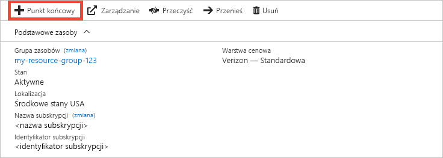
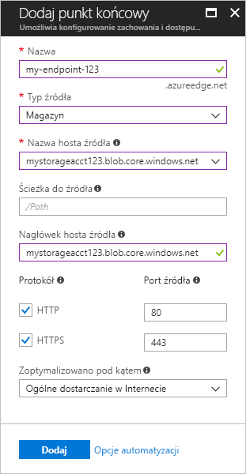

# Szybki start: Tworzenie profilu usługi Azure CDN i punktu końcowego usługi
W tym przewodniku Szybki start włączysz usługę Azure Content Delivery Network (CDN) przez utworzenie nowego profilu i punktu końcowego usługi CDN. Po utworzeniu profilu i punktu końcowego można rozpocząć dostarczanie zawartości do klientów.

[!INCLUDE [quickstarts-free-trial-note](../../includes/quickstarts-free-trial-note.md)]

## Wymagania wstępne
Na potrzeby tego przewodnika Szybki start trzeba wcześniej utworzyć konto magazynu o nazwie *mystorageacct123*, które będzie używane jako nazwa hosta źródła. Aby uzyskać więcej informacji, zobacz [Integrate an Azure storage account with Azure CDN (Integrowanie konta usługi Azure Storage z usługą Azure CDN)](cdn-create-a-storage-account-with-cdn.md).

## Logowanie do witryny Azure Portal
Zaloguj się w witrynie [Azure Portal](https://portal.azure.com) przy użyciu konta platformy Azure.

[!INCLUDE [cdn-create-profile](../../includes/cdn-create-profile.md)]

## Tworzenie nowego punktu końcowego usługi CDN

Utworzony profil usługi CDN może służyć do tworzenia punktu końcowego.

1. W witrynie Azure Portal na pulpicie nawigacyjnym wybierz utworzony profil usługi CDN. Jeśli nie możesz go znaleźć, wybierz pozycję **Wszystkie usługi**, a następnie wybierz pozycję **Profile CDN**. Na stronie **Profile CDN** wybierz profil do użycia. 
   
    Zostanie wyświetlona strona profilu usługi CDN.

2. Wybierz pozycję **Punkt końcowy**.
   
    
   
    Zostanie wyświetlone okienko **Dodawanie punktu końcowego**.

3. Dla ustawień punktu końcowego należy użyć wartości podanych w poniższej tabeli:

    | Ustawienie | Value |
    | ------- | ----- |
    | **Nazwa** | Wprowadź ciąg *my-endpoint-123* jako nazwę hosta punktu końcowego. Ta nazwa musi być globalnie unikatowa; jeśli jest już używana, można wprowadzić inną nazwę. Ta nazwa jest używana do uzyskiwania dostępu do buforowanych zasobów w domenie _&lt;nazwa punktu końcowego&gt;_ .azureedge.net.|
    | **Typ źródła** | Wybierz pozycję **Magazyn**. | 
    | **Nazwa hosta źródła** | Wprowadź ciąg *mystorageacct123.blob.core.windows.net* jako nazwę hosta. Ta nazwa musi być globalnie unikatowa; jeśli jest już używana, można wprowadzić inną nazwę. |
    | **Ścieżka do źródła** | Pozostaw to pole puste. |
    | **Nagłówek hosta źródła** | Pozostaw wygenerowaną wartość domyślną. |  
    | **Protokół** | Pozostaw domyślnie wybrane opcje **HTTP** i **HTTPS**. |
    | **Port źródła** | Pozostaw domyślne wartości portów. | 
    | **Zoptymalizowano pod kątem** | Pozostaw domyślnie wybraną pozycję **Ogólne dostarczanie w Internecie**. |

    

3. Wybierz pozycję **Dodaj**, aby utworzyć nowy punkt końcowy.
   
   Po utworzeniu punktu końcowego zostanie on wyświetlony na liście punktów końcowych dla profilu.
    
   
    
   Punkt końcowy nie jest natychmiast dostępny do użycia, ponieważ propagacja rejestracji zajmuje trochę czasu: 
   - W przypadku profili usługi **Azure CDN Standard from Microsoft** propagacja zwykle trwa do 10 minut. 
   - W przypadku profili usługi **Azure CDN Standard from Akamai** propagacja zwykle trwa mniej niż jedną minutę. 
   - W przypadku profili usługi **Azure CDN Standard from Verizon** oraz usługi **Azure CDN Premium from Verizon** propagacja zwykle trwa do 90 minut. 

## Oczyszczanie zasobów
W poprzednich krokach utworzono profil i punkt końcowy usługi CDN w grupie zasobów. Zapisz te zasoby, jeśli chcesz przejść do sekcji [Następne kroki](#next-steps) i dowiedzieć się, jak dodać domenę niestandardową do punktu końcowego. Jeśli jednak nie będziesz już potrzebować tych zasobów w przyszłości, możesz je usunąć przez usunięcie grupy zasobów, unikając w ten sposób dodatkowych opłat:

1. W menu znajdującym się po lewej stronie w witrynie Azure Portal wybierz pozycję **Grupy zasobów**, a następnie wybierz pozycję **my-resource-group-123**.

2. Na stronie **Grupa zasobów** wybierz pozycję **Usuń grupę zasobów**, wprowadź ciąg *my-resource-group-123* w polu tekstowym, a następnie wybierz pozycję **Usuń**.

    Ta akcja spowoduje usunięcie grupy zasobów, profilu i punktu końcowego, które utworzono w tym przewodniku Szybki start.

## Kolejne kroki
Aby dowiedzieć się więcej na temat dodawania domeny niestandardowej do punktu końcowego usługi CDN, zapoznaj się z następującym samouczkiem:

> [!div class="nextstepaction"]
> [Samouczek: Dodawanie domeny niestandardowej do punktu końcowego usługi Azure CDN](cdn-map-content-to-custom-domain.md)

