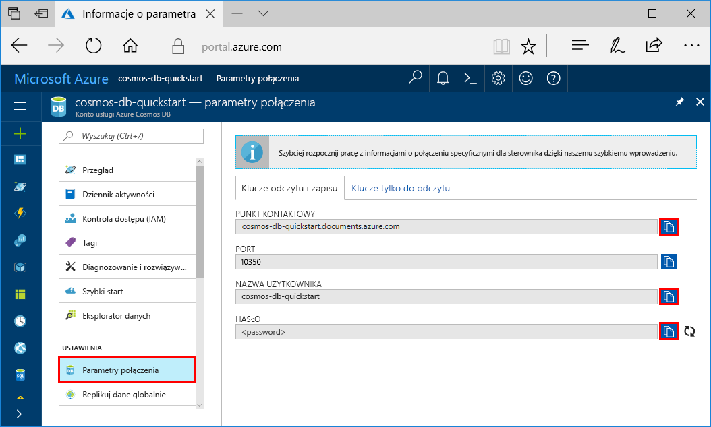

# <a name="quickstart-build-a-cassandra-app-with-net-and-azure-cosmos-db"></a>Szybki start: tworzenie aplikacji Cassandra przy użyciu platformy .NET i usługi Azure Cosmos DB

> [!div class="op_single_selector"]
> * [.NET](create-cassandra-dotnet.md)
> * [Java](create-cassandra-java.md)
> * [Node.js](create-cassandra-nodejs.md)
> * [Python](create-cassandra-python.md)
>  

W tym przewodniku Szybki start przedstawiono używanie platformy .NET i [interfejsu API bazy danych Cassandra](cassandra-introduction.md) w usłudze Azure Cosmos DB do tworzenia aplikacji profilów przez sklonowanie przykładu z serwisu GitHub. W tym przewodniku Szybki start pokazano również sposób tworzenia konta usługi Azure Cosmos DB przy użyciu witryny internetowej Azure Portal.

Azure Cosmos DB to rozproszona globalnie, wielomodelowa usługa bazy danych firmy Microsoft. Dzięki wykorzystaniu globalnego rozproszenia i możliwości skalowania w poziomie w usłudze Azure Cosmos DB można szybko tworzyć i za pomocą zapytań badać bazy danych dokumentów, tabel, par klucz/wartość i grafowe. 

## <a name="prerequisites"></a>Wymagania wstępne

[!INCLUDE [quickstarts-free-trial-note](../../includes/quickstarts-free-trial-note.md)] Można też [bezpłatnie wypróbować usługę Azure Cosmos DB](https://azure.microsoft.com/try/cosmosdb/) bez subskrypcji platformy Azure — nie wymaga to opłat ani zobowiązań.

Potrzebne są też następujące elementy: 
* Jeśli nie masz jeszcze zainstalowanego programu Visual Studio 2017, możesz pobrać program [Visual Studio 2017 Community Edition](https://www.visualstudio.com/downloads/) i używać go **bezpłatnie**. Podczas instalacji programu Visual Studio upewnij się, że jest włączona opcja **Programowanie na platformie Azure**.
* Zainstaluj usługę [Git](https://www.git-scm.com/), aby sklonować przykład.

<a id="create-account"></a>
## <a name="create-a-database-account"></a>Tworzenie konta bazy danych

[!INCLUDE [cosmos-db-create-dbaccount-cassandra](../../includes/cosmos-db-create-dbaccount-cassandra.md)]


## <a name="clone-the-sample-application"></a>Klonowanie przykładowej aplikacji

Teraz przejdźmy do pracy z kodem. Sklonujemy aplikację interfejsu API bazy danych Cassandra z serwisu GitHub, ustawimy parametry połączenia i uruchomimy ją. Zobaczysz, jak łatwo jest pracować programowo z danymi. 

1. Otwórz wiersz polecenia. Utwórz nowy folder o nazwie `git-samples`. Następnie zamknij wiersz polecenia.

    ```bash
    md "C:\git-samples"
    ```

2. Otwórz okno terminalu usługi Git, na przykład git bash, i użyj polecenia `cd`, aby przejść do nowego folderu instalacji aplikacji przykładowej.

    ```bash
    cd "C:\git-samples"
    ```

3. Uruchom następujące polecenie w celu sklonowania przykładowego repozytorium. To polecenie tworzy kopię przykładowej aplikacji na komputerze.

    ```bash
    git clone https://github.com/Azure-Samples/azure-cosmos-db-cassandra-dotnet-getting-started.git
    ```

4. Następnie otwórz plik rozwiązania CassandraQuickStartSample w programie Visual Studio. 

## <a name="review-the-code"></a>Przeglądanie kodu

Ten krok jest opcjonalny. Jeśli chcesz dowiedzieć się, jak kod tworzy zasoby bazy danych, możesz przejrzeć poniższe fragmenty kodu. Fragmenty kodu są pobierane z pliku `Program.cs` zainstalowanego w folderze `C:\git-samples\azure-cosmos-db-cassandra-dotnet-getting-started\CassandraQuickStartSample`. W przeciwnym razie możesz od razu przejść do sekcji [Aktualizowanie parametrów połączenia](#update-your-connection-string).

* Zainicjuj sesję przez nawiązanie połączenia z punktem końcowym klastra Cassandra. Interfejs API bazy danych Cassandra w usłudze Azure Cosmos DB obsługuje tylko protokół TLS 1.2. 

  ```csharp
   var options = new Cassandra.SSLOptions(SslProtocols.Tls12, true, ValidateServerCertificate);
   options.SetHostNameResolver((ipAddress) => CassandraContactPoint);
   Cluster cluster = Cluster.Builder().WithCredentials(UserName, Password).WithPort(CassandraPort).AddContactPoint(CassandraContactPoint).WithSSL(options).Build();
   ISession session = cluster.Connect();
   ```

* Utwórz nową przestrzeń kluczy.

    ```csharp
    session.Execute("CREATE KEYSPACE uprofile WITH REPLICATION = { 'class' : 'NetworkTopologyStrategy', 'datacenter1' : 1 };"); 
    ```

* Utwórz nową tabelę.

   ```csharp
  session.Execute("CREATE TABLE IF NOT EXISTS uprofile.user (user_id int PRIMARY KEY, user_name text, user_bcity text)");
   ```

* Wstaw jednostki użytkowników przez użycie obiektu IMapper z nową sesją łączącą się z przestrzenią kluczy uprofile.

    ```csharp
    mapper.Insert<User>(new User(1, "LyubovK", "Dubai"));
    ```
    
* Wyślij zapytanie w celu pobrania informacji o wszystkich użytkownikach.

    ```csharp
   foreach (User user in mapper.Fetch<User>("Select * from user"))
   {
      Console.WriteLine(user);
   }
    ```
    
* Wyślij zapytanie w celu pobrania informacji o jednym użytkowniku.

    ```csharp
    mapper.FirstOrDefault<User>("Select * from user where user_id = ?", 3);
    ```

## <a name="update-your-connection-string"></a>Aktualizowanie parametrów połączenia

Teraz wróć do witryny Azure Portal, aby uzyskać informacje o parametrach połączenia i skopiować je do aplikacji. Informacje o parametrach połączenia umożliwiają aplikacji komunikowanie się z hostowaną bazą danych.

1. W witrynie [Azure Portal](https://portal.azure.com/) wybierz pozycję **Parametry połączenia**.

    Użyj przycisku  po prawej stronie ekranu, aby skopiować wartość NAZWA UŻYTKOWNIKA.

    

2. W programie Visual Studio 2017 otwórz plik Program.cs. 

3. Wklej wartość NAZWA UŻYTKOWNIKA z portalu do lokalizacji `<FILLME>` w wierszu 13.

    Wiersz 13 pliku Program.cs powinien teraz wyglądać podobnie do: 

    `private const string UserName = "cosmos-db-quickstart";`

3. Wróć do portalu i skopiuj wartość HASŁO. Wklej wartość HASŁO z portalu do lokalizacji `<FILLME>` w wierszu 14.

    Wiersz 14 pliku Program.cs powinien teraz wyglądać podobnie do: 

    `private const string Password = "2Ggkr662ifxz2Mg...==";`

4. Wróć do portalu i skopiuj wartość PUNKT KONTAKTOWY. Wklej wartość PUNKT KONTAKTOWY z portalu do lokalizacji `<FILLME>` w wierszu 15.

    Wiersz 15 pliku Program.cs powinien teraz wyglądać podobnie do: 

    `private const string CassandraContactPoint = "cosmos-db-quickstarts.cassandra.cosmosdb.azure.com"; //  DnsName`

5. Zapisz plik Program.cs.
    
## <a name="run-the-net-app"></a>Uruchamianie aplikacji .Net

1. W programie Visual Studio wybierz pozycję **Narzędzia** > **Menedżer pakietów NuGet** > **Konsola menedżera pakietów**.

2. W wierszu polecenia użyj poniższego polecenia, aby zainstalować pakiet NuGet sterownika platformy .NET. 

    ```cmd
    Install-Package CassandraCSharpDriver
    ```
3. Naciśnij klawisze CTRL+F5, aby uruchomić aplikację. Aplikacja zostanie wyświetlona w oknie konsoli. 

    

    Naciśnij klawisze CTRL+C, aby zatrzymać wykonywanie programu i zamknąć okno konsoli. 
    
4. W witrynie Azure Portal otwórz **Eksploratora danych**, aby wykonywać zapytania oraz modyfikować te nowe dane i pracować z nimi.

    

## <a name="review-slas-in-the-azure-portal"></a>Przeglądanie umów SLA w witrynie Azure Portal

[!INCLUDE [cosmosdb-tutorial-review-slas](../../includes/cosmos-db-tutorial-review-slas.md)]

## <a name="clean-up-resources"></a>Oczyszczanie zasobów

[!INCLUDE [cosmosdb-delete-resource-group](../../includes/cosmos-db-delete-resource-group.md)]

## <a name="next-steps"></a>Następne kroki

W tym przewodniku Szybki start wyjaśniono sposób tworzenia konta usługi Azure Cosmos DB, tworzenia kontenera za pomocą Eksploratora danych i uruchamiania aplikacji internetowej. Teraz możesz zaimportować dodatkowe dane do swojego konta usługi Cosmos DB. 

> [!div class="nextstepaction"]
> [Importowanie danych bazy danych Cassandra do usługi Azure Cosmos DB](cassandra-import-data.md)
