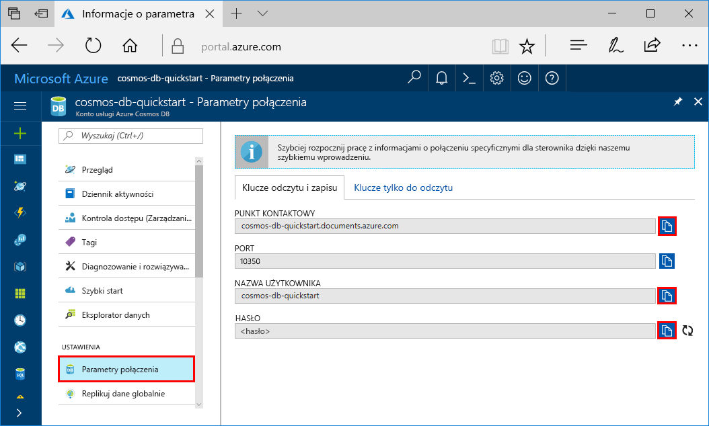
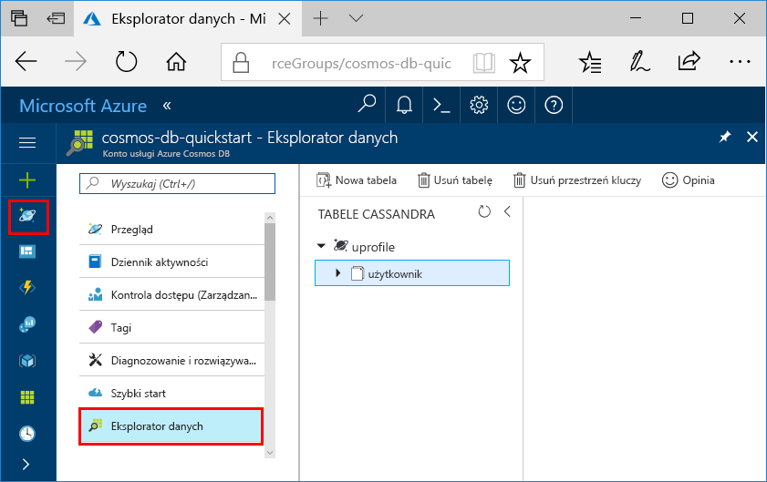

# <a name="quickstart-build-a-cassandra-app-with-nodejs-and-azure-cosmos-db"></a>Szybki start: tworzenie aplikacji Cassandra przy użyciu platformy Node.js i usługi Azure Cosmos DB

> [!div class="op_single_selector"]
> * [.NET](create-cassandra-dotnet.md)
> * [Java](create-cassandra-java.md)
> * [Node.js](create-cassandra-nodejs.md)
> * [Python](create-cassandra-python.md)
>  

W tym przewodniku Szybki start przedstawiono używanie platformy Node.js i [interfejsu API bazy danych Cassandra](cassandra-introduction.md) w usłudze Azure Cosmos DB do tworzenia aplikacji profilów przez sklonowanie przykładu z serwisu GitHub. W tym przewodniku Szybki start pokazano również sposób tworzenia konta usługi Azure Cosmos DB przy użyciu witryny internetowej Azure Portal.

Azure Cosmos DB to rozproszona globalnie, wielomodelowa usługa bazy danych firmy Microsoft. Dzięki wykorzystaniu globalnego rozproszenia i możliwości skalowania w poziomie w usłudze Azure Cosmos DB można szybko tworzyć i za pomocą zapytań badać bazy danych dokumentów, tabel, par klucz/wartość i grafowe. 

## <a name="prerequisites"></a>Wymagania wstępne

[!INCLUDE [quickstarts-free-trial-note](../../includes/quickstarts-free-trial-note.md)] Można też [bezpłatnie wypróbować usługę Azure Cosmos DB](https://azure.microsoft.com/try/cosmosdb/) bez subskrypcji platformy Azure — nie wymaga to opłat ani zobowiązań.

Potrzebne są też następujące elementy:
* [Node.js](https://nodejs.org/en/) w wersji 0.10.29 lub nowszej
* [Usługa Git](https://git-scm.com/)

## <a name="create-a-database-account"></a>Tworzenie konta bazy danych

Przed utworzeniem bazy danych dokumentów musisz utworzyć konto bazy danych Cassandra z użyciem usługi Azure Cosmos DB.

[!INCLUDE [cosmos-db-create-dbaccount-cassandra](../../includes/cosmos-db-create-dbaccount-cassandra.md)]

## <a name="clone-the-sample-application"></a>Klonowanie przykładowej aplikacji

Teraz sklonujemy aplikację interfejsu API Apache Cassandra z usługi GitHub, ustawimy parametry połączenia i uruchomimy ją. Zobaczysz, jak łatwo jest pracować programowo z danymi. 

1. Otwórz wiersz polecenia. Utwórz nowy folder o nazwie `git-samples`. Następnie zamknij wiersz polecenia.

    ```bash
    md "C:\git-samples"
    ```

2. Otwórz okno terminalu usługi Git, na przykład git bash. Użyj polecenia `cd`, aby przejść do nowego folderu w celu zainstalowania przykładowej aplikacji.

    ```bash
    cd "C:\git-samples"
    ```

3. Uruchom następujące polecenie w celu sklonowania przykładowego repozytorium. To polecenie tworzy kopię przykładowej aplikacji na komputerze.

    ```bash
    git clone https://github.com/Azure-Samples/azure-cosmos-db-cassandra-nodejs-getting-started.git
    ```

## <a name="review-the-code"></a>Przeglądanie kodu

Ten krok jest opcjonalny. Jeśli chcesz dowiedzieć się, jak kod tworzy zasoby bazy danych, możesz przejrzeć poniższe fragmenty kodu. Fragmenty kodu są pobierane z pliku `uprofile.js` z folderu `C:\git-samples\azure-cosmos-db-cassandra-nodejs-getting-started`. W przeciwnym razie możesz od razu przejść do sekcji [Aktualizowanie parametrów połączenia](#update-your-connection-string). 

* Nazwa użytkownika i hasło zostały ustawione przy użyciu strony parametrów połączenia w witrynie Azure Portal. Element `path\to\cert` zawiera ścieżkę do certyfikatu X509. 

   ```nodejs
   var ssl_option = {
        cert : fs.readFileSync("path\to\cert"),
        rejectUnauthorized : true,
        secureProtocol: 'TLSv1_2_method'
        };
   const authProviderLocalCassandra = new cassandra.auth.PlainTextAuthProvider(config.username, config.password);
   ```

* Element `client` jest inicjowany przy użyciu informacji contactPoint. Dane contactPoint są pobierane z witryny Azure Portal.

    ```nodejs
    const client = new cassandra.Client({contactPoints: [config.contactPoint], authProvider: authProviderLocalCassandra, sslOptions:ssl_option});
    ```

* Element `client` łączy się z interfejsem API bazy danych Cassandra w usłudze Azure Cosmos DB.

    ```nodejs
    client.connect(next);
    ```

* Tworzona jest nowa przestrzeń kluczy.

    ```nodejs
    function createKeyspace(next) {
        var query = "CREATE KEYSPACE IF NOT EXISTS uprofile WITH replication = {\'class\': \'NetworkTopologyStrategy\', \'datacenter1\' : \'1\' }";
        client.execute(query, next);
        console.log("created keyspace");    
  }
    ```

* Tworzona jest nowa tabela.

   ```nodejs
   function createTable(next) {
    var query = "CREATE TABLE IF NOT EXISTS uprofile.user (user_id int PRIMARY KEY, user_name text, user_bcity text)";
        client.execute(query, next);
        console.log("created table");
   },
   ```

* Wstawiane są jednostki klucz-wartość.

    ```nodejs
    ...
       {
          query: 'INSERT INTO  uprofile.user  (user_id, user_name , user_bcity) VALUES (?,?,?)',
          params: [5, 'IvanaV', 'Belgaum', '2017-10-3136']
        }
    ];
    client.batch(queries, { prepare: true}, next);
    ```

* Zapytanie o pobranie wszystkich wartości kluczy.

    ```nodejs
   var query = 'SELECT * FROM uprofile.user';
    client.execute(query, { prepare: true}, function (err, result) {
      if (err) return next(err);
      result.rows.forEach(function(row) {
        console.log('Obtained row: %d | %s | %s ',row.user_id, row.user_name, row.user_bcity);
      }, this);
      next();
    });
    ```  
    
* Zapytanie o pobranie pary klucz-wartość.

    ```nodejs
    function selectById(next) {
        console.log("\Getting by id");
        var query = 'SELECT * FROM uprofile.user where user_id=1';
        client.execute(query, { prepare: true}, function (err, result) {
        if (err) return next(err);
            result.rows.forEach(function(row) {
            console.log('Obtained row: %d | %s | %s ',row.user_id, row.user_name, row.user_bcity);
        }, this);
        next();
        });
    }
    ```  

## <a name="update-your-connection-string"></a>Aktualizowanie parametrów połączenia

Teraz wróć do witryny Azure Portal, aby uzyskać informacje o parametrach połączenia i skopiować je do aplikacji. Parametry połączenia umożliwiają aplikacji komunikowanie się z hostowaną bazą danych.

1. W witrynie [Azure Portal](https://portal.azure.com/) wybierz pozycję **Parametry połączenia**. 

    Użyj przycisku  po prawej stronie ekranu, aby skopiować górną wartość, PUNKT KONTAKTOWY.

    

2. Otwórz plik `config.js`. 

3. Wklej wartość PUNKT KONTAKTOWY z portalu do lokalizacji `<FillMEIN>` w wierszu 4.

    Wiersz 4 powinien teraz wyglądać podobnie do: 

    `config.contactPoint = "cosmos-db-quickstarts.cassandra.cosmosdb.azure.com:10350"`

4. Skopiuj wartość NAZWA UŻYTKOWNIKA z portalu do lokalizacji `<FillMEIN>` w wierszu 2.

    Wiersz 2 powinien teraz wyglądać podobnie do: 

    `config.username = 'cosmos-db-quickstart';`
    
5. Skopiuj wartość HASŁO z portalu do lokalizacji `<FillMEIN>` w wierszu 3.

    Wiersz 3 powinien teraz wyglądać podobnie do:

    `config.password = '2Ggkr662ifxz2Mg==';`

6. Zapisz plik `config.js`.
    
## <a name="use-the-x509-certificate"></a>Używanie certyfikatu X509

1. Pobierz na komputer lokalny certyfikat Baltimore CyberTrust Root spod adresu [https://cacert.omniroot.com/bc2025.crt](https://cacert.omniroot.com/bc2025.crt). Zmień rozszerzenie nazwy tego pliku na `.cer`.

   Certyfikat ma numer seryjny `02:00:00:b9` i odcisk palca SHA1 `d4🇩🇪20:d0:5e:66:fc:53:fe:1a:50:88:2c:78:db:28:52:ca:e4:74`.

2. Otwórz plik `uprofile.js` i zmień wartość parametru `path\to\cert`, aby wskazywał nowy certyfikat.

3. Zapisz plik `uprofile.js`.

## <a name="run-the-nodejs-app"></a>Uruchamianie aplikacji Node.js

1. W oknie terminalu usługi Git uruchom polecenie `npm install`, aby zainstalować wymagane moduły npm.

2. Uruchom polecenie `node uprofile.js`, aby uruchomić aplikację Node.

3. W wierszu polecenia sprawdź, czy wyniki są zgodne z oczekiwaniami.

    

    Naciśnij klawisze CTRL+C, aby zatrzymać wykonywanie programu i zamknąć okno konsoli. 

4. W witrynie Azure Portal otwórz **Eksploratora danych**, aby wykonywać zapytania oraz modyfikować te nowe dane i pracować z nimi. 

     

## <a name="review-slas-in-the-azure-portal"></a>Przeglądanie umów SLA w witrynie Azure Portal

[!INCLUDE [cosmosdb-tutorial-review-slas](../../includes/cosmos-db-tutorial-review-slas.md)]

## <a name="clean-up-resources"></a>Oczyszczanie zasobów

[!INCLUDE [cosmosdb-delete-resource-group](../../includes/cosmos-db-delete-resource-group.md)]

## <a name="next-steps"></a>Następne kroki

W tym przewodniku Szybki start wyjaśniono sposób tworzenia konta usługi Azure Cosmos DB, tworzenia kontenera za pomocą Eksploratora danych i uruchamiania aplikacji. Teraz możesz zaimportować dodatkowe dane do swojego konta usługi Cosmos DB. 

> [!div class="nextstepaction"]
> [Importowanie danych bazy danych Cassandra do usługi Azure Cosmos DB](cassandra-import-data.md)


