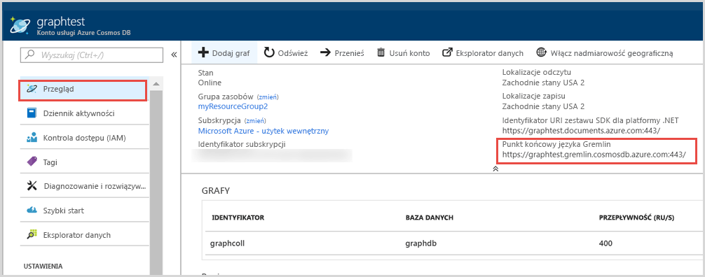

# <a name="quickstart-build-a-net-framework-or-core-application-using-the-azure-cosmos-db-gremlin-api-account"></a>Szybki start: tworzenie aplikacji .NET Framework lub Core przy użyciu konta interfejsu API usługi Azure Cosmos DB Gremlin

> [!div class="op_single_selector"]
> * [Konsola Gremlin](create-graph-gremlin-console.md)
> * [.NET](create-graph-dotnet.md)
> * [Java](create-graph-java.md)
> * [Node.js](create-graph-nodejs.md)
> * [Python](create-graph-python.md)
> * [PHP](create-graph-php.md)
>  

Azure Cosmos DB to rozproszona globalnie, wielomodelowa usługa bazy danych firmy Microsoft. Dzięki wykorzystaniu dystrybucji globalnej i możliwości skalowania poziomego opartego na usłudze Azure Cosmos DB, można szybko tworzyć i za pomocą zapytań badać bazy danych dokumentów, par klucz/wartość i grafów. 

Ten przewodnik Szybki start pokazuje, jak utworzyć konto interfejsu API usługi Azure Cosmos DB [Gremlin,](graph-introduction.md) bazę danych i wykres (kontener) przy użyciu witryny Azure portal. Następnie aplikacja konsoli utworzona za pomocą sterownika open source [Gremlin.Net](https://tinkerpop.apache.org/docs/3.2.7/reference/#gremlin-DotNet) zostanie skompilowana i uruchomiona.  

## <a name="prerequisites"></a>Wymagania wstępne

Jeśli nie masz jeszcze zainstalowanej programu Visual Studio 2019, możesz pobrać **bezpłatną** [wersję programu Visual Studio 2019 Community Edition](https://www.visualstudio.com/downloads/)i korzystać z niej. Podczas instalacji programu Visual Studio upewnij się, że jest włączona opcja **Programowanie na platformie Azure**.

[!INCLUDE [quickstarts-free-trial-note](../../includes/quickstarts-free-trial-note.md)]

## <a name="create-a-database-account"></a>Tworzenie konta bazy danych

[!INCLUDE [cosmos-db-create-dbaccount-graph](../../includes/cosmos-db-create-dbaccount-graph.md)]

## <a name="add-a-graph"></a>Dodawanie grafu

[!INCLUDE [cosmos-db-create-graph](../../includes/cosmos-db-create-graph.md)]

## <a name="clone-the-sample-application"></a>Klonowanie przykładowej aplikacji

Teraz sklonujemy aplikację interfejsu API języka Gremlin z repozytorium GitHub, ustawimy parametry połączenia i uruchomimy ją. Zobaczysz, jak łatwo jest pracować programowo z danymi. 

1. Otwórz wiersz polecenia, utwórz nowy folder o nazwie git-samples, a następnie zamknij wiersz polecenia.

    ```bash
    md "C:\git-samples"
    ```

2. Otwórz okno terminala usługi Git, np. git bash, i użyj polecenia `cd`, aby przejść do nowego folderu instalacji aplikacji przykładowej.

    ```bash
    cd "C:\git-samples"
    ```

3. Uruchom następujące polecenie w celu sklonowania przykładowego repozytorium. To polecenie tworzy kopię aplikacji przykładowej na komputerze.

    ```bash
    git clone https://github.com/Azure-Samples/azure-cosmos-db-graph-gremlindotnet-getting-started.git
    ```

4. Następnie otwórz program Visual Studio i otwórz plik rozwiązania.

5. Przywróć pakiety NuGet w projekcie. Powinny one obejmować sterownik Gremlin.Net, a także pakiet Newtonsoft.Json.


6. Sterownik Gremlin.Net możesz także zainstalować ręcznie, za pomocą menedżera pakietów NuGet lub [narzędzia wiersza polecenia nuget](https://docs.microsoft.com/nuget/install-nuget-client-tools): 

    ```bash
    nuget install Gremlin.Net
    ```

## <a name="review-the-code"></a>Przeglądanie kodu

Ten krok jest opcjonalny. Jeśli chcesz się dowiedzieć, jak zasoby bazy danych są tworzone w kodzie, możesz przejrzeć poniższe fragmenty kodu. W przeciwnym razie możesz od razu przejść do sekcji [Aktualizacja parametrów połączenia](#update-your-connection-string). 

Wszystkie poniższe fragmenty kodu pochodzą z pliku Program.cs.

* Ustaw parametry połączenia na podstawie konta utworzonego powyżej: 

   :::code language="csharp" source="~/azure-cosmosdb-graph-dotnet/GremlinNetSample/Program.cs" id="configureConnectivity":::

* Polecenia Gremlin do wykonania są wymienione w słowniku:

   :::code language="csharp" source="~/azure-cosmosdb-graph-dotnet/GremlinNetSample/Program.cs" id="defineQueries":::

* Utwórz `GremlinServer` nowe `GremlinClient` i obiekty połączeń przy użyciu parametrów podanych powyżej:

   :::code language="csharp" source="~/azure-cosmosdb-graph-dotnet/GremlinNetSample/Program.cs" id="defineClientandServerObjects":::

* Wykonaj każdą kwerendę `GremlinClient` Gremlin przy użyciu obiektu za pomocą zadania asynchronicznego. Można odczytać zapytania Gremlin ze słownika zdefiniowanego w poprzednim kroku i wykonać je. Później uzyskać wynik i odczytać wartości, które są sformatowane jako słownik, przy użyciu `JsonSerializer` klasy z pakietu Newtonsoft.Json:

   :::code language="csharp" source="~/azure-cosmosdb-graph-dotnet/GremlinNetSample/Program.cs" id="executeQueries":::

## <a name="update-your-connection-string"></a>Aktualizowanie parametrów połączenia

Teraz wróć do witryny Azure Portal, aby uzyskać informacje o parametrach połączenia i skopiować je do aplikacji.

1. W witrynie [Azure Portal](https://portal.azure.com/) przejdź do swojego konta bazy danych programu Graph. Na karcie **Przegląd** są wyświetlane dwa punkty końcowe: 
 
   **.NET SDK URI** — ta wartość jest używana podczas łączenia się z kontem wykresu przy użyciu biblioteki Microsoft.Azure.Graphs. 

   **Punkt końcowy języka Gremlin** — ta wartość jest używana podczas nawiązywania połączenia z kontem programu Graph przy użyciu biblioteki Gremlin.Net.

    

   Aby uruchomić ten przykład, skopiuj wartość **gremlinu punktu końcowego,** `https://<your cosmos db account name>.gremlin.cosmosdb.azure.com`usuń numer portu na końcu, czyli identyfikator URI staje się . Wartość punktu końcowego powinna wyglądać`testgraphacct.gremlin.cosmosdb.azure.com`

1. Następnie przejdź do karty **Klucze** i skopiuj wartość **KLUCZA PODSTAWOWEGO** z witryny Azure portal. 

1. Po skopiowaniu identyfikatora URI i klucza podstawowego konta zapisz je na nowej zmiennej środowiskowej na komputerze lokalnym z uruchomieniem aplikacji. Aby ustawić zmienną środowiskową, otwórz okno wiersza polecenia i uruchom następujące polecenie. Pamiętaj, aby zastąpić <Your_Azure_Cosmos_account_URI> i <Your_Azure_Cosmos_account_PRIMARY_KEY> wartości.

   ```console
   setx EndpointUrl "https://<your cosmos db account name>.gremlin.cosmosdb.azure.com"
   setx PrimaryKey "<Your_Azure_Cosmos_account_PRIMARY_KEY>"
   ```

1. Otwórz plik *Program.cs* i zaktualizuj zmienne "bazy danych i kontenera" za pomocą nazw bazy danych i kontenera (który jest również nazwą wykresu) utworzonych powyżej.

    `private static string database = "your-database-name";` `private static string container = "your-container-or-graph-name";`

1. Zapisz plik Program.cs. 

Aplikacja została zaktualizowana i zawiera teraz wszystkie informacje potrzebne do nawiązania komunikacji z usługą Azure Cosmos DB. 

## <a name="run-the-console-app"></a>Uruchamianie aplikacji konsolowej

Naciśnij klawisze CTRL + F5, aby uruchomić aplikację. Aplikacja będzie wyświetlać polecenia zapytań języka Gremlin i ich wyniki w konsoli.

   W oknie konsoli będą widoczne wierzchołki i krawędzie dodawane do grafu. Po zakończeniu działania skryptu naciśnij klawisz ENTER dwa razy, aby zamknąć okno konsoli.

## <a name="browse-using-the-data-explorer"></a>Przeglądanie za pomocą Eksploratora danych

Teraz możesz wrócić do Eksploratora danych w witrynie Azure Portal, aby przeglądać nowe dane i wykonywać zapytania względem nich.

1. W Eksploratorze danych nowa baza danych jest wyświetlana w okienku Grafy. Rozwiń węzły bazy danych i kontenera, a następnie kliknij pozycję **Graf**.

2. Kliknij polecenie **Zastosuj filtr**, aby użyć domyślnego zapytania do wyświetlenia wszystkich wierzchołków grafu. Dane wygenerowane przez przykładową aplikację zostaną wyświetlone w okienku Grafy.

    Możesz powiększać i zmniejszać graf, rozszerzać obszar wyświetlania grafu, dodawać kolejne wierzchołki oraz przenosić wierzchołki na wyświetlanej powierzchni.

    

## <a name="review-slas-in-the-azure-portal"></a>Przeglądanie umów SLA w witrynie Azure Portal

[!INCLUDE [cosmosdb-tutorial-review-slas](../../includes/cosmos-db-tutorial-review-slas.md)]

## <a name="clean-up-resources"></a>Oczyszczanie zasobów

[!INCLUDE [cosmosdb-delete-resource-group](../../includes/cosmos-db-delete-resource-group.md)]

## <a name="next-steps"></a>Następne kroki

W tym przewodniku Szybki start wyjaśniono sposób tworzenia konta usługi Azure Cosmos DB, tworzenia grafu za pomocą Eksploratora danych i uruchamiania aplikacji. Teraz możesz tworzyć bardziej złożone zapytania i implementować zaawansowaną logikę przechodzenia grafu za pomocą języka Gremlin. 

> [!div class="nextstepaction"]
> [Wykonywanie zapytań przy użyciu języka Gremlin](tutorial-query-graph.md)

