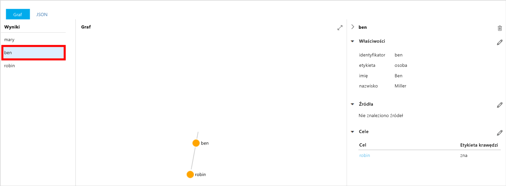
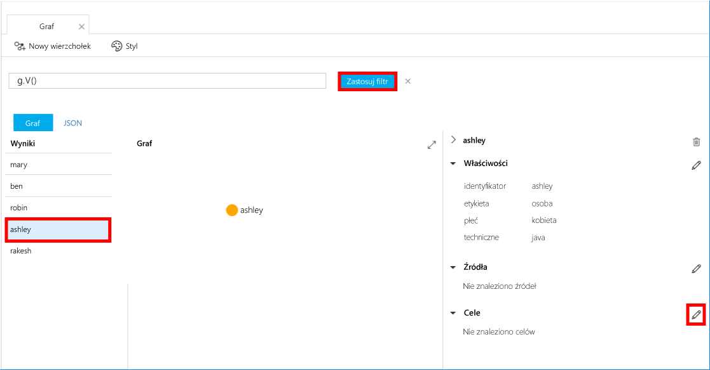

# <a name="azure-cosmos-db-create-a-graph-database-using-java-and-the-azure-portal"></a>Azure Cosmos DB: Tworzenie bazy danych grafów przy użyciu języka Java i witryny Azure Portal

Azure Cosmos DB to rozproszona globalnie wielomodelowa usługa bazy danych firmy Microsoft. Przy użyciu bazy danych rozwiązania Cosmos platformy Azure, można szybko tworzyć i kwerend dokumentu zarządzanego, tabeli i bazy danych wykresu. 

Ta opcja szybkiego startu tworzy wykres prostych bazy danych dla bazy danych rozwiązania Cosmos Azure przy użyciu narzędzia portalu Azure. Ponadto ten przewodnik Szybki start pokazuje, jak szybko utworzyć aplikację konsolową Java przy użyciu bazy danych grafów, korzystając ze sterownika OSS [Gremlin Java](https://mvnrepository.com/artifact/org.apache.tinkerpop/gremlin-driver). Instrukcje podane w tym przewodniku Szybki start można wykonać w dowolnym systemie operacyjnym, w którym można uruchomić oprogramowanie Java. Ta opcja szybkiego startu zaznajomić z tworzenia i modyfikowania wykresy w Interfejsie użytkownika lub programowo, nastąpi swoich preferencji. 

## <a name="prerequisites"></a>Wymagania wstępne
[!INCLUDE [quickstarts-free-trial-note](../../includes/quickstarts-free-trial-note.md)]

Ponadto:

* [Zestaw Java Development Kit (JDK) 1.7+](http://www.oracle.com/technetwork/java/javase/downloads/jdk8-downloads-2133151.html)
    * W systemie Ubuntu uruchom polecenie `apt-get install default-jdk`, aby zainstalować zestaw JDK.
    * Upewnij się, że zmienna środowiskowa JAVA_HOME wskazuje folder, w którym zainstalowano zestaw JDK.
* [Pobierz](http://maven.apache.org/download.cgi) i [zainstaluj](http://maven.apache.org/install.html) archiwum binarne [Maven](http://maven.apache.org/)
    * W systemie Ubuntu możesz uruchomić polecenie `apt-get install maven`, aby zainstalować narzędzie Maven.
* [Git](https://www.git-scm.com/)
    * W systemie Ubuntu możesz uruchomić polecenie `sudo apt-get install git`, aby zainstalować usługę Git.

## <a name="create-a-database-account"></a>Tworzenie konta bazy danych

Przed utworzeniem bazy danych grafów musisz utworzyć konto bazy danych Gremlin (Graph) z użyciem usługi Azure Cosmos DB.

[!INCLUDE [cosmos-db-create-dbaccount-graph](../../includes/cosmos-db-create-dbaccount-graph.md)]

## <a name="add-a-graph"></a>Dodawanie grafu

Teraz możesz użyć narzędzia Eksplorator danych w witrynie Azure Portal, aby utworzyć bazę danych grafów. 

1. Kliknij przycisk **Eksploratora danych** > **nowy wykres**.

    **Dodaj wykres** obszar jest wyświetlany po prawej, konieczne może być przewiń w prawo, aby go wyświetlić.

    

2. W **Dodaj wykres** wprowadź ustawienia dla nowego wykresu.

    Ustawienie|Sugerowana wartość|Opis
    ---|---|---
    Identyfikator bazy danych|sample-database|Wprowadź *bazy danych przykładowych* jako nazwę nowej bazy danych. Nazwy baz danych muszą zawierać od 1 do 255 znaków i nie mogą zawierać znaków `/ \ # ?` ani mieć spacji na końcu.
    Identyfikator grafu|sample-graph|Wprowadź *wykres próbki* jako nazwę nowej kolekcji. Wykres nazwy mają te same wymagania znak jako identyfikatorów w bazie danych.
    Pojemność magazynu|Stała (10 GB)|Zmień wartość na **stałe (10 GB)**. Ta wartość to pojemność magazynu bazy danych.
    Przepływność|400 jednostek żądania|Zmień przepływność 400 jednostek żądań na sekundę (RU/s). Jeśli chcesz zmniejszyć opóźnienie, możesz później przeskalować przepływność w górę.
    Klucz partycji|Pozostaw puste|Na potrzeby tego przewodnika Szybki start pozostaw klucz partycji pusty.

3. Po wypełnieniu formularza kliknij przycisk **OK**.

## <a name="clone-the-sample-application"></a>Klonowanie przykładowej aplikacji

Teraz przejdźmy do pracy z kodem. Załóżmy sklonować aplikacji interfejsu API programu Graph, z serwisu GitHub, Ustaw ciąg połączenia i uruchom go. Zobaczysz, jak łatwo jest pracować programowo z danymi.  

1. Otwórz wiersz polecenia, Utwórz nowy folder o nazwie przykłady git, a następnie Zamknij wiersz polecenia.

    ```bash
    md "C:\git-samples"
    ```

2. Otwórz okno terminala git, np. git bash i użyj `cd` polecenie, aby przejść do folderu instalacji aplikacji przykładowej.  

    ```bash
    cd "C:\git-samples"
    ```

3. Uruchom następujące polecenie w celu sklonowania przykładowego repozytorium. To polecenie tworzy kopię przykładowej aplikacji na komputerze. 

    ```bash
    git clone https://github.com/Azure-Samples/azure-cosmos-db-graph-java-getting-started.git
    ```

## <a name="review-the-code"></a>Przeglądanie kodu

Ten krok jest opcjonalny. Jeśli chcesz się dowiedzieć, jak zasoby bazy danych są tworzone w kodzie, można przejrzeć poniższe fragmenty kodu. Fragmenty kodu są pobierane z `Program.java` pliku w folderze C:\git-samples\azure-cosmos-db-graph-java-getting-started\src\GetStarted. W przeciwnym razie możesz przejść od razu do [zaktualizować parametry połączenia](#update-your-connection-information). 

* Element `Client` języka Gremlin jest inicjowany z poziomu konfiguracji w pliku `src/remote.yaml`.

    ```java
    cluster = Cluster.build(new File("src/remote.yaml")).create();
    ...
    client = cluster.connect();
    ```

* Wykonywanie serii kroków języka Gremlin przy użyciu metody `client.submit`.

    ```java
    ResultSet results = client.submit(gremlin);

    CompletableFuture<List<Result>> completableFutureResults = results.all();
    List<Result> resultList = completableFutureResults.get();

    for (Result result : resultList) {
        System.out.println(result.toString());
    }
    ```

## <a name="update-your-connection-information"></a>Zaktualizuj informacje o połączeniu

Teraz wróć do portalu Azure, aby uzyskać informacje o połączeniu i skopiuj go do aplikacji. Te ustawienia umożliwiają użycie aplikacji do komunikowania się z bazą danych hostowanej.

1. W [portalu Azure](http://portal.azure.com/), kliknij przycisk **klucze**. 

    Skopiuj pierwszą część wartość identyfikatora URI.

    
2. Otwórz plik src/remote.yaml i wkleić wartość za pośrednictwem `$name$` w `hosts: [$name$.graphs.azure.com]`.

    Wiersz 1 remote.yaml powinna wyglądać podobnie do 

    `hosts: [test-graph.graphs.azure.com]`

3. W portalu Azure, użyj przycisku kopiowania, aby klucz podstawowy skopiuj i wklej go za pośrednictwem `$masterKey$` w `password: $masterKey$`.

    Wiersz 4 remote.yaml powinna wyglądać podobnie do 

    `password: 2Ggkr662ifxz2Mg==`

4. Zmień wiersz 3 remote.yaml z

    `username: /dbs/$database$/colls/$collection$`

    na 

    `username: /dbs/sample-database/colls/sample-graph`

5. Zapisz plik remote.yaml.

## <a name="run-the-console-app"></a>Uruchamianie aplikacji konsolowej

1. W oknie terminalu usługi Git za pomocą polecenia `cd` przejdź do folderu azure-cosmos-db-graph-java-getting-started.

    ```git
    cd "C:\git-samples\azure-cosmos-db-graph-java-getting-started"
    ```

2. W oknie terminalu git Użyj następującego polecenia w celu zainstalowania wymaganych pakietów języka Java.

   ```
   mvn package
   ```

3. W oknie terminalu git Użyj następującego polecenia do uruchomienia aplikacji Java.
    
    ```
    mvn exec:java -D exec.mainClass=GetStarted.Program
    ```

    W oknie terminalu zostaną wyświetlone wierzchołki dodawane do grafu. 
    
    Jeśli występują błędy przekroczenia limitu czasu, sprawdź, czy zaktualizowane informacje o połączeniu poprawnie w [zaktualizuj informacje o połączeniu](#update-your-connection-information), a także spróbuj ponownie uruchomić ostatnie polecenie. 
    
    Po zatrzymuje program, naciśnij klawisz Enter, następnie przejdź do portalu Azure w przeglądarce internetowej. 

<a id="add-sample-data"></a>
## <a name="review-and-add-sample-data"></a>Przeglądanie i dodawanie przykładowych danych

Teraz możesz wrócić do Eksploratora danych i zobaczyć wierzchołki dodane do grafu, a także dodać kolejne punkty danych.

1. Kliknij przycisk **Eksploratora danych**, rozwiń węzeł **wykres próbki**, kliknij przycisk **wykres**, a następnie kliknij przycisk **Zastosuj filtr**. 

   

2. Na liście **Wyniki** zwróć uwagę na nowych użytkowników dodanych do grafu. Wybierz użytkownika **ben** i zwróć uwagę, że jest połączony z użytkownikiem robin. Można przenieść wierzchołków wokół przez przeciąganie i upuszczanie, powiększać i pomniejszać przewijając kółka myszy, a następnie rozwiń rozmiar wykres z podwójną strzałką. 

   

3. Dodajmy kilka nowych użytkowników. Kliknij przycisk **Nowy wierzchołek**, aby dodać dane do grafu.

   

4. Wprowadź etykietę *osoby*.

5. Kliknij przycisk **Dodaj właściwość** można dodać każdego z następujących właściwości. Zauważ, że możesz utworzyć unikatowe właściwości dla każdej osoby w grafie. Tylko klucz id jest wymagany.

    key|wartość|Uwagi
    ----|----|----
    id|ashley|Unikatowy identyfikator wierzchołka. Jeśli nie określono identyfikatora, zostanie on wygenerowany.
    płeć|kobieta| 
    techniczne | java | 

    > [!NOTE]
    > W tym przewodniku Szybki start tworzymy kolekcję niepartycjonowaną. Niemniej jednak, jeśli utworzysz kolekcję partycjonowaną poprzez określenie klucza partycji podczas tworzenia kolekcji, musisz uwzględnić klucz partycji jako klucz w każdym nowym wierzchołku. 

6. Kliknij przycisk **OK**. Może być konieczne rozszerzenie ekranu w celu wyświetlenia przycisku **OK** u dołu ekranu.

7. Kliknij przycisk **Nowy wierzchołek** ponownie i dodaj kolejnego nowego użytkownika. 

8. Wprowadź etykietę *osoby*.

9. Kliknij przycisk **Dodaj właściwość** można dodać każdego z następujących właściwości:

    key|wartość|Uwagi
    ----|----|----
    id|rakesh|Unikatowy identyfikator wierzchołka. Jeśli nie określono identyfikatora, zostanie on wygenerowany.
    płeć|mężczyzna| 
    szkoła|MIT| 

10. Kliknij przycisk **OK**. 

11. Kliknij przycisk **Zastosuj filtr** przycisk przy użyciu domyślnego `g.V()` filtr, aby wyświetlić wszystkie wartości na wykresie. Wszyscy użytkownicy będą teraz wyświetlani na liście **Wyniki**. 

    W miarę dodawania większej ilości danych można używać filtrów do ograniczania wyników. Domyślnie korzysta z Eksploratora danych `g.V()` można pobrać wszystkich wierzchołków na wykresie. Można ją zmienić na inny [zapytania wykres](tutorial-query-graph.md), takich jak `g.V().count()`, aby zwrócić liczbę wszystkich wierzchołków na wykresie w formacie JSON. Zmiana filtru, Zmień filtr z powrotem do `g.V()` i kliknij przycisk **Zastosuj filtr** Aby ponownie wyświetlić wszystkie wyniki.

12. Teraz możemy połączyć użytkowników rakesh i ashley. Upewnij się, **Monika** wybrano **wyniki** listy, a następnie kliknij przycisk Edytuj **cele** w prawym dolnym. Może być konieczne rozszerzenie okna w celu wyświetlenia obszaru **Właściwości**.

   

13. W **docelowej** wpisz *rakesh*i w **etykiety krawędzi** wpisz *zna*, a następnie kliknij przycisk wyboru.

   

14. Teraz wybierz użytkownika **rakesh** z listy wyników, aby zobaczyć, że użytkownicy ashley i rakesh są połączeni. 

   

   Na tym kończy się tworzenie zasobu części tego samouczka. Możesz dodać wierzchołków do wykresu, zmodyfikuj istniejące wierzchołków lub zmiana zapytania. Teraz załóżmy Przejrzyj metryki bazy danych rozwiązania Cosmos Azure udostępnia, a następnie wyczyścić zasoby. 

## <a name="review-slas-in-the-azure-portal"></a>Przeglądanie umów SLA w witrynie Azure Portal

[!INCLUDE [cosmosdb-tutorial-review-slas](../../includes/cosmos-db-tutorial-review-slas.md)]

## <a name="clean-up-resources"></a>Oczyszczanie zasobów

[!INCLUDE [cosmosdb-delete-resource-group](../../includes/cosmos-db-delete-resource-group.md)]

## <a name="next-steps"></a>Następne kroki

W tym przewodniku Szybki start wyjaśniono sposób tworzenia konta usługi Azure Cosmos DB, tworzenia grafu za pomocą Eksploratora danych i uruchamiania aplikacji. Teraz możesz tworzyć bardziej złożone zapytania i implementować zaawansowaną logikę przechodzenia grafu za pomocą języka Gremlin. 

> [!div class="nextstepaction"]
> [Wykonywanie zapytań przy użyciu języka Gremlin](tutorial-query-graph.md)

