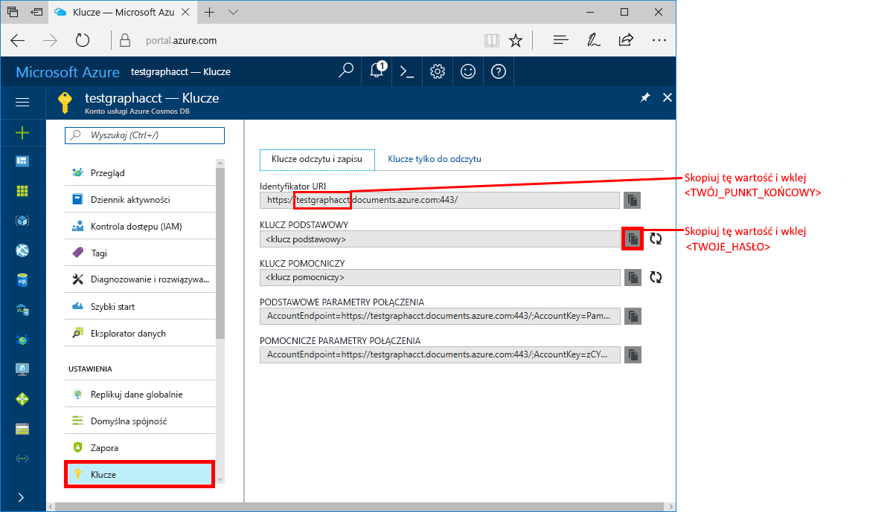
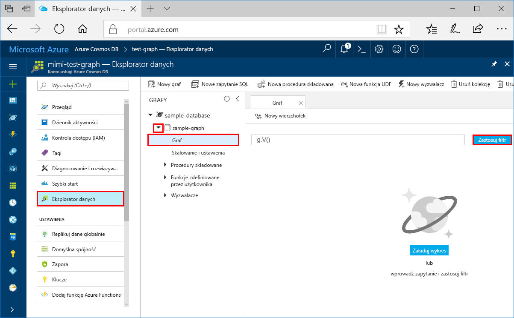
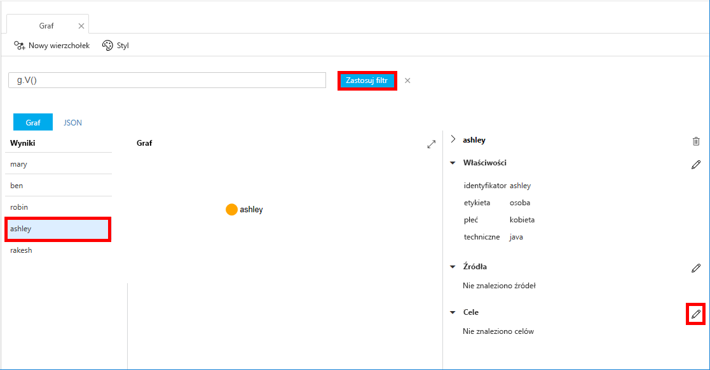
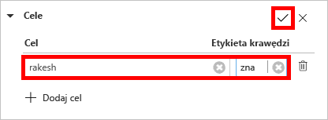

# <a name="azure-cosmos-db-create-a-graph-database-using-python-and-the-azure-portal"></a>Azure Cosmos DB: tworzenie grafowej bazy danych przy użyciu języka Python i witryny Azure Portal

W tym przewodniku Szybki start przedstawiono używanie języka Python i [interfejsu API programu Graph](graph-introduction.md) usługi Azure Cosmos DB do tworzenia aplikacji konsolowej przez sklonowanie przykładu z usługi GitHub. Ten przewodnik Szybki start przeprowadzi Cię również przez tworzenie konta usługi Azure Cosmos DB przy użyciu portalu internetowego platformy Azure.   

Azure Cosmos DB to rozproszona globalnie wielomodelowa usługa bazy danych firmy Microsoft. Dzięki wykorzystaniu dystrybucji globalnej i możliwości skalowania poziomego w usłudze Azure Cosmos DB można szybko tworzyć i za pomocą zapytań badać bazy danych dokumentów, tabel, par klucz/wartość i grafowe.  

> [!NOTE]
> Ten przewodnik Szybki start wymaga konta grafowej bazy danych utworzonego po 27 listopada 2017 r. Istniejące konta będą obsługiwać język Python po migrowaniu do wersji powszechnie dostępnej.

## <a name="prerequisites"></a>Wymagania wstępne

[!INCLUDE [quickstarts-free-trial-note](../../includes/quickstarts-free-trial-note.md)] Można też [bezpłatnie wypróbować usługę Azure Cosmos DB](https://azure.microsoft.com/try/cosmosdb/) bez subskrypcji platformy Azure — nie wymaga to opłat ani zobowiązań.

Ponadto:
* [Python](https://www.python.org/downloads/) — wersja 3.5 lub nowsza
* [Menedżer pakietów pip](https://pip.pypa.io/en/stable/installing/)
* [Git](http://git-scm.com/)
* [Sterownik języka Python dla języka Gremlin](https://github.com/apache/tinkerpop/tree/master/gremlin-python)

## <a name="create-a-database-account"></a>Tworzenie konta bazy danych

Przed utworzeniem bazy danych grafów musisz utworzyć konto bazy danych Gremlin (Graph) z użyciem usługi Azure Cosmos DB.

[!INCLUDE [cosmos-db-create-dbaccount-graph](../../includes/cosmos-db-create-dbaccount-graph.md)]

## <a name="add-a-graph"></a>Dodawanie grafu

Teraz możesz użyć narzędzia Eksplorator danych w witrynie Azure Portal, aby utworzyć bazę danych grafów. 

1. Kliknij pozycję **Eksplorator danych** > **Nowy graf**.

    Obszar **Dodaj graf** jest wyświetlany po prawej stronie i konieczne może być przewinięcie w prawo w celu wyświetlenia go.

    

2. Na stronie **Dodaj graf** wprowadź ustawienia dla nowego grafu.

    Ustawienie|Sugerowana wartość|Opis
    ---|---|---
    Identyfikator bazy danych|sample-database|Wprowadź *sample-database* jako nazwę nowej bazy danych. Nazwy baz danych muszą zawierać od 1 do 255 znaków i nie mogą zawierać znaków `/ \ # ?` ani mieć spacji na końcu.
    Identyfikator grafu|sample-graph|Wprowadź *sample-graph* jako nazwę nowej kolekcji. W przypadku nazw grafów obowiązują takie same wymagania dotyczące znaków jak dla identyfikatorów baz danych.
    Pojemność magazynu|Stała (10 GB)|Pozostaw wartość domyślną **Stała (10 GB)**. Ta wartość to pojemność magazynu bazy danych.
    Przepływność|400 jednostek żądania|Zmień przepływność na 400 jednostek żądań na sekundę (RU/s). Jeśli chcesz zmniejszyć opóźnienie, możesz później przeskalować przepływność w górę.

3. Po wypełnieniu formularza kliknij przycisk **OK**.

## <a name="clone-the-sample-application"></a>Klonowanie przykładowej aplikacji

Teraz przejdźmy do pracy z kodem. Sklonujemy aplikację interfejsu API programu Graph z usługi GitHub, ustawimy parametry połączenia i uruchomimy ją. Zobaczysz, jak łatwo jest pracować programowo z danymi.  

1. Otwórz wiersz polecenia, utwórz nowy folder o nazwie git-samples, a następnie zamknij wiersz polecenia.

    ```bash
    md "C:\git-samples"
    ```

2. Otwórz okno terminala usługi Git, na przykład git bash, i użyj polecenia `cd`, aby przejść do folderu instalacji aplikacji przykładowej.  

    ```bash
    cd "C:\git-samples"
    ```

3. Uruchom następujące polecenie w celu sklonowania przykładowego repozytorium. To polecenie tworzy kopię aplikacji przykładowej na komputerze. 

    ```bash
    git clone https://github.com/Azure-Samples/azure-cosmos-db-graph-python-getting-started.git
    ```

## <a name="review-the-code"></a>Przeglądanie kodu

Ten krok jest opcjonalny. Jeśli chcesz się dowiedzieć, jak zasoby bazy danych są tworzone w kodzie, możesz przejrzeć poniższe fragmenty kodu. Wszystkie fragmenty kodu pochodzą z pliku `connect.py` w folderze C:\git-samples\azure-cosmos-db-graph-python-getting-started\. W przeciwnym razie możesz od razu przejść do sekcji [Aktualizowanie parametrów połączenia](#update-your-connection-information). 

* Element `client` języka Gremlin jest inicjowany w wierszu 104 w pliku `connect.py`:

    ```python
    ...
    client = client.Client('wss://<YOUR_ENDPOINT>.graphs.azure.com:443/','g', 
        username="/dbs/<YOUR_DATABASE>/colls/<YOUR_COLLECTION_OR_GRAPH>", 
        password="<YOUR_PASSWORD>")
    ...
    ```

* Na początku pliku `connect.py` jest zadeklarowana seria kroków języka Gremlin. Następnie są one wykonywane przy użyciu metody `client.submitAsync()`:

    ```python
    client.submitAsync(_gremlin_cleanup_graph)
    ```

## <a name="update-your-connection-information"></a>Aktualizowanie danych połączenia

Teraz wróć do witryny Azure Portal, aby uzyskać informacje o połączeniu i skopiować je do aplikacji. Te ustawienia umożliwiają aplikacji komunikację z hostowaną bazą danych.

1. W witrynie [Azure Portal](http://portal.azure.com/) kliknij pozycję **Klucze**. 

    Skopiuj pierwszą część wartości identyfikatora URI.

    

2. Otwórz plik connect.py i w wierszu 104 wklej wartość URI w lokalizacji `<YOUR_ENDPOINT>` tutaj:

    ```python
    client = client.Client('wss://<YOUR_ENDPOINT>.graphs.azure.com:443/','g', 
        username="/dbs/<YOUR_DATABASE>/colls/<YOUR_COLLECTION_OR_GRAPH>", 
        password="<YOUR_PASSWORD>")
    ```

    Część obiektu klienta dotycząca identyfikatora URI powinna teraz wyglądać podobnie jak w tym kodzie:

    ```python
    client = client.Client('wss://test.graphs.azure.com:443/','g', 
        username="/dbs/<YOUR_DATABASE>/colls/<YOUR_COLLECTION_OR_GRAPH>", 
        password="<YOUR_PASSWORD>")
    ```

3. Zmień drugi parametr obiektu `client`, zamieniając ciągi `<YOUR_DATABASE>` i `<YOUR_COLLECTION_OR_GRAPH>`. Jeśli użyjesz wartości sugerowanych, parametr powinien wyglądać podobnie do tego kodu:

    `username="/dbs/sample-database/colls/sample-graph"`

    Cały obiekt `client` powinien teraz wyglądać podobnie do tego kodu:

    ```python
    client = client.Client('wss://test.graphs.azure.com:443/','g', 
        username="/dbs/sample-database/colls/sample-graph", 
        password="<YOUR_PASSWORD>")
    ```

4. W witrynie Azure Portal za pomocą przycisku kopiowania skopiuj wartość KLUCZ PODSTAWOWY i wklej ją w lokalizacji `<YOUR_PASSWORD>` w parametrze `password=<YOUR_PASSWORD>`.

    Cała definicja obiektu `client` powinna teraz wyglądać podobnie do tego kodu:
    ```python
    client = client.Client('wss://test.graphs.azure.com:443/','g', 
        username="/dbs/sample-database/colls/sample-graph", 
        password="asdb13Fadsf14FASc22Ggkr662ifxz2Mg==")
    ```

5. Zapisz plik `connect.py`.

## <a name="run-the-console-app"></a>Uruchamianie aplikacji konsolowej

1. W oknie terminalu usługi Git za pomocą polecenia `cd` przejdź do folderu azure-cosmos-db-graph-python-getting-started.

    ```git
    cd "C:\git-samples\azure-cosmos-db-graph-python-getting-started"
    ```

2. W oknie terminalu usługi Git użyj następującego polecenia, aby zainstalować wymagane pakiety języka Python.

   ```
   pip install -r requirements.txt
   ```

3. W oknie terminalu usługi Git użyj następującego polecenia, aby uruchomić aplikację języka Python.
    
    ```
    python connect.py
    ```

    W oknie terminalu zostaną wyświetlone wierzchołki i krawędzie dodawane do grafu. 
    
    Jeśli występują błędy przekroczenia limitu czasu, sprawdź, czy zaktualizowano poprawnie informacje o połączeniu w sekcji [Aktualizowanie danych połączenia](#update-your-connection-information), a także spróbuj ponownie uruchomić ostatnie polecenie. 
    
    Po zatrzymaniu działania programu naciśnij klawisz Enter i przejdź z powrotem do witryny Azure Portal w przeglądarce internetowej.

<a id="add-sample-data"></a>
## <a name="review-and-add-sample-data"></a>Przeglądanie i dodawanie przykładowych danych

Teraz możesz wrócić do Eksploratora danych i zobaczyć wierzchołki dodane do grafu, a także dodać kolejne punkty danych.

1. Kliknij przycisk **Eksplorator danych**, rozwiń opcję **sample-graph**, kliknij pozycję **Graf**, a następnie **Zastosuj filtr**. 

   

2. Na liście **Wyniki** zwróć uwagę na nowych użytkowników dodanych do grafu. Wybierz użytkownika **ben** i zwróć uwagę, że jest połączony z użytkownikiem robin. Możesz przenosić wierzchołki, przeciągając je i upuszczając, zmieniać powiększenie przy użyciu kółka myszy oraz powiększać rozmiar grafu przy użyciu podwójnej strzałki. 

   

3. Dodajmy kilku nowych użytkowników. Kliknij przycisk **Nowy wierzchołek**, aby dodać dane do grafu.

   

4. Wprowadź etykietę *osoba*.

5. Kliknij pozycję **Dodaj właściwość**, aby dodać poszczególne poniższe właściwości. Zauważ, że możesz utworzyć unikatowe właściwości dla każdej osoby w grafie. Tylko klucz id jest wymagany.

    key|wartość|Uwagi
    ----|----|----
    id|ashley|Unikatowy identyfikator wierzchołka. Jeśli nie określono identyfikatora, zostanie on wygenerowany.
    płeć|kobieta| 
    techniczne | java | 

    > [!NOTE]
    > W tym przewodniku Szybki start zostaje utworzona kolekcja niepartycjonowana. Niemniej jednak, jeśli utworzysz kolekcję partycjonowaną poprzez określenie klucza partycji podczas tworzenia kolekcji, musisz uwzględnić klucz partycji jako klucz w każdym nowym wierzchołku. 

6. Kliknij przycisk **OK**. Może być konieczne rozszerzenie ekranu w celu wyświetlenia przycisku **OK** u dołu ekranu.

7. Kliknij przycisk **Nowy wierzchołek** ponownie i dodaj kolejnego nowego użytkownika. 

8. Wprowadź etykietę *osoba*.

9. Kliknij pozycję **Dodaj właściwość**, aby dodać poszczególne poniższe właściwości:

    key|wartość|Uwagi
    ----|----|----
    id|rakesh|Unikatowy identyfikator wierzchołka. Jeśli nie określono identyfikatora, zostanie on wygenerowany.
    płeć|mężczyzna| 
    szkoła|MIT| 

10. Kliknij przycisk **OK**. 

11. Kliknij przycisk **Zastosuj filtr** przy użyciu domyślnego filtru `g.V()`, aby wyświetlić wszystkie wartości na grafie. Wszyscy użytkownicy będą teraz wyświetlani na liście **Wyniki**. 

    W miarę dodawania większej ilości danych można używać filtrów do ograniczania wyników. Domyślnie Eksplorator danych korzysta z zapytania `g.V()` w celu pobrania wszystkich wierzchołków grafu. Można je zmienić na inne [zapytanie o graf](tutorial-query-graph.md), takie jak`g.V().count()`, aby zwrócić liczbę wszystkich wierzchołków grafu w formacie JSON. W przypadku zmiany filtru zmień filtr ponownie na `g.V()` i kliknij pozycję **Zastosuj filtr**, aby ponownie wyświetlić wszystkie wyniki.

12. Teraz możemy połączyć użytkowników rakesh i ashley. Upewnij się, że użytkownik **ashley** został wybrany na liście **Wyniki**, a następnie kliknij przycisk edycji obok pozycji **Cele** u dołu po prawej. Może być konieczne rozszerzenie okna w celu wyświetlenia obszaru **Właściwości**.

   

13. W polu **Cel** wpisz *rakesh*, a w polu **Etykieta krawędzi** wpisz *zna*, a następnie kliknij pole wyboru.

   

14. Teraz wybierz użytkownika **rakesh** z listy wyników, aby zobaczyć, że użytkownicy ashley i rakesh są połączeni. 

   

   Na tym kończy się część tego samouczka poświęcona tworzeniu zasobów. Możesz dodać do grafu kolejne wierzchołki, zmodyfikować istniejące wierzchołki lub zmienić zapytania. Teraz przejrzyjmy metryki udostępniane przez usługę Azure Cosmos DB, a następnie wyczyśćmy zasoby. 

## <a name="review-slas-in-the-azure-portal"></a>Przeglądanie umów SLA w witrynie Azure Portal

[!INCLUDE [cosmosdb-tutorial-review-slas](../../includes/cosmos-db-tutorial-review-slas.md)]

## <a name="clean-up-resources"></a>Oczyszczanie zasobów

[!INCLUDE [cosmosdb-delete-resource-group](../../includes/cosmos-db-delete-resource-group.md)]

## <a name="next-steps"></a>Następne kroki

W tym przewodniku Szybki start wyjaśniono sposób tworzenia konta usługi Azure Cosmos DB, tworzenia grafu za pomocą Eksploratora danych i uruchamiania aplikacji. Teraz możesz tworzyć bardziej złożone zapytania i implementować zaawansowaną logikę przechodzenia grafu za pomocą języka Gremlin. 

> [!div class="nextstepaction"]
> [Wykonywanie zapytań przy użyciu języka Gremlin](tutorial-query-graph.md)

