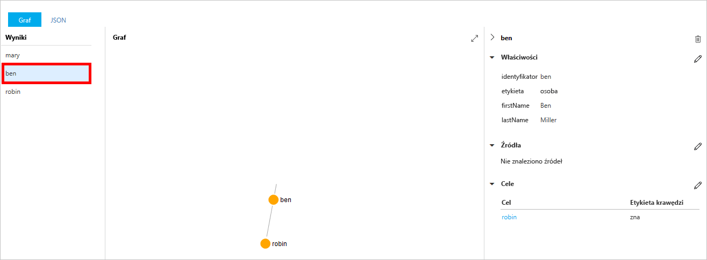
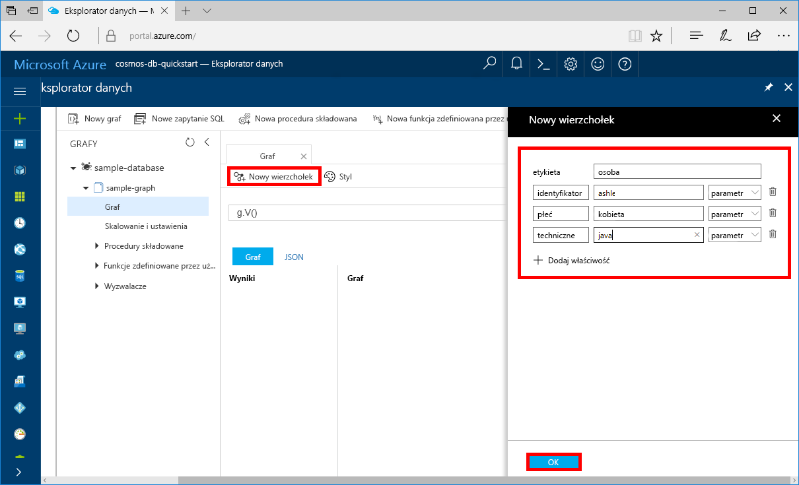
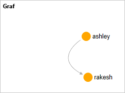

# <a name="quickstart-create-a-graph-database-in-azure-cosmos-db-using-python-and-the-azure-portal"></a>Szybki start: tworzenie bazy danych wykresów w usłudze Azure Cosmos DB przy użyciu języka Python i witryny Azure portal

> [!div class="op_single_selector"]
> * [Konsola Gremlin](create-graph-gremlin-console.md)
> * [.NET](create-graph-dotnet.md)
> * [Java](create-graph-java.md)
> * [Node.js](create-graph-nodejs.md)
> * [Python](create-graph-python.md)
> * [PHP](create-graph-php.md)
>  

W tym przewodniku Szybki start można utworzyć konto interfejsu API usługi Azure Cosmos DB Gremlin (wykres) i zarządzać nim z witryny Azure Portal i dodawać dane przy użyciu aplikacji języka Python sklonowanej z usługi GitHub. Usługa Azure Cosmos DB to wielomodelowa usługa bazy danych, która umożliwia szybkie tworzenie i wykonywanie zapytań o bazy danych dokumentów, tabeli, wartości klucza i wykresów z możliwościami dystrybucji globalnej i skali poziomej.

## <a name="prerequisites"></a>Wymagania wstępne
- Konto platformy Azure z aktywną subskrypcją. [Utwórz jeden za darmo](https://azure.microsoft.com/free/?ref=microsoft.com&utm_source=microsoft.com&utm_medium=docs&utm_campaign=visualstudio). Możesz [też bezpłatnie wypróbować usługę Azure Cosmos DB](https://azure.microsoft.com/try/cosmosdb/) bez subskrypcji platformy Azure.
- [Python 3.5+](https://www.python.org/downloads/) z instalatorem [pakietów pip.](https://pip.pypa.io/en/stable/installing/)
- [Sterownik Pythona dla Gremlin](https://github.com/apache/tinkerpop/tree/master/gremlin-python).
- [Git](https://git-scm.com/downloads).

> [!NOTE]
> Ten przewodnik Szybki start wymaga konta grafowej bazy danych utworzonego po 20 grudnia 2017 r. Istniejące konta będą obsługiwać język Python po migrowaniu do wersji powszechnie dostępnej.

## <a name="create-a-database-account"></a>Tworzenie konta bazy danych

Przed utworzeniem bazy danych grafów musisz utworzyć konto bazy danych Gremlin (Graph) z użyciem usługi Azure Cosmos DB.

[!INCLUDE [cosmos-db-create-dbaccount-graph](../../includes/cosmos-db-create-dbaccount-graph.md)]

## <a name="add-a-graph"></a>Dodawanie grafu

[!INCLUDE [cosmos-db-create-graph](../../includes/cosmos-db-create-graph.md)]

## <a name="clone-the-sample-application"></a>Klonowanie przykładowej aplikacji

Teraz przejdźmy do pracy z kodem. Sklonujemy aplikację interfejsu API języka Gremlin z usługi GitHub, ustawimy parametry połączenia i uruchomimy ją. Zobaczysz, jak łatwo jest pracować programowo z danymi.  

1. Otwórz wiersz polecenia, utwórz nowy folder o nazwie git-samples, a następnie zamknij wiersz polecenia.

    ```bash
    md "C:\git-samples"
    ```

2. Otwórz okno terminala usługi Git, na przykład git bash, i użyj polecenia `cd`, aby przejść do folderu instalacji aplikacji przykładowej.  

    ```bash
    cd "C:\git-samples"
    ```

3. Uruchom następujące polecenie w celu sklonowania przykładowego repozytorium. To polecenie tworzy kopię aplikacji przykładowej na komputerze. 

    ```bash
    git clone https://github.com/Azure-Samples/azure-cosmos-db-graph-python-getting-started.git
    ```

## <a name="review-the-code"></a>Przeglądanie kodu

Ten krok jest opcjonalny. Jeśli chcesz się dowiedzieć, jak zasoby bazy danych są tworzone w kodzie, możesz przejrzeć poniższe fragmenty kodu. Wszystkie fragmenty są pobierane z pliku *connect.py* w folderze *C:\git-samples\azure-cosmos-db-graph-python-getting-started\\ * folderu. W przeciwnym razie możesz od razu przejść do sekcji [Aktualizacja parametrów połączenia](#update-your-connection-information). 

* Gremlin `client` jest inicjowany w linii 104 w *connect.py:*

    ```python
    ...
    client = client.Client('wss://<YOUR_ENDPOINT>.gremlin.cosmosdb.azure.com:443/','g', 
        username="/dbs/<YOUR_DATABASE>/colls/<YOUR_COLLECTION_OR_GRAPH>", 
        password="<YOUR_PASSWORD>")
    ...
    ```

* Seria kroków Gremlin są zadeklarowane na początku pliku *connect.py.* Następnie są one wykonywane przy użyciu metody `client.submitAsync()`:

    ```python
    client.submitAsync(_gremlin_cleanup_graph)
    ```

## <a name="update-your-connection-information"></a>Aktualizowanie danych połączenia

Teraz wróć do witryny Azure Portal, aby uzyskać informacje o połączeniu i skopiować je do aplikacji. Te ustawienia umożliwiają aplikacji komunikację z hostowaną bazą danych.

1. Na swoim koncie usługi Azure Cosmos DB w [portalu Azure](https://portal.azure.com/)wybierz pozycję **Klucze**. 

    Skopiuj pierwszą część wartości identyfikatora URI.

    

2. Otwórz plik *connect.py* i w wierszu 104 wklej `<YOUR_ENDPOINT>` wartość URI w tym miejscu:

    ```python
    client = client.Client('wss://<YOUR_ENDPOINT>.gremlin.cosmosdb.azure.com:443/','g', 
        username="/dbs/<YOUR_DATABASE>/colls/<YOUR_COLLECTION_OR_GRAPH>", 
        password="<YOUR_PASSWORD>")
    ```

    Część obiektu klienta dotycząca identyfikatora URI powinna teraz wyglądać podobnie jak w tym kodzie:

    ```python
    client = client.Client('wss://test.gremlin.cosmosdb.azure.com:443/','g', 
        username="/dbs/<YOUR_DATABASE>/colls/<YOUR_COLLECTION_OR_GRAPH>", 
        password="<YOUR_PASSWORD>")
    ```

3. Zmień drugi parametr obiektu `client`, zamieniając ciągi `<YOUR_DATABASE>` i `<YOUR_COLLECTION_OR_GRAPH>`. Jeśli użyjesz wartości sugerowanych, parametr powinien wyglądać podobnie do tego kodu:

    `username="/dbs/sample-database/colls/sample-graph"`

    Cały obiekt `client` powinien teraz wyglądać podobnie do tego kodu:

    ```python
    client = client.Client('wss://test.gremlin.cosmosdb.azure.com:443/','g', 
        username="/dbs/sample-database/colls/sample-graph", 
        password="<YOUR_PASSWORD>")
    ```

4. Na stronie **Klawisze** użyj przycisku kopiowania, aby skopiować klucz podstawowy i `<YOUR_PASSWORD>` wkleić go w parametrze. `password=<YOUR_PASSWORD>`

    Cała definicja obiektu `client` powinna teraz wyglądać podobnie do tego kodu:
    ```python
    client = client.Client('wss://test.gremlin.cosmosdb.azure.com:443/','g', 
        username="/dbs/sample-database/colls/sample-graph", 
        password="asdb13Fadsf14FASc22Ggkr662ifxz2Mg==")
    ```

6. Zapisz plik *connect.py.*

## <a name="run-the-console-app"></a>Uruchamianie aplikacji konsolowej

1. W oknie terminalu usługi Git za pomocą polecenia `cd` przejdź do folderu azure-cosmos-db-graph-python-getting-started.

    ```git
    cd "C:\git-samples\azure-cosmos-db-graph-python-getting-started"
    ```

2. W oknie terminalu usługi Git użyj następującego polecenia, aby zainstalować wymagane pakiety języka Python.

   ```
   pip install -r requirements.txt
   ```

3. W oknie terminalu usługi Git użyj następującego polecenia, aby uruchomić aplikację języka Python.
    
    ```
    python connect.py
    ```

    W oknie terminalu zostaną wyświetlone wierzchołki i krawędzie dodawane do grafu. 
    
    Jeśli występują błędy przekroczenia limitu czasu, sprawdź, czy zaktualizowano poprawnie informacje o połączeniu w sekcji [Aktualizowanie danych połączenia](#update-your-connection-information), a także spróbuj ponownie uruchomić ostatnie polecenie. 
    
    Po zatrzymaniu działania programu naciśnij klawisz Enter i przejdź z powrotem do witryny Azure Portal w przeglądarce internetowej.

<a id="add-sample-data"></a>
## <a name="review-and-add-sample-data"></a>Przeglądanie i dodawanie przykładowych danych

Po wstawieniu wierzchołków i krawędzi można teraz wrócić do Eksploratora danych i wyświetlić wierzchołki dodane do wykresu i dodać dodatkowe punkty danych.

1. W swoim koncie usługi Azure Cosmos DB w portalu Azure wybierz **pozycję Eksplorator danych**, rozwiń **przykładowy wykres**, wybierz pozycję **Wykres**, a następnie wybierz pozycję **Zastosuj filtr**. 

   

2. Na liście **Wyniki** zwróć uwagę, że do wykresu dodawanych jest trzech nowych użytkowników. Możesz przenosić wierzchołki, przeciągając je i upuszczając, zmieniać powiększenie przy użyciu kółka myszy oraz powiększać rozmiar grafu przy użyciu podwójnej strzałki. 

   

3. Dodajmy kilku nowych użytkowników. Wybierz przycisk Nowy wierzchołek, aby dodać dane do wykresu. **New Vertex**

   

4. Wprowadź etykietę *osoba*.

5. Wybierz **dodaj właściwość,** aby dodać każdą z następujących właściwości. Zauważ, że możesz utworzyć unikatowe właściwości dla każdej osoby w grafie. Tylko klucz id jest wymagany.

    key|value|Uwagi
    ----|----|----
    Pk|/pk| 
    id|ashley|Unikatowy identyfikator wierzchołka. Jeśli nie określono identyfikatora, zostanie on wygenerowany.
    płeć|kobieta| 
    techniczne | java | 

    > [!NOTE]
    > W tym przewodniku Szybki start zostaje utworzona kolekcja niepartycjonowana. Niemniej jednak, jeśli utworzysz kolekcję partycjonowaną poprzez określenie klucza partycji podczas tworzenia kolekcji, musisz uwzględnić klucz partycji jako klucz w każdym nowym wierzchołku. 

6. Kliknij przycisk **OK**. Może być konieczne rozszerzenie ekranu w celu wyświetlenia przycisku **OK** u dołu ekranu.

7. Ponownie wybierz **pozycję Nowy wierzchołek** i dodaj kolejnego nowego użytkownika. 

8. Wprowadź etykietę *osoba*.

9. Wybierz **dodaj właściwość,** aby dodać każdą z następujących właściwości:

    key|value|Uwagi
    ----|----|----
    Pk|/pk| 
    id|rakesh|Unikatowy identyfikator wierzchołka. Jeśli nie określono identyfikatora, zostanie on wygenerowany.
    płeć|mężczyzna| 
    szkoła|MIT| 

10. Kliknij przycisk **OK**. 

11. Wybierz przycisk **Zastosuj filtr** `g.V()` z filtrem domyślnym, aby wyświetlić wszystkie wartości na wykresie. Wszyscy użytkownicy będą teraz wyświetlani na liście **Wyniki**. 

    W miarę dodawania większej ilości danych można używać filtrów do ograniczania wyników. Domyślnie Eksplorator danych korzysta z zapytania `g.V()` w celu pobrania wszystkich wierzchołków grafu. Można je zmienić na inne [zapytanie o graf](tutorial-query-graph.md), takie jak`g.V().count()`, aby zwrócić liczbę wszystkich wierzchołków grafu w formacie JSON. Jeśli filtr został zmieniony, zmień `g.V()` filtr z powrotem na i wybierz opcję **Zastosuj filtr,** aby ponownie wyświetlić wszystkie wyniki.

12. Teraz możemy połączyć użytkowników rakesh i ashley. Upewnij **się, że ashley** jest zaznaczone na liście **Wyniki,** a następnie wybierz przycisk edycji obok **pozycji Obiekty docelowe** w prawym dolnym dolno strona. Może być konieczne rozszerzenie okna w celu wyświetlenia obszaru **Właściwości**.

    

13. W polu **Cel** typu *rakesh*, a w polu **Etykieta Krawędź** *zna*, a następnie zaznacz czek.

    

14. Teraz wybierz użytkownika **rakesh** z listy wyników, aby zobaczyć, że użytkownicy ashley i rakesh są połączeni. 

    

Na tym kończy się część tego samouczka poświęcona tworzeniu zasobów. Możesz dodać do grafu kolejne wierzchołki, zmodyfikować istniejące wierzchołki lub zmienić zapytania. Teraz przejrzyjmy metryki udostępniane przez usługę Azure Cosmos DB, a następnie wyczyśćmy zasoby. 

## <a name="review-slas-in-the-azure-portal"></a>Przeglądanie umów SLA w witrynie Azure Portal

[!INCLUDE [cosmosdb-tutorial-review-slas](../../includes/cosmos-db-tutorial-review-slas.md)]

## <a name="clean-up-resources"></a>Oczyszczanie zasobów

[!INCLUDE [cosmosdb-delete-resource-group](../../includes/cosmos-db-delete-resource-group.md)]

## <a name="next-steps"></a>Następne kroki

W tym przewodniku Szybki start dowiesz się, jak utworzyć konto usługi Azure Cosmos DB, utworzyć wykres przy użyciu Eksploratora danych i uruchomić aplikację języka Python, aby dodać dane do wykresu. Teraz możesz tworzyć bardziej złożone zapytania i implementować zaawansowaną logikę przechodzenia grafu za pomocą języka Gremlin. 

> [!div class="nextstepaction"]
> [Wykonywanie zapytań przy użyciu języka Gremlin](tutorial-query-graph.md)

