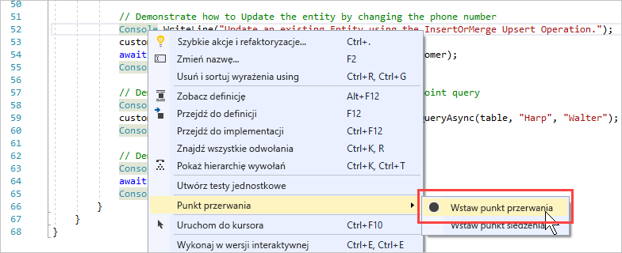

# <a name="quickstart-build-a-table-api-app-with-net-sdk-and-azure-cosmos-db"></a>Szybki start: tworzenie aplikacji interfejsu API tabel za pomocą narzędzia .NET SDK i usługi Azure Cosmos DB 

> [!div class="op_single_selector"]
> * [.NET](create-table-dotnet.md)
> * [Java](create-table-java.md)
> * [Node.js](create-table-nodejs.md)
> * [Python](create-table-python.md)
>  

Ten przewodnik szybkiego startu pokazuje, jak używać programu .NET i [interfejsu API tabeli](table-introduction.md) usługi Azure Cosmos DB do tworzenia aplikacji przez sklonowanie przykładu z usługi GitHub. Ten przewodnik Szybki start pokazuje również, jak utworzyć konto usługi Azure Cosmos DB i jak korzystać z Eksploratora danych do tworzenia tabel i jednostek w witrynie internetowej Azure Portal.

## <a name="prerequisites"></a>Wymagania wstępne

Jeśli nie masz jeszcze zainstalowanej programu Visual Studio 2019, możesz pobrać **bezpłatną** [wersję programu Visual Studio 2019 Community Edition](https://www.visualstudio.com/downloads/)i korzystać z niej. Podczas instalacji programu Visual Studio upewnij się, że jest włączona opcja **Programowanie na platformie Azure**.

[!INCLUDE [quickstarts-free-trial-note](../../includes/quickstarts-free-trial-note.md)]

## <a name="create-a-database-account"></a>Tworzenie konta bazy danych

[!INCLUDE [cosmos-db-create-dbaccount-table](../../includes/cosmos-db-create-dbaccount-table.md)]

## <a name="add-a-table"></a>Dodawanie tabeli

[!INCLUDE [cosmos-db-create-table](../../includes/cosmos-db-create-table.md)]

## <a name="add-sample-data"></a>Dodawanie danych przykładowych

[!INCLUDE [cosmos-db-create-table-add-sample-data](../../includes/cosmos-db-create-table-add-sample-data.md)]

## <a name="clone-the-sample-application"></a>Klonowanie przykładowej aplikacji

Teraz sklonujemy aplikację Tabela z serwisu GitHub, ustawimy parametry połączenia i uruchomimy ją. Zobaczysz, jak łatwo jest pracować programowo z danymi. 

1. Otwórz wiersz polecenia, utwórz nowy folder o nazwie git-samples, a następnie zamknij wiersz polecenia.

   ```bash
   md "C:\git-samples"
   ```

2. Otwórz okno terminala usługi Git, np. git bash, i użyj polecenia `cd`, aby przejść do nowego folderu instalacji aplikacji przykładowej.

   ```bash
   cd "C:\git-samples"
   ```

3. Uruchom następujące polecenie w celu sklonowania przykładowego repozytorium. To polecenie tworzy kopię aplikacji przykładowej na komputerze.

   ```bash
   git clone https://github.com/Azure-Samples/azure-cosmos-table-dotnet-core-getting-started.git
   ```

## <a name="open-the-sample-application-in-visual-studio"></a>Otwieranie przykładowej aplikacji w programie Visual Studio

1. W programie Visual Studio wybierz z menu **Plik** pozycję **Otwórz**, a następnie wybierz pozycję **Projekt/Rozwiązanie**. 

    

2. Przejdź do folderu, w którym sklonowała przykładowa aplikacja i otwórz plik TableStorage.sln.

## <a name="update-your-connection-string"></a>Aktualizowanie parametrów połączenia

Teraz wróć do witryny Azure Portal, aby uzyskać informacje o parametrach połączenia i skopiować je do aplikacji. Umożliwia to aplikacji komunikację z hostowaną bazą danych. 

1. W witrynie [Azure Portal](https://portal.azure.com/) kliknij pozycję **Parametry połączenia**. Użyj przycisku kopiowania po prawej stronie okna, aby skopiować **PODSTAWOWE PARAMETRY POŁĄCZENIA**.

   

2. W programie Visual Studio otwórz plik **Settings.json.** 

3. Wklej **podstawowy ciąg połączenia** z portalu do wartości StorageConnectionString. Wklej parametry wewnątrz cudzysłowów.

   ```csharp
   {
      "StorageConnectionString": "<Primary connection string from Azure portal>"
   }
   ```

4. Naciśnij klawisze CTRL+S, aby zapisać plik **Settings.json.**

Aplikacja została zaktualizowana i zawiera teraz wszystkie informacje potrzebne do nawiązania komunikacji z usługą Azure Cosmos DB. 

## <a name="build-and-deploy-the-app"></a>Kompilowanie i wdrażanie aplikacji

1. W programie Visual Studio kliknij prawym przyciskiem myszy projekt **CosmosTableSamples** w **Eksploratorze rozwiązań,** a następnie kliknij polecenie **Zarządzaj pakietami NuGet**. 

   

2. W polu NuGet **Browse** wpisz Microsoft.Azure.Cosmos.Table. Spowoduje to wyszukanie biblioteki klienta interfejsu API tabeli usługi Cosmos DB. Należy zauważyć, że ta biblioteka jest obecnie dostępna dla platformy .NET Framework i .NET Standard. 
   
   

3. Kliknij **przycisk Zainstaluj,** aby zainstalować bibliotekę **Microsoft.Azure.Cosmos.Table.** Spowoduje to zainstalowanie pakietu interfejsu API tabeli usługi Azure Cosmos DB oraz wszystkich zależności.

4. Po uruchomieniu całej aplikacji przykładowe dane są wstawiane do encji tabeli i usuwane na końcu, więc nie zobaczysz żadnych wstawionych danych po uruchomieniu całej próbki. Można jednak wstawić niektóre punkty przerwania, aby wyświetlić dane. Otwórz BasicSamples.cs plik i kliknij prawym przyciskiem myszy wiersz 52, wybierz **punkt przerwania,** a następnie wybierz pozycję **Wstaw punkt przerwania**. Wstaw kolejny punkt przerwania w wierszu 55.

    

5. Naciśnij klawisz F5, aby uruchomić aplikację. Okno konsoli wyświetla nazwę nowej bazy danych tabeli (w tym przypadku demoa13b1) w usłudze Azure Cosmos DB. 
    
   

   Po dotarciu do pierwszego punktu przerwania wróć do Eksploratora danych w witrynie Azure Portal. Kliknij przycisk **Odśwież**, rozwiń tabelę demo* i kliknij pozycję **Jednostki**. Karta **Jednostki** po prawej stronie zawiera nową jednostkę dodaną dla Waltera Harpa. Zauważ, że numer telefonu nowej jednostki to 425-555-0101.

   
    
   Jeśli podczas uruchamiania projektu zostanie wyświetlony komunikat o błędzie pliku Settings.json, można go rozwiązać, dodając do ustawień projektu następujący wpis XML. Kliknij prawym przyciskiem myszy cosmostablepróby, wybierz pozycję Edytuj CosmosTableSamples.csproj i dodaj następujący elementGrupa: 

   ```csharp
     <ItemGroup>
       <None Update="Settings.json">
         <CopyToOutputDirectory>PreserveNewest</CopyToOutputDirectory>
       </None>
     </ItemGroup>
   ```

6. Zamknij kartę **Jednostki** w Eksploratorze danych.
    
7. Naciśnij klawisz F5, aby kontynuować pracę aplikacji do następnego punktu przerwania. 

    Po dotarciu do punktu przerwania wróć do witryny Azure Portal, kliknij ponownie pozycję **Jednostki** w celu otwarcia karty **Jednostki** i zauważ, że numer telefonu został zaktualizowany do 425-555-0105.

8. Naciśnij klawisz F5, aby kontynuować pracę aplikacji. 
 
   Aplikacja doda jednostki na potrzeby zaawansowanej przykładowej aplikacji, której interfejs API tabeli obecnie nie obsługuje. Następnie aplikacja usunie tabelę utworzoną przez przykładową aplikację.

9. W oknie konsoli naciśnij klawisz Enter, aby zakończyć wykonywanie aplikacji. 
  

## <a name="review-slas-in-the-azure-portal"></a>Przeglądanie umów SLA w witrynie Azure Portal

[!INCLUDE [cosmosdb-tutorial-review-slas](../../includes/cosmos-db-tutorial-review-slas.md)]

## <a name="clean-up-resources"></a>Oczyszczanie zasobów

[!INCLUDE [cosmosdb-delete-resource-group](../../includes/cosmos-db-delete-resource-group.md)]

## <a name="next-steps"></a>Następne kroki

W tym przewodniku Szybki start wyjaśniono sposób tworzenia konta usługi Azure Cosmos DB, tworzenia tabeli za pomocą Eksploratora danych i uruchamiania aplikacji.  Teraz można tworzyć zapytania do danych przy użyciu interfejsu API tabel.  

> [!div class="nextstepaction"]
> [Importowanie danych tabeli do interfejsu API tabeli](table-import.md)

