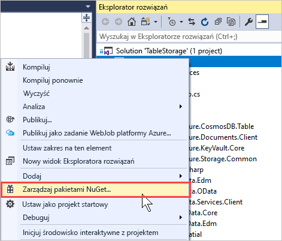
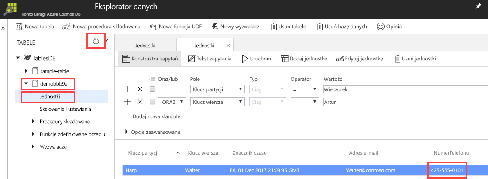

# <a name="quickstart-build-a-table-api-app-with-net-and-azure-cosmos-db"></a>Szybki start: tworzenie aplikacji interfejsu API tabeli za pomocą platformy .NET i usługi Azure Cosmos DB 

> [!div class="op_single_selector"]
> * [.NET](create-table-dotnet.md)
> * [Java](create-table-java.md)
> * [Node.js](create-table-nodejs.md)
> * [Python](create-table-python.md)
>  

Ten przewodnik szybkiego startu pokazuje, jak używać programu .NET i [interfejsu API tabeli](table-introduction.md) usługi Azure Cosmos DB do tworzenia aplikacji przez sklonowanie przykładu z usługi GitHub. Ten przewodnik Szybki start pokazuje również, jak utworzyć konto usługi Azure Cosmos DB i jak korzystać z Eksploratora danych do tworzenia tabel i jednostek w witrynie internetowej Azure Portal.

Azure Cosmos DB to rozproszona globalnie wielomodelowa usługa bazy danych firmy Microsoft. Dzięki dystrybucji globalnej i możliwości skalowania poziomego w usłudze Azure Cosmos DB możesz szybko tworzyć i za pomocą zapytań badać bazy danych dokumentów, par klucz/wartość oraz grafów. 

## <a name="prerequisites"></a>Wymagania wstępne

Jeśli nie masz jeszcze zainstalowanego programu Visual Studio 2017, możesz pobrać program [Visual Studio 2017 Community Edition](https://www.visualstudio.com/downloads/) i używać go **bezpłatnie**. Podczas instalacji programu Visual Studio upewnij się, że jest włączona opcja **Programowanie na platformie Azure**.

[!INCLUDE [quickstarts-free-trial-note](../../includes/quickstarts-free-trial-note.md)]

## <a name="create-a-database-account"></a>Tworzenie konta bazy danych

> [!IMPORTANT] 
> Musisz utworzyć nowe konto interfejsu API tabeli, aby pracować z ogólnie dostępnymi zestawami SDK interfejsu API tabeli. Konta interfejsu API tabeli utworzone w okresie obowiązywania wersji zapoznawczej nie są obsługiwane przez ogólnie dostępne zestawy SDK.
>

[!INCLUDE [cosmos-db-create-dbaccount-table](../../includes/cosmos-db-create-dbaccount-table.md)]

## <a name="add-a-table"></a>Dodawanie tabeli

[!INCLUDE [cosmos-db-create-table](../../includes/cosmos-db-create-table.md)]

## <a name="add-sample-data"></a>Dodawanie danych przykładowych

[!INCLUDE [cosmos-db-create-table-add-sample-data](../../includes/cosmos-db-create-table-add-sample-data.md)]

## <a name="clone-the-sample-application"></a>Klonowanie przykładowej aplikacji

Teraz sklonujemy aplikację Tabela z serwisu GitHub, ustawimy parametry połączenia i uruchomimy ją. Zobaczysz, jak łatwo jest pracować programowo z danymi. 

1. Otwórz wiersz polecenia, utwórz nowy folder o nazwie git-samples, a następnie zamknij wiersz polecenia.

    ```bash
    md "C:\git-samples"
    ```

2. Otwórz okno terminalu usługi Git, na przykład git bash, i użyj polecenia `cd`, aby przejść do nowego folderu instalacji aplikacji przykładowej.

    ```bash
    cd "C:\git-samples"
    ```

3. Uruchom następujące polecenie w celu sklonowania przykładowego repozytorium. To polecenie tworzy kopię przykładowej aplikacji na komputerze.

    ```bash
    git clone https://github.com/Azure-Samples/storage-table-dotnet-getting-started.git
    ```
## <a name="open-the-sample-application-in-visual-studio"></a>Otwieranie przykładowej aplikacji w programie Visual Studio

1. W programie Visual Studio wybierz z menu **Plik** pozycję **Otwórz**, a następnie wybierz pozycję **Projekt/Rozwiązanie**. 

    

2. Przejdź do folderu, do którego sklonowano przykładową aplikację, i otwórz plik TableStorage.sln.

    

## <a name="update-your-connection-string"></a>Aktualizowanie parametrów połączenia

Teraz wróć do witryny Azure Portal, aby uzyskać informacje o parametrach połączenia i skopiować je do aplikacji. Umożliwia to aplikacji komunikację z hostowaną bazą danych. 

1. W witrynie [Azure Portal](https://portal.azure.com/) kliknij pozycję **Parametry połączenia**. 

    Użyj przycisku kopiowania po prawej stronie okna, aby skopiować **PODSTAWOWE PARAMETRY POŁĄCZENIA**.

    

2. W programie Visual Studio otwórz plik App.config. 

3. Usuń znaczniki komentarza dla ciągu StorageConnectionString w wierszu 8 i wstaw znaczniki komentarza dla ciągu StorageConnectionString w wierszu 7, ponieważ w tym samouczku nie jest używany emulator pamięci zestawu SDK platformy Azure. Wiersze 7 i 8 powinny teraz wyglądać następująco:

    ```
    <!--key="StorageConnectionString" value="UseDevelopmentStorage=true;" />-->
    <add key="StorageConnectionString" value="DefaultEndpointsProtocol=https;AccountName=[AccountName];AccountKey=[AccountKey]" />
    ```

4. Wklej **PODSTAWOWE PARAMETRY POŁĄCZENIA** z portalu do wartości StorageConnectionString w wierszu 8. Wklej parametry wewnątrz cudzysłowów. 

    > [!IMPORTANT]
    > Jeśli dany punkt końcowy korzysta z adresu documents.azure.com, oznacza to, że masz konto w wersji zapoznawczej i musisz utworzyć [nowe konto interfejsu API tabeli](#create-a-database-account), aby korzystać z dostępnego ogólnie zestawu SDK API tabeli. 
    > 

    Wiersz 8 powinien teraz wyglądać podobnie do:

    ```
    <add key="StorageConnectionString" value="DefaultEndpointsProtocol=https;AccountName=<account name>;AccountKey=<account-key>;TableEndpoint=https://<account name>.table.cosmosdb.azure.com;" />
    ```

5. Naciśnij klawisze Ctrl+S, aby zapisać plik App.config.

Aplikacja została zaktualizowana i zawiera teraz wszystkie informacje potrzebne do nawiązania komunikacji z usługą Azure Cosmos DB. 

## <a name="build-and-deploy-the-app"></a>Kompilowanie i wdrażanie aplikacji

1. W programie Visual Studio kliknij projekt **TableStorage** prawym przyciskiem myszy w **Eksploratorze rozwiązań**, a następnie kliknij polecenie **Zarządzaj pakietami NuGet**. 

   
2. W polu **Przeglądaj** obszaru pakietów NuGet wpisz ciąg *Microsoft.Azure.CosmosDB.Table*. Spowoduje to wyszukanie biblioteki klienta interfejsu API tabeli usługi Cosmos DB. Pamiętaj, że ta biblioteka jest obecnie dostępna tylko dla platformy .NET Standard, nie jest jeszcze dostępna dla platformy .NET Core.
   
   

3. Kliknij pozycję **Zainstaluj**, aby zainstalować bibliotekę **Microsoft.Azure.CosmosDB.Table**. Spowoduje to zainstalowanie pakietu interfejsu API tabeli usługi Azure Cosmos DB oraz wszystkich zależności.

    

4. Otwórz plik BasicSamples.cs. Kliknij prawym przyciskiem myszy wiersz 52, wybierz pozycję **Punkt przerwania**, a następnie wybierz pozycję **Wstaw punkt przerwania**. Wstaw kolejny punkt przerwania w wierszu 55.

    

5. Naciśnij klawisz F5, aby uruchomić aplikację.

    W oknie konsoli zostanie wyświetlona nazwa nowej bazy danych tabel (w tym przypadku „demo91ab4”) w usłudze Azure Cosmos DB. 
    
    

    W przypadku wystąpienia błędu dotyczącego zależności zobacz [Rozwiązywanie problemów](table-sdk-dotnet.md#troubleshooting).

    Po dotarciu do pierwszego punktu przerwania wróć do Eksploratora danych w witrynie Azure Portal. Kliknij przycisk **Odśwież**, rozwiń tabelę demo* i kliknij pozycję **Jednostki**. Karta **Jednostki** po prawej stronie zawiera nową jednostkę dodaną dla Waltera Harpa. Zauważ, że numer telefonu nowej jednostki to 425-555-0101.

    
    
6. Zamknij kartę **Jednostki** w Eksploratorze danych.
    
7. Naciśnij klawisz F5, aby kontynuować pracę aplikacji do następnego punktu przerwania. 

    Po dotarciu do punktu przerwania wróć do witryny Azure Portal, kliknij ponownie pozycję **Jednostki** w celu otwarcia karty **Jednostki** i zauważ, że numer telefonu został zaktualizowany do 425-555-0105.

8. Naciśnij klawisz F5, aby kontynuować pracę aplikacji. 
 
   Aplikacja doda jednostki na potrzeby zaawansowanej przykładowej aplikacji, której interfejs API tabeli obecnie nie obsługuje. Następnie aplikacja usunie tabelę utworzoną przez przykładową aplikację.

9. W oknie konsoli naciśnij klawisz Enter, aby zakończyć wykonywanie aplikacji. 
  

## <a name="review-slas-in-the-azure-portal"></a>Przeglądanie umów SLA w witrynie Azure Portal

[!INCLUDE [cosmosdb-tutorial-review-slas](../../includes/cosmos-db-tutorial-review-slas.md)]

## <a name="clean-up-resources"></a>Oczyszczanie zasobów

[!INCLUDE [cosmosdb-delete-resource-group](../../includes/cosmos-db-delete-resource-group.md)]

## <a name="next-steps"></a>Następne kroki

W tym przewodniku Szybki start wyjaśniono sposób tworzenia konta usługi Azure Cosmos DB, tworzenia tabeli za pomocą Eksploratora danych i uruchamiania aplikacji.  Teraz można tworzyć zapytania do danych przy użyciu interfejsu API tabel.  

> [!div class="nextstepaction"]
> [Importowanie danych tabeli do interfejsu API tabeli](table-import.md)

