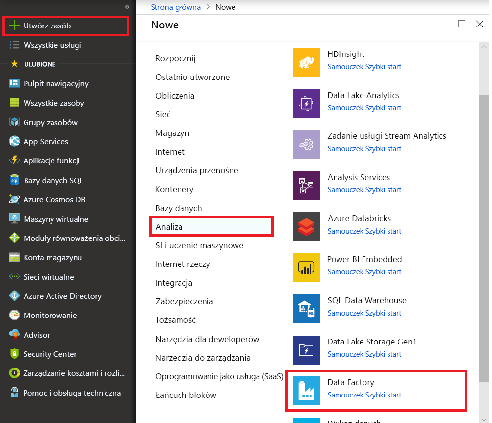
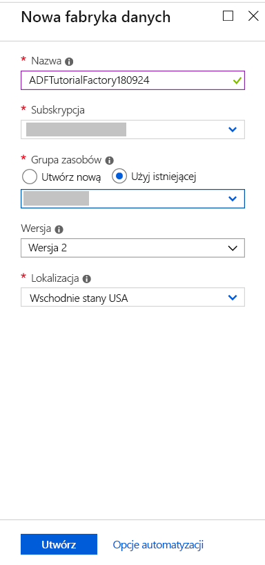

# Kopiowanie danych przy użyciu narzędzia do kopiowania danych 
> [!div class="op_single_selector" title1="Select the version of Data Factory service you are using:"]
> * [Wersja 1 — ogólnie dostępna](v1/data-factory-copy-data-from-azure-blob-storage-to-sql-database.md)
> * [Wersja 2 — wersja zapoznawcza](quickstart-create-data-factory-copy-data-tool.md)

W tym przewodniku Szybki start użyjesz witryny Azure Portal do utworzenia fabryki danych. Następnie za pomocą narzędzia do kopiowania danych utworzysz potok służący do kopiowania danych z folderu w magazynie Azure Blob Storage do innego folderu. 

> [!NOTE]
> Jeśli jesteś nowym użytkownikiem usługi Azure Data Factory, przed wykonaniem kroków zawartych w tym przewodniku Szybki start zobacz [Wprowadzenie do usługi Azure Data Factory](data-factory-introduction.md). 
>
> Ten artykuł dotyczy wersji 2 usługi Data Factory, która jest obecnie dostępna w wersji zapoznawczej. Jeśli używasz dostępnej ogólnie wersji 1 usługi Data Factory, zobacz artykuł z [wprowadzeniem do usługi Data Factory w wersji 1](v1/data-factory-copy-data-from-azure-blob-storage-to-sql-database.md).

[!INCLUDE [data-factory-quickstart-prerequisites](../../includes/data-factory-quickstart-prerequisites.md)] 

## Tworzenie fabryki danych

1. Kliknij przycisk **Nowy** w lewym menu, kliknij pozycję **Dane + analiza**, a następnie kliknij pozycję **Data Factory**. 
   
   
2. Na stronie **Nowa fabryka danych** wprowadź wartość **ADFTutorialDataFactory** w polu **Nazwa**. 
      
     
 
   Nazwa fabryki danych platformy Azure musi być **globalnie unikatowa**. Jeśli dla pola nazwy wystąpi poniższy błąd, zmień nazwę fabryki danych (np. twojanazwaADFTutorialDataFactory), a następnie ponów próbę utworzenia. Artykuł [Data Factory — Naming Rules (Usługa Data Factory — reguły nazewnictwa)](naming-rules.md) zawiera reguły nazewnictwa artefaktów usługi Data Factory.
  
     
3. Wybierz **subskrypcję** Azure, w której chcesz utworzyć fabrykę danych. 
4. Dla opcji **Grupa zasobów** wykonaj jedną z następujących czynności:
     
      - Wybierz pozycję **Użyj istniejącej**, a następnie wybierz istniejącą grupę zasobów z listy rozwijanej. 
      - Wybierz pozycję **Utwórz nową**, a następnie wprowadź nazwę grupy zasobów.   
         
      Informacje na temat grup zasobów znajdują się w artykule [Using resource groups to manage your Azure resources](../azure-resource-manager/resource-group-overview.md) (Używanie grup zasobów do zarządzania zasobami platformy Azure).  
4. Wybierz wartość **V2 (wersja zapoznawcza)** dla **wersji**.
5. Na liście **lokalizacja** wybierz lokalizację fabryki danych. Na liście rozwijanej są wyświetlane tylko obsługiwane lokalizacje. Magazyny danych (Azure Storage, Azure SQL Database itp.) i jednostki obliczeniowe (HDInsight itp.) używane przez fabrykę danych mogą mieścić się w innych lokalizacjach/regionach.
6. Wybierz opcję **Przypnij do pulpitu nawigacyjnego**.     
7. Kliknij przycisk **Utwórz**.
8. Na pulpicie nawigacyjnym jest widoczny następujący kafelek ze stanem: **Wdrażanie fabryki danych**. 

    
9. Po zakończeniu tworzenia zostanie wyświetlona strona **Fabryka danych**, jak pokazano na poniższej ilustracji.
   
   
10. Kliknij kafelek **Tworzenie i monitorowanie**, aby w osobnej karcie uruchomić interfejs użytkownika usługi Azure Data Factory. 

## Uruchamianie narzędzia do kopiowania danych

1. Na stronie wprowadzenia kliknij kafelek **Kopiuj dane**, aby uruchomić narzędzie do kopiowania danych. 

   
2. Na stronie **Właściwości** narzędzia do kopiowania danych kliknij przycisk **Dalej**. Na tej stronie możesz określić nazwę potoku i jego opis. 

    
3. Na stronie **Magazyn danych źródłowych** wybierz pozycję **Azure Blob Storage**, a następnie kliknij przycisk **Dalej**.

    
4. Na stronie **Określanie konta usługi Azure Blob Storage** wybierz **nazwę konta magazynu** z listy rozwijanej, a następnie kliknij przycisk Dalej. 

    
5. Na stronie **Wybieranie pliku lub folderu wejściowego** wykonaj następujące czynności:

    1. Przejdź do folderu **adftutorial/input**. 
    2. Wybierz plik **emp.txt**.
    3. Kliknij pozycję **Wybierz**. Możesz dwukrotnie kliknąć plik **emp.txt**, aby pominąć ten krok. 
    4. Kliknij przycisk **Dalej**. 

    
6. Na stronie **Ustawienia formatu pliku** zwróć uwagę, że narzędzie automatycznie wykrywa ograniczniki kolumn i wierszy, a następnie kliknij przycisk **Dalej**. Na tej stronie możesz także wyświetlić podgląd danych i wyświetlić schemat danych wejściowych. 

    
7. Na stronie **Docelowy magazyn danych** wybierz pozycję **Azure Blob Storage**, a następnie kliknij przycisk **Dalej**. 

        
8. Na stronie **Określanie konta usługi Azure Blob Storage** wybierz konto usługi Azure Blob Storage, a następnie kliknij przycisk **Dalej**. 

    
9. Na stronie **Wybieranie pliku lub folderu wyjściowego** wykonaj następujące czynności: 

    1. Wprowadź wartość **adftutorial/output** jako **ścieżkę do folderu**.
    2. Wprowadź wartość **emp.txt** jako **nazwę pliku**. 
    3. Kliknij przycisk **Dalej**. 

     
10. Na stronie **Ustawienia formatu pliku** kliknij przycisk **Dalej**. 

    
11. Na stronie **Ustawienia** kliknij przycisk **Dalej**. 

    
12. Sprawdź wszystkie ustawienia na stronie **Podsumowanie**, a następnie kliknij przycisk Dalej. 

    
13. Na stronie **Zakończono wdrożenie** kliknij pozycję **Monitoruj**, aby monitorować utworzony potok. 

    
14. Aplikacja zostanie przełączona na kartę **Monitorowanie**. Na tej stronie wyświetlany jest stan potoku. Kliknij pozycję **Odśwież**, aby odświeżyć listę. 
    
    
15. Kliknij link **Wyświetl uruchomienia działania** w kolumnie Akcje. Potok ma tylko jedno działanie typu **Kopiowanie**. 

    
16. Aby wyświetlić szczegółowe informacje na temat operacji kopiowania, kliknij link **Szczegóły** (obraz okularów) w kolumnie **Działania**. Aby uzyskać więcej informacji o właściwościach, zobacz [Omówienie działania kopiowania](copy-activity-overview.md). 

    
17. Sprawdź, czy plik **emp.txt** został utworzony w folderze **output** w kontenerze **adftutorial**. Jeśli folder wyjściowy nie istnieje, usługa Data Factory automatycznie go utworzy. 
18. Przejdź do karty **Edycja**, aby móc edytować połączone usługi, zestawy danych i potoki. Aby dowiedzieć się więcej o edytowaniu tych elementów w interfejsie użytkownika usługi Data Factory, zobacz [Tworzenie fabryki danych za pomocą witryny Azure Portal](quickstart-create-data-factory-portal.md).

    

## Następne kroki
Potok w tym przykładzie kopiuje dane z jednej lokalizacji do innej lokalizacji w usłudze Azure Blob Storage. Zapoznaj się z [samouczkami](tutorial-copy-data-portal.md), aby dowiedzieć się więcej o korzystaniu z usługi Data Factory w dalszych scenariuszach. 