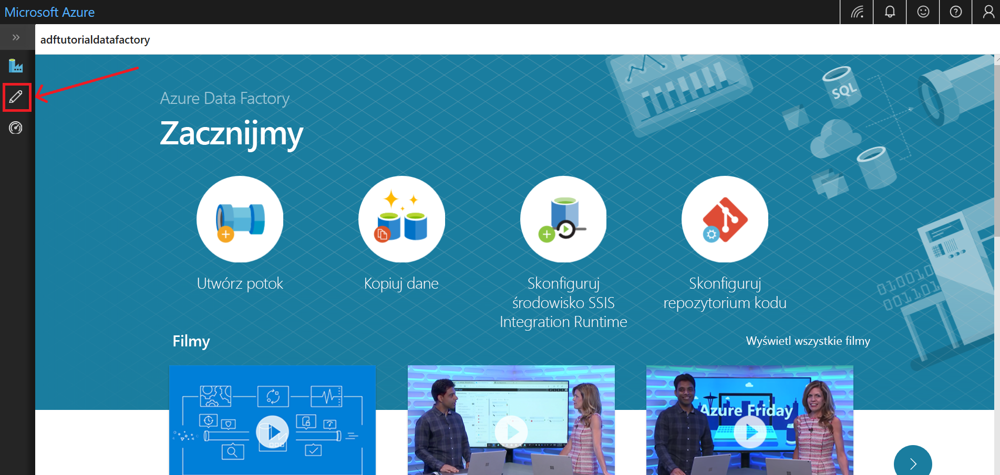
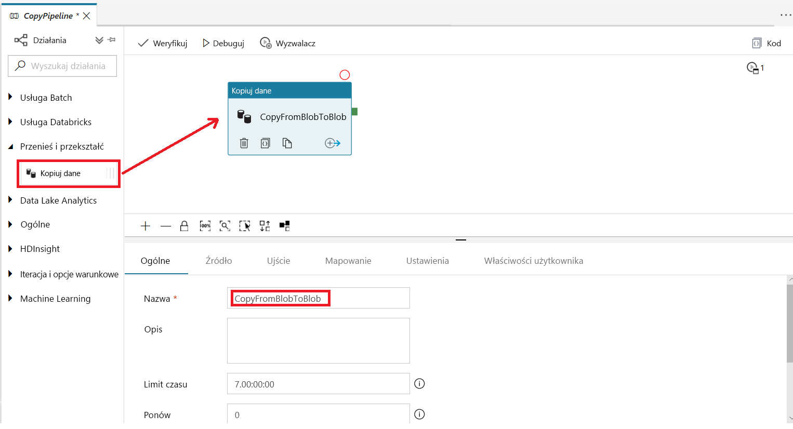

# Tworzenie fabryki danych za pomocą interfejsu użytkownika usługi Azure Data Factory
> [!div class="op_single_selector" title1="Select the version of Data Factory service you are using:"]
> * [Wersja 1 — ogólnie dostępna](v1/data-factory-copy-data-from-azure-blob-storage-to-sql-database.md)
> * [Wersja 2 — wersja zapoznawcza](quickstart-create-data-factory-portal.md)

W tym przewodniku Szybki start opisano sposób używania interfejsu użytkownika usługi Azure Data Factory w celu tworzenia i monitorowania fabryki danych. Potok tworzony w tej fabryce danych **kopiuje** dane z jednego folderu do innego folderu w usłudze Azure Blob Storage. Aby zapoznać się z samouczkiem dotyczącym **przekształcania** danych za pomocą usługi Azure Data Factory, zobacz [Tutorial: Transform data using Spark (Samouczek: Przekształcanie danych przy użyciu usługi Spark)](tutorial-transform-data-spark-portal.md). 

> [!NOTE]
> Jeśli jesteś nowym użytkownikiem usługi Azure Data Factory, przed wykonaniem kroków zawartych w tym przewodniku Szybki start zobacz [Wprowadzenie do usługi Azure Data Factory](data-factory-introduction.md). 
>
> Ten artykuł dotyczy wersji 2 usługi Data Factory, która jest obecnie dostępna w wersji zapoznawczej. Jeśli używasz ogólnie dostępnej wersji 1 usługi Data Factory, zobacz [Data Factory version 1 - tutorial](v1/data-factory-copy-data-from-azure-blob-storage-to-sql-database.md) (Usługa Data Factory w wersji 1 — samouczek).

[!INCLUDE [data-factory-quickstart-prerequisites](../../includes/data-factory-quickstart-prerequisites.md)] 

### Połączenia wideo 
Obejrzenie tego filmu wideo ułatwi zapoznanie się z interfejsem użytkownika usługi Data Factory: 
>[!VIDEO https://channel9.msdn.com/Shows/Azure-Friday/Visually-build-pipelines-for-Azure-Data-Factory-v2/Player]

## Tworzenie fabryki danych

1. Przejdź do witryny [Azure Portal](https://portal.azure.com). 
2. Kliknij przycisk **Nowy** w lewym menu, kliknij pozycję **Dane + analiza**, a następnie kliknij pozycję **Data Factory**. 
   
   
2. Na stronie **Nowa fabryka danych** wprowadź wartość **ADFTutorialDataFactory** w polu **Nazwa**. 
      
     
 
   Nazwa fabryki danych platformy Azure musi być **globalnie unikatowa**. Jeśli dla pola nazwy wystąpi poniższy błąd, zmień nazwę fabryki danych (np. twojanazwaADFTutorialDataFactory). Artykuł [Data Factory — Naming Rules (Usługa Data Factory — reguły nazewnictwa)](naming-rules.md) zawiera reguły nazewnictwa artefaktów usługi Data Factory.
  
     
3. Wybierz **subskrypcję** Azure, w której chcesz utworzyć fabrykę danych. 
4. Dla opcji **Grupa zasobów** wykonaj jedną z następujących czynności:
     
      - Wybierz pozycję **Użyj istniejącej**, a następnie wybierz istniejącą grupę zasobów z listy rozwijanej. 
      - Wybierz pozycję **Utwórz nową**, a następnie wprowadź nazwę grupy zasobów.   
         
    Informacje na temat grup zasobów znajdują się w artykule [Using resource groups to manage your Azure resources](../azure-resource-manager/resource-group-overview.md) (Używanie grup zasobów do zarządzania zasobami platformy Azure).  
4. Wybierz wartość **V2 (wersja zapoznawcza)** dla **wersji**.
5. Na liście **lokalizacja** wybierz lokalizację fabryki danych. Na liście rozwijanej są wyświetlane tylko lokalizacje obsługiwane przez usługę Data Factory. Magazyny danych (Azure Storage, Azure SQL Database itp.) i jednostki obliczeniowe (HDInsight itp.) używane przez fabrykę danych mogą mieścić się w innych lokalizacjach.
6. Wybierz opcję **Przypnij do pulpitu nawigacyjnego**.     
7. Kliknij przycisk **Utwórz**.
8. Na pulpicie nawigacyjnym jest widoczny następujący kafelek ze stanem: **Wdrażanie fabryki danych**. 

    
9. Po zakończeniu tworzenia zostanie wyświetlona strona **Fabryka danych**, jak pokazano na poniższej ilustracji.
   
    
10. Kliknij kafelek **Tworzenie i monitorowanie**, aby w osobnej karcie uruchomić interfejs użytkownika usługi Azure Data Factory. 
11. Na stronie Wprowadzenie przełącz się na kartę **Edycja** w lewym panelu, jak pokazano na poniższym obrazie: 

    

## Tworzenie połączonej usługi Azure Storage
W tym kroku utworzysz połączoną usługę służącą do łączenia konta usługi Azure Storage z fabryką danych. Połączona usługa ma informacje o połączeniu, których usługa Data Factory używa w środowisku uruchomieniowym do nawiązywania z nią połączenia.

2. Kliknij pozycję **Połączenia**, a następnie kliknij przycisk **Nowe** na pasku narzędzi. 

        
3. Na stronie **Nowa połączona usługa** wybierz pozycję **Azure Blob Storage**, a następnie kliknij przycisk **Dalej**. 

    
4. Na stronie **Nowa połączona usługa** wykonaj następujące czynności: 

    1. Wprowadź wartość **AzureStorageLinkedService** w polu **Nazwa**.
    2. Wybierz nazwę konta usługi Azure Storage dla **nazwy konta magazynu**.
    3. Kliknij pozycję **Testuj połączenie**, aby sprawdzić, czy usługa Data Factory może nawiązać połączenie z kontem magazynu. 
    4. Kliknij przycisk **Zapisz**, aby zapisać połączoną usługę. 

         
5. Upewnij się, że usługa **AzureSqlLinkedService** jest wyświetlana na liście połączonych usług. 

    

## Tworzenie zestawów danych
W tym kroku tworzone są dwa zestawy danych: **InputDataset** i **OutputDataset**. Te zestawy danych są typu **AzureBlob**. Odwołują się one do **połączonej usługi Azure Storage** utworzonej w poprzednim kroku. 

Wejściowy zestaw danych reprezentuje dane źródłowe w folderze wejściowym. W definicji wejściowego zestawu danych określany jest kontener obiektów blob (**adftutorial**), folder (**input**) i plik (**emp.txt**), który zawiera dane źródłowe. 

Wyjściowy zestaw danych reprezentuje dane, które są kopiowane do lokalizacji docelowej. W definicji wyjściowego zestawu danych określany jest kontener obiektów blob (**adftutorial**), folder (**output**) i plik, do którego kopiowane są dane. Każde uruchomienie potoku ma skojarzony ze sobą unikatowy identyfikator, do którego można uzyskać dostęp za pomocą zmiennej systemowej **RunId**. Nazwa pliku wyjściowego jest dynamicznie obliczana na podstawie identyfikatora uruchomienia potoku.   

W ustawieniach połączonej usługi określono konto usługi Azure Storage, które zawiera dane źródłowe. W ustawieniach zestawu danych źródłowych należy określić, gdzie dokładnie znajduje się źródło danych (kontener obiektów blob, folder i plik). W ustawieniach zestawu danych ujścia należy określić, gdzie kopiowane są dane (kontener obiektów blob, folder i plik). 
 
1. Kliknij przycisk **+** (znak plus), a następnie wybierz pozycję **Zestaw danych**.

    
2. Na stronie **Nowy zestaw danych** wybierz pozycję **Azure Blob Storage**, a następnie kliknij przycisk **Zakończ**. 

    
3. W oknie **Właściwości** zestawu danych wprowadź wartość **InputDataset** w polu **Nazwa**. 

    
4. Przejdź do karty **Połączenie** i wykonaj następujące czynności: 

    1. Wybierz pozycję **AzureStorageLinkedService** dla połączonej usługi. 
    2. Kliknij przycisk **Przeglądaj** dla pola **Ścieżka pliku**. 
        
    3. W oknie **Wybieranie pliku lub folderu** przejdź do folderu **input** w kontenerze **adftutorial**, wybierz plik **emp.txt**, a następnie kliknij przycisk **Zakończ**.

        
    4. Opcjonalnie: kliknij pozycję **Podgląd danych**, aby wyświetlić dane w pliku emp.txt.     
5. Powtórz kroki, aby utworzyć wyjściowy zestaw danych.  

    1. Kliknij przycisk **+** (znak plus) w lewym panelu, a następnie wybierz pozycję **Zestaw danych**.
    2. Na stronie **Nowy zestaw danych** wybierz pozycję **Azure Blob Storage**, a następnie kliknij przycisk **Zakończ**.
    3. Określ wartość **OutputDataset** jako nazwę.
    4. Wprowadź wartość **adftutorial/output** jako nazwę folderu. Jeśli folder wyjściowy nie istnieje, zostanie on utworzony za pomocą działania kopiowania. 
    5. Wprowadź wartość `@CONCAT(pipeline().RunId, '.txt')` jako nazwę pliku. Każde uruchomienie potoku ma skojarzony ze sobą unikatowy identyfikator. Wyrażenie łączy identyfikator uruchomienia potoku z rozszerzeniem **.txt** w celu obliczenia nazwy pliku wyjściowego. Aby uzyskać listę obsługiwanych zmiennych systemowych i wyrażeń, zobacz [Zmienne systemowe](control-flow-system-variables.md) i [Język wyrażeń](control-flow-expression-language-functions.md).

        

## Tworzenie potoku 
W tym kroku utworzysz potok i zweryfikujesz go za pomocą działania  **kopiowania**, które korzysta z wejściowego i wyjściowego zestawu danych. Działanie kopiowania służy do kopiowania danych z pliku określonego w ustawieniach wejściowego zestawu danych do pliku określonego w ustawieniach wyjściowego zestawu danych. Jeśli wejściowy zestaw danych określa tylko folder (a nie nazwę pliku), działanie kopiowania kopiuje wszystkie pliki w folderze źródłowym do lokalizacji docelowej. 

1. Kliknij przycisk **+** (znak plus), a następnie wybierz pozycję **Potok**. 

    
2. Określ wartość **CopyPipeline** w polu **Nazwa** w oknie **Właściwości**. 

    
3. W przyborniku **Działania** rozwiń pozycję **Przepływ danych**, a następnie przeciągnij i upuść działanie **kopiowania** z przybornika **Działania** do powierzchni Projektanta potoku. Możesz również wyszukać działania w przyborniku **Działania**. Określ wartość **CopyFromBlobToBlob** w polu **Nazwa**.

    
4. Przejdź do karty **Źródło** w ustawieniach działania kopiowania, a następnie wybierz wartość **InputDataset** dla **zestawu danych źródłowych**.

        
5. Przejdź do karty **Ujście** w ustawieniach działania kopiowania, a następnie wybierz wartość **OutputDataset** dla **zestawu danych ujścia**.

        
7. Kliknij pozycję **Weryfikuj**, aby zweryfikować ustawienia potoku. Sprawdź, czy potok został pomyślnie zweryfikowany. Kliknij **strzałkę w prawo**, aby zamknąć dane wyjściowe weryfikacji. 

    

## Testowe uruchamianie potoku
W tym kroku uruchomisz przebieg testowy potoku przed jego wdrożeniem w fabryce Data Factory. 

1. Na pasku narzędzi potoku kliknij pozycję **Przebieg testowy**. 
    
    
2. Sprawdź, czy na karcie **Dane wyjściowe** ustawień potoku wyświetlany jest stan przebiegu potoku. 

        
3. Sprawdź, czy w folderze **output** kontenera **adftutorial** znajduje się plik wyjściowy. Jeśli folder wyjściowy nie istnieje, usługa Data Factory automatycznie go utworzy. 
    
    

## Ręczne wyzwalanie potoku
W tym kroku wdrożysz jednostki (połączone usługi, zestawy danych i potoki) w fabryce Azure Data Factory. Następnie ręcznie wyzwolisz przebieg potoku. Możesz również opublikować jednostki za pomocą własnego repozytorium GIT programu VSTS, co zostało omówione w [innym samouczku](tutorial-copy-data-portal.md?#configure-code-repository).

1. Przed wyzwoleniem potoku należy opublikować jednostki w fabryce Data Factory. Aby przeprowadzić publikowanie, w okienku po lewej stronie kliknij pozycję **Opublikuj**. 

    
2. Aby ręcznie wyzwolić potok, kliknij pozycję **Wyzwól** na pasku narzędzi, a następnie wybierz pozycję **Wyzwól teraz**. 
    
    

## Monitorowanie potoku

1. Przejdź do karty **Monitorowanie** po lewej stronie. Kliknij przycisk **Odśwież**, aby odświeżyć listę.

    
2. Kliknij link **Wyświetl uruchomienia działania** w obszarze **Akcje**. Na tej stronie zostanie wyświetlony stan uruchomienia działania kopiowania. 

    
3. Aby wyświetlić szczegółowe informacje na temat operacji kopiowania, kliknij link **Szczegóły** (obraz okularów) w kolumnie **Działania**. Aby uzyskać więcej informacji o właściwościach, zobacz [Omówienie działania kopiowania](copy-activity-overview.md). 

    
4. Sprawdź, czy nowy plik jest widoczny w folderze **output**. 
5. Możesz z powrotem przejść do widoku **Uruchomienia potoków** z widoku **Uruchomienia działania**, klikając link **Potoki**. 

## Wyzwalanie potoku zgodnie z harmonogramem
Ten krok jest opcjonalny w tym samouczku. Możesz utworzyć **wyzwalacz harmonogramu**, aby zaplanować okresowe uruchamianie potoku (co godzinę, codziennie itd.). W tym kroku utworzysz wyzwalacz służący do uruchamiania co minutę, aż do daty/godziny określonej jako data zakończenia. 

1. Przejdź do karty **Edycja**. 

    
1. Kliknij pozycję **Wyzwalacz** w menu, a następnie kliknij pozycję **Nowy/Edytuj**. 

    
2. Na stronie **Dodawanie wyzwalaczy** kliknij pozycję **Wybierz wyzwalacz...** , a następnie kliknij przycisk **Nowy**. 

    
3. Na stronie **Nowy wyzwalacz** w polu **Koniec** wybierz pozycję **W dniu**, określ czas zakończenia jako kilka minut późniejszy niż czas bieżący, a następnie kliknij pozycję **Zastosuj**. Za poszczególne uruchomienia potoku są naliczane opłaty, zatem określ czas zakończenia jako późniejszy tylko o kilka minut od czasu rozpoczęcia. Upewnij się, że przypada on tego samego dnia. Upewnij się również, że okres między czasem publikowania i czasem zakończenia będzie wystarczający do uruchomienia potoku. Wyzwalacz zaczyna obowiązywać dopiero po opublikowaniu rozwiązania w fabryce Data Factory, a nie po zapisaniu go w interfejsie użytkownika. 

    
4. Zaznacz opcję **Aktywowane** na stronie **Nowy wyzwalacz**, a następnie kliknij przycisk **Dalej** 

    
5. Na stronie **Nowy wyzwalacz** zapoznaj się z komunikatem ostrzegawczym, a następnie kliknij przycisk **Zakończ**.

    
6. Kliknij pozycję **Opublikuj**, aby opublikować zmiany w fabryce Data Factory. 

    
8. Przejdź do karty **Monitorowanie** po lewej stronie. Kliknij pozycję **Odśwież**, aby odświeżyć listę. Potok będzie uruchamiany raz na minutę od czasu publikowania do czasu zakończenia. Zwróć uwagę na wartości w kolumnie **Wyzwolone przez**. Ręczne uruchomienie wyzwalacza zostało ustawione w kroku **Wyzwól teraz** wykonanym wcześniej. 

    
9. Kliknij strzałkę w dół obok pozycji **Uruchomienia potoków**, aby przejść do widoku **Uruchomienia wyzwalacza**. 

        
10. Sprawdź, czy **plik wyjściowy** jest tworzony w folderze **output** dla każdego uruchomienia potoku aż do określonej daty/godziny zakończenia. 

## Następne kroki
Potok w tym przykładzie kopiuje dane z jednej lokalizacji do innej lokalizacji w usłudze Azure Blob Storage. Zapoznaj się z [samouczkami](tutorial-copy-data-portal.md), aby dowiedzieć się więcej o korzystaniu z usługi Data Factory w dalszych scenariuszach. 